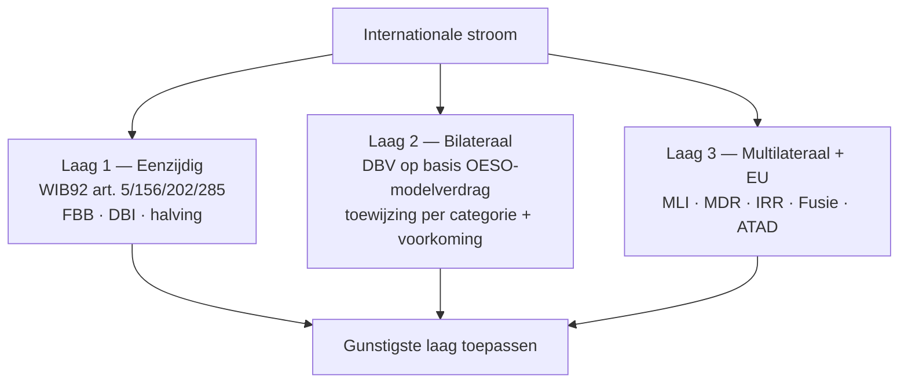

> **Samenvatting — kapstok voor herhaling.** Techniek-PO over internationaal-fiscaal advies. Deze samenvatting bundelt de drie lagen voorkoming, de DBV-toewijzing per inkomenscategorie, de VI-drempels (art. 5 OESO-MV), de EU-richtlijn-drempels (10 % MDR · 25 % IRR), het ATAD-vijfluik en de klassieke valkuilen. Voor verhaal en routekaart: [[studiemateriaal/2-8|minicursus PO 2.8]]. Voor inhoudelijke tarieven + cijfers: Cijferzakboekje 2026.

## 1. Take-away — wat je écht moet weten

- **Vier-stappen-cascade bij elke DBV-toepassing**: (1) toepassingsgebied art. 1+2 — valt persoon + belasting onder verdrag? (successie NIET); (2) residentie art. 4 — bij dubbele residentie tie-breaker-cascade duurzaam tehuis → middelpunt levensbelangen → gewoon verblijf → nationaliteit; (3) toewijzing per categorie art. 6-21; (4) voorkomingsmethode in woonstaat art. 23A/B.
- **"Uitsluitend" is bijna altijd FOUT** bij art. 6 (OG), 7 (winst), 10 (dividend), 11 (intrest), 15 (arbeid). "May be taxed" = GEDEELDE bevoegdheid, woonstaat behoudt heffingsrecht + past voorkomingsmethode toe. "Shall be taxable only" = EXCLUSIEF (komt voor bij art. 8, 18, 19 §1).
- **Drie lagen werken hiërarchisch**: bij intra-EU intra-groep stromen primeren EU-richtlijnen (MDR/IRR) over DBV-plafonds — 0 % bronheffing als drempels gehaald. Anders DBV-toewijzing + plafond. Anders intern recht (FBB/DBI/art. 156).
- **EU-richtlijn-drempels uit het hoofd**: Moeder-dochterrichtlijn = ≥ 10 % deelneming dochter + 1 jr houdperiode (dividenden). Interest-royalty-richtlijn = ≥ 25 % verbonden via UITBETALER, ONTVANGER of gemeenschappelijke moeder-VENNOOTSCHAP (intresten + royalty's). Fusierichtlijn = rechtsvorm bijlage I deel A + Ven.B-onderworpenheid (geen vzw).
- **VI-drempels: weet welk artikel pakt**. Steengroeve/mijn = art. 5 §2(f) — KLASSIEKE VI ZONDER tijdsdrempel. Bouwwerf = art. 5 §3 — VI bij DUUR > 12 mnd. Belgisch intern recht (art. 229 WIB92) heeft lagere drempel (> 30 dgn) maar DBV beperkt.
- **Recapture-regel art. 206/4 WIB92**: bij vrijstellingsmethode mag BE-vennootschap een verlies van een buitenlandse VI eerst aftrekken op BE-grondslag. Als VI later winstgevend wordt, moet die winst — normaal vrijgesteld onder DBV — bij de BE-grondslag GEVOEGD worden tot beloop van het eerder afgetrokken verlies. Boekhoudkundige winst ≠ BE-belastbare grondslag.

---

## 2. Drie lagen voorkoming — eenzijdig · bilateraal · multilateraal+EU

Bij elke internationale stroom: pas de gunstigste laag toe. Intra-EU intra-groep met richtlijn-drempels gehaald → 0 % bronheffing. Anders DBV-tarief. Anders intern recht. Voor uitwerking: [[wat-is-internationaal-fiscaal-recht]].

---

## 3. DBV-toewijzingstabel — per inkomenscategorie

Het hart van DBV-werk. Lees ALTIJD letterlijk: "may be taxed" = gedeeld; "shall be taxable only" = exclusief. Voor uitwerking per artikel: [[dbv-werking-en-toewijzingsregels]].

| Art. | Categorie | Toewijzing | Plafond bronstaat | BE-woonstaat-methode |
|---|---|---|---|---|
| **6** | Onroerend goed | **GEDEELD** (may be taxed in bronstaat) | geen | Vrijstelling met progressievoorbehoud (WIB92 art. 155) |
| **7** | Ondernemingswinst | Woonstaat **tenzij VI** (dan bron heft op VI-winst) | geen | Vrijstelling op VI-winst + recapture art. 206/4 |
| **8** | Scheepvaart / luchtvaart | **EXCLUSIEF** werkelijke leiding-staat | n.v.t. | n.v.t. |
| **10** | Dividend | **GEDEELD** | 5 % bij ≥ 25 %-deelneming · 15 % andere (OESO-model) · **0 % MDR-vrijstelling** | DBI-aftrek 100 % (art. 202-205quater) |
| **11** | Intrest | **GEDEELD** | 10 % (OESO-model) · **0 % IRR-vrijstelling** | FBB 15/85 |
| **12** | Royalty | Zuiver OESO: EXCLUSIEF woonstaat · BE-DBV's vaak GEDEELD | varieert · **0 % IRR** | FBB 15/85 |
| **15** | Arbeid | Werkstaat hoofdregel **tenzij 183-dgn-uitzondering** | n.v.t. | Vrijstelling met progressievoorbehoud (art. 155) |
| **18** | Privé-pensioen | **EXCLUSIEF** woonstaat | n.v.t. | n.v.t. |
| **19 §1** | Overheidsfunctie | **EXCLUSIEF** bronstaat (uitbetalende staat) | n.v.t. | n.v.t. |
| **19 §2** | Overheidspensioen | Bronstaat tenzij **inwoner + onderdaan** andere staat | n.v.t. | n.v.t. |

> **Noot.** Vrijstelling met progressievoorbehoud: vrijgesteld inkomen telt mee voor tariefberekening op rest (art. 155 WIB92). Niet hetzelfde als "volledige vrijstelling".

---

## 4. Tie-breaker dubbele residentie — cascade in 4 stappen

### Natuurlijke persoon — art. 4 §2 OESO-MV

| Stap | Criterium | Effect bij gelijkstand |
|---|---|---|
| **(a)** | Duurzaam tehuis — woning duurzaam ter beschikking | → stap (b) |
| **(b)** | Middelpunt van levensbelangen — persoonlijke + economische banden | → stap (c) |
| **(c)** | Gewoon verblijf — feitelijk waar het vaakst | → stap (d) |
| **(d)** | Nationaliteit | → (e) onderling overleg (MAP) |
| **(e)** | Onderling overleg bevoegde autoriteiten | — |

> **Noot.** Klassieke val: nationaliteit als "EERSTE" criterium = FOUT. Het is HET DERDE-LAATSTE. Examen 2015-1 vr49 + 2024-oef vr3 toetsen dit.

### Vennootschap — art. 4 §3 OESO-MV (post-MLI)

| Regime | Wat geldt |
|---|---|
| **Pre-MLI** | Werkelijke leiding-toets — automatisch toegewezen aan staat van werkelijke leiding |
| **Post-MLI** | Onderling overleg bevoegde autoriteiten — geen automatische toets meer |

---

## 5. Vaste inrichting — vier categorieën + drempels (art. 5 OESO-MV)

Drempelvraag bij inbound (buitenlandse onderneming in BE) en outbound (BE-onderneming in buitenland). Voor uitwerking: [[vaste-inrichting-en-belasting-niet-inwoners]].

| Type VI | Artikel | Drempel | Voorbeeld |
|---|---|---|---|
| **Vaste bedrijfsruimte** | art. 5 §1 + §2 | geen tijd — bestaat zodra ruimte stabiel + activiteit | Kantoor · fabriek · atelier · filiaal |
| **Steengroeve / mijn / gas-olie-bron** | art. 5 §2(f) | **GEEN tijdsdrempel** — klassieke VI vanaf dag 1 | Steengroeve, ongeacht uitbatingsduur |
| **Bouwwerf / installatie** | art. 5 §3 | **> 12 maanden** (OESO-model); BE-DBV's soms 6 mnd | Verbouwing atelier 14 mnd → VI |
| **Afhankelijke vertegenwoordiger** | art. 5 §5 | habitueel contracten sluiten in naam | Agent met volmacht, niet enkel marketing |
| **Onafhankelijke agent** | art. 5 §6 | GEEN VI — als economisch + juridisch onafhankelijk | Commissionair voor meerdere merken |
| **Voorbereidend / hulp** | art. 5 §4 | GEEN VI — UITSLUITEND opslag, uitstalling, info-inwinning | Verbindingskantoor zonder verkoop |

> **Noot.** Belgisch intern recht (WIB92 art. 229): bouwwerf > 30 dgn kan al BNI-claim triggeren — maar DBV beperkt tot 12 mnd. Klassieke val bij examen: steengroeve verwarren met bouwwerf (2015-1 vr49 + 2024-oef vr4).

---

## 6. EU-richtlijnen — drempels en effect

Drie EU-fiscale richtlijnen schakelen bronheffing uit op intra-EU intra-groep-stromen. Drempels MOETEN exact. Voor uitwerking: [[europese-richtlijnen-en-bronheffing]].

| Richtlijn | Object | Deelnemings-drempel | Houdperiode | Effect bij toepassing |
|---|---|---|---|---|
| **Moeder-dochter 2011/96/EU** | Dividenden EU-moeder → EU-dochter | **≥ 10 %** kapitaal dochter | **≥ 1 jaar** | 0 % bronheffing in dochter-lidstaat + DBI-aftrek in moeder-lidstaat |
| **Interest-royalty 2003/49/EG** | Intresten + royalty's tussen verbonden EU-vennootschappen | **≥ 25 %** kapitaal OF stemrechten — UITBETALER↔ONTVANGER OF gemeenschappelijke moeder-**VENNOOTSCHAP** | **≥ 1 jaar** | 0 % bronheffing |
| **Fusie 2009/133/EG** | Grensoverschrijdende fusie · splitsing · inbreng · aandelenruil | n.v.t. — drempel zit in RECHTSVORM (bijlage I A) + onderworpen Ven.B (bijlage I B) | n.v.t. | Fiscale neutraliteit — uitstel meerwaarde tot realisatie |
| **ATAD I 2016/1164** | Anti-tax-avoidance — vijfluik | varieert per maatregel | n.v.t. | Anti-misbruik-corridor — niet vrijstelling |

> **Noot.** Klassieke val 2024-oef vr8: 3 %-deelneming + gemeenschappelijke aandeelhouder is NATUURLIJKE PERSOON. MDR faalt (< 10 %) ÉN IRR faalt (geen gemeenschappelijke moeder-VENNOOTSCHAP). Voorbeeld 2015-1 vr50: ivzw probeert fusierichtlijn — faalt op rechtsvorm (geen vennootschap in bijlage I A).

---

## 7. DBI versus FBB — Belgische correctiemechanismen

Twee parallelle technieken: DBI voor dividenden, FBB voor intresten + royalty's. Niet automatisch overlappend met MDR/IRR — telkens apart toetsen.

| Element | DBI-aftrek | FBB |
|---|---|---|
| **Object** | Ontvangen dividenden (Ven.B) | Buitenlandse intresten + royalty's |
| **Mechaniek** | **AFTREK** uit Ven.B-grondslag (100 %) | **CREDIT/VERREKENING** forfait 15/85 op netto-inkomen |
| **Deelnemings-drempel** | ≥ 10 % OF aanschaffingswaarde ≥ € 2,5 M | n.v.t. — geldt voor alle buitenlandse roerende inkomen |
| **Houdperiode** | ≥ 1 jaar ononderbroken | n.v.t. |
| **Bijkomende voorwaarde** | **Taxatievoorwaarde** — uitkerende vennootschap niet in tax-haven-regime | Daadwerkelijke buitenlandse bronheffing geheven + aanmerkelijke band met BE-beroepsactiviteit |
| **Beperking** | Geen DBI bij art. 203-uitsluitingen (KB-lijst tax-havens) | FBB-credit ≤ BE-belasting op specifiek inkomen; overschot verloren |
| **Wets-art.** | WIB92 art. 202-205quater | WIB92 art. 285-289 |

> **Noot.** Belangrijke nuance: vennootschap kan MDR-vrijstelling halen (0 % bronheffing) maar DBI verliezen (taxatievoorwaarde-faal). Andersom kan ook. Beide CHECK afzonderlijk.

---

## 8. ATAD-vijfluik — anti-tax-avoidance vijf maatregelen

Bindend voor alle EU-lidstaten sinds 2018-2020. Belgisch omgezet in WIB92. Voor uitwerking: [[transfer-pricing-beps-en-anti-misbruik]].

| # | Maatregel | Mechaniek | BE-art. |
|---|---|---|---|
| **1** | Interest limitation | Netto-interest aftrekbaar tot **30 % EBITDA OF € 3 M** safe harbour (hoogste) | WIB92 art. 198/1 |
| **2** | CFC — Controlled Foreign Company | Passieve winst van laagbelaste dochter (< 50 % BE-tarief) toegerekend aan BE-moeder | WIB92 art. 185/2-3 |
| **3** | Exit tax | Bij zetelverplaatsing: heffing latente meerwaarden + ATAD spreiding 5 jaar binnen EU/EER | WIB92 art. 210 §1, 4° + art. 412bis |
| **4** | Hybride mismatches | Voorkoming dubbele aftrek + niet-belasting door verschillende kwalificatie entiteit/instrument | WIB92 art. 198 §1, 10°/2-3 + art. 185/4 |
| **5** | GAAR — General Anti-Abuse | Negeren niet-authentieke regelingen waarvan hoofddoel fiscaal voordeel is | WIB92 art. 344 §1 |

> **Noot.** PPT (Principal Purpose Test) staat parallel hieraan via MLI art. 7 in DBV's — weigert verdragsvoordelen bij hoofddoel-belastingontwijking. Substance-test cruciaal.

---

## 9. Transfer pricing — vijf OECD-methoden + documentatie

Armslengte-beginsel art. 9 OESO-MV + art. 185 §2 WIB92. Vijf vergelijkingsmethoden + drie-laagse documentatie. Voor uitwerking: [[transfer-pricing-beps-en-anti-misbruik]].

### Vijf OECD-methoden

| Methode | Geschikt voor | Vergelijking met |
|---|---|---|
| **CUP** — Comparable Uncontrolled Price | Identieke producten/diensten tussen onafhankelijken | Markttransactie zelf |
| **Resale Price** | Distributeurs zonder waardetoevoeging | Wederverkoop-marge onafhankelijken |
| **Cost Plus** | Contract-producent · zelfstandig dienst-verlener | Kostenmarge onafhankelijken |
| **TNMM** | Functioneel vergelijkbare onafhankelijken — meest gebruikt | Netto-winstmarge |
| **Profit Split** | Sterk geïntegreerde activiteiten | Waarde-creatie-allocatie |

### TP-documentatie (BEPS actiepunt 13)

| Document | Inhoud | Drempel BE |
|---|---|---|
| **Master file** | Groep-overview · IP · financiering · fiscale positie | Omzet > € 50 M OF balans > € 1 B OF > 100 VTE |
| **Local file** | Belgische entiteit · intra-groep transacties · prijsmethode | Master file-drempel + transactie > € 1 M (immat./diensten) of > € 25 M (goederen) |
| **CbCR** | Per-land overzicht — omzet · winst · belasting · kapitaal · VTE | Consolidaire groeps-omzet **≥ € 750 M** |

---

## 10. Termijntabel internationale rechtsmiddelen

### Per rechtsmiddel — instantie + termijn

| Rechtsmiddel | Bevoegde instantie | Termijn |
|---|---|---|
| **Belgisch bezwaar** federale belasting | Adviseur-generaal AAFisc | **1 jaar** vanaf 3de werkdag (WIB92 art. 371) |
| **MAP** — Mutual Agreement Procedure | Belgische bevoegde autoriteit FOD Financiën Dienst Internationale Betrekkingen | **3 jaar** vanaf eerste kennisgeving DBV-strijdige maatregel (art. 25 §1 OESO-MV) |
| **MAP-arbitrage** (post-MLI) | Onafhankelijk arbitragepanel | Verplicht bij stilzitten **≥ 2 jaar** voor verdragspartners die MLI-arbitrage kozen |
| **EU-arbitrage** (Richtlijn 2017/1852) | Bevoegde autoriteiten + arbitragepanel bij stilzitten | 3 jr klacht + 6 mnd ontvankelijkheid + 2 jr overleg + arbitrage |
| **Ruling DVB** | Dienst Voorafgaande Beslissingen | 3 mnd richttermijn; bindend 5 jaar (verlengbaar) |
| **Beroep tegen MAP-uitkomst** | Fiscale rechtbank van eerste aanleg | **3 maanden** na kennisgeving MAP-uitkomst |

> **Noot.** MAP schorst de Belgische bezwaarprocedure tijdens onderhandelingen (anti-litigation-clausule MLI). Belastingplichtige is geen partij in MAP — alleen autoriteiten onderhandelen — maar moet wel op de hoogte worden gehouden.

---

## 11. Klassieke valkuilen

| Valkuil | Wat klopt er niet | Wat klopt wél |
|---|---|---|
| "**Uitsluitend**" in stelling over art. 6/7/10/11/15 OESO-MV | Toewijzing wordt geinterpreteerd als exclusief | "**May be taxed**" = GEDEELDE bevoegdheid. Woonstaat behoudt heffingsrecht + past art. 23A/B toe. "Shall be taxable only" = EXCLUSIEF (komt voor bij art. 8, 18, 19 §1). |
| Nationaliteit als **eerste** tie-breaker-criterium voor natuurlijke persoon | Volgorde art. 4 §2 cascade verkeerd onthouden | Nationaliteit is HET DERDE-LAATSTE criterium: (a) duurzaam tehuis → (b) middelpunt levensbelangen → (c) gewoon verblijf → **(d) nationaliteit** → (e) onderling overleg. |
| **Steengroeve** verwart met **bouwwerf** — tijdsdrempel | 12-mnd-drempel toegepast op mijn/steengroeve | Steengroeve = art. 5 §2(f) — KLASSIEKE VI ZONDER tijdsdrempel, vanaf dag 1. Bouwwerf = art. 5 §3 — VI bij duur **> 12 maanden**. Twee verschillende paragrafen. |
| MDR-drempel **10 %** verwart met IRR-drempel **25 %** | Eenzelfde drempel voor beide richtlijnen aangenomen | Moeder-dochter: **≥ 10 %** kapitaal dochter (dividenden). Interest-royalty: **≥ 25 %** kapitaal of stemrechten (intresten + royalty's). Schrijf de drempel ALTIJD op vóór je antwoordt. |
| IRR via gemeenschappelijke **natuurlijke persoon** als moederfiguur | Familieholdings met broer/zus als gemeenschappelijke aandeelhouder | Voorwaarde art. 3 b) IRR: gemeenschappelijke moeder-**VENNOOTSCHAP** — geen natuurlijke persoon. Examen 2024-oef vr8 (HU-case) faalt expliciet hierop. |
| OESO-MV op **successierechten** toepassen | Aangenomen dat OESO-DBV ook successie dekt | Art. 2 OESO-MV: "taxes on income and on capital" — successie NIET inbegrepen. Apart OESO-Model 1982 voor successie + schenking (zelden gebruikt in BE-praktijk). |
| VI-winst **recapture**-regel art. 206/4 WIB92 vergeten | Boekhoudkundige wereldwinst = BE-belastbare grondslag aangenomen | Bij eerder afgetrokken VI-verlies wordt latere VI-winst (normaal vrijgesteld onder DBV) opnieuw bij BE-grondslag gevoegd, tot beloop van het afgetrokken verlies. Examen 2014-1 vr37: BE-grondslag jaar 2 = 4.000, niet 3.000. |
| Fusierichtlijn 2009/133 toepassen op **vzw/ivzw** | Vereenvoudigde aanname dat alle EU-entiteiten onder richtlijn vallen | Art. 3 vereist rechtsvorm in **bijlage I deel A** — limitatieve lijst KAPITAALVENNOOTSCHAPPEN. Vzw/ivzw is geen vennootschap → richtlijn faalt op voorwaarde (a). Examen 2015-1 vr50 (Spaanse caritatieve vzw). |

---

## 12. Verdieping

### Leerstukken — voor pedagogische opfris

Werkt iets niet meer scherp? Klik door naar het leerstuk dat het uitwerkt:

- [[wat-is-internationaal-fiscaal-recht]] — drie lagen + oorzaken/vormen dubbele belasting + drie aanknopingspunten (residentie · VI · bron)
- [[dbv-werking-en-toewijzingsregels]] — vier-stappen-denkbeweging + toewijzingsregels per categorie + voorkomingsmethoden + MLI-overlay
- [[vaste-inrichting-en-belasting-niet-inwoners]] — VI-drempels art. 5 + BNI-categorieën + recapture-regel art. 206/4
- [[europese-richtlijnen-en-bronheffing]] — MDR + IRR + fusie + DBI + FBB + exit-heffing
- [[transfer-pricing-beps-en-anti-misbruik]] — armslengte + TP-documentatie + ATAD-vijfluik + PPT + Kaaiman
- [[geintegreerd-internationaal-advies]] — vijf-stappen-methodiek op drie cases (oprichting · exit · grensoverschrijdend vermogen) + MAP

### Concept-fiches — voor definitorisch detail

Voor wie een wettekst-pointer of nauwkeurige definitie zoekt:

**Kader** — [[internationaal-fiscaal]] · [[dubbelbelastingverdrag]] · [[oeso-modelverdrag]] · [[mli-instrument]] · [[fiscale-residentie]]

**VI + BNI** — [[vaste-inrichting]] · [[belasting-niet-inwoners]] · [[buitenlandse-winst-en-verlies]] · [[winst-naar-herkomst]]

**EU-richtlijnen + BE-correctie** — [[eu-fiscale-richtlijnen]] · [[moeder-dochterrichtlijn]] · [[interest-royalty-richtlijn]] · [[forfaitair-gedeelte-buitenlandse-belasting]] · [[dbi-aftrek]] · [[fiscale-fusie-splitsing]] · [[exit-planning-vennootschap]] · [[roerend-inkomen-internationaal]]

**Anti-ontwijking + procedure** — [[transfer-pricing]] · [[beps-actieplan]] · [[atad-richtlijn]] · [[anti-misbruik]] · [[country-by-country-reporting]] · [[juridische-constructie-cayman]] · [[thin-cap-regime]] · [[fiscale-regularisatie-en-buitenlandse-goederen]] · [[map]]

**Persoonlijke aspecten** — [[internationale-tewerkstelling]] · [[bijzonder-regime-buitenlandse-kaderleden]] · [[internationaal-onroerend-goed]] · [[internationale-structurering-vennootschap]]

---

*Samenvatting PO 2.8. Status: voorgesteld — POC volgens ADR-039.*
