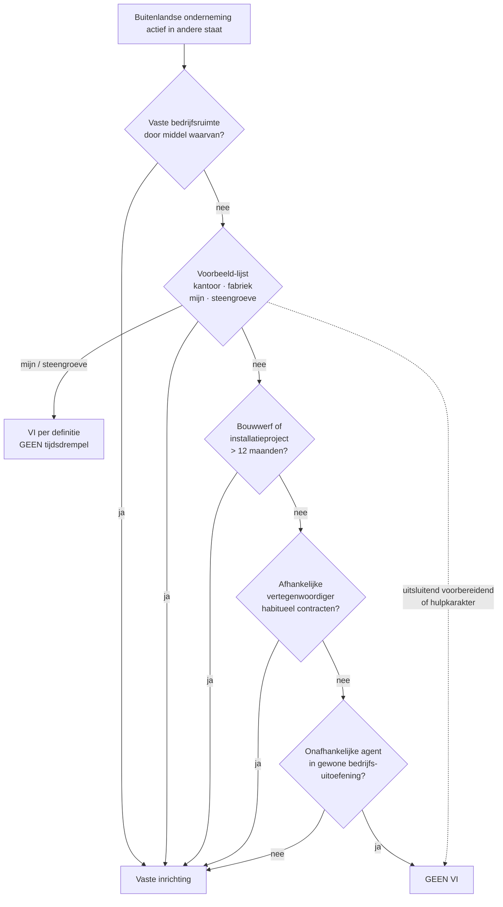

> **Leerstuk — één vraag, helemaal doorgewerkt.** Dit is het tweede techniek-leerstuk van PO 2.8 — na de DBV-toewijzingsregels staan we nu stil bij de drempelvraag *zelf*: wanneer is een staat überhaupt bevoegd om de winst van een buitenlandse onderneming te belasten? Het antwoord draait om één figuur — de **vaste inrichting**. Inbound (buitenlandse vennootschap actief in België) of outbound (Belgische vennootschap actief in het buitenland): telkens loopt alles via die ene drempel. Voor verhaal en routekaart: [[studiemateriaal/2-8|overzicht PO 2.8]].

## Antwoord in één blik

Een vaste inrichting (VI) is de **drempel** voor de heffingsbevoegdheid van de bronstaat op ondernemingswinst. Onder het OESO-modelverdrag (art. 7 §1) mag de bronstaat een buitenlandse onderneming alleen belasten als die ondernemer daar voldoende substantie heeft — vier categorieën VI (vaste bedrijfsruimte · de voorbeeld-lijst inclusief mijn en steengroeve · bouwwerf van meer dan 12 maanden · afhankelijke vertegenwoordiger). Bij **inbound** valt de buitenlandse vennootschap onder de Belgische belasting niet-inwoners (BNI-vennootschapsbelasting), berekend op de winst die toerekenbaar is aan de Belgische inrichting. Bij **outbound** blijft de Belgische vennootschap belastbaar op de wereldwijde winst, maar de meeste dubbelbelastingverdragen stellen de buitenlandse VI-winst vrij — met één belangrijke uitzondering: de **recapture-regel** (art. 185 §3 WIB92) haalt eerder afgetrokken VI-verliezen terug zodra de buitenlandse inrichting weer winstgevend wordt.

We werken eerst de vier categorieën door (de OESO-drempel), daarna de Belgische BNI-techniek voor vennootschappen en natuurlijke personen, daarna de outbound-stroom met de recapture-regel als examen-favoriet, en sluiten af met drie typische valkuilen.

---

## Vier soorten vaste inrichting

De vaste inrichting is de kerndrempel van het internationaal fiscaal recht. Zonder VI mag de bronstaat de ondernemingswinst van een buitenlandse onderneming **niet** belasten — die winst blijft volledig in de woonstaat. Met VI mag de bronstaat heffen op de winst die toerekenbaar is aan die inrichting. Wie de VI-drempel correct kan inschatten, beheerst meteen de helft van alle inbound/outbound-werk.

Het OESO-modelverdrag erkent vier hoofdcategorieën, oplopend van intuïtief naar minder intuïtief: een vaste bedrijfsruimte, de voorbeeld-lijst (mijn, steengroeve, …), een bouwwerf, en een afhankelijke vertegenwoordiger. We bekijken ze één voor één, telkens met een Berkelaar-illustratie. Berkelaar Distributie (de Belgische dochter van de holdinggroep van Henri De Cock) opent in 2025 een atelier-toonzaal in Lille; die situatie loopt door alle vier de categorieën.

### Categorie 1 — Vaste bedrijfsruimte

De hoofddefinitie luidt: een vaste plaats van bedrijfsuitoefening waardoorheen de werkzaamheid van een onderneming geheel of gedeeltelijk wordt uitgeoefend. Drie cumulatieve elementen zitten in die ene zin. Er moet een **ruimte** zijn — fysiek aanwijsbaar, niet louter een postbus. Die ruimte moet **vast** zijn — niet ad hoc, met enige stabiliteit in de tijd. En de onderneming moet er **doorheen** actief zijn — niet alleen huurder of toevallige bezoeker, maar daadwerkelijk operationeel.

Typische voorbeelden: een kantoor, een filiaal, een fabriek, een werkplaats, een atelier, een magazijn. Voor Berkelaar Distributie geldt na de oplevering van de Lille-verbouwing (juni 2026) precies dit: een atelier met toonzaal waar e-bikes worden verkocht, hersteld en uitgeleverd door 4 lokale werknemers en 1 Belgische teamleader. Klassieke vaste bedrijfsruimte, geen tijdsdrempel meer relevant — het bestaat zodra de ruimte ter beschikking is én er activiteit in plaatsvindt.

> **De voorbeeld-lijst in art. 5 §2 is illustratie, geen lijst-met-criterium.** De opsomming "zetel van leiding, filiaal, kantoor, fabriek, werkplaats, mijn, olie- of gasbron, steengroeve" verfijnt categorie 1 — ze geeft voorbeelden van plaatsen die *typisch* aan de drie cumulatieve elementen voldoen. Bij **mijn, olie- of gasbron en steengroeve** treedt echter een eigen regel op: deze plaatsen vormen een vaste inrichting *van zodra ze in uitbating zijn*, ongeacht de duur. Een tijdelijke ontginningsactiviteit van zes maanden — die voor een gewone bouwwerf onder de drempel zou blijven — maakt voor een steengroeve gewoon VI. Voor de stagiair is dat de klassieke val: bouwwerf-12-maanden door de hoofden halen met steengroeve-zonder-drempel. Twee aparte regels, twee aparte paragrafen.

### Categorie 2 — Bouwwerf en installatieproject

Voor een **bouw-, constructie- of installatieproject** is er een eigen tijdsdrempel: het project vormt VI als het langer duurt dan **twaalf maanden** in de bronstaat. Dat is de OESO-standaard. Belgische dubbelbelastingverdragen wijken er soms van af — oudere verdragen of verdragen met ontwikkelingslanden hanteren wel eens zes maanden. Altijd het concrete verdrag raadplegen voor de exacte drempel.

> **De Belgische intern-rechtelijke definitie is ruimer.** Voor de toepassing van de Belgische belasting niet-inwoners definieert het Belgisch recht een "Belgische inrichting" autonoom: een vaste bedrijfsinrichting waardoorheen een buitenlandse onderneming geheel of gedeeltelijk haar beroepswerkzaamheid in België uitoefent. De wet somt een aantal specifieke gevallen op (filiaal, kantoor, werkplaats, ...) en behandelt expliciet ook bouwwerven, vertegenwoordigers en goederenvoorraden. Maar — en dit is de cruciale combinatieregel — wanneer er een dubbelbelastingverdrag bestaat, **prevaleert dat verdrag** op de ruimere Belgische definitie. De Belgische heffingsclaim wordt dan terugbegrensd tot wat het verdrag toelaat. In de praktijk: voor verdragspartners geldt typisch de OESO-drempel van twaalf maanden voor bouwwerven, niet de ruimere Belgische regel.

De drempel werkt **absoluut**, niet pro rata. Bij elf maanden en negenentwintig dagen: geen VI. Bij twaalf maanden en één dag: VI, en wel met terugwerkende kracht vanaf dag één. De klassieke OESO-doctrine dwingt dit logisch af — de drempel is een binair scharnierpunt.

Voor Berkelaar Distributie is dit het kritische punt. De Lille-verbouwing start op 1 april 2025 en eindigt op 15 juni 2026 — veertien maanden, dus boven de twaalf-maanden-drempel. Gevolg: VI vanaf dag één in Frankrijk. Berkelaar Distributie wordt vanaf 1 april 2025 belastingplichtig in Frankrijk op de winst toerekenbaar aan Lille — zelfs voor de fase waarin het pand nog wordt verbouwd en er nog geen retail-omzet is. De bouwwerf-fase zelf draagt geen winst maar wel kosten; die kosten worden toegerekend aan de Franse inrichting.

> **Anti-fragmentatie sinds het multilateraal instrument.** Een klassieke ontwijkingstechniek bestond erin om een groot project op te splitsen in drie sub-werken van elk zes maanden, uitgevoerd door verschillende vennootschappen van dezelfde groep — elk afzonderlijk onder de drempel, geen VI. Het multilateraal instrument (MLI, art. 14) en de bijgewerkte commentaar bij art. 5 OESO-MV blokkeren dit: gerelateerde projecten tellen sinds 2018 samen voor de drempel. Voor de stagiair is de praktische regel: bij elk meervoudig opgesplitst project op naam van verbonden vennootschappen, opletten voor de samengetelde duur.

### Categorie 3 — Afhankelijke vertegenwoordiger

Een **persoon** — natuurlijk of rechtspersoon — die in een staat handelt voor een buitenlandse onderneming en daar **habitueel contracten sluit in naam** van die onderneming, maakt zelfs zonder vaste bedrijfsruimte een VI in de bronstaat. De voorwaarden zijn cumulatief: daadwerkelijk handelen, **habitueel** (niet eenmalig), contracten **sluiten** (geen vrijblijvende prospects), **in naam** van de onderneming. Sinds het MLI (BEPS-actiepunt 7) is die derde voorwaarde verruimd — wie de hoofdrol speelt bij het onderhandelen kan ook zonder formeel mandaat als afhankelijke vertegenwoordiger kwalificeren wanneer de onderneming nadien standaard ondertekent.

Een **onafhankelijke** agent doet géén VI ontstaan: economisch én juridisch autonoom van de opdrachtgever én handelend in de gewone uitoefening van een eigen bedrijf — denk aan een commissionair die voor meerdere merken werkt.

Voor Berkelaar Distributie het contrast: stel dat Berkelaar in plaats van het Lille-atelier een Franse commercial agent inschakelt. Werkt die agent **uitsluitend voor Berkelaar** en sluit hij **habitueel verkoopcontracten** in haar naam? Afhankelijke vertegenwoordiger, Franse VI zelfs zonder atelier. Werkt hij voor **meerdere merken** en levert hij enkel **prospects** aan? Onafhankelijke makelaar, geen VI.

### Categorie 4 — Wat geen VI is: voorbereidende of hulpactiviteit

Een vaste bedrijfsruimte die uitsluitend dient voor **voorbereidende of hulpactiviteiten** blijft buiten het VI-begrip. Klassieke voorbeelden: een lokaal louter voor opslag, uitstalling of aflevering van eigen goederen; een kantoor uitsluitend voor reclame of informatievergaring. Het sleutelwoord is **uitsluitend** — een Belgisch verbindingskantoor dat naast marketing ook offertes voorbereidt of klanten ontvangt voor verkoopgesprekken, verliest die status en wordt VI.

Sinds het MLI geldt bovendien een **anti-fragmentatieregel**: wanneer een onderneming haar activiteiten over meerdere vaste plaatsen verdeelt — elk afzonderlijk "voorbereidend" — maar die plaatsen samen een coherent geheel vormen dat voorbij voorbereidend gaat, kwalificeren ze gezamenlijk als één VI.

### En de dienst-VI?

Sommige Belgische dubbelbelastingverdragen — vooral met ontwikkelingslanden en op basis van het VN-modelverdrag — kennen daarnaast een **dienst-vaste-inrichting**: dienstverlening in de bronstaat die voldoende lang aanhoudt (typisch 183 dagen in 12 maanden) maakt een VI, zelfs zonder fysieke vaste plaats. Dit zit niet in het zuivere OESO-MV en is voor EU-werk zelden relevant. Bij adviezen rond Belgische ondernemingen actief in opkomende markten: altijd het specifieke verdrag controleren.

---

## Belasting niet-inwoners — vennootschappen

Voor inbound situaties — een buitenlandse vennootschap met een vaste inrichting in België — past België de **belasting niet-inwoners voor vennootschappen** toe. Een eigen heffing, vergelijkbaar met de vennootschapsbelasting maar gericht op de Belgische component van de winst.

Aan de heffing zijn onderworpen: buitenlandse vennootschappen, samen met verenigingen, instellingen of lichamen zonder rechtspersoonlijkheid die een vergelijkbare rechtsvorm hebben en hun voornaamste inrichting of zetel van bestuur niet in België hebben. De **belastbare basis** omvat vier soorten Belgische bron-inkomsten: winst toerekenbaar aan een Belgische inrichting, inkomsten van Belgisch onroerend goed, bepaalde Belgische roerende inkomsten met aanknopingspunt, en specifieke Belgische beroepsinkomsten. Voor de VI-winst gelden grotendeels dezelfde berekeningsregels als voor de gewone vennootschapsbelasting. Het Belgische boekhoudrecht geldt voor de Belgische inrichting — beperkt tot de verrichtingen die ermee verbonden zijn.

| Aspect | Binnenlandse vennootschap (Ven.B) | Buitenlandse vennootschap met Belgische inrichting (BNI-Ven.B) |
|---|---|---|
| Belastbare basis | Wereldwijde winst | Winst toerekenbaar aan Belgische inrichting + Belgische bron-inkomsten |
| Tarief | 25 % (verlaagd tarief voor KMO mogelijk) | Zelfde tarief — verlaagd tarief KMO niet automatisch toegankelijk |
| Aangifteformulier | 275.1 | 273 (eigen formulier voor niet-inwoners) |
| Boekhoudplicht | Belgisch boekhoudrecht, volledig | Belgisch boekhoudrecht, beperkt tot de inrichting |
| Verliesoverdracht | Onbeperkt naar volgende jaren, op wereldwijde winst | Alleen toerekenbaar aan inrichting, alleen tegen toekomstige inrichtings-winst |
| Geschilbeslechting | Bezwaar bij adviseur-generaal + fiscale rechtbank | Idem + vaak parallelle MAP-procedure onder DBV |

> **Niet alle KMO-voordelen gelden voor BNI-Ven.B.** Het verlaagde tarief van 20 % op de eerste schijf van de belastbare winst, sommige investeringsaftrekken en specifieke vrijstellingsregimes zijn historisch ontworpen voor binnenlandse KMO's. Voor een Belgische inrichting van een buitenlandse vennootschap moet je telkens nakijken of het concrete voordeel openstaat — een aantal voordelen vereist dat de hele vennootschap aan de Belgische KMO-toets voldoet, niet enkel het Belgische deel.

---

## Belasting niet-inwoners — natuurlijke personen

Niet-rijksinwoners — natuurlijke personen die fiscaal niet in België verblijven — met Belgische inkomsten vallen onder de belasting niet-inwoners voor de personenbelasting. De heffing is beperkter dan de gewone personenbelasting: gericht op Belgische bron-inkomen, met beperktere aftrekmogelijkheden, en met een eigen aangifteformulier (276.1 of een sub-versie).

Drie categorieën niet-inwoners worden onderscheiden. De **niet-inwoner zonder vast verblijf in België** krijgt de meest beperkte aftrekken — veel federale en gewestelijke belastingverminderingen blijven buiten bereik. De **niet-inwoner met een Belgisch tehuis** krijgt iets ruimere aftrekken. De fiscaal-gunstigste derde categorie is de **niet-inwoner met overwegend Belgisch inkomen** — vaak aangeduid als de Schumacker-categorie.

### De Schumacker-regel — een EU-rechtelijke verplichting

Het Hof van Justitie oordeelde in het arrest *Schumacker* (C-279/93, 1995) dat een niet-inwoner die het overgrote deel van zijn wereldinkomen uit één lidstaat haalt, voor persoonlijke aftrekken niet mag worden gediscrimineerd ten opzichte van inwoners van die staat. Hij heeft in zijn woonstaat amper een belastbare basis tegen dewelke hij persoonlijke aftrekken kan plaatsen — als de werkstaat hem die ook ontzegt, zou hij ze nergens kunnen benutten.

België heeft die rechtspraak omgezet: wanneer een niet-inwoner ten minste **75 %** van zijn wereldwijde beroepsinkomen uit Belgische bron behaalt, wordt zijn belasting berekend volgens de regels van de gewone personenbelasting — met de aftrekken, belastingverminderingen en berekeningswijzes die voor rijksinwoners gelden. Praktisch: toegang tot bestedings-aftrekken, persoonsgebonden aftrekken voor kinderen ten laste, en de standaard belastingschalen.

> **De cascade om de regel niet te verwarren met andere drempels.** Het 75 %-criterium betreft *de verhouding van Belgische beroepsinkomsten tot wereldwijde beroepsinkomsten*, niet de totale inkomsten en niet enkel het Belgische deel. Wie €100.000 wereldinkomen heeft en daarvan €78.000 uit Belgische bron, valt onder de regel. Wie €100.000 wereldinkomen heeft maar €72.000 uit Belgische bron, valt erbuiten. De aangifte vraagt expliciet om die wereldwijde verhouding te documenteren.

Belastbaar zijn enkel inkomsten uit Belgische bron: Belgische beroepsinkomsten (loon voor in België verricht werk, mandaten, zelfstandige), Belgisch onroerend goed (kadastraal inkomen of huurwaarde), en bepaalde Belgische roerende inkomsten (meestal via bevrijdende roerende voorheffing). Op de berekende belasting komt 7 % federale opcentiemen; **gemeente-opcentiemen** gelden niet — een niet-inwoner woont niet in een Belgische gemeente. Voor de toepassing van gewestelijke verminderingen worden niet-inwoners wel in één gewest gelokaliseerd via de cascade in WIB92 art. 248/2.

**Sophie De Cock — illustratie in omgekeerde richting.** Sophie is Belgisch rijksinwoner (Lanaken) maar werkt 60 % van haar tijd in Nederland. België belast haar in de gewone personenbelasting op wereldwijd inkomen; Nederland past zíjn belasting niet-inwoners toe op het Nederlandse loondeel. Voor het samenspel grijp je terug naar het verdrag België-Nederland en de vrijstelling met progressievoorbehoud — daar gaat een ander leerstuk over.

---

## Outbound — buitenlandse vaste inrichting

Tot hier zat je in de spiegel van een Belgische heffing op buitenlandse spelers. Nu draaien we de stroom om: Belgische vennootschap met een vaste inrichting in het buitenland. **Berkelaar Distributie** met haar Franse VI in Lille is het hoofdvoorbeeld.

De grondregel is eenvoudig: Berkelaar Distributie is en blijft Belgisch fiscaal inwoner — haar zetel en werkelijke leiding zitten in Antwerpen. Ze is onderworpen aan de Belgische vennootschapsbelasting op haar **wereldwijde winst**, inclusief de Franse VI-winst. Het verdrag België-Frankrijk komt dan tussenbeide om dubbele belasting te voorkomen.

België hanteert in zijn dubbelbelastingverdragen overwegend de **vrijstellingsmethode** met progressievoorbehoud voor ondernemingswinst. Concreet voor Berkelaar Distributie: de winst van de Franse inrichting wordt door Frankrijk belast (Franse vennootschapsbelasting op de aan Lille toerekenbare winst), en België stelt diezelfde winst vrij — met progressievoorbehoud waar relevant, hoewel dat voor vennootschappen praktisch weinig effect heeft omdat de Belgische vennootschapsbelasting niet progressief werkt zoals de personenbelasting.

### De winstbepaling per herkomst

Wanneer een Belgische vennootschap meerdere buitenlandse inrichtingen heeft, moet ze haar wereldwinst toewijzen per herkomst — een toepassing van de algemene OESO-regel "winst toerekenbaar aan de inrichting" (art. 7 OESO-MV). Twee methoden zijn gangbaar. De **directe methode** vereist een afzonderlijke boekhouding per inrichting — alsof elke VI een aparte onderneming was, met eigen functies, activa en risico's. De **indirecte methode** verdeelt de geconsolideerde winst via een verdeelsleutel (omzet, lonen, activa). De OESO-doctrine geeft sinds 2010 de voorkeur aan de directe methode, geconcretiseerd in de Authorised OECD Approach: behandel de inrichting als een onafhankelijke onderneming, ken haar functies en risico's toe, pas armslengte-prijzen toe op interne verrichtingen.

Voor Berkelaar Distributie betekent dit: zodra Lille operationeel is, moet er een afzonderlijke Franse boekhouding zijn — met toegerekende activa (atelier-inrichting, voorraad e-bikes), toegerekende lonen (4 Franse werknemers + 1 gedetacheerde), en gedocumenteerde interne verrichtingen tussen Antwerpse hoofdzetel en Franse inrichting (bv. centrale inkoop die fietsen levert aan Lille — armslengte-prijs nodig).

### De recapture-regel — examen-favoriet

Hier ligt de meest geteste finesse van de hele outbound-techniek. De vrijstellingsmethode klinkt symmetrisch — winst vrijgesteld, dus ook verlies onbruikbaar in België — maar de Belgische wetgever heeft een afwijking ingebouwd voor de eerste jaren van een buitenlandse VI.

De afwijking werkt in twee tijden. **Eerst de aftrek** (gunstig voor de Belgische belastingplichtige): wanneer de buitenlandse inrichting verlies maakt, en dit verlies kwalificeert onder de bijzondere voorwaarden van de wet, mag het tijdelijk worden afgetrokken van de Belgische belastbare grondslag — zelfs onder de vrijstellingsmethode. Pedagogische reden: een aanloopverlies in een buitenlandse VI zou anders op niemands grondslag aftrekbaar zijn (België stelt vrij, het andere land heeft nog geen winst), wat economisch onlogisch is. **Daarna de recapture** (ongunstig): wanneer de inrichting nadien winstgevend wordt, wordt die latere VI-winst — die normaal onder het verdrag vrijgesteld is — bij de Belgische grondslag opgeteld, tot beloop van het eerder afgetrokken verlies. Per saldo: economisch neutraal als cumulatieve verliezen en winsten gelijk uitkomen, maar tijdelijk een renteloze "fiscale lening" aan de Belgische vennootschap.

> **Welk wetsartikel?** De recapture-regel voor buitenlandse inrichtingsverliezen die voorheen op de Belgische grondslag werden afgetrokken, is verankerd in **art. 185 §3 WIB92** (de bepaling die het algemene principe stelt dat verliezen van bij verdrag vrijgestelde inrichtingen buiten beschouwing blijven, met een uitzondering voor definitieve EER-verliezen en met de recapture-mechaniek voor herwonnen winst). De toepassing loopt door op het aangifteformulier en wordt gekoppeld aan de bepalingen over verliesverwerking in art. 206 WIB92 (regels rond overdracht van beroepsverliezen). Voor de stagiair: **art. 185 §3** is de inhoudelijke grondslag; circulaire 2023/C/103 geeft de praktische uitwerking.

#### Examen 2014-1 vraag 37 — doorgewerkt voorbeeld

| Jaar | Wereldwinst (boekhoudkundig) | VI-resultaat (Italië) | Aftrek of recapture op Belgische grondslag | Belgisch belastbaar |
|---|---|---|---|---|
| 1 | 1.000 | −1.000 | Verlies van 1.000 wordt op Belgische grondslag afgetrokken | 1.000 |
| 2 | 3.000 | +1.000 | Recapture: 1.000 wordt teruggevoegd; daarnaast de gewone vrijstelling van de VI-winst | 4.000 |
| 3 (hypothetisch) | 3.000 | +1.000 | Geen recapture meer (eerder afgetrokken verlies is uitgeput), normale vrijstelling | 2.000 |

De trap ligt in jaar 2. Boekhoudkundig is de wereldwinst 3.000. Onder een naïeve lezing van de vrijstellingsmethode: Belgisch belastbaar = 2.000 (de Italiaanse 1.000 vrijgesteld). **Fout**. De recapture haalt de eerder afgetrokken 1.000 terug bij de Belgische grondslag, bovenop de gewone vrijstelling — Belgisch belastbaar = **4.000**. Boekhoudkundige wereldwinst en Belgische belastbare grondslag **lopen uit elkaar** zolang de recapture-keten loopt. In jaar 3 is de "lade" leeg en volgt de zuivere vrijstellingsmethode.

**Berkelaar-illustratie.** De Franse VI in Lille maakt in 2026 (aanloopjaar) een verlies van −120k, dat onder art. 185 §3 op de Belgische grondslag wordt afgetrokken. In 2027 maakt de VI +180k winst — recapture activeert: 120k wordt opnieuw bij de Belgische grondslag gevoegd, de resterende 60k blijft vrijgesteld onder het verdrag België-Frankrijk. Vanaf 2028 vervalt de recapture-component.

---

## Drie valkuilen om scherp te houden

**Valkuil 1 — Steengroeve verward met bouwwerf.** De steengroeve, de mijn en de olie- of gasbron staan in de voorbeeld-lijst (art. 5 §2) als klassieke vaste inrichting *zonder tijdsdrempel*. De bouwwerf staat in een aparte paragraaf (art. 5 §3) met een drempel van twaalf maanden. Een steengroeve in uitbating van zes maanden is VI; een bouwwerf van zes maanden is dat niet. Klassieke trickvraag: een bedrijf opent een tijdelijke steengroeve voor acht maanden — geen VI? Fout, VI vanaf dag één. Examen 2015-1 vr49 en 2024-oefenvraag 4 hameren hierop.

**Valkuil 2 — Recapture-regel en boekhoudkundige winst.** Bij een eerder afgetrokken VI-verlies wijkt de Belgische belastbare grondslag af van de boekhoudkundige wereldwinst — naar boven. Wie in een examenvraag zonder nadenken "Belgisch belastbaar = wereldwinst minus VI-winst" toepast, mist precies de recapture-component. Telkens een buitenlandse VI in de feitenset eerst verlies en dan winst maakt: aftrek-en-recapture-keten op de Belgische grondslag uitwerken. Examen 2014-1 vr37 is het klassieke voorbeeld.

**Valkuil 3 — BNI-Ven.B is geen kopie van de Belgische vennootschapsbelasting.** Niet alle gunstmaatregelen voor binnenlandse KMO's — verlaagd tarief op de eerste schijf, sommige investeringsaftrekken, specifieke vrijstellingsregimes — gelden zonder meer voor de belasting niet-inwoners van een buitenlandse vennootschap met een Belgische inrichting. Voor elk gunst-instrument moet je nagaan of het ook openstaat voor BNI-Ven.B, en of dat dan vereist dat de gehele buitenlandse vennootschap zelf de KMO-toets doorstaat. Vermijd de reflex "BNI = gewone Ven.B met een ander aangifteformulier".

---

## Wanneer je dit snapt, ga dan naar

- [[europese-richtlijnen-en-bronheffing]] — EU-richtlijnen op dividenden, intresten en royalty's; hoe Belgische DBI-aftrek en forfaitair gedeelte buitenlandse belasting de bronheffing corrigeren.
- [[transfer-pricing-beps-en-anti-misbruik]] — bij vaste inrichting: corresponderende correcties en armslengte tussen VI en hoofdzetel (Authorised OECD Approach in detail).
- [[geintegreerd-internationaal-advies]] — Case B (exit + zetelverplaatsing) toetst VI-techniek en recapture aan een synthese-praktijk.
- [[studiemateriaal/2-8/samenvatting|Samenvatting PO 2.8]] — voor herhaling vlak vóór het examen: VI-drempels, BNI-categorieën en recapture op één pagina.

## Doorklik naar concepten

Voor wie definitorisch detail wil opzoeken:

- [[vaste-inrichting]] · [[belasting-niet-inwoners]]
- [[buitenlandse-winst-en-verlies]] · [[winst-naar-herkomst]]
- [[toepassingsgebied-vennootschapsbelasting]]

---

## Wettelijk fundament

- VI-definitie internationaal: OESO-modelverdrag art. 5 §1 tot §7 — vaste plaats van bedrijfsuitoefening, voorbeeld-lijst, bouwwerf > 12 maanden, afhankelijke vertegenwoordiger, onafhankelijke agent-uitsluiting, dochter-uitsluiting.
- VI-definitie Belgisch intern recht: WIB92 art. 229 — autonome Belgische definitie van "Belgische inrichting" voor buitenlandse ondernemingen, met opsomming van specifieke gevallen (filiaal, kantoor, werkplaats, ...) en aparte regeling voor vertegenwoordigers. Bij verdragspartner: de OESO-drempel uit het verdrag primeert.
- BNI-plichtigheid: WIB92 art. 227 — niet-rijksinwoners (1°), buitenlandse vennootschappen met voornaamste inrichting of zetel buiten België (2°), vreemde Staten en andere niet-Belgische rechtspersonen (3°).
- Belastbare basis BNI: WIB92 art. 228 e.v. + verwijzingsregels in art. 235 — toepassing van de regels van de personenbelasting (art. 7 tot 103, 129/1) voor 227, 1° en van de vennootschapsbelasting (art. 183, 185 §2 en §5, 185quater, 185quinquies, 190-208) voor 227, 2°.
- Boekhoudplicht Belgische inrichting: WIB92 art. 320/1 — Belgisch boekhoudrecht van toepassing op de inrichting, beperkt tot de verrichtingen, activa, vorderingen en schulden die ermee verbonden zijn.
- Schumacker-omzetting (75 %-Belgische beroepsinkomsten): WIB92 art. 242, 243/1 en 244 — toegang tot bestedings-aftrekken, gewone PB-tarief en aftrekken voor wie minstens 75 % beroepsinkomen uit Belgische bron heeft; toegevoegde regels voor EER-inwoners. Rechtsgrond: HJEU 14 februari 1995, C-279/93 Schumacker.
- Vrijstelling buitenlandse VI-winst + recapture-regel: WIB92 art. 185 §3 — verliezen geleden in een bij verdrag vrijgestelde buitenlandse inrichting blijven in beginsel buiten beschouwing voor de Belgische grondslag, met uitzonderingen voor definitieve EER-verliezen en met de recapture-mechaniek voor latere winsten van diezelfde inrichting. Praktische uitwerking in circulaire 2023/C/103 van 21.12.2023.
- Verliesverwerking en volgorde: WIB92 art. 206 — algemene regels rond overdracht en aftrek van vorige beroepsverliezen, met specifieke regels voor verliezen geleden in buitenlandse inrichtingen.
- VI-uitbreiding post-MLI: multilateraal instrument art. 12 tot 15 — anti-fragmentatieregel voor bouwwerven, verruiming agent-VI-begrip (BEPS-actie 7), strengere lezing van de voorbereidende/hulpactiviteit-uitzondering.

---

*Leerstuk PO 2.8. Status: voorgesteld — volgt ADR-037.*
