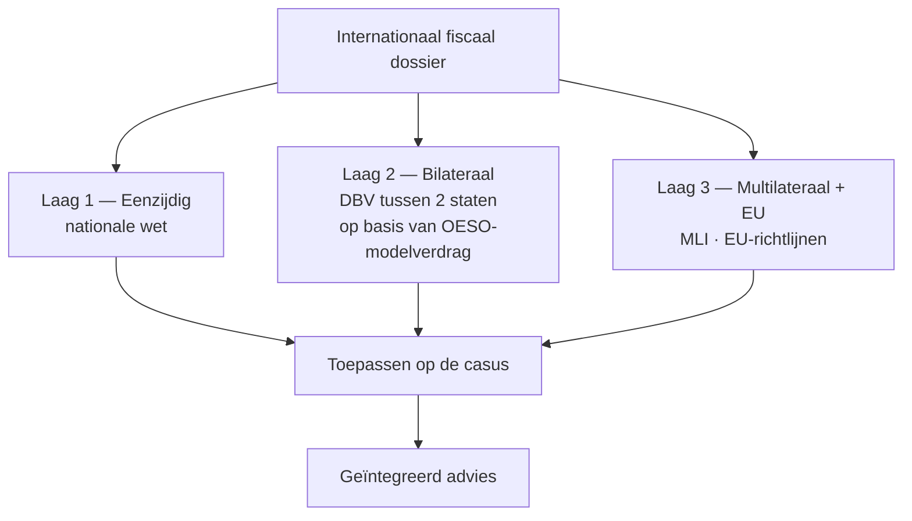

> **Leerstuk — één vraag, helemaal doorgewerkt.** Dit is de entry-fiche voor PO 2.8: eerst snappen waarom dubbele belasting ontstaat en welke drie lagen ze oplossen, daarna pas de techniek. De DBV-mechaniek staat in [[dbv-werking-en-toewijzingsregels]], de vaste inrichting in [[vaste-inrichting-en-belasting-niet-inwoners]], de EU-richtlijnen in [[europese-richtlijnen-en-bronheffing]]. Voor verhaal en routekaart: [[studiemateriaal/2-8|overzicht PO 2.8]].

## Antwoord in één blik

Internationaal fiscaal recht is het samenspel van regels dat voorkomt dat dezelfde inkomsten of hetzelfde vermogen door meerdere staten **dubbel** worden belast. Drie lagen lossen dat samen op: een staat doet eerst zelf wat hij kan (**eenzijdig** in zijn nationale wet), daarna komt het **bilaterale** dubbelbelastingverdrag tussen twee staten erbij, en bovenop liggen nog **multilaterale en Europese** instrumenten. Bij elke internationale casus toets je de drie lagen tegelijk en kies je de gunstigste uitkomst.

We werken eerst de **oorzaken** door, dan de twee **vormen** (juridisch ≠ economisch), daarna de **drie lagen** — telkens met een stroom uit de Berkelaar-groep — en sluiten af met de drie aanknopingspunten en de rollen van de accountant.

---

## Waarom ontstaat dubbele belasting?

Henri De Cock ontvangt in 2026 een dividend van €650.000 van zijn Luxemburgse dochter Berkelaar Luxemburg SARL. Twee staten kijken naar diezelfde euro. **Luxemburg** wil heffen omdat de bron op Luxemburgs grondgebied ligt. **België** wil heffen omdat Henri Belgisch rijksinwoner is — wie hier woont, wordt op zijn wereldinkomen aangeslagen. Beide claims zijn legitiem. Zonder corrigerend mechanisme: één inkomen, twee aanslagen.

Achter elk dossier zit één van drie klassieke oorzaken — soms één, vaak twee tegelijk.

### Het woonplaatsbeginsel

Een staat belast zijn eigen inwoners op hun **wereldinkomen**. Voor België: wie zijn woonplaats of de zetel van zijn fortuin in België heeft gevestigd, is Belgisch rijksinwoner en daarmee wereldwijd belastbaar. Henri, gedomicilieerd in Antwerpen, valt daar onder. Zijn Luxemburgse dividend, zijn Spaanse villa, zijn intresten op een Duitse rekening — alles passeert in beginsel via de Belgische aangifte.

### Het bronbeginsel

Tegelijk claimt elke staat **inkomen waarvan de bron op zijn grondgebied ligt**, ook al wordt het ontvangen door een niet-inwoner. Spanje belast Henri's villa via een forfaitaire heffing voor niet-inwoners — niet omdat Henri Spanjaard is, maar omdat de steen op Spaanse bodem staat. Luxemburg houdt bronheffing in op het dividend van zijn SARL. Nederland belast Sophie's loon voor de dagen die ze op Nederlandse bodem werkt. De staat heft als **bronstaat**.

### Dubbele residentie

Een derde, minder frequente oorzaak: twee staten kwalificeren **dezelfde persoon** als hun inwoner. Maarten is sinds 2024 vanuit Antwerpen gedetacheerd naar Berkelaar Luxemburg SARL. Zijn gezin blijft in België — voor België rijksinwoner. Maar hij werkt voltijds in Luxemburg en huurt er een appartement — naar Luxemburgs recht óók inwoner. Twee staten claimen hem; zonder regel om de knoop door te hakken, wordt hij in beide volledig belast.

> **Aside.** Het klassieke geval combineert oorzaak 1 en 2 (woonstaat × bronstaat). Dubbele residentie is zeldzamer en wordt apart opgelost via een cascade die we in [[dbv-werking-en-toewijzingsregels]] uitwerken.

| Oorzaak | Mechaniek | Voorbeeld Berkelaar |
|---|---|---|
| Woonplaatsbeginsel | Staat belast zijn rijksinwoner op zijn wereldinkomen | België belast Henri op zijn Luxemburgse dividend |
| Bronbeginsel | Staat belast inkomen waarvan de bron op zijn grondgebied ligt | Luxemburg belast hetzelfde dividend bij uitkering door de SARL |
| Dubbele residentie | Beide staten zien dezelfde persoon als inwoner | Maarten in zijn overgangsjaar: BE-gezin + LU-werkplek |

De oorzaken zijn elk op zich verdedigbaar. Het probleem is niet dat een staat woonplaats of bron belast — het probleem is dat **de claims niet automatisch samenwerken**. Daarom bestaat internationaal fiscaal recht.

---

## Twee vormen: juridisch versus economisch

Niet alle dubbele belasting is hetzelfde. Twee scenario's lijken op elkaar maar vragen een ander instrument om op te lossen.

**Juridische dubbele belasting** treedt op wanneer **dezelfde belastingplichtige** voor **hetzelfde inkomen** door **twee staten** wordt belast. Sophie (Belgisch rijksinwoner) werkt bij Berkelaar Nederland in Maastricht. België wil als woonstaat belasten op haar wereldinkomen; Nederland wil als werkstaat belasten op het deel dat ze op Nederlandse bodem verdient. Eén Sophie, één loonpakket, twee staten — klassieke juridische dubbele belasting.

**Economische dubbele belasting** treedt op wanneer **hetzelfde inkomen** door **twee verschillende belastingplichtigen** wordt belast. Berkelaar Luxemburg SARL betaalt vennootschapsbelasting op haar winst; diezelfde winst wordt uitgekeerd als dividend van €650.000 aan Berkelaar Holding BV, die er nogmaals op belast wordt (vóór toepassing van de aftrek voor definitief belaste inkomsten). Materieel hetzelfde geld, maar twee belastingplichtigen — economisch dubbel.

| Element | Juridische dubbele belasting | Economische dubbele belasting |
|---|---|---|
| Belastingplichtige | Zelfde persoon | Twee verschillende personen |
| Inkomen | Zelfde inkomen | Zelfde inkomensstroom |
| Klassiek voorbeeld | Sophie's loon: BE woonstaat + NL werkstaat | LU SARL winst → BE Holding dividend |
| Hoofd-instrument | Dubbelbelastingverdrag + voorkomingsmethode | Aftrek voor definitief belaste inkomsten + corresponderende correctie |

Het onderscheid maakt uit voor de remedie. Juridische dubbele belasting los je op via een **dubbelbelastingverdrag** dat de heffingsbevoegdheid verdeelt en de woonstaat verplicht om resterende dubbele heffing weg te nemen. Voor economische dubbele belasting bestaat geen verdragsmechanisme tussen verschillende belastingplichtigen — die wordt opgelost door **intern recht** (de Belgische aftrek voor definitief belaste inkomsten op dividenden uit dochters) of, bij verrekenprijzen, door een corresponderende correctie waarmee de tweede staat zijn grondslag verlaagt nadat de eerste corrigeert.

> **Examen-aandacht.** Bij een verrekenprijs-correctie tussen een vaste inrichting en haar hoofdzetel gaat het om dezelfde rechtspersoon — dus géén klassiek juridisch geval. Wie de twee vormen niet beheerst, antwoordt fout op vragen die spelen op precies dat onderscheid.

---

## Drie lagen van voorkoming

Dubbele belasting wordt op drie niveaus tegelijk aangepakt. Elke staat doet eerst wat hij in zijn eigen wet kan; dan komen de bilaterale verdragen erbij; en bovenop liggen multilaterale instrumenten en Europese richtlijnen. De drie lagen werken **cumulatief**: je toetst ze alle drie en kiest de uitkomst die voor de cliënt het gunstigst uitvalt — eerste reflex bij elk internationaal dossier.

### Laag 1 — Eenzijdig: nationaal-rechtelijke correcties

Elke staat heeft in zijn interne wet regels om dubbele belasting te beperken, **zonder dat een tegenpartij moet meewerken**. Dit is de bodemlaag — ze werkt zelfs in dossiers met landen waarmee België geen dubbelbelastingverdrag heeft.

De Belgische personenbelasting kent twee belangrijke technieken die in latere leerstukken uitgewerkt worden. Voor buitenlandse inkomsten **zonder een dubbelbelastingverdrag** voorziet de wet een **halvering**: de Belgische belasting op die inkomsten wordt tot de helft verminderd. Voor inkomsten die **wél onder een verdrag** vallen en die het verdrag aan de bronstaat toewijst, geldt de **vrijstelling met progressievoorbehoud**: de buitenlandse inkomsten worden vrijgesteld, maar tellen mee om het tarief te bepalen dat op het overige Belgische inkomen wordt toegepast. Henri's Spaanse villa-inkomen en Sophie's Nederlandse loon volgen dit regime.

Daarnaast zitten in deze laag de **forfaitaire verrekening** van buitenlandse bronheffing op intresten en royalty's en de **aftrek voor definitief belaste inkomsten** waarmee een Belgische moeder de dividenden uit haar dochters uit de belastbare grondslag haalt. De volledige werking komt aan bod in [[europese-richtlijnen-en-bronheffing]].

Sterkte en zwakte van deze laag: ze werkt **altijd**, ook zonder verdrag, maar is vaak **forfaitair** en dus grover dan een precieze verrekening van de werkelijk in het buitenland betaalde belasting. Overgeschoten buitenlandse heffing gaat in de regel verloren.

### Laag 2 — Bilateraal: dubbelbelastingverdragen

Een **dubbelbelastingverdrag** is een verdrag tussen twee staten dat dubbele belasting voorkomt door twee dingen samen te regelen: het **wijst per inkomenscategorie** aan welke staat mag heffen (woonstaat, bronstaat of allebei met een plafond), en het verplicht de woonstaat om de resterende dubbele heffing weg te nemen via een **voorkomingsmethode** — vrijstelling of verrekening.

België heeft ongeveer 100 actieve verdragen. Bijna allemaal gemodelleerd op het **OESO-modelverdrag**: een door de OESO-lidstaten gezamenlijk onderhouden template van 31 standaard-artikelen met commentaar. Het modelverdrag is zelf geen verdrag — staten gebruiken het als gemeenschappelijke onderhandelingsbasis. Voor de Berkelaar-stromen tellen onder meer België-Nederland (Sophie's loon), België-Luxemburg (LU-dividend, Maarten), België-Frankrijk (Lille-VI) en België-Spanje (Henri's villa).

Twee eigenschappen om te onthouden. Eerst: een verdrag **verhoogt nooit** de belasting — het kan alleen beperken. Is intern recht al gunstiger, dan blijft intern recht van toepassing. Vervolgens: zonder verdrag is er geen bilaterale laag, alleen laag 1 en — voor EU-stromen — laag 3. De toewijzingsregels per inkomenscategorie en de voorkomingsmethode worden volledig uitgewerkt in [[dbv-werking-en-toewijzingsregels]].

### Laag 3 — Multilateraal en Europees

De bovenste laag bundelt instrumenten die **meerdere staten tegelijk** binden.

Het **Multilateraal Instrument (MLI)** is een verdragsraamwerk dat in één klap ongeveer 100 bestaande bilaterale verdragen aanpast: het voert anti-misbruik-clausules in (Principal Purpose Test), verbreedt het VI-begrip en voorziet arbitrage bij blokkades. België ondertekende in 2018; de gevolgen treden vanaf 2020 in werking, telkens afhankelijk van ratificatie door de tegenpartij.

Daarnaast staan in deze laag de **EU-richtlijnen** op fiscaal vlak. Vier sleutelstukken voor PO 2.8: de **moeder-dochterrichtlijn** schaft de bronheffing af op dividenden tussen verbonden EU-vennootschappen vanaf een deelnemingsdrempel; de **interest-royaltyrichtlijn** doet hetzelfde voor intresten en royalty's, met een hogere drempel; de **fusierichtlijn** verzekert fiscale neutraliteit bij grensoverschrijdende fusies, splitsingen en aandelenruil; en de **anti-tax-avoidance-richtlijnen (ATAD I en II)** verplichten alle EU-lidstaten om anti-misbruik-regels in te voeren (controlled foreign companies, beperking van interestaftrek, exit-heffing, hybride-mismatches, algemene anti-misbruik-regel).

Voor de Berkelaar-stromen geldt: het Luxemburgse dividend naar de Belgische holding en de royalty van Nederland naar Luxemburg vallen in beginsel onder respectievelijk de moeder-dochterrichtlijn en de interest-royaltyrichtlijn. Als alle voorwaarden gehaald zijn, betekent dat **0 % bronheffing** — sterker dan elk verdragstarief. De drempels en de anti-misbruik-toets per richtlijn werken we uit in [[europese-richtlijnen-en-bronheffing]].

> **Aside — de gunstigste laag, niet de hoogste.** Hoewel laag 3 vaak doorslaggevend is, primeert hij niet automatisch. Een verdragstarief kan in een specifiek geval gunstiger zijn dan een richtlijn die door een drempel of een voorwaarde niet gehaald wordt. De vuistregel blijft: alle drie de lagen toetsen, dan de gunstigste kiezen.

---

## Drie aanknopingspunten in elke casus

Wie de drie lagen door heeft, opent elke internationale casus met dezelfde drie vragen.

**Residentie — wie woont waar?** Voor natuurlijke personen kijkt de Belgische wet naar de woonplaats of de zetel van het fortuin: één van beide volstaat om Belgisch rijksinwoner te zijn. Voor vennootschappen telt de zetel van werkelijke leiding. Wanneer twee staten dezelfde persoon als inwoner kwalificeren, lost het OESO-modelverdrag dat op met een **cascade**: eerst waar de persoon een duurzaam tehuis ter beschikking heeft; daarna het middelpunt van levensbelangen (gezin, werk, vermogen); daarna het gewoon verblijf; en pas tot slot de nationaliteit. Lukt geen criterium, dan overleggen de bevoegde autoriteiten onderling.

**Vaste inrichting — heeft de buitenlandse onderneming voldoende substantie in een andere staat om daar belast te worden?** Het OESO-modelverdrag definieert vier hoofdvarianten: een vaste bedrijfsruimte, een bouwwerf of installatieproject boven een tijdsdrempel, een afhankelijke vertegenwoordiger die habitueel contracten sluit, en — sinds BEPS — een dienst-vaste inrichting. Berkelaar Distributie opent een atelier in Lille met 14 maanden verbouwing — daarmee al een vaste inrichting in Frankrijk via de bouwwerf-categorie. De volledige toets komt in [[vaste-inrichting-en-belasting-niet-inwoners]].

**Bron — waar is het inkomen verdiend?** Onroerend goed: ligging. Arbeid: werkstaat. Dividend: vestigingsstaat van de uitkerende vennootschap. Royalty: meestal de staat van de schuldenaar.

| Aanknopingspunt | Vraag | Relevante categorie |
|---|---|---|
| Residentie | Wie woont waar? | Hoofdregel intern + tie-breaker op verdragsniveau |
| Vaste inrichting | Voldoende substantie in andere staat? | Vier varianten: ruimte · bouwwerf · agent · dienst |
| Bron van inkomen | Waar verdiend? | Verschilt per inkomenscategorie |

Samen openen ze elke casus. Henri's Spaanse villa: residentie BE × bron ES → het verdrag wijst onroerend goed toe aan de ligging-staat, België vrijstelt met progressievoorbehoud. Sophie's loon: residentie BE × bron NL → 183-dagen-regel voor arbeid. Dezelfde drie vragen, telkens een ander antwoord.

---

## De accountant in het internationale dossier

Het programma verdeelt het werk over drie hoofdrollen plus één synthese-rol. Weten welke rol je speelt is even belangrijk als het juiste antwoord vinden.

Als **adviseur** structureer je vragen vooraf: vestigingskeuze, grensoverschrijdende investeringen, het onthaal van een expat-werknemer, het vragen van een voorafgaande beslissing aan de fiscus — de dominante rol in dit programma-onderdeel. Als **compliance-verantwoordelijke** verzorg je de aangiftes: belasting niet-inwoners, formulieren voor verlaagde bronheffing onder een verdrag, country-by-country-rapport, aangifte van juridische constructies. Als **vertegenwoordiger** sta je in voor de cliënt bij de Belgische of buitenlandse fiscus, bij de Dienst Voorafgaande Beslissingen, of in de onderlinge overlegprocedure tussen twee staten — het mechanisme uit het OESO-modelverdrag waarmee bevoegde autoriteiten verdragsstrijdige heffingen proberen op te lossen.

Een vierde, synthese-rol komt op bij **exit-dossiers**: een verkoop met zetelverplaatsing of een grensoverschrijdende herstructurering, waar structurering, aangifte en eventueel geschil-begeleiding in één dossier samenkomen. Eén praktische tip voor de leesroute: de drie aanknopingspunten — residentie, vaste inrichting, bron — keren in elk volgend leerstuk terug. Wie ze hier stevig vastlegt, ervaart de rest van het pakket als toepassing eerder dan als nieuw materiaal.

---

## Wanneer je dit snapt, ga dan naar

- [[dbv-werking-en-toewijzingsregels]] — De matrijs van het verdrag: hoe heffingsbevoegdheid per inkomenscategorie wordt toegewezen en hoe de woonstaat de resterende dubbele heffing wegneemt.
- [[vaste-inrichting-en-belasting-niet-inwoners]] — Wanneer is België bevoegd op een buitenlandse activiteit? De drempel voor een vaste inrichting + de mechaniek van de belasting niet-inwoners.
- [[europese-richtlijnen-en-bronheffing]] — De Europese laag: moeder-dochter, interest-royalty, fusie + de Belgische correcties (forfaitaire verrekening + aftrek voor definitief belaste inkomsten).
- [[studiemateriaal/2-8/samenvatting|Samenvatting PO 2.8]] — Voor herhaling vlak vóór het examen: denkschema feiten → verdrag → richtlijn + de drie lagen op één pagina.

## Doorklik naar concepten

Voor wie definitorisch detail wil opzoeken:

- [[internationaal-fiscaal]] · [[dubbelbelastingverdrag]] · [[fiscale-residentie]]
- [[oeso-modelverdrag]] · [[mli-instrument]]
- [[eu-fiscale-richtlijnen]]

---

## Wettelijk fundament

- Belgisch rijksinwoner — woonplaats of zetel van fortuin als alternatieve criteria: WIB 92 art. 2 §1, 1° + art. 3 (toepassing van de personenbelasting op rijksinwoners).
- Fiscale woonplaats vennootschap — maatschappelijke zetel, voornaamste inrichting of zetel van werkelijke leiding: WIB 92 art. 2 §1, 5° + art. 179.
- Tie-breaker bij dubbele residentie van natuurlijke personen — cascade duurzaam tehuis → middelpunt levensbelangen → gewoon verblijf → nationaliteit → onderling overleg: art. 4 §2 OESO-modelverdrag.
- Halvering van de Belgische belasting op inkomsten uit het buitenland: WIB 92 art. 156 (onroerende inkomsten, in het buitenland behaalde en belaste beroepsinkomsten en bepaalde diverse inkomsten). Klassieke toepassing voor inkomsten uit landen zonder dubbelbelastingverdrag.
- Vrijstelling met progressievoorbehoud — de Belgische voorkomingsmethode wanneer een verdrag de heffingsbevoegdheid aan de bronstaat toewijst: WIB 92 art. 155 (omzetting van art. 23A OESO-modelverdrag).
- Forfaitair gedeelte van buitenlandse belasting (verrekening buitenlandse bronheffing op intresten en royalty's): WIB 92 art. 285-289.
- Aftrek voor definitief belaste inkomsten (dividenden uit dochtervennootschappen): WIB 92 art. 202-205quater.
- Bronnen van Belgische inkomsten voor niet-inwoners (territoriaal aanknopingspunt): WIB 92 art. 228.
- MLI — Multilateraal Instrument BEPS-actiepunt 15: goedgekeurd in België in 2018; gevolgen voor de Belgische verdragen in werking vanaf 2020, telkens afhankelijk van de ratificatie door de tegenpartij.

---

*Leerstuk PO 2.8. Status: voorgesteld — POC volgens ADR-037.*
