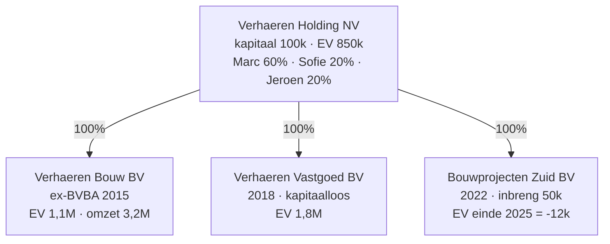

> **Leerstuk — één vraag, helemaal doorgewerkt.** Dit leerstuk gaat over de **gewone besluitvorming** binnen een vennootschap. Crisis-modus — alarmbel, uitkeringstest, bestuurdersaansprakelijkheid bij continuïteitsproblemen — komt in [[kapitaalbescherming-uitkeringen-en-alarmbel|leerstuk 3]]. Voor verhaal en routekaart: [[studiemateriaal/3-0|overzicht PO 3.0]].

## Antwoord in één blik

Een vennootschap heeft **drie organen** plus een **vierde kanaal**. Het **bestuursorgaan** (één zaakvoerder of een collegiale raad) doet alle handelingen die nodig of dienstig zijn voor het maatschappelijk doel. De **algemene vergadering** beslist over jaarrekening, winstbestemming, statutenwijziging, benoeming en ontslag van bestuur, kwijting. De **aandeelhoudersovereenkomst** (SHA) is een privaat contract tussen aandeelhouders dat hun onderlinge verhouding aanvullend regelt (lock-up, voorkooprecht, drag-along, tag-along, exit).

Drie regels lopen door alle vier de blokken:

- Een besluit van bestuur of AV dat strijdig is met de wet, de statuten of met de belangenconflict-procedure kan **nietig** worden verklaard op vordering van een belanghebbende.
- Aandeelhouders die samen **10 %** van de aandelen of het kapitaal vertegenwoordigen kunnen het bestuur **dwingen** een algemene vergadering bijeen te roepen.
- Een aandeelhoudersovereenkomst bindt alleen de **partijen** — niet derden, niet nieuwe aandeelhouders. Wie erga-omnes-effect wil, schrijft de clausule in de **statuten**.

We bouwen het verhaal op rond de **Verhaeren-bouwgroep**.

> **De groep in één blik.** Marc Verhaeren (62) is oprichter, met zijn kinderen Sofie (35, jurist) en Jeroen (32, ingenieur) als minderheidsaandeelhouders in de top-NV. Onderaan hangen drie BV's die elk hun eigen rol spelen — Verhaeren Bouw als operationele werkvennootschap, Vastgoed BV als patrimoniumdrager, en Bouwprojecten Zuid als de zwarte-schaap-dochter die in 2026 alarmbel zal trekken. In dit leerstuk spelen vooral de Holding en de twee gezonde BV's mee.

---

## Het bestuursorgaan — vorm, bevoegdheid, vertegenwoordiging

### Bestuursvormen — individueel of collegiaal

De **BV** geeft maximale vormvrijheid: één of meerdere zaakvoerders, individueel of collegiaal. Geen wettelijke raad-van-bestuur-vereiste. Verhaeren Bouw BV werkt zo: Marc is enige zaakvoerder.

De **NV** kent drie modellen die in de statuten gekozen worden:

| Model | Beschrijving | Wanneer typisch |
|---|---|---|
| **Enige bestuurder** | Eén persoon doet alles | KMO-NV met dominante oprichter (Verhaeren Holding tot 2026) |
| **Collegiale raad van bestuur** | Minstens drie bestuurders (twee toegelaten bij <3 aandeelhouders); meerderheidsbeslissing | Familiebedrijven na opvolging, meerdere aandeelhouderskampen |
| **Duaal bestuur** | Directieraad voor management, raad van toezicht voor toezicht | Zelden in KMO's — eerder voor grote of genoteerde vennootschappen |

Vanaf 2027 schakelt Verhaeren Holding NV over op een collegiale RvB met vier zetels: Marc 2, Sofie 1, Jeroen 1.

### Bevoegdheid binnen — vertegenwoordigingsmacht buiten

De wet onderscheidt scherp tussen wat het bestuur **intern** mag (bevoegdheid tegenover de vennootschap zelf) en hoe het de vennootschap **extern** verbindt tegenover derden.

Intern is de bevoegdheid ruim: alle handelingen die nodig of dienstig zijn voor het maatschappelijk doel. De statuten kunnen die bevoegdheid beperken — bijvoorbeeld investeringen boven 500 000 EUR voorbehouden aan de AV.

Maar tegenover derden weegt zo'n statutaire beperking **niet**. Sterker: zelfs als het bestuur een handeling stelt **buiten het maatschappelijk doel**, blijft de vennootschap principieel gebonden — tenzij ze kan bewijzen dat de derde wist of had moeten weten dat het buiten het doel viel. Loutere bekendmaking van de statuten is geen voldoende bewijs.

> **Doelhandelingen — de ultra-vires-test.** "Ultra vires" betekent letterlijk "buiten de bevoegdheid" — een handeling buiten het maatschappelijk doel. De test: kijk eerst naar het doel in de statuten, kijk dan of de handeling daar redelijkerwijs onder valt.

Twee voorbeelden uit de Verhaeren-groep:

- Marc tekent als zaakvoerder van Verhaeren Bouw een aankoopovereenkomst voor een betonmolen van 80 000 EUR. Doel = algemene bouwaanneming. Binnen doel → vennootschap gebonden, ook als de statuten een goedkeuringsdrempel zouden bevatten. Tegenover de leverancier weegt die drempel niet.
- Marc tekent als zaakvoerder van Verhaeren Vastgoed (doel = beheer bedrijfspatrimonium) diezelfde betonmolen-aankoop. Buiten doel. De vennootschap is **mogelijk** niet gebonden — maar enkel als ze kan aantonen dat de leverancier wist of had moeten weten dat een vastgoedvennootschap geen betonmolens hoort te kopen. De bewijslast ligt bij de vennootschap die wil ontsnappen.

Praktijkles: de externe vertegenwoordigingsmacht is ruim. Wie het bestuur wil controleren, doet dat **intern** — via de AV, een collegiale RvB, of een aandeelhoudersovereenkomst.

### Belangenconflict — protocol per bestuursvorm

Een belangenconflict ontstaat wanneer een bestuurder bij een welbepaalde beslissing een rechtstreeks of onrechtstreeks **vermogensrechtelijk belang** heeft dat strijdig is met dat van de vennootschap. Geen reden om de bestuurder af te zetten — wel om een procedureprotocol te volgen.

Het protocol verschilt naargelang de bestuursvorm:

| Bestuursvorm | Wat de geconflicteerde bestuurder moet doen |
|---|---|
| **BV — meerdere bestuurders** | Meedelen aan andere bestuurders vóór de beslissing · verklaring + aard belang in notulen · onthouden van beraadslaging én stemming · andere bestuurders beslissen |
| **BV — alle of enige bestuurder geconflicteerd** | Geen onthouding mogelijk → voorleggen aan de **AV**, ook als die uit één persoon bestaat (vermelding, notulering, transparantie) |
| **NV — collegiale RvB** | Mededelingsplicht + onthouding · vermelding in notulen + jaarverslag (aard + vermogensrechtelijke gevolgen) · raad mag beslissing **niet delegeren** |
| **NV — enige bestuurder** | Voorleggen aan AV. Geen onthoudingsoptie — er is geen ander orgaan om naar uit te wijken |

Marc Verhaeren leeft midden in dit protocol. Twee terugkerende belangenconflicten:

- **Huur Verhaeren Bouw ↔ Verhaeren Vastgoed.** Marc is enige zaakvoerder van beide BV's en tekent dus beide kanten. Belangenconflict in beide BV's. Omdat hij enige bestuurder is, wordt de beslissing in elke BV voorgelegd aan de AV — i.c. de Holding. Dat lijkt formeel ("Marc tegen Marc"), maar de transparantie-keten werkt: de huur wordt genotuleerd, in het jaarverslag vermeld, en bij latere controle traceerbaar.
- **Holding-dochter-transactie.** Bij elke intra-groep-transactie waar Marc een persoonlijk belang heeft, moet hij in de Holding de beslissing voorleggen aan de AV — waar Sofie en Jeroen samen 40 % uitmaken. Hier doet de controle-cirkel zijn werk.

> **De afgeschafte lasthebber ad hoc.** Onder de oude BVBA-regeling bestond bij belangenconflict van de zaakvoerder-enige-vennoot een ad-hoc-vertegenwoordiger ("lasthebber ad hoc") die in zijn plaats optrad. Sinds het WVV is die figuur **afgeschaft**. In de BV wordt de beslissing voorgelegd aan de AV, ook als die uit één persoon bestaat. Examen-instinker: wie nog naar "lasthebber ad hoc" verwijst, schrijft pre-WVV-recht.

Een geschonden belangenconflict-procedure leidt niet automatisch tot nietigheid — maar opent de weg voor een belanghebbende om de nietigheid te **vorderen** bij de ondernemingsrechtbank, ook als de inhoudelijke beslissing op zichzelf redelijk lijkt.

### Onrechtmatig financieel voordeel — een aparte aansprakelijkheid

Naast het protocol staat een aparte aansprakelijkheidsgrond: zelfs als de bestuurder het belangenconflict-protocol heeft gevolgd, blijft hij **persoonlijk en hoofdelijk** aansprakelijk indien de beslissing hem of een mede-bestuurder een **onrechtmatig financieel voordeel** heeft opgeleverd ten nadele van de vennootschap.

Het belang voor de praktijk: de algemene bestuurdersaansprakelijkheid wordt sinds het WVV beperkt door een **cap** op basis van omzet en balanstotaal. Maar het onrechtmatig financieel voordeel valt buiten die cap — geen plafond, geen verzekerings-vrijwaring, geen contractuele exoneratie.

Concreet: Marc koopt als zaakvoerder van Verhaeren Bouw een betonmolen van een vennootschap waar hij indirect deelt — voor 50 000 EUR, terwijl een onafhankelijke schatting 35 000 EUR aanwijst. Het belangenconflict heeft hij gemeld en genotuleerd. Toch is hij persoonlijk aansprakelijk voor de 15 000 EUR verschil. Het protocol verhindert de nietigheidsvordering — maar wist de bovenmaatse prijs niet uit.

---

## De algemene vergadering — bijeenroeping, deelname, beslissing

### Bijeenroeping — wie en hoe?

De AV wordt bijeengeroepen door het **bestuursorgaan**, dat ook de agenda bepaalt. Twee categorieën:

- De **jaarvergadering** is wettelijk verplicht en behandelt jaarrekening, winstbestemming, kwijting en mandaat-hernieuwingen.
- Een **buitengewone AV** kan op elk moment — door het bestuur op eigen initiatief, of op **verzoek** van aandeelhouders die samen **een tiende** van de aandelen (BV) of het kapitaal (NV) vertegenwoordigen. Het bestuur moet die AV dan binnen **drie weken** bijeenroepen; bij weigering kunnen aandeelhouders de voorzitter van de ondernemingsrechtbank vatten.

Oproepingsformaliteiten:

- **Niet-genoteerd**: oproeping uiterlijk **15 dagen** vóór de AV, schriftelijk (post of e-mail mits akkoord). Agenda + plaats + datum + uur verplicht.
- **Genoteerd**: oproeping uiterlijk **30 dagen** vóór de AV, via Belgisch Staatsblad, nationaal blad en website.

Bij **laattijdige bijeenroeping** kan het besluit op vordering van een belanghebbende worden vernietigd — tenzij **alle** aandeelhouders aanwezig waren en geen bezwaar maakten. Concreet voor Verhaeren Holding NV: boekjaareinde 31-12, jaarvergadering traditioneel in mei. Een oproeping op 1 mei voor een AV op 15 mei zou maar 14 dagen vooraf zijn — te laat. Praktijk: oproeping op 28-29 april.

### Wie mag de algemene vergadering bijwonen?

- **Aandeelhouders**: principieel iedereen, met als uitzondering aandelen zonder stemrecht (NV) of statutair uitgesloten aandeelsoorten (BV) — die stemmen wel mee bij beslissingen die hun specifieke rechten raken.
- **Bestuurders**: niet wettelijk verplicht aanwezig, maar moeten zich op vraag verantwoorden. In praktijk standaard aanwezig op de jaarvergadering.
- **Commissaris** (indien aangesteld): **moet** aanwezig zijn bij de bespreking van zijn verslag over de jaarrekening.
- **Externe accountant**: geen wettelijk aanwezigheidsrecht. In KMO's vaak uitgenodigd als deskundige ondersteuner — om de jaarrekening toe te lichten, niet als deelnemer aan de stemming.
- **Derden**: geen recht, behalve specifieke uitzonderingen (bv. obligatiehouders bij beslissingen over hun obligatielening).

> **Individueel controlerecht.** In een BV of NV zonder commissaris — zoals alle Verhaeren-vennootschappen — heeft elke aandeelhouder een **individueel controlerecht**: persoonlijk inzage in alle boeken, briefwisseling, notulen en verslagen. Eén aandeelhouder volstaat, geen stemming nodig. Voor Sofie of Jeroen is dit dé instap om zich te informeren over wat Marc aan het doen is, los van de jaarvergadering. Klassiek minderheidsrecht — terugkerend in voorbeeldexamenvragen over "rechten van de minderheidsaandeelhouder".

### Meerderheden — gewoon, versterkt, bijzonder

Hoeveel stemmen heb je nodig om een beslissing te krijgen? Dat hangt af van wat er beslist wordt.

| Beslissing | Meerderheid | Aanwezigheidsquorum | Vorm |
|---|---|---|---|
| Jaarrekening + winstbestemming + kwijting | Gewone (>50 %) | Geen | Onderhands |
| Benoeming en ontslag van bestuur | Gewone | Geen | Onderhands |
| Statutenwijziging (algemeen) | **3/4** versterkt | **1/2** van kapitaal/aandelen aanwezig | Notarieel |
| Wijziging maatschappelijk doel | **4/5** of unanimiteit | 1/2 | Notarieel |
| Omzetting van rechtsvorm (Boek 14) | **4/5** | 1/2 | Notarieel |
| Vrijwillige ontbinding | **3/4** of 4/5 | 1/2 | Notarieel |

Bij gebrek aan quorum op een eerste vergadering wordt een **tweede AV** bijeengeroepen met dezelfde agenda. Daar geldt geen quorum-vereiste meer — de aanwezige aandeelhouders beslissen, ongeacht hun aandeel.

Wat betekent dat voor Verhaeren Holding NV? Marc heeft 60 %. Voor jaarrekening, kwijting, dividend en bestuursbenoeming beslist hij alleen. Voor een **statutenwijziging** (>75 %) moet hij minstens één kind meekrijgen. Voor een **wijziging van het maatschappelijk doel** beide. Dat is de hefboom die Sofie aan de onderhandelingstafel naar de aandeelhoudersovereenkomst brengt: haar 20 % heeft al een blokkeringsmacht voor strategische beslissingen — ze wil contractuele waarborgen die die macht concretiseren.

### Volmachten

Een aandeelhouder kan zich op de AV laten vertegenwoordigen door een **schriftelijke volmacht** aan een andere aandeelhouder of een derde, tenzij de statuten dat beperken. Statuten kunnen de **kring** beperken (bv. enkel mede-aandeelhouders), maar niet onmogelijk maken. De volmachtgever kan **stem-instructies** meegeven per agendapunt; de volmachthouder mag daar niet van afwijken zonder uitdrukkelijk mandaat — riskeert anders civielrechtelijke aansprakelijkheid tegenover de lastgever.

Concreet: Sofie woont in Antwerpen, AV in Sint-Niklaas. Ze geeft volmacht met instructies aan Jeroen — Jeroen stemt namens Sofie 20 % plus zichzelf 20 %, samen 40 %.

### Nietigheid van besluiten — vier gronden

Een besluit van de AV of het bestuursorgaan kan op vordering van een belanghebbende worden vernietigd door de **ondernemingsrechtbank**. Vier nietigheidsgronden:

| Grond | Voorbeeld |
|---|---|
| **Strijdig met de wet** | AV die een uitkering boven de uitkeringsruimte beslist (zie [[kapitaalbescherming-uitkeringen-en-alarmbel|leerstuk 3]]) |
| **Strijdig met de statuten** | AV-besluit dat een statutair quorum negeert |
| **Bevoegdheidsgebrek** | Het orgaan was niet bevoegd over het onderwerp |
| **Proceduregebrek** | Laattijdige bijeenroeping · schending belangenconflict-procedure · onregelmatigheid die de beraadslaging kon beïnvloeden |

**Vorderingsgerechtigd**: elke belanghebbende (aandeelhouder, schuldeiser, bestuurder, derde met rechtstreeks belang) — feitelijke beoordeling door de rechter. **Termijn**: zes maanden na de bekendmaking, of bij gebrek aan bekendmaking na de dag van kennisname.

De nietigheidsvordering is dé klassieke beschermingsremedie van de **minderheidsaandeelhouder**. Voor Sofie en Jeroen in de Holding is dat een belangrijke achtervang: zelfs als Marc met zijn 60 % een dividend doorduwt dat hen schaadt, kunnen zij — naast het individueel controlerecht — de nietigheid van het uitkeringsbesluit vorderen.

---

## De aandeelhoudersovereenkomst — een vierde kanaal naast de statuten

Een aandeelhoudersovereenkomst, vaak afgekort als **SHA** (uit het Engels: Shareholders' Agreement), is een privaat contract tussen (een deel van de) aandeelhouders waarin ze hun onderlinge verhouding regelen — aanvullend op of zelfs buiten de statuten om.

Het principieel verschil met de statuten ligt in **drie eigenschappen**:

- **Bindingskring**: een SHA bindt enkel de **partijen** die hem hebben ondertekend. Geen erga-omnes-effect, geen werking tegen derden of nieuwe aandeelhouders. Statuten daarentegen binden iedereen die aandelen verwerft.
- **Openbaarheid**: een SHA wordt **niet** neergelegd of bekendgemaakt. Statuten worden bij de griffie van de ondernemingsrechtbank neergelegd en zijn publiek raadpleegbaar.
- **Flexibiliteit**: een SHA mag veel gedetailleerder, soepeler en specifieker zijn dan statuten. Een lock-up van 5 jaar voor specifieke aandeelhouders, een board-vertegenwoordigingsformule, een exit-prijsformule — dat hoort niet in statuten thuis.

Schending van een SHA-clausule levert **wanprestatie** op tussen partijen — geen automatische nietigheid van het vennootschappelijk besluit dat de clausule miskent. Wie de SHA-clausule erga-omnes-effect wil geven (tegen toekomstige aandeelhouders), moet ze **statutair** verankeren.

### De vier kernclausules

Een SHA draait in de praktijk om vier vaste bouwstenen.

| Clausule | Wat ze doet | Verhaeren-toepassing |
|---|---|---|
| **Lock-up** | Aandeelhouders verbinden zich geen aandelen te vervreemden gedurende een vaste periode (typisch 3-7 jaar) — stabiliteit tijdens groei, opvolging of pre-exit | Sofie en Jeroen 5 jaar; Marc niet (flexibiliteit voor latere exit) |
| **Voorkooprecht** | Bij voorgenomen overdracht aan derde: eerst aanbieden aan mede-aandeelhouders tegen dezelfde voorwaarden; bij weigering binnen de termijn (bv. 30 dagen) vrij aan derde verkopen | Onderling, met prioriteit tussen Sofie en Jeroen vóór tegenover Marc |
| **Tag-along** (mee-verkooprecht) | Beschermt minderheid: als meerderheidsaandeelhouder verkoopt aan derde, kunnen minderheidsaandeelhouders **mee-verkopen** tegen dezelfde prijs en voorwaarden | Sofie en Jeroen kunnen meeverkopen indien Marc verkoopt voor ≥ 50 % |
| **Drag-along** (mee-sleurplicht) | Beschermt meerderheid: meerderheidsaandeelhouder kan minderheid **verplichten** mee te verkopen om 100 %-exit mogelijk te maken | Marc kan kinderen verplichten mee te verkopen bij externe koper ≥ 80 % |

Tag-along en drag-along worden altijd samen onderhandeld — het paar verzekert dat de meerderheidsaandeelhouder een grote exit kan rondkrijgen én dat de minderheid niet vastzit met een onbekende nieuwe meerderheidsaandeelhouder.

**Board-vertegenwoordiging** — afspraken over wie hoeveel zetels in de raad van bestuur krijgt. Werkt via stem-afspraken op de AV: aandeelhouders verbinden zich voor bepaalde kandidaten te stemmen. De statutaire benoeming blijft nodig — de SHA dwingt enkel het stemgedrag. Voor Verhaeren Holding NV vanaf 2027: Marc 2 zetels (zolang ≥ 50 % aandeelhouder), Sofie 1, Jeroen 1.

### Exit zonder rechtszaak

Aandeelhoudersconflicten kunnen vennootschappen jarenlang verlammen. Het Wetboek biedt **gerechtelijke** remedies — gedwongen **uittreding** of **uitsluiting** — maar die procedures duren maanden tot jaren en zijn duur.

Het pragmatische alternatief loopt via een vooraf overeengekomen SHA-exit-clausule: bij blokkering die langer dan een vastgelegde periode (bv. 6 maanden) aanhoudt, een **bindende derdenwaardering** door een wederzijds aangewezen deskundige + verplichte overname door de overgebleven aandeelhouders tegen die waardering. Een variant is de **Russian roulette**: één partij zet een prijs vast, de andere kiest "kopen of verkopen" tegen die prijs — effectief om patstellingen tussen twee partijen te breken.

Concreet: in 2027 ontstaat een conflict tussen Sofie en Jeroen over de strategie na Marcs uittreden. De SHA-exit-clausule treedt in werking — bindende derdenwaardering, Sofie kiest verkoop, Jeroen koopt haar uit. Geen rechtbank.

### SHA versus statuten — wanneer wat?

De praktische beslisregel:

- **In de statuten**: wat tegen derden of nieuwe aandeelhouders moet werken — overdrachtsbeperkingen, aandeelsoorten met of zonder stemrecht, bijzondere benoemingsrechten.
- **In de SHA**: wat tussen de huidige partijen vertrouwelijk wil blijven — lock-up, board-deals, exit-prijsformules, bestuursvergoedingen.

Eén combinatie-clausule wordt vaak gebruikt: een **statutaire aanbiedingsplicht** ("aandelen mogen niet aan een derde worden overgedragen tenzij die derde toetreedt tot de SHA"). Daardoor wordt elke nieuwe aandeelhouder automatisch partij bij de SHA — en zo verkrijgt de SHA quasi-erga-omnes-effect via een statutaire achterdeur.

> **Vertrouwelijkheid als motief.** Statuten worden bij de griffie neergelegd en zijn publiek raadpleegbaar. Wie zaakgevoelige clausules niet wil openbaren — een exit-prijsformule, een specifieke bestuursvergoeding, een board-deal — kiest voor de SHA. Voor familievennootschappen is dat een belangrijk argument: de buitenwereld hoeft niet te weten welke prijs of welk mechanisme de familie intern hanteert.

---

## Kwijting — wat het wel en niet dekt

Aan het einde van elk boekjaar verleent de AV ná de goedkeuring van de jaarrekening bij **afzonderlijke stemming** kwijting aan het bestuur — een formele vrijwaring voor het gedrag in dat boekjaar.

De kwijting is alleen rechtsgeldig onder twee voorwaarden:

- De **ware toestand** van de vennootschap mag niet zijn verborgen door enige weglating of onjuiste opgave in de jaarrekening.
- Wat **extrastatutaire of met de wet strijdige verrichtingen** betreft: die moeten **bepaaldelijk in de oproeping** zijn vermeld.

Wat de kwijting **dekt**: vorderingen van de vennootschap (of de AV als orgaan) tegen de bestuurder voor zijn gedrag in dat boekjaar.

Wat ze **niet** dekt:

- **Derde-belanghebbenden** — een curator, een individuele schuldeiser, een fiscus — zijn niet gebonden. Zij kunnen de bestuurder nog steeds aanspreken.
- **Verzwegen feiten** — wat het bestuur niet meedeelde en wat de AV niet kende, valt buiten de kwijting.
- **Het ontslag-boekjaar zelf** — een bestuurder die wordt afgezet, krijgt door zijn ontslag op zich géén kwijting. Pas op de volgende jaarvergadering wordt voor dat boekjaar beslist.

> **De cap op bestuurdersaansprakelijkheid.** Naast de kwijting werkt sinds het WVV een algemene **cijfermatige cap** op de bestuurdersaansprakelijkheid, gekoppeld aan omzet en balanstotaal. De cap valt weg bij **bedrog**, bij **zware fout** en bij specifieke aansprakelijkheidsgronden (zoals het onrechtmatig financieel voordeel hierboven). De diepere uitwerking — wanneer ze geldt en wanneer ze zwicht — komt in [[kapitaalbescherming-uitkeringen-en-alarmbel|leerstuk 3]].

---

## Geschilanticipatie en minnelijke schikking

De accountant-in-spe ziet drie SHA-hefbomen die conflicten **anticiperen** vóór ze uitbreken:

- **Exit-mechanisme** bij blokkering (zoals hierboven beschreven).
- **ADR-clausule** — een verplichting tot **alternative dispute resolution** (alternatieve geschillenbeslechting, meestal mediation of arbitrage) vóór de rechter wordt aangezocht. Versnelt en bespaart kosten.
- **Waarderingsformule** voor uittredingsgevallen — verschuift de discussie van "wat is de aandeelprijs" naar de feitelijke uittredingsvraag.

Twee moderne bewijsaspecten: sinds de wet van 13 april 2019 hebben elektronische bestanden, e-mails en screenshots dezelfde bewijswaarde als geschreven stukken zodra de identiteit van de auteur kan worden vastgesteld. AV's via videoconferentie zijn rechtsgeldig mits identiteitsvaststelling en (digitale of fysieke) ondertekening van de notulen — sinds de COVID-aanpassingen breed aanvaard, mits de statuten of oproeping erin voorzien.

Breekt het conflict toch uit, dan blijft de **minnelijke schikking** — een buitenrechtelijk akkoord met mediator, eventueel gehomologeerd door de rechtbank — de snelste uitweg. In familievennootschappen vaak verkozen boven een procedure.

---

## Brug naar leerstuk 3 — als de cijfers krachten worden

Dit leerstuk behandelde **gewone** besluitvorming. Maar in een vennootschap kunnen de **cijfers** plotseling de regie nemen — wanneer het netto-actief van een BV negatief dreigt te worden, of wanneer een voorgenomen uitkering de uitkeringstest niet doorstaat. Van discretionaire bestuurder wordt het bestuur dan een **bijeenroeper** (alarmbelprocedure) of een **twee-testen-examinator** (uitkering). De bestuurdersaansprakelijkheid stuwt op.

Dat is de stof van [[kapitaalbescherming-uitkeringen-en-alarmbel|leerstuk 3]].

---

## Drie valkuilen

> ⚠️ **Valkuil 1 — de lasthebber ad hoc als oude reflex.** Bij belangenconflict van een zaakvoerder-enige-vennoot in een BV nog de oude BVBA-figuur "lasthebber ad hoc" hanteren. Fout. Sinds het WVV is die figuur afgeschaft. In de BV wordt de beslissing voorgelegd aan de algemene vergadering, ook als die uit één persoon bestaat — met vermelding, notulering en transparantie.

> ⚠️ **Valkuil 2 — SHA-clausules verwarren met statutaire clausules.** Een drag-along in een SHA bindt alleen de ondertekenaars. Een nieuwe aandeelhouder die toetreedt zonder partij bij de SHA te worden, is niet gebonden. Wie erga-omnes-effect wil, moet de overdrachtsbeperking statutair verankeren — of een statutaire aanbiedingsplicht inschrijven die toetreding tot de SHA verplicht maakt.

> ⚠️ **Valkuil 3 — denken dat kwijting onbeperkt vrijwaart.** Kwijting bindt enkel de algemene vergadering. Derde-belanghebbenden (curator bij faillissement, individuele schuldeisers, fiscus) zijn niet gebonden. En kwijting dekt niet wat op het moment van de stemming verzwegen was. Een bestuurder die rust waant op een gekregen kwijting kan jaren later alsnog worden aangesproken.

---

## Bijzondere mandaten van de accountant — kort

Bij verrichtingen zoals inbreng in natura, kapitaalverhoging, quasi-inbreng, interimdividend, omzetting van rechtsvorm, fusie/splitsing of ontbinding-vereffening komt vaak een wettelijk verslag van een bedrijfsrevisor of accountant kijken. De mechaniek per verrichting — wie bevoegd, welk type verslag, welke kernuitspraak — staat in [[bijzondere-mandaten-van-de-accountant|leerstuk 6]]. Hier volstaat de positionering: de wettelijke verslagverplichting is geen formaliteit, ze is een geldigheidsvoorwaarde voor het besluit.

---

## Wettelijk fundament

- **Bestuursorgaan BV — bevoegdheid + vertegenwoordiging**: WVV art. 5:52-5:53 (interne bevoegdheid + externe vertegenwoordigingsmacht; vennootschap gebonden ook buiten voorwerp, behoudens kwade trouw derde).
- **Belangenconflict BV — bestuurder**: WVV art. 5:55-5:56 (mededelingsplicht + onthouding + notulen + jaarverslag; bij enige of alle bestuurders geconflicteerd: voorleggen aan AV).
- **Onrechtmatig financieel voordeel BV**: WVV art. 5:57 (persoonlijke + hoofdelijke aansprakelijkheid, ook bij protocol-naleving).
- **Bestuursvormen NV**: WVV art. 7:73 e.v. (collegiale RvB minstens 3 of 2 leden bij <3 aandeelhouders), art. 7:85 e.v. (enige bestuurder), art. 7:104 e.v. (duaal bestuur).
- **Belangenconflict NV — RvB**: WVV art. 7:84 (mededeling + onthouding; raad mag de beslissing niet delegeren).
- **Belangenconflict NV — enige bestuurder**: WVV art. 7:90 (voorleggen aan algemene vergadering).
- **Onrechtmatig financieel voordeel NV**: WVV art. 7:97.
- **Bestuurdersaansprakelijkheid algemeen**: WVV art. 2:52 (behoorlijke vervulling van de taak), art. 2:56 (cijfermatige cap), art. 2:57 (cap onverzakelijk; geen contractuele of statutaire exoneratie).
- **AV — bijeenroeping BV**: WVV art. 5:62 (door bestuur of op verzoek aandeelhouders ≥10 %; oproeping uiterlijk 15 dagen vóór de AV).
- **AV — bijeenroeping NV**: WVV art. 7:113 (analoog; ≥10 % van kapitaal; 15 dagen niet-genoteerd, 30 dagen genoteerd via art. 7:115).
- **Statutenwijziging — versterkte meerderheden**: WVV art. 5:100 BV / 7:153 NV (3/4-meerderheid + 1/2-quorum; tweede AV geen quorum-vereiste).
- **Individueel controlerecht aandeelhouders zonder commissaris**: WVV art. 3:101 (algemeen) en boekspecifieke regelingen (inzage in boeken, briefwisseling, notulen).
- **Kwijting bestuur**: WVV art. 5:77 BV / 7:149 NV (verleend bij afzonderlijke stemming na goedkeuring jaarrekening; alleen geldig indien geen weglating/onjuiste opgave en extrastatutaire verrichtingen bepaaldelijk in de oproeping vermeld).
- **Nietigheid besluiten organen**: WVV art. 2:40-2:43 (gronden + procedure; vordering bij ondernemingsrechtbank; verjaring vorderingen tegen bestuurders 5 jaar — art. 2:130).
- **Gerechtelijke uittreding/uitsluiting aandeelhouder**: WVV art. 2:60 (uitsluiting) en art. 2:69 (uittreding) — klassieke remedies bij blokkering; SHA-exit-mechanisme is in de praktijk vaak eenvoudiger.

Drempel-percentages (≥10 %, 3/4, 4/5, 1/2-quorum) staan in de wettekst. Eventuele drempel-bedragen in voorbeelden in dit leerstuk zijn illustratief — voor actuele bedragen: zie Cijferzakboekje.

## Doorklik naar concepten

Voor wie definitorisch detail wil opzoeken:

- [[bestuur-vennootschap]] · [[algemene-vergadering]] · [[belangenconflict-bestuur]]
- [[aandeelhoudersovereenkomsten]] · [[aandeel]] · [[tantieme]] · [[auditcomite]]
- [[vennootschapsgeschillen]] · [[bestuurdersaansprakelijkheid]]

## Wanneer je dit snapt, ga dan naar

- [[kapitaalbescherming-uitkeringen-en-alarmbel]] — wat gebeurt er als de cijfers de uitkeringstest of de alarmbel raken (bestuur in crisis-modus).
- [[overdracht-overname-en-herstructurering]] — hoe een SHA praktisch werkt bij een share deal (drag-along + R&W + due diligence).
- [[vennootschapsvorm-kiezen-en-oprichten]] — voor de fundamenten: waarom een BV haar bestuursvormen anders ziet dan een NV.
- [[bijzondere-mandaten-van-de-accountant]] — voor de mechaniek per wettelijk verslag (inbreng, omzetting, fusie, uitkering, ontbinding).
- [[studiemateriaal/3-0/samenvatting|Samenvatting PO 3.0]] — drie organen + meerderheden-tabel + SHA-vs-statuten + belangenconflict-protocol als geheugen-kapstok.

