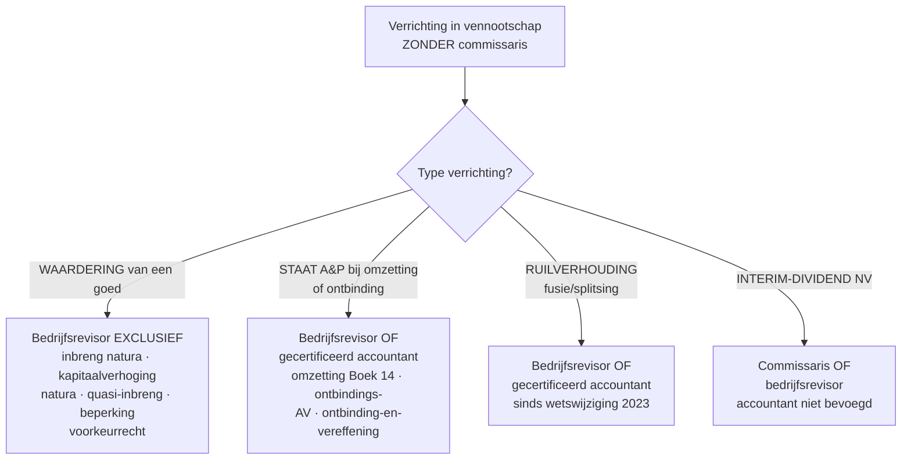

> **Leerstuk — één vraag, helemaal doorgewerkt.** Dit is het laatste leerstuk van PO 3.0 — een synthese-laag. Geen nieuwe stof: je herleest de wettelijke verslagen die je in [[kapitaalbescherming-uitkeringen-en-alarmbel]], [[overdracht-overname-en-herstructurering]] en [[ontbinding-vereffening-en-insolventie]] al hebt zien voorbijkomen, maar nu vanuit één denkmodus: de positie van de accountant-derde. Voor het overzicht en de routekaart: [[studiemateriaal/3-0|overzicht PO 3.0]].

## Antwoord in één blik

In een vennootschap zonder commissaris kent de wet de accountant of bedrijfsrevisor **een twaalftal wettelijke verslag-mandaten** toe — telkens als de wetgever bij een specifieke verrichting (waardering, uitkering, herstructurering, ontbinding) een onafhankelijk derde-oordeel wil. **Vier van die mandaten zijn voorbehouden aan de bedrijfsrevisor** (inbreng in natura, kapitaalverhoging in natura, quasi-inbreng, beperking voorkeurrecht) — telkens waarderingsopdrachten waar de wetgever de zwaarste expertise-graad eist. **De overige mandaten mogen óók door een gecertificeerd accountant** worden uitgevoerd: omzetting Boek 14, ontbindings-AV-verslag, ontbinding-en-vereffening in één akte, en — sinds een wetswijziging van 2023 — ook het fusie- en splitsingsverslag. Daarbovenop drie *kwalificatie-rollen* (privé-expertise, gerechtsexpertise, attest aan derden) en de mogelijke aanstelling als herstructureringsdeskundige tijdens een gerechtelijke reorganisatie.

We bouwen het op in vijf blokken. Eerst het **algemeen kader** (wat is een bijzonder mandaat, accountant versus revisor, ITAA-norm). Daarna het **uniforme werkprogramma-raamwerk** dat over alle mandaten heen herhaalt. Vervolgens de **vaste verslag-structuur**. Dan **vier mandaat-werkpaarden** met Verhaeren-case-toepassing. Tenslotte de **drie kwalificatie-rollen** (expertise + attest aan derden) en valkuilen.

---

## Algemeen kader — wat is een bijzonder mandaat?

Een *bijzonder mandaat* is een **wettelijke verslag-opdracht** die de wetgever aan een externe deskundige toevertrouwt in vennootschappen die **geen commissaris** hebben. Telkens als het bestuur een verrichting wil doorvoeren waarbij belanghebbenden (aandeelhouders, schuldeisers, derden) kunnen worden geraakt — een waardering, een uitkering, een herstructurering, een ontbinding — verlangt de wet een onafhankelijk derde-oordeel.

In vennootschappen *mét* commissaris voert die commissaris deze mandaten typisch uit, als onderdeel van zijn lopende controleopdracht. Voor PO 3.0 ligt het examen-zwaartepunt bij de **kmo zonder commissaris** — daar wordt de externe accountant of een aangewezen bedrijfsrevisor aangesproken. De vraag wordt dan steeds dezelfde: *wie van de twee mag wat?*

### Accountant of bedrijfsrevisor — wie mag wat?

Beide beroepen vallen onder het ITAA, maar hun mandaat-capaciteit verschilt. De wetgever heeft een onderscheid gemaakt op basis van het type beoordeling dat de opdracht vereist.

**Bedrijfsrevisor-exclusief** zijn vier verrichtingen die de **waardering** van een goed of een uitgifteprijs betreffen:

- inbreng in natura (BV en NV);
- kapitaalverhoging in natura;
- quasi-inbreng (alleen in NV);
- beperking van het voorkeurrecht (NV).

De wetgever wil hier de zwaarste expertise-graad inschakelen: de waardering-toets vraagt om diepgaande methodologische kennis die in de revisor-opleiding centraal staat.

**Gedeeld** (gecertificeerd accountant OF bedrijfsrevisor) zijn de overige mandaten:

- omzetting van rechtsvorm (Boek 14);
- ontbindings-AV-verslag (staat van activa en passiva);
- ontbinding-en-vereffening in één akte;
- het fusie- en splitsingsverslag — sinds een wetswijziging van 2023.

Logica: deze opdrachten betreffen een *getrouwheids-toets* op een staat A&P of een methodologische redelijkheidstoets, eerder dan een zuiver waarderingsoordeel.

**Interim-dividend NV** verdient aparte vermelding: hier moet de **commissaris of een bedrijfsrevisor** de tussentijdse staat nazien — de gecertificeerd accountant is niet bevoegd. Het script-antwoord op de klassieke examen-instinker "mag de externe accountant een interim-dividend-verslag NV maken?" is dus *neen*.

| Verrichting | Externe accountant? | Bedrijfsrevisor? |
|---|:---:|:---:|
| Inbreng in natura BV/NV | nee | ja |
| Kapitaalverhoging in natura BV/NV | nee | ja |
| Quasi-inbreng (NV) | nee | ja |
| Beperking voorkeurrecht NV | nee | ja |
| Interim-dividend NV | nee | ja (of commissaris) |
| Omzetting van rechtsvorm — Boek 14 | **ja** | ja |
| Ontbindings-AV — staat A&P | **ja** | ja |
| Ontbinding-en-vereffening in één akte | **ja** | ja |
| Fusie/splitsing — ruilverhouding | **ja** *(sinds 2023)* | ja |
| Inbreng bedrijfstak of algemeenheid | nee | ja |
| Vereffenaarsmandaat *(opdracht, geen verslag)* | **ja** | ja |
| Herstructureringsdeskundige GR | **ja** | ja |

> **Examen-instinker — twee klassiekers in één vraag.** "Mag een externe accountant het verslag van inbreng in natura maken?" Antwoord: **neen** — uitsluitend bedrijfsrevisor. "Mag hij het omzettingsverslag Boek 14 maken?" Antwoord: **ja** — beide bevoegd. Het verschil zit in het type beoordeling: waardering versus getrouwheidstoets op een staat. Schrijf dat onderscheid expliciet in je antwoord, ook als de vraag het niet vraagt — het is de pedagogische sleutel.

---

## Uniform werkprogramma — vier fasen per mandaat

Elk bijzonder mandaat volgt dezelfde vier-fasen-structuur. Leer deze structuur eenmaal, en je kan elk mandaat-verslag opzetten — alleen de inhoud van fase 2 (werkzaamheden) verandert per mandaat-type. Dit is het pedagogische kernpunt van dit leerstuk: niet elf afzonderlijke verhalen, maar één raamwerk dat je elf keer hergebruikt.

### Fase 1 — Aanvaarding, onafhankelijkheid, opdrachtbrief

Vóór je werk verricht, doorloop je een vaste aanvaardingsfase. Dit hoort tot de algemene deontologie (PO 4.0 — zie [[opdrachtaanvaarding-en-opdrachtbrief]] en [[deontologie]]) maar komt bij elk mandaat terug.

De aanvaardingsprocedure toetst vier elementen:

- **Deskundigheid** — heb je de competentie voor dit specifieke mandaat? Een algemeen-fiscaal accountant heeft niet automatisch de waarderings-expertise voor een complex inbreng-natura-dossier.
- **Onafhankelijkheid** — geen vroegere of huidige binding met de cliënt of betrokken partijen die je oordeel zou kunnen kleuren. Vier klassieke bedreigingen worden gewogen: zelftoetsing (eigen werk beoordelen), eigenbelang (financieel belang), familie (verwantschap), belangenverdediging (cliënt-loyaliteit). Zie [[onafhankelijkheid]] voor het volledige assessment.
- **Middelen** — tijd, team en infrastructuur beschikbaar binnen de gevraagde termijn.
- **Integriteit van de cliënt** — geen aanwijzing van fraude, manipulatie of slechte trouw.

Als de aanvaarding doorgaat, volgt de **opdrachtbrief** — verplicht schriftelijk document, getekend door cliënt en accountant vóór aanvang. De minimuminhoud:

- aard van het mandaat (welk wettelijk artikel, welke verrichting);
- feiten waarop het mandaat betrekking heeft;
- verwachte werkzaamheden + scope;
- honorarium-afspraken;
- termijn en mijlpalen.

Het verslag dat je later uitbrengt zal een uitdrukkelijke **onafhankelijkheidsverklaring** bevatten — dat is de schriftelijke neerslag van fase 1 in het eindproduct.

### Fase 2 — Werkzaamheden en werkprogramma

Het werkprogramma is per mandaat-type *specifiek*, maar bevat altijd drie constante elementen.

**Constante 1 — actualiteitsvereiste.** Alle cijfers moeten actueel zijn op de datum waarop de algemene vergadering of het bestuursorgaan beslist. Voor een staat van activa en passiva bij omzetting Boek 14, bij een ontbindings-AV-verslag of bij een ontbinding-en-vereffening in één akte geldt een **maximumleeftijd van drie maanden** ten opzichte van de beslissingsdatum. Bij grensoverschrijdende omzetting is dat vier maanden. Bij inbreng in natura geldt geen vaste termijn maar wel: waardering op of zo dicht mogelijk bij de inbrengdatum. Bij interim-dividend NV: tussentijdse staat die *actueel* moet zijn, zonder formele drempel.

> **Examen-favoriet.** "Wat is de maximumleeftijd van de staat van activa en passiva bij een Boek 14-omzetting?" Antwoord: **drie maanden**. Voor *grensoverschrijdende* omzetting: vier. Voor inbreng natura: geen drempel — waarderingsdatum = inbrengdatum. Drie verschillende regimes — verwar ze niet.

**Constante 2 — methodologische redelijkheidstoets.** Bij waarderings-mandaten (inbreng natura, kapitaalverhoging natura, quasi-inbreng, fusie/splitsing-ruilverhouding) onderzoek je of de gehanteerde methodes economisch verantwoord zijn en of de uitkomst *redelijk* is. **Je geeft geen absolute waarde-uitspraak.** Je zegt niet "deze grond is 300.000 euro waard" — je zegt "de gebruikte methoden zijn passend, het relatieve belang dat eraan is toegekend is verantwoord, en de bekomen waarde is niet kennelijk onredelijk." Dat is een zwakker oordeel dan waardering, en het is bewust zo.

**Constante 3 — zorgvuldige documentatie.** Werkbladen, correspondentie, externe bevestigingen, cijferanalyses — alles wordt in een dossier bewaard. De ITAA-norm vereist dossier-bewaring gedurende minstens tien jaar. Reden: latere aansprakelijkheidsvorderingen of een curator-onderzoek bij eventuele faillietverklaring van de cliënt kunnen jaren na het mandaat opduiken.

### Fase 3 — Het verslag, zes blokken

Elk wettelijk verslag heeft een vaste structuur — voorgeschreven door de ITAA-norm voor bijzondere mandaten en consistent doorgevoerd in de WVV-praktijk.

| Blok | Inhoud |
|---|---|
| 1. Identificatie | titel verslag · wettelijk mandaat-artikel · cliënt · datum · accountant/revisor · ITAA-erkenningsnummer |
| 2. Opdracht en kader | beschrijving voorgenomen verrichting · verwijzing naar relevante WVV-artikelen · het bijzonder verslag van het bestuursorgaan dat als basis dient |
| 3. Werkzaamheden | opsomming wat je hebt onderzocht: boekhoudkundige stukken, marktinformatie, juridische context, gesprekken |
| 4. Bevindingen | feitelijke vaststellingen — bv. "de waardering steunt op marktvergelijking en DCF" · "de staat A&P is twee maanden oud" · "het nettoactief vóór en na bedraagt X en Y" |
| 5. **Conclusie** | de kernuitspraak — *per mandaat-type anders* |
| 6. Onafhankelijkheidsverklaring + ondertekening | "ik verklaar onafhankelijk te zijn" · ondertekening · datum · ITAA-erkenningsnummer |

De **conclusie in blok 5** is per mandaat-type verschillend — dat is wat je examen-technisch moet kunnen herkennen en reproduceren. Bij inbreng natura zegt de revisor dat de waardering redelijk is en ten minste gelijk aan de tegenprestatie. Bij omzetting verklaart de accountant dat de staat een getrouw beeld geeft en dat er geen overwaardering van het nettoactief is vastgesteld. Bij ontbinding-en-vereffening in één akte bevestigt hij dat alle schulden zijn betaald of geconsigneerd. **Dezelfde verslag-structuur, een andere kern-uitspraak.**

### Fase 4 — Bewaring en opvolging

Het dossier wordt **minstens tien jaar bewaard** (ITAA-norm). Na publicatie van het verslag heb je geen lopende verantwoordelijkheid — dat is wat een commissaris onderscheidt van een houder van een bijzonder mandaat. Wel: tussen je verslag-datum en de eigenlijke uitvoering van de verrichting kunnen feiten veranderen. Bij quasi-inbreng en bij inbreng in natura schrijft de wet expliciet voor dat de waardering moet worden **herzien** als zich *aanzienlijke wijzigingen* voordoen. Je werk moet dus niet alleen op verslag-datum kloppen, maar je moet alert blijven tot de verrichting effectief is voltrokken.

Aansprakelijkheid loopt door de gewone regels: foutaansprakelijkheid jegens cliënt en derden, de ITAA-norm, en de verplichte beroepsaansprakelijkheidsverzekering. Bij vereffenaarsmandaten (zie verder) loopt het risico hoger omdat je dan als *orgaan* van de vennootschap optreedt.

---

## Vier mandaat-werkpaarden uitgewerkt

Vier mandaten domineren statistisch het examen. Voor elk geef je de kern-uitspraak van het verslag, de mandaat-specifieke werkzaamheden, en een Verhaeren-case ter concretisering.

### Inbreng in natura — de prototype van een waarderingsmandaat

Een aandeelhouder of derde brengt een goed (vastgoed, machine, deelneming, vordering, knowhow) in het kapitaal van de vennootschap in tegen uitgifte van nieuwe aandelen. **Bedrijfsrevisor-exclusief.** Dit is examen-favoriet (~5 vragen historisch).

**Werkzaamheden.** De revisor onderzoekt de gehanteerde **waarderingsmethoden** — typisch een combinatie van marktvergelijking, DCF, intrinsieke waarde (voor goederen) of meerdere methodes met expliciete weging (voor aandelen). Hij verifieert de onderliggende cijfers, vraagt externe bevestigingen waar relevant (kadastrale gegevens, marktdata, technische schattingen), en onderzoekt mogelijke lasten op het in te brengen goed (hypotheek, voorrechten, pandrecht).

**Kern-uitspraak in het verslag:** *de gehanteerde waardering en de toegepaste methoden zijn redelijk, en de waarde van de inbreng komt ten minste overeen met de tegenprestatie (het aantal nieuwe aandelen tegen fractiewaarde).*

**Verhaeren-case (maart 2026).** Marc Verhaeren bezit privé een bouwgrond in Lokeren (verworven via erfenis 2010), geschatte verkoopwaarde 300.000 euro. Hij wil deze grond inbrengen in Verhaeren Bouw BV als kapitaalverhoging — eigenaar Holding ontvangt bijkomende aandelen ter waarde 300.000 euro tegen fractiewaarde. Procedure:

1. Marc en Verhaeren Holding (de bestaande aandeelhouder) laten een onafhankelijke vastgoedschatting opmaken — twee onafhankelijke schattingen die uitkomen rond 295.000-305.000 euro.
2. Het bestuursorgaan van Verhaeren Bouw stelt een **bijzonder bestuursverslag** op met de beschrijving van de inbreng, de motivering ("uitbreiding van de werfvoorraad"), de gemotiveerde waardering en de tegenprestatie.
3. Een **bedrijfsrevisor** wordt aangewezen door het bestuursorgaan. Opdrachtbrief getekend.
4. Werkprogramma revisor: marktwaardering toetsen op basis van de twee schattingen + kadastrale toets + bestemming (woongebied bevestigd) + onderzoek bestaande lasten (geen hypotheek, geen voorrecht).
5. Revisorenverslag uitgebracht: waardering 300.000 euro is redelijk, ≥ tegenprestatie.
6. Verslag toegevoegd aan het bestuursverslag, **algemene vergadering** beslist, **notariële akte** verleden, **kapitaalverhoging** ingeschreven.

Belangrijk onderscheid met de NV: bij een NV bestaat ook **quasi-inbreng** — de aankoop door de vennootschap van een goed van een insider (oprichter, bestuurder, aandeelhouder) binnen twee jaar na oprichting, tegen een vergoeding van minstens 10 % van het kapitaal. Daar geldt eenzelfde verslag-vereiste. **In de BV bestaat quasi-inbreng niet** — de wetgever heeft die regel afgeschaft bij de invoering van het WVV, want zonder kapitaal viel ook de aanknopingsdrempel weg. Voor een BV als Verhaeren Bouw moet je dus alleen denken aan inbreng natura, niet aan quasi-inbreng.

### Omzetting Boek 14 — examen-favoriet bij uitstek

Een vennootschap wijzigt van rechtsvorm zonder verlies van rechtspersoonlijkheid: BV wordt NV, CV wordt BV, BV wordt maatschap. Dit traject staat in **Boek 14** van het WVV en is, statistisch gezien, **dé examen-favoriet** van PO 3.0 (~6 vragen historisch). Pedagogisch belangrijk: **gecertificeerd accountant OF bedrijfsrevisor** mag dit verslag opmaken — niet exclusief revisor.

**Werkzaamheden.** Drie kernpunten:

- **Actualiteit verifiëren** — staat A&P maximaal drie maanden oud op AV-datum (binnenlandse omzetting). Praktisch: het bestuursorgaan stelt de staat op een afsluitdatum die binnen drie maanden vóór de geplande AV valt.
- **Getrouwheid controleren** — alle activa en passiva juist gewaardeerd, geen verzwijging van schulden, alle verbintenissen erkend (ook leasecontracten, hangende geschillen, sociale en fiscale schulden).
- **Overwaardering nettoactief expliciet vermelden** — dit is de cruciale eigen wettelijke verplichting. Als de revisor of accountant tot de bevinding komt dat het nettoactief is overgewaardeerd, moet hij dat *uitdrukkelijk* vermelden in zijn conclusie, met aanduiding van het bedrag.

**Kern-uitspraak in het verslag:** *de staat van activa en passiva geeft een getrouw beeld van het vermogen op datum X, en er werd geen overwaardering van het nettoactief vastgesteld* — of, indien aanwezig: *een overwaardering van Y euro werd vastgesteld voor onderdeel Z.*

**Verhaeren-case (najaar 2026).** Verhaeren Vastgoed BV (de patrimonium-vennootschap met twee percelen industriegrond, bedrijfsgebouw en een bouwgrond) wordt omgezet naar een **maatschap** met Marc + Linda + Sofie + Jeroen als maten. Doel: vastgoed buiten de vennootschapsstructuur halen voor opvolgings- en familievermogensbeheer. Procedure:

1. Bestuursorgaan stelt **omzettingsverslag** op met de motivatie + staat A&P per 30 september 2026 (binnen drie maanden vóór de geplande AV van 1 december 2026).
2. **Gecertificeerd accountant** aangewezen (niet exclusief revisor — Boek 14 laat beide toe).
3. Werkprogramma: actualiteit staat A&P bevestigen; waardering van twee percelen + bedrijfsgebouw + bouwgrond verifiëren (geen overwaardering vastgesteld); rekening-courant-schuld aan Verhaeren Holding gevalideerd; lopende hypothecaire kredieten gechecked.
4. Accountantsverslag uitgebracht 15 november 2026.
5. AV 1 december 2026 — versterkte meerderheid (3/4 voor binnenlandse omzetting; 4/5 in oudere wetgeving — controleer het toepasselijke quorum) — **notariële akte**.
6. Maatschapscontract ondertekend 15 december 2026. Vastgoed-patrimonium overgaat onder algemene rechtsopvolging.

> **Examen-instinker — de allerklassiekste.** Niet elke wijziging van rechtsvorm is een Boek 14-omzetting. De **automatische overgang van BVBA naar BV per 1 januari 2020** (overgangsbepalingen WVV) is **géén** Boek 14-omzetting. Daar gebeurde alles *van rechtswege, zonder enige formaliteit*: geen AV-besluit, geen omzettingsverslag, geen accountantsverslag, geen staat A&P van drie maanden oud, geen notariële akte. Het oude BVBA-kapitaal werd automatisch omgevormd tot een statutair onbeschikbare eigenvermogensrekening (CBN-advies 2019/14). Bij een examen-vraag "is een accountantsverslag nodig bij de overgang BVBA → BV?" is het antwoord dus duidelijk **neen**. Bij "is een accountantsverslag nodig bij vrijwillige omzetting BV → maatschap?" is het antwoord **ja** — dat is een echte Boek 14-omzetting.

### Ontbinding-en-vereffening in één akte — veel voorkomende KMO-praktijk

Voor de accountant in een kmo-praktijk is dit een veel voorkomende opdracht: een dormante dochter of een uitgewerkte vennootschap wordt in één AV-akte ontbonden én vereffend. Het spaart tijd en kosten ten opzichte van de gewone twee-traps-vereffening. **Gecertificeerd accountant of bedrijfsrevisor** is bevoegd.

**Voorwaarden (cumulatief).** De wet stelt drie strikte voorwaarden voor één-aktige ontbinding:

- geen vereffenaar aangeduid;
- alle schulden zijn ofwel betaald, ofwel werden gelden geconsigneerd op een derdenrekening van notaris of op de consignatiekas voor de schulden die nog niet konden worden voldaan;
- een commissaris, bedrijfsrevisor of externe accountant maakt een verslag op dat dit bevestigt.

**Werkzaamheden.** Naast de gewone staat-A&P-toets (max drie maanden, getrouwheid, overwaardering) ligt het zwaartepunt op de **volledigheid van de schulden**:

- alle openstaande facturen, leningen, fiscale schulden (BTW, RV, VenB-saldo), sociale schulden (RSZ, vakantiegeld, opzegvergoedingen) systematisch geïdentificeerd;
- bewijsstukken van **betaling** of van **consignatie** voor elke openstaande schuld;
- onderzoek naar mogelijk *vergeten* schulden (zoals lopende huurverplichtingen, garantieverbintenissen, hangende geschillen).

**Kern-uitspraak in het verslag:** *de staat van activa en passiva op datum X geeft een getrouw beeld, en alle in de staat opgenomen schulden zijn ofwel betaald ofwel zijn er voldoende gelden geconsigneerd voor hun voldoening* — zodat ontbinding-en-vereffening in één akte mogelijk is.

> **Valkuil.** Een schuld waarvan de accountant niet wist (dus niet in de staat) en die later opduikt, kan de vereffening **ongeldig** maken. De schuldeiser kan dan een heropening van de vereffening vragen en persoonlijke aansprakelijkheid claimen tegen het bestuur én tegen de accountant. Dossier-discipline (zie fase 4) is hier geen formaliteit maar een aansprakelijkheids-buffer.

**Verhaeren-case (toekomstig scenario, 2028).** Na de share deal van Verhaeren Bouw aan Bouwer X (zie [[overdracht-overname-en-herstructurering]]) houdt Verhaeren Holding nog een dormante dochter over zonder activiteit. De accountant onderzoekt: enige activa = liquide middelen 25.000 euro + RC-vordering Holding 5.000 euro; enige schulden = openstaande sociale bijdragen 1.200 euro (waarvoor consignatie wordt geregeld) + lopende huur tot uitschrijving 600 euro (betaald). Verslag bevestigt → ontbinding-en-vereffening in één akte → liquide saldo terug naar Holding.

### Fusie/splitsing — ruilverhouding en methodologie

Bij een fusie van twee vennootschappen, of een splitsing van één vennootschap in meerdere, ontvangen de aandeelhouders van de te ontbinden vennootschap aandelen van de overnemende of nieuw opgerichte vennootschap. De **ruilverhouding** (hoeveel aandelen van A je krijgt per aandeel B) is daarbij de scharniervraag. De wet vereist een schriftelijk verslag dat oordeelt of die ruilverhouding redelijk is. Sinds een wetswijziging van 2023 mag dit verslag worden uitgebracht door de **commissaris, een bedrijfsrevisor of een gecertificeerd accountant** (in vennootschappen met commissaris is dat doorgaans de commissaris zelf).

**Werkzaamheden.** Dit is het *zwaarste* van alle bijzondere mandaten in termen van methodologische diepte. Per vennootschap pas je doorgaans **meerdere waarderingsmethoden** toe (DCF, peer-multiples, EBITDA-multiplier, intrinsieke waarde, nettoactief) en geef je een gemotiveerde weging tussen die methoden. Daarnaast analyseer je synergie-effecten van de fusie, en vergelijk je met markt-comparables.

**Kern-uitspraak in het verslag:**

- volgens welke methoden de voorgestelde ruilverhouding is vastgesteld;
- of die methoden in het gegeven geval passen en tot welke waardering elke methode leidt;
- welk relatief belang aan elke methode is toegekend, en waarom;
- of de finale ruilverhouding van X aandelen vennootschap A voor Y aandelen vennootschap B *relevant en redelijk* is.

Net als bij inbreng natura: de accountant of revisor geeft **geen absolute waardering** — hij geeft een methodologische redelijkheidstoets. Cassatierechtspraak bevestigt: het verslag dat slechts één methode hanteert zonder rationale is vatbaar voor nietigheid van het fusiebesluit op vordering van een aandeelhouder.

In de Verhaeren-case is er geen fusie of splitsing voorzien — de aandelenoverdracht in 2027 is een share deal, geen fusie. Voor concretisering in een examencontext: stel je een fusie van Verhaeren Bouw met een externe bouwondernemer voor — dan zou je per vennootschap drie methodes toepassen, hun relatief belang motiveren, en concluderen of een ruilverhouding van bijvoorbeeld 3 nieuwe aandelen per oud aandeel redelijk is.

---

## Bijzondere mandaten in insolventie-context

Tijdens een gerechtelijke reorganisatie of een faillissement kan de accountant nog enkele specifieke rollen opnemen, buiten de klassieke verslag-mandaten. Drie zijn relevant.

**Herstructureringsdeskundige** — tijdens een gerechtelijke reorganisatie kan de rechtbank een deskundige aanstellen om het bestuur bij te staan met de opstelling van het reorganisatieplan, de cijfermatige onderbouwing en de bemiddeling met de schuldeisers. Dit is een echt wettelijk mandaat, gehonoreerd op last van de boedel.

**Boekhoudkundig deskundige bij faillissement** — de curator (typisch een advocaat) kan een accountant aanstellen voor specifieke onderzoeken: analyse van financiële stromen vóór de staking van betaling, identificatie van niet-tegenwerpbare betalingen, opmaak van een geconsolideerd schuldeisers-overzicht. Geen wettelijk mandaat in eigenlijke zin — opdracht van de curator.

**Adviseur-continuïteit in de vroege detectiefase** — vóór een gerechtelijke reorganisatie, op het ogenblik dat de knipperlichten oplichten of de kamer voor ondernemingen in moeilijkheden contact opneemt, is de accountant de eerste lijn tussen de vennootschap en het insolventie-traject. Geen wettelijke functie, wel een vakkundige verantwoordelijkheid die in de ITAA-deontologie verankerd zit. Zie [[ontbinding-vereffening-en-insolventie]] voor de procedure-context.

**Verhaeren-case (juni 2026).** De accountant van Bouwprojecten Zuid begeleidt het bestuur bij de aanvraag van een gerechtelijke reorganisatie. In een variant van het scenario stelt de ondernemingsrechtbank hem na de opening van de procedure aan als **herstructureringsdeskundige** om het collectief akkoord te helpen formuleren — dat is dan een rechterlijke aanstelling, met opdrachtbrief van de rechtbank en honorarium op last van de boedel.

---

## Drie kwalificatie-rollen — privé-expertise, gerechtsexpertise, attest aan derden

Naast de eigenlijke wettelijke mandaten kent het examenprogramma drie *kwalificatie-rollen*: situaties waarin de accountant zijn boekhoudkundige expertise extern aanwendt, zonder wettelijk verslag-mandaat.

**Privé-expertise.** Partijen in een geschil (twee aandeelhouders die oneens zijn over de waardering van een uittredend aandeel, een verkoper en een koper die over de prijs onderhandelen, twee echtgenoten in een echtscheiding met een gemeenschappelijke vennootschap) schakelen de accountant in als **bindende derdenwaarderaar**, mediator of second-opinion-expert. Geen wettelijk kader — louter contractueel. Wel onder de ITAA-deontologie. Dit komt typisch terug in een aandeelhoudersovereenkomst met een exit-mechanisme (zie [[bestuur-algemene-vergadering-en-aandeelhouders]]).

**Gerechtsexpertise.** De rechtbank stelt de accountant aan als **gerechtsdeskundige** in een geschil waarin boekhoudkundige feiten doorslaggevend zijn — waardering van een aandeel bij gedwongen uittreding, kwantificatie van schade bij bestuurdersaansprakelijkheid, onderzoek van mogelijke fraude. Dit is wel een wettelijke functie (geregeld in het Gerechtelijk Wetboek), met eedaflegging en verslag onder rechterlijke supervisie.

**Attest aan derden.** Een derde partij — een kredietverlener, een partner, een koper in een M&A-context — vraagt een schriftelijke verklaring van de accountant over een specifiek feit van de cliënt. Klassieke voorbeelden: een werkkapitaal-verklaring bij een share deal, een normalised-EBITDA-rapport, een continuïteitsverklaring, een due-diligence-attest. Dit is geen wettelijk mandaat maar valt wel onder een specifieke ITAA-norm en — bij grotere transacties — onder de internationale ISAE-standaarden (zie [[isae-opdracht]]). Voor PO 3.0 examen-relevant in een M&A-context: bij de overname-case Verhaeren Bouw 2027 zal de accountant typisch een normalised-EBITDA-rapport en een werkkapitaal-verklaring leveren.

---

## Drie valkuilen

> **Valkuil 1 — accountant het inbreng-natura-verslag laten maken.** Klassieke examen-instinker. De wet voorziet **bedrijfsrevisor-exclusief** voor alle waarderings-mandaten (inbreng natura, kapitaalverhoging natura, quasi-inbreng, beperking voorkeurrecht). De externe accountant kan de cliënt wel begeleiden bij de voorbereiding, kan helpen bij het opstellen van het bijzonder bestuursverslag, maar **kan zelf geen wettelijk waarderingsverslag uitbrengen**.

> **Valkuil 2 — de drie-maanden-regel verkeerd toepassen.** De drie-maanden-actualiteit van de staat A&P geldt bij omzetting Boek 14 (binnenlands), bij het ontbindings-AV-verslag en bij ontbinding-en-vereffening in één akte. Bij grensoverschrijdende omzetting is dat **vier** maanden. Bij inbreng natura geldt de regel niet — daar geldt: waardering op of zo dicht mogelijk bij de inbrengdatum. Bij interim-dividend NV: tussentijdse staat die *actueel* moet zijn, zonder formele drempel. Vier mandaten, drie verschillende regimes. Per mandaat-type apart toetsen.

> **Valkuil 3 — denken dat het accountantsverslag een waarde-verklaring is.** Bij waarderingsmandaten geeft de accountant of revisor **geen absolute prijs** ("dit is 300.000 euro waard"). Hij verklaart dat de gebruikte *methoden* redelijk zijn, dat hun *relatief belang* verantwoord is, en dat de bekomen waarde *niet kennelijk onredelijk* is. Methodologische redelijkheid is de standaard, niet absolute waardering. Bij een examenvraag over de aard van de uitspraak — vermijd de woordkeuze "de accountant bevestigt de waarde van X" — schrijf "de accountant verklaart dat de gehanteerde methoden redelijk zijn en dat de uitkomst niet kennelijk onredelijk is."

---

## Verbinding met andere leerstukken

Wanneer je dit snapt, ga dan naar:

- [[kapitaalbescherming-uitkeringen-en-alarmbel]] — voor de bestuurs-context: inbreng natura, interim-dividend en uitkeringstests vanuit het *bestuurs*-perspectief.
- [[ontbinding-vereffening-en-insolventie]] — voor de procedure-context: wanneer een ontbindings-AV-verslag of een ontbinding-en-vereffening in één akte verplicht is.
- [[vennootschapsvorm-kiezen-en-oprichten]] — voor het **BVBA → BV-onderscheid** ten opzichte van vrijwillige omzetting Boek 14. Dat onderscheid is op zichzelf een examenklassieker.
- [[studiemateriaal/3-0/samenvatting|Samenvatting PO 3.0]] — voor herhaling: de tabel bijzondere mandaten + het uniforme werkprogramma-raamwerk op één A4.

### Doorklik naar concepten

Voor wie definitorisch detail wil opzoeken (zie ook PO 4.0 voor deontologie + opdrachtbrief + onafhankelijkheid):

- [[bijzondere-mandaten]]
- [[kapitaalverhoging-in-natura]] · [[quasi-inbreng]] · [[winstuitkering]] · [[inkoop-eigen-aandelen]]
- [[kapitaalbescherming]] · [[reorganisatie]] · [[fusie]] · [[splitsing]] · [[inbreng-bedrijfstak-of-algemeenheid]]
- [[ontbinding-en-vereffening]] · [[gerechtelijke-reorganisatie]]
- [[opdrachtaanvaarding-en-opdrachtbrief]] · [[kwaliteitsmanagement-opdracht]] · [[onafhankelijkheid]] · [[deontologie]] · [[isae-opdracht]]

---

## Wettelijk fundament

- Inbreng in natura BV: WVV art. 5:7 — bedrijfsrevisor-exclusief, waarderingsverslag.
- Inbreng in natura NV: WVV art. 7:7 — analoog aan BV, met fractiewaarde-toetsing.
- Kapitaalverhoging in natura BV: WVV art. 5:112 (verwijzend naar 5:7-mechaniek).
- Kapitaalverhoging in natura NV: WVV art. 7:183 (verwijzend naar 7:7-mechaniek).
- Quasi-inbreng (alleen NV): WVV art. 7:8 — commissaris of bedrijfsrevisor; drempel 10 % van het geplaatste kapitaal, binnen twee jaar na oprichting, voor verkrijging van een insider.
- Beperking voorkeurrecht NV: WVV art. 7:191 — commissaris of bedrijfsrevisor over uitgifteprijs en motivering.
- Interim-dividend NV: WVV art. 7:199 — commissaris of (in afwezigheid) bedrijfsrevisor; statutaire machtiging + winst lopend boekjaar + tussentijdse staat vereist.
- Inkoop eigen aandelen: WVV art. 5:147 BV / 7:215 NV — onderworpen aan de uitkeringstests; geen specifiek extern verslag in afwezigheid van commissaris.
- Omzetting van rechtsvorm — binnenlands: WVV art. 14:3 (staat A&P max drie maanden) + 14:4 (commissaris, bedrijfsrevisor of externe accountant brengt verslag uit, vermeldt enige overwaardering van het nettoactief) + 14:5 (bestuursverslag) + 14:8 (AV-besluit met 3/4 meerderheid).
- Omzetting van rechtsvorm — grensoverschrijdend: WVV art. 14:20-14:25 (staat max vier maanden, gelijkaardige verslag-vereiste, drie/vier-vijfde-meerderheid).
- Fusie — ruilverhouding: WVV art. 12:25 (fusievoorstel) + 12:26 (verslag commissaris, bedrijfsrevisor of gecertificeerd accountant — sinds wetswijziging 25 mei 2023).
- Splitsing — ruilverhouding: WVV art. 12:64 — analoog aan fusie.
- Inbreng bedrijfstak of algemeenheid: WVV art. 12:103 e.v. — commissaris of bedrijfsrevisor.
- Ontbindings-AV — staat A&P: WVV art. 2:67 §1 — staat max drie maanden, verslag van commissaris, bedrijfsrevisor of externe accountant.
- Ontbinding-en-vereffening in één akte: WVV art. 2:91 — bevestigt dat alle schulden zijn voldaan of geconsigneerd, op basis van de staat A&P uit art. 2:67 §1.
- Vereffenaarsmandaat: WVV art. 2:79 e.v. — opdracht-mandaat, geen verslag-mandaat. Aansprakelijkheid art. 2:80.
- Herstructureringsdeskundige tijdens gerechtelijke reorganisatie: WER art. XX.39 (en XX.83/22 in besloten gerechtelijke reorganisatie).
- Gerechtsdeskundige: Ger.W. art. 962 e.v.
- Cross-PO doorklik — opdrachtbrief, onafhankelijkheid, kwaliteitsmanagement: zie [[opdrachtaanvaarding-en-opdrachtbrief]], [[onafhankelijkheid]], [[kwaliteitsmanagement-opdracht]] (PO 4.0 deontologie).
- Cross-PO doorklik — ISAE-attestopdrachten aan derden (in M&A-context): zie [[isae-opdracht]].
- BVBA → BV-overgang (van rechtswege per 1 januari 2020): CBN-advies 2019/14 — geen Boek 14-procedure, geen verslag, geen accountant betrokken.
