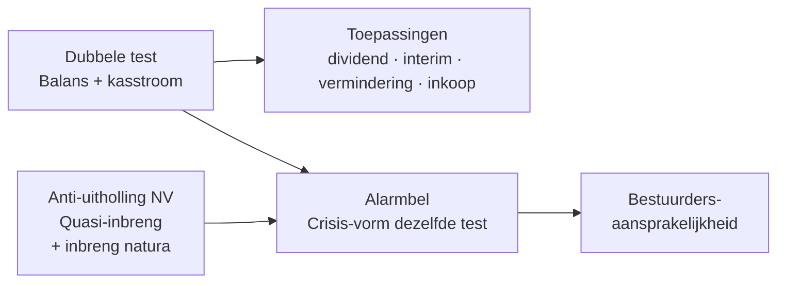
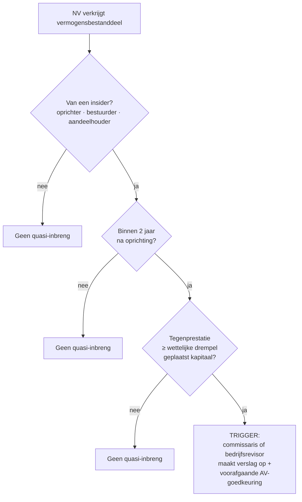
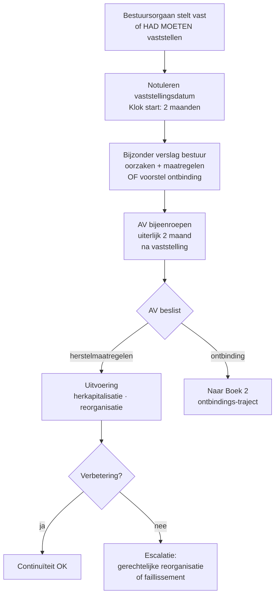

> **Leerstuk — één vraag, helemaal doorgewerkt.** Dit is het zwaarste leerstuk van PO 3.0 — ongeveer negen directe vraag-eenheden uit de voorbeeldexamens leven hier. De pedagogische lijn is één: de hele kapitaalbescherming draait om dezelfde **dubbele test**. Elke uitkering is er een toepassing van; de alarmbel is haar crisis-vorm. Voor verhaal en routekaart: [[studiemateriaal/3-0|overzicht PO 3.0]].

## Antwoord in één blik

Drie hoofdideeën dragen dit leerstuk. **Eén** — élke uitkering uit een vennootschap (gewoon dividend, interim-dividend, kapitaalvermindering met terugbetaling, inkoop eigen aandelen, tantième) moet door dezelfde **dubbele test**: een balans-test (zou het netto-actief door de uitkering onder een toegelaten ondergrens zakken?) en een kasstroom-test (kan de vennootschap haar opeisbare schulden de komende twaalf maanden nog voldoen?). **Twee** — in een NV bestaat naast deze tests nog een verwante **anti-uitholling-regel**, de **quasi-inbreng**: een verkrijging van een insider tegen een tegenprestatie boven een wettelijke drempel binnen twee jaar na oprichting wordt aan een revisorenverslag onderworpen, om te beletten dat de inbreng-in-natura-controle bij de oprichting wordt omzeild. **Drie** — wanneer het vermogen tóch onder een gevarendrempel zakt, schiet de **alarmbel** in werking: het bestuursorgaan moet de algemene vergadering binnen twee maanden bijeenroepen, met een bijzonder verslag over de continuïteit. Niet-naleving kost het bestuur zijn aansprakelijkheids-cap.

We werken alles uit op één doorlopende voorbeeldgroep — de **Verhaeren Bouwgroep**: Verhaeren Holding NV (kapitaal 100k, EV 850k) met drie dochters — Verhaeren Bouw BV (operationeel, ex-BVBA met statutair onbeschikbare inbreng), Verhaeren Vastgoed BV, en **Bouwprojecten Zuid BV** (eigen vermogen einde 2025 −12k — onze alarmbel-case).

---

## De dubbele uitkeringstest — kapstok voor alles

Sinds het WVV in 2019 in werking trad, is de schuldeisersbescherming in een BV niet meer gebaseerd op het kapitaalconcept (dat is er gewoon niet meer). Ze rust op een **dubbele test** die elke vermogensafvloeiing filtert. In de NV bestaat het kapitaalconcept nog wél, maar de tests werken er analoog. Begrijp je deze logica, dan begrijp je álles wat hierna komt — de regels rond dividend, interim-dividend, kapitaalvermindering en inkoop eigen aandelen zijn telkens varianten op dezelfde twee filters.

### De netto-actief-test — kan je het je veroorloven?

De eerste test kijkt naar de balans. Een BV mag geen uitkering doen als het **netto-actief** door die uitkering negatief zou worden of zou dalen onder een wettelijk of statutair beschermde ondergrens. Die ondergrens kan twee dingen omvatten: ingebracht eigen vermogen dat statutair onbeschikbaar is gesteld (klassiek de oude BVBA-kapitaalrubriek na de WVV-overgang), én reserves die volgens wet of statuten niet uitkeerbaar zijn (denk aan een wettelijke reserve in een NV).

Het netto-actief wordt bepaald aan de hand van de laatst goedgekeurde jaarrekening of een recentere tussentijdse staat. Voor de uitkeringstest moet je het netto-actief verder *verminderen* met de nog niet afgeschreven kosten van oprichting en uitbreiding en met de nog niet afgeschreven kosten van onderzoek en ontwikkeling — dit voorkomt dat je geactiveerde kosten gebruikt om uitkeerbaar vermogen op te kloppen.

> **Hoe ziet dat eruit voor Verhaeren Bouw?** Stel: einde 2025 bedraagt het netto-actief 1.100.000 EUR. Daarvan is 18.550 EUR statutair onbeschikbare inbreng (het oude BVBA-kapitaal uit 2015, na de automatische overgang in 2020 omgezet conform de CBN-leer). Andere niet-uitkeerbare reserves: 0. **Uitkeringsruimte** = 1.100.000 − 18.550 = 1.081.450 EUR. Een uitkering boven die ruimte is verboden — al was de cash beschikbaar.

Voor een **NV** werkt de logica gelijk, met één belangrijk verschil: de ondergrens is niet "nul plus onbeschikbare reserves" maar het **gestorte of opgevraagde kapitaal** (afhankelijk van wat hoger is) **plus** alle reserves die volgens wet of statuten niet uitkeerbaar zijn. Voor Verhaeren Holding NV (kapitaal 100.000 EUR, volledig volstort): het netto-actief mag door een uitkering nooit onder 100.000 + onbeschikbare reserves dalen.

### De liquiditeitstest — kan je het ook *betalen*?

De tweede test kijkt naar de kasstroom — en is sinds het WVV nieuw voor wie de oude BVBA-regeling kende. Vóór elke uitkering moet het **bestuursorgaan** vaststellen dat de vennootschap, gelet op de redelijkerwijs te verwachten ontwikkelingen, na de uitkering haar opeisbare schulden de komende **twaalf maanden** zal kunnen blijven voldoen. Deze beslissing wordt verantwoord in een verslag dat niet wordt neergelegd, maar wel intern wordt bijgehouden. Is er een commissaris, dan kijkt hij de boekhoudkundige en financiële gegevens van dat verslag na en vermeldt hij dat in zijn jaarlijks controleverslag.

Belangrijk: AV beslist over de uitkering — maar het besluit heeft **pas uitwerking** wanneer ook het bestuur de liquiditeitstest positief heeft afgerond. De twee bevoegdheden zijn dus samen nodig.

### Wat als het toch fout gaat? Sanctie en terugvordering

De wet voorziet harde gevolgen. Beslist het bestuur tot uitkering terwijl het wist of behoorde te weten dat de vennootschap door de uitkering haar schulden niet meer zou kunnen voldoen, dan zijn de bestuurders **hoofdelijk aansprakelijk** voor de daaruit voortvloeiende schade aan vennootschap en derden. Daarnaast krijgt het bestuursorgaan een specifiek **terugvorderingsrecht**: het kan elke onrechtmatige uitkering terugvorderen van de aandeelhouders die ze ontvingen, onafhankelijk van hun goede of kwade trouw. Voor de NV bestaat een analoge sanctieregeling.

### De twee tests naast elkaar

|  | BV | NV |
|---|---|---|
| **Balans-test (netto-actief)** | Mag niet negatief worden, en niet zakken onder statutair onbeschikbare inbreng + niet-uitkeerbare reserves | Mag niet zakken onder gestort/opgevraagd kapitaal + niet-uitkeerbare reserves |
| **Kasstroom-test (liquiditeit)** | Bestuur stelt vast: 12 maanden opeisbare schulden voldoen | Idem — analoge formulering |
| **Wie test, wie beslist?** | AV beslist tot uitkering; bestuur voert liquiditeitstest uit (uitkering heeft pas uitwerking na positieve bestuursvaststelling) | Idem |
| **Sanctie bij faute** | Hoofdelijke aansprakelijkheid bestuurders + terugvordering bij aandeelhouders door bestuursorgaan | Analoge regeling |
| **Aftrek vóór test** | Nog niet afgeschreven oprichtings-/uitbreidings- en O&O-kosten | Idem |

> **Examen-instinker:** beide tests zijn **cumulatief**. Een vennootschap met een gezonde balans-netto-actief maar een wankele kasstroom-prognose mag *niet* uitkeren — zelfs als de eerste test ruim geslaagd is. Stagiairs verliezen hier punten door alleen de balans-test te checken.

---

## Toepassingen — vier soorten uitkering onder dezelfde test

Vier uitkeringstypes leven onder de dubbele test, elk met een eigen procedure of moment. Onthoud: de test is steeds dezelfde — het verschilt is *wie beslist*, *wanneer* en *welke formaliteiten errond hangen*.

### Gewoon dividend — AV-besluit op de jaarvergadering

Het simpelste geval. De jaarrekening wordt opgemaakt, het bestuur stelt voor wat aan de aandeelhouders kan worden uitgekeerd, de AV stemt over de winstbestemming op de jaarvergadering. Vóór de uitbetaling moet het bestuur de liquiditeitstest afronden — pas dán heeft het AV-besluit uitwerking.

Bij uitkering aan een natuurlijke persoon wordt **roerende voorheffing** afgehouden (tarieven en VVPRbis-regeling: zie het Cijferzakboekje en doorklik [[2-3|PO 2.3 — VenB en RV]] voor de fiscale dimensie). Een holding die dividend ontvangt van een dochter geniet typisch van de **DBI-aftrek** — eveneens cross-PO 2.3.

> **Verhaeren-case.** Verhaeren Bouw keert sinds 2018 gemiddeld 100.000 EUR per jaar uit aan Verhaeren Holding. De Holding pakt dat dividend via DBI fiscaal vrijgesteld op. In 2026 wordt overwogen dat tijdelijk op te schorten omdat Bouwprojecten Zuid kapitaal nodig heeft — wat ons direct naar de alarmbel-case zal brengen.

### Interim-dividend — bestuur beslist tussen twee jaarvergaderingen door

Een **interim-dividend** is een uitkering uit de winst van het *lopende* boekjaar (of uit de nog niet uitgekeerde winst van het vorig boekjaar, zolang die niet bestemd is), beslist door het **bestuursorgaan** zelf — tussen twee jaarvergaderingen door. In de NV is dit strikt geregeld.

Vier voorwaarden cumulatief in de NV. **Eén** — de statuten moeten het bestuur uitdrukkelijk machtigen tot interim-dividend; zonder die machtiging mag het niet. **Twee** — uitkering uit winst van het lopende boekjaar of niet-goedgekeurde winst van het vorig boekjaar — *niet* uit reserves, en niet zonder de overgedragen verliezen eerst weg te werken. **Drie** — het bestuur stelt een **tussentijdse staat van activa en passiva** op waaruit blijkt dat de winst volstaat; is er een commissaris, dan kijkt hij die staat na en voegt zijn verslag bij zijn jaarlijks controleverslag. **Vier** — de dubbele uitkeringstest moet sluiten zoals bij elk dividend.

In een **vennootschap zonder commissaris** is er geen wettelijke verplichting tot extern verslag bij interim-dividend. In de praktijk vraagt het bestuur dikwijls aan zijn vaste accountant of bedrijfsrevisor om de tussentijdse staat te bevestigen voor dossier-opbouw. Voor de verslag-mechaniek van die bevestiging: zie [[bijzondere-mandaten-van-de-accountant]].

In de **BV** bestaat er geen aparte regeling voor interim-dividend: technisch is een uitkering tussen twee jaarvergaderingen door perfect mogelijk via de gewone uitkeringsmechanismen, zolang de dubbele test sluit. Veel KMO's gebruiken dit pad voor kwartaaluitkeringen.

> **Examen-favoriet:** wanneer is een interim-dividend in een NV onmogelijk? Antwoord — vier negatieven, elk volstaat: geen statutaire machtiging, geen winst van het lopende of vorig boekjaar, geleden verliezen nog niet aangezuiverd, of de dubbele test faalt.

### Kapitaalvermindering — uitkering via kapitaal

Een vennootschap kan haar kapitaal (NV) of haar statutair onbeschikbare inbreng (BV) verminderen. Onderscheid drie **vormen**, die fundamenteel anders worden behandeld.

| Vorm | Wat gebeurt er? | Onderworpen aan dubbele test? | Schuldeiserstermijn 2 mnd? |
|---|---|---|---|
| **Werkelijke kapitaalvermindering** | Geld terug aan aandeelhouders | **Ja** — is een uitkering | **Ja** (NV) |
| **Formele kapitaalvermindering** | Verliezen boekhoudkundig wegwerken | Nee — geen uitstroom | Nee |
| **Vermindering door inkoop eigen aandelen** | Eigen aandelen kopen en vernietigen | Ja — zie hierna | Nee (eigen procedure) |

De **werkelijke** kapitaalvermindering in een NV verloopt formeel zwaar: AV-besluit met versterkte meerderheid (statutenwijziging), notariële akte, bekendmaking in het Belgisch Staatsblad. Daarna krijgen de **schuldeisers** twee maanden om zekerheid te vragen voor schuldvorderingen die al vaststaan maar nog niet opeisbaar zijn (of waarvoor een gerechtelijke procedure liep vóór de AV). Pas na die twee maanden mag de vennootschap effectief uitkeren.

Een **formele** kapitaalvermindering (verliezen wegwerken) is een louter boekhoudkundige operatie: er stroomt niets weg, dus geen dubbele test en geen schuldeiserstermijn. Vergelijking met een gewoon dividend: een werkelijke kapitaalvermindering is procedureel zwaarder (notariële akte + 2 maanden wachttijd), maar de oorsprong van het uitgekeerde bedrag verschilt — niet uit reserves of winst, maar uit het kapitaal zelf.

### Inkoop eigen aandelen — geforceerde uitkering

Een vennootschap die haar eigen aandelen terugkoopt doet economisch een uitkering aan de verkopende aandeelhouder: hij krijgt cash, geeft aandelen op, en de vennootschap houdt of vernietigt de aandelen. De wet behandelt dit dan ook als uitkering — onderworpen aan de dubbele test, te beslissen door de AV met versterkte meerderheid, en met cap op het maximum-uitkeerbaar bedrag dat de uitkeringsruimte respecteert.

Houder van eigen aandelen blijft de vennootschap, maar de aandelen geven geen stemrecht zolang ze in eigen bezit zijn. Klassiek gebruik: een aandeelhouder gedeeltelijk uitkopen zonder dat een derde toetreedt, aandeelhouderskring herstructureren, of een SHA-mechanisme operationeel maken na bv. een overlijden.

> **Verhaeren-case.** Stel dat Sofie in 2030 uit Verhaeren Holding NV wil uitstappen. Drie opties. **(a)** Verkoopt aan Jeroen of Marc — gewone overdracht. **(b)** Verkoopt aan een externe partij — mits voorkooprecht uit de SHA. **(c)** Holding koopt haar aandelen in — uitkering aan Sofie uit het Holding-vermogen, onderworpen aan de dubbele test plus AV-besluit met versterkte meerderheid. De keuze hangt af van wie de cash heeft en wat de SHA voorziet.

---

## Kapitaalverhoging in natura — het verslag-perspectief

Tegenovergesteld aan een uitkering: een vennootschap kan haar kapitaal (NV) of inbreng (BV) **verhogen** — in geld (gewone storting) of **in natura** (een goed, een terrein, een vordering, een intellectueel recht). Bij inbreng in natura is er een dubbel verslag-mechanisme dat de waardering controleert: het bestuursorgaan stelt een **bijzonder verslag** op met motivatie van het belang van de inbreng + beschrijving + gemotiveerde waardering + tegenprestatie (aantal nieuwe aandelen); een **bedrijfsrevisor** aangewezen door het bestuursorgaan onderzoekt die waardering en verklaart of de waarde ten minste gelijk is aan de tegenprestatie en of beide redelijk zijn.

De **procedure**: bestuur stelt voorstel op → revisor aangewezen + maakt verslag → AV-besluit met versterkte meerderheid → notariële akte → bekendmaking in KBO/Staatsblad. **Voorkeurrecht** bestaande aandeelhouders mag enkel beperkt of opgeheven worden mits een aanvullend verslag (van commissaris of bedrijfsrevisor) over uitgifteprijs en motivering — een examen-instinker.

> **Verhaeren-case.** In maart 2026 brengt Marc privé een terrein van 300.000 EUR in Verhaeren Bouw in. Schema: bestuur Verhaeren Bouw stelt bijzonder verslag op (waarom dit terrein? — uitbreidingsproject) → bedrijfsrevisor aangewezen, werkprogramma marktvergelijking + kadastrale check → verslag verklaart waardering ≥ tegenprestatie + redelijkheid → AV-besluit (Holding = enige aandeelhouder) → notariële akte → eigen-vermogensrubriek "Inbrengen" van Verhaeren Bouw stijgt met 300.000 EUR. De **inhoud** van het revisorenverslag — werkprogramma, modelverklaringen, onafhankelijkheid — werken we uit in [[bijzondere-mandaten-van-de-accountant]].

---

## Quasi-inbreng — alleen in de NV, binnen twee jaar

De quasi-inbreng is een anti-omzeilings-mechanisme dat **alleen in de NV bestaat**. Doel: voorkomen dat een oprichter de revisor-controle bij inbreng-in-natura ontwijkt door zijn goed niet in te brengen, maar pas na oprichting aan de vennootschap te *verkopen* tegen een hoge prijs. Zonder regeling zou je zo de waarderingscontrole gewoon overslaan.

De wet voorziet **drie cumulatieve triggers**:

Voor de exacte drempel — een percentage van het geplaatst kapitaal — zie het Cijferzakboekje of het Wetboek. Het verslag wordt opgemaakt door de **commissaris** (indien aanwezig) of, anders, door een door het bestuur aangewezen **bedrijfsrevisor**. Bij het verslag voegt het bestuur een eigen bijzonder verslag waarin het uitlegt waarom de verkrijging van belang is voor de vennootschap. De **AV moet de verkrijging vooraf goedkeuren** — niet achteraf bekrachtigen.

> **Verhaeren-case.** Stel dat Verhaeren Holding NV pas eind 2024 was opgericht (niet 2018). In 2026 verkoopt Marc een privé-perceel grond van 80.000 EUR aan de Holding. Kapitaal Holding = 100.000 EUR. Marc is bestuurder + grootaandeelhouder → insider. Verkrijging binnen twee jaar na oprichting → tweede trigger. Tegenprestatie 80.000 EUR — boven de wettelijke drempel op een kapitaal van 100k → derde trigger. Resultaat: bedrijfsrevisorenverslag verplicht + voorafgaande AV-goedkeuring. Werkprogramma identiek aan inbreng-natura — uitwerking in [[bijzondere-mandaten-van-de-accountant]].

In de **BV** bestaat geen quasi-inbreng-regime (logisch: zonder kapitaal kan je geen percentage-drempel definiëren). Maar opgelet: koopt een BV iets van een insider, dan kunnen de regels rond **belangenconflict** activeren — een ander hoofdstuk (zie [[bestuur-algemene-vergadering-en-aandeelhouders]]). En zou de transactie verkapte inbreng-in-natura zijn, dan grijpen de gewone inbreng-in-natura-regels in op het moment van de inbreng zelf.

> **Historische noot:** in het oude Wetboek van vennootschappen bestond ook in de BVBA een quasi-inbreng-regel. Sinds het WVV is die in de BV-opvolger geschrapt, omdat de BV kapitaalloos werd. Voorbeeldexamens van vóór 2019 kunnen dus nog "quasi-inbreng in BVBA" bevatten — niet meer toepasbaar op een huidige BV.

---

## De alarmbelprocedure — crisis-vorm van de dubbele test

Waar de uitkeringstest een vermogensafvloeiing filtert *voordat* ze gebeurt, dwingt de **alarmbel** het bestuur om in te grijpen wanneer het vermogen al *gezakt* is (of dreigt te zakken) onder een gevarendrempel. Het is het spiegelbeeld van dezelfde logica.

### Drempels — wanneer rinkelt de bel?

**In de BV** — twee triggers, elk volstaat afzonderlijk:

- het **netto-actief** is negatief geworden of *dreigt* negatief te worden;
- het bestuursorgaan stelt vast dat de vennootschap haar opeisbare schulden de komende **twaalf maanden** niet meer zal kunnen voldoen, gelet op de redelijkerwijze te voorziene ontwikkelingen.

Herkenbaar — beide triggers zijn de crisis-spiegelbeelden van de twee uitkeringstests. De logica is identiek; alleen het *moment* verschilt.

**In de NV** — twee kapitaalgebaseerde drempels:

- netto-actief is gedaald onder **de helft** van het kapitaal (eerste drempel);
- netto-actief is gedaald onder **een vierde** van het kapitaal (tweede drempel — strenger).

Elke drempel triggert een aparte AV-cyclus met haar eigen agenda en besluitvereisten. Bij de tweede drempel volstaat een minderheid van 25 procent van de stemmen om de ontbinding van de vennootschap goed te keuren — wat minderheidsaandeelhouders een hefboom geeft die ze in normale tijden niet hebben.

> **Examen-instinker:** in oude voorbeeldexamens (2003-2014) komt op BVBA-niveau soms "kapitaalverlies 50% / 25%" voor — dezelfde percentages als de huidige NV, maar als oude BVBA-regel. Sinds het WVV is de BVBA-regel **vervangen** door de BV-systematiek (negatief netto-actief of liquiditeit faalt). Wie de oude BVBA-drempels op een huidige BV toepast: fout. De percentages overleven enkel in de NV.

### Procedure — vier stappen in twee maanden

**Stap 1 — vaststelling.** Het bestuursorgaan stelt de drempeloverschrijding vast — bij jaarafsluiting, tussentijdse staat of liquiditeitsprognose. De klok van twee maanden start vanaf de vaststelling of vanaf de datum waarop ze had moeten plaatsvinden. Een laattijdige vaststelling stelt het bestuur dus *retroactief* in fout: je kan je niet verschuilen achter "we wisten het niet". Dit geldt zowel voor BV als NV.

**Stap 2 — bijzonder verslag van het bestuur.** Het verslag bevat een oorzakenanalyse plus de voorgestelde **maatregelen** om de continuïteit te vrijwaren — of, alternatief, een voorstel tot **ontbinding**. Het verslag wordt op de agenda van de AV vermeld; aandeelhouders krijgen een kopie. **Belangrijk**: het ontbreken van dit verslag maakt het AV-besluit *nietig* — een formele val voor wie de procedure haastig afhandelt.

**Stap 3 — bijeenroeping AV binnen twee maanden.** De AV beraadslaagt over de voorgestelde maatregelen of over de ontbinding en stemt. In de NV gelden bij de tweede drempel (¼ kapitaal) lagere stemmajoriteiten voor ontbinding, waardoor minderheidsaandeelhouders extra invloed krijgen.

**Stap 4 — uitvoering.** Bestuur voert de gestemde maatregelen uit (herkapitalisatie, herstructurering, kostenbesparing) of leidt de ontbinding in. Wordt het netto-actief weer positief en is de liquiditeit hersteld, dan is de alarmbel *geneutraliseerd* — een tweede AV is in de BV niet nodig (anders dan de oude BVBA-regeling die een aparte tweede AV voorzag bij verdere verslechtering).

> **Verhaeren-case Bouwprojecten Zuid.** Op 15 januari 2026 stelt de accountant vast dat het eigen vermogen 31-12-2025 −12.000 EUR bedraagt — de eerste BV-trigger schiet. De kasstroom-prognose 2026 toont bovendien een 12-maand-tekort van 45.000 EUR zonder herfinanciering — ook de tweede trigger. Klok start 15 januari; uiterste datum AV-bijeenroeping = **15 maart 2026**. Marc als enige bestuurder stelt een bijzonder verslag op: oorzakenanalyse (twee zwakkere boekjaren in een afnemende regiomarkt) + maatregelen (kapitaalinjectie 80.000 EUR door Holding + heronderhandeling kredietlijn + reorganisatie personeel). Op 10 maart 2026 stemt de AV (Holding = enige aandeelhouder) in met het herstelplan. De uitvoering start onmiddellijk.

### Bestuurdersaansprakelijkheid — wanneer de cap valt

De algemene regel is dat een bestuurder aansprakelijk is voor fouten "binnen de marge waarbinnen redelijkerwijze van mening kan worden verschild" — een soort verzachting van de oude onbeperkte aansprakelijkheid. Daarbij geldt een **cap** op het bedrag waarvoor hij persoonlijk kan worden aangesproken: een schaal afhankelijk van omzet en balanstotaal van de vennootschap (zie Cijferzakboekje voor de exacte bedragen per categorie).

Maar die cap valt weg in een aantal gevallen — met name bij **grove fout** of bedrog. Niet-naleving van de alarmbel kwalificeert in vaste rechtspraak als grove fout — een bestuurder die de alarmbel hoorde luiden en het niet deed (of te laat deed), riskeert dus **onbeperkte** aansprakelijkheid voor de schade die de niet-bijeenroeping aan derden heeft toegebracht.

> **Vermoeden van causaliteit (IBA-rechtsleer, bestendigd in cassatie).** Indien de AV niet of te laat is bijeengeroepen wordt *vermoed* dat enige schade door derden geleden, is veroorzaakt door die niet-bijeenroeping. Het vermoeden is weerlegbaar — maar de **bewijslast** verschuift naar de bestuurder. Voor schuldeisers is dat een enorme hefboom.

Komt het tot **faillissement** en heeft het bestuur 'kennelijk grove fout' begaan die heeft bijgedragen tot het faillissement, dan kan de curator op grond van het Wetboek van economisch recht (Boek XX — *wrongful trading*) een vordering instellen voor het netto-passief van de faillissementsboedel. Te-late of niet-uitgevoerde alarmbel is daarvoor een paradigmatisch voorbeeld. De drie hefbomen samen — alarmbel-schending + grove-fout-cap-doorbreking + wrongful trading — vormen één coherent systeem dat het bestuur dwingt om tijdig in te grijpen.

> **Verhaeren-case — wat als?** Stel dat Marc de alarmbel in januari 2026 *niet* had geluid en in maart 2026 een nieuwe orderbeslissing had laten doorgaan die het verlies verergerde. Bij latere faillietverklaring kan de curator drie hefbomen tegelijk inzetten: (a) alarmbel-schending → vermoeden van causaliteit voor schade aan schuldeisers; (b) grove fout → cap van de algemene aansprakelijkheidsregel valt weg; (c) wrongful trading → vordering tegen Marc persoonlijk voor het netto-passief van de faillissementsboedel. De combinatie is fataal — net daarom is het stipt naleven van stap 1 (tijdige vaststelling) zo cruciaal.

---

## Drie valkuilen

> ⚠️ **Valkuil 1 — Alleen de netto-actief-test toepassen.** De twee tests zijn cumulatief. Een vennootschap met een sterke balans-netto-actief maar zwakke kasstroom-prognose mag *niet* uitkeren — zelfs als de eerste test ruim slaagt. Examen-strikvraag.

> ⚠️ **Valkuil 2 — Oude BVBA-alarmbel-drempels op een huidige BV.** Onder het WVV zijn die 50%/25%-percentages weg uit de BV: trigger = negatief netto-actief óf liquiditeitstest faalt. De percentages overleven enkel in de NV (1/2 + 1/4 van het kapitaal).

> ⚠️ **Valkuil 3 — Quasi-inbreng in een BV testen.** De quasi-inbreng bestaat alléén in de NV. In een BV gelden bij verkrijgingen van insiders de gewone inbreng-in-natura-regels (als het werkelijk een verkapte inbreng is) of de regels rond belangenconflict — maar geen aparte quasi-inbreng-drempel of -procedure.

---

## Verder lezen

Wanneer je dit snapt, ga dan naar:

- **[[ontbinding-vereffening-en-insolventie]]** — wat gebeurt als de alarmbel het niet houdt: gerechtelijke reorganisatie + faillissement.
- **[[bijzondere-mandaten-van-de-accountant]]** — voor de mechaniek van de wettelijke verslagen: inbreng natura, quasi-inbreng, interim-dividend, inkoop eigen aandelen, alarmbel-advies.
- **[[overdracht-overname-en-herstructurering]]** — wanneer een uitkering niet kan en aandeelhouder overweegt te verkopen: share deal en R&W.
- Voor herhaling — dubbele test, alarmbel-flowchart en bestuurdersaansprakelijkheid-trigger op één kapstok: zie [[studiemateriaal/3-0/samenvatting|Samenvatting PO 3.0]].

### Doorklik naar concepten

Voor wie definitorisch detail wil opzoeken:

- [[kapitaalbescherming]] · [[winstuitkering]] · [[eigen-vermogen]]
- [[kapitaalverhoging]] · [[kapitaalverhoging-in-natura]] · [[kapitaalvermindering]] · [[voorkeurrecht]]
- [[quasi-inbreng]] · [[inkoop-eigen-aandelen]] · [[volstortingsplicht]]
- [[bestuurdersaansprakelijkheid]]

---

## Wettelijk fundament

- BV — netto-actief-test bij uitkering: WVV art. 5:142 (geen uitkering indien netto-actief negatief wordt of zakt onder statutair onbeschikbare inbreng/reserves; aftrek van nog niet afgeschreven oprichtings- en O&O-kosten).
- BV — liquiditeitstest: WVV art. 5:143 (bestuursorgaan stelt vast dat opeisbare schulden 12 mnd voldoen kunnen worden; AV-besluit heeft pas uitwerking na vaststelling).
- BV — sanctie onrechtmatige uitkering: WVV art. 5:144 (hoofdelijke aansprakelijkheid bestuurders + terugvorderingsrecht bestuursorgaan ten aanzien van aandeelhouders, ongeacht goede trouw).
- NV — netto-actief-test + liquiditeitstest: WVV art. 7:212 + 7:213 (analoog aan BV maar getoetst aan gestort/opgevraagd kapitaal + onbeschikbare reserves).
- NV — interim-dividend: WVV art. 7:213 (statutaire machtiging + winst lopend boekjaar + tussentijdse staat A&P + commissarisverificatie indien aanwezig + dubbele test).
- NV — quasi-inbreng: WVV art. 7:8 + 7:10 (insider-verkrijging boven drempel binnen 2 jaar na oprichting — bedrijfsrevisor- of commissarisverslag + voorafgaande AV-goedkeuring; drempel-percentage geplaatst kapitaal: zie Cijferzakboekje).
- Inbreng in natura BV — oprichting + kapitaalverhoging: WVV art. 5:7 + 5:133 (bijzonder verslag bestuur/oprichters + bedrijfsrevisorenverslag over waardering en redelijkheid).
- Inbreng in natura NV — oprichting + kapitaalverhoging: WVV art. 7:7 + 7:197 (analoog, met fractiewaarde-toetsing aandelen).
- NV — beperking voorkeurrecht: WVV art. 7:191 (aanvullend verslag commissaris/revisor over uitgifteprijs + motivering beperking).
- NV — werkelijke kapitaalvermindering met schuldeiserstermijn: WVV art. 7:208 (2 maanden schuldeiserstermijn na bekendmaking; recht op zekerheid voor vaststaande nog-niet-opeisbare vorderingen).
- Inkoop eigen aandelen: WVV art. 5:147 (BV) / 7:215 (NV) — AV met versterkte meerderheid + uitkering binnen uitkeringsruimte volgens dubbele test; geen stemrecht op eigen aandelen.
- **Alarmbel BV**: WVV art. 5:153 (twee triggers — §1 netto-actief negatief of dreigend negatief; §2 liquiditeitstest 12 mnd faalt; bijeenroeping AV binnen 2 mnd na vaststelling of had-moeten-vaststellen; bijzonder verslag bestuur; ontbreken verslag = nietigheid besluit).
- **Alarmbel NV**: WVV art. 7:228 (twee drempels — 1/2 kapitaal en 1/4 kapitaal; aparte AV-cyclus per drempel; bij 1/4-drempel 25%-stemmenmeerderheid volstaat voor ontbinding).
- Bestuurdersaansprakelijkheid — algemene regel + cap: WVV art. 2:56 + 2:57 (cap schaal volgens omzet/balanstotaal — bedragen Cijferzakboekje; cap valt bij grove fout, bedrog of fiscale/sociale schulden — alarmbel-schending kwalificeert als grove fout in vaste rechtspraak).
- Wrongful trading: WER art. XX.227 (curator kan vordering instellen voor netto-passief faillissementsboedel bij kennelijk grove fout die heeft bijgedragen tot faillissement; te-late alarmbel is een paradigmatisch voorbeeld).
- IBA-rechtsleer (Strelia 2022, bestendigd in cassatie) — vermoeden van causaliteit bij niet-naleving alarmbel: schade door derden vermoed veroorzaakt door niet-bijeenroeping AV; vermoeden weerlegbaar maar bewijslast bij bestuurder.
