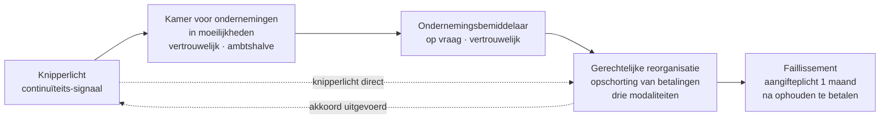
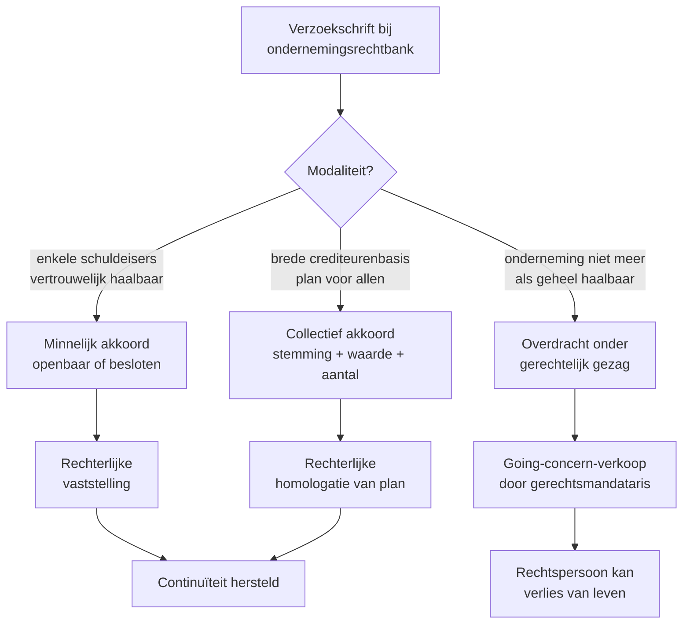

> **Leerstuk — één vraag, helemaal doorgewerkt.** Voor verhaal en routekaart: [[studiemateriaal/3-0|overzicht PO 3.0]]. Dit leerstuk brengt twee verhalen samen: het *vrijwillig* einde via Boek 2 WVV (ontbinding-AV, vereffenaar, sluiting) en het *onvrijwillig* einde via Boek XX WER (knipperlicht, kamer, bemiddelaar, gerechtelijke reorganisatie, faillissement). Ze horen samen omdat er tussen vrijwillig en gedwongen een scharnier zit — staking van betaling — dat het pad onverbiddelijk omzet. Voor de verslag-mechaniek van de accountant in elk van deze procedures: doorklik naar [[bijzondere-mandaten-van-de-accountant]].

## Antwoord in één blik

Een vennootschap eindigt in twee mogelijke werelden. **Vrijwillig** volgt ze het Boek-2-pad: een ontbindings-AV beslist tot stopzetting (notariële akte, versterkte meerderheid, bijzonder verslag bestuur + accountant- of revisorenverslag over de staat van activa en passiva), een vereffenaar verzilvert en betaalt, en een sluitings-AV ontbindt het laatste vlies (onderhands, gewone meerderheid). Een snellere variant — "ontbinding-en-vereffening in één akte" — werkt alleen als er geen vereffenaar wordt aangesteld én alle schulden zijn betaald of geconsigneerd, bevestigd door dat accountantsverslag. **Onvrijwillig** loopt ze Boek XX in: een gradatie van vroege detectie (knipperlicht → kamer voor ondernemingen in moeilijkheden → ondernemingsbemiddelaar) naar formele procedures (gerechtelijke reorganisatie in drie modaliteiten → faillissement) en eindigt eventueel in stigma-mechanismen (kwijtschelding/rehabilitatie voor natuurlijke personen, beroepsverbod voor bestuurders met grove fout).

Drie technische sleutels die het examen graag toetst. **Eén**: ontbindings-AV en sluitings-AV zijn niet hetzelfde — verschil in meerderheid, vormvereisten en verslag. **Twee**: de faillissementsaangifteplicht is **één maand** vanaf het ogenblik waarop de vennootschap is opgehouden te betalen, en die plicht slaapt niet tijdens overwegingen van een vrijwillige ontbinding. **Drie**: een vrijwillige ontbinding kan een vennootschap met staking van betaling niet redden — wie het toch probeert, riskeert een ambtshalve faillietverklaring en bestuurdersaansprakelijkheid voor het netto-passief van de boedel.

We bouwen in drie blokken: eerst de vrijwillige ontbinding en vereffening (Boek 2), dan de Boek-XX-gradatie van vroege detectie tot faillissement, en ten slotte de bestuurdersaansprakelijkheid en het scharnier dat het ene pad in het andere kan omzetten.

---

## Vrijwillige ontbinding en vereffening — Boek 2

Een vennootschap eindigt vrijwillig in drie tijden: **ontbinding** (besluit), **vereffening** (afwikkeling) en **sluiting** (uitschrijving). Elk tijdvak heeft zijn eigen formaliteiten en zijn eigen rol voor de accountant.

### De ontbindings-AV — notariële akte plus accountantsverslag

De algemene vergadering beslist tot ontbinding met een **versterkte meerderheid** (typisch drie vierde of vier vijfde van de stemmen, afhankelijk van de rechtsvorm) en een aanwezigheidsquorum van de helft van het kapitaal. De beslissing moet bij **notariële akte** worden vastgelegd — dat is een geldigheidsvereiste, geen formaliteit voor de bühne. Wie ontbindt bij onderhandse akte, ontbindt niet.

Aan die AV gaat een vaste agenda vooraf. Het **bestuursorgaan stelt een bijzonder verslag** op waarin het de reden voor de voorgestelde ontbinding toelicht. Bij dat verslag voegt het een **staat van activa en passiva** die niet ouder is dan drie maanden. Een **commissaris, externe accountant of bedrijfsrevisor** brengt vervolgens een verslag uit over die staat — verklaart of zij de toestand van de vennootschap getrouw weergeeft en signaleert eventuele onzekerheden over de waardering. Die rol mag de gewone (externe) accountant opnemen — anders dan bij een inbreng in natura, waar uitsluitend een bedrijfsrevisor bevoegd is. De mechaniek van dat verslag — werkprogramma, onafhankelijkheidsverklaring, conclusies — staat uitgewerkt in [[bijzondere-mandaten-van-de-accountant]].

De AV stelt vervolgens de **vereffenaar** aan, een natuurlijk persoon of een meervoudig college. Vanaf dat ogenblik treedt de vereffenaar in de plaats van het bestuursorgaan — de bestuurders houden op te functioneren. Ontbindingsbesluit en identiteit van de vereffenaar worden bij de griffie neergelegd en in het Belgisch Staatsblad bekendgemaakt. De vennootschap voert vanaf dan op alle stukken de toevoeging "in vereffening".

### Vereffening — de vereffenaar aan zet

De vereffenaar heeft drie hoofdtaken. Hij **verzilvert** de activa (verkoop voorraden, vorderingen innen, vaste activa te gelde maken), hij **betaalt** de schuldeisers in volgorde van voorrang (eerst de bevoorrechte — fiscaal, sociaal, hypothecair — daarna de chirografaire), en hij **verdeelt** het eventuele restant aan de aandeelhouders volgens hun aandeel.

Als de baten de lasten ruim overtreffen of de schuldvorderingen voldoende gewaarborgd zijn, mag hij op eigen risico eerst de opeisbare schulden betalen vooraleer alle andere afgewikkeld zijn. Blijkt later dat het tekort schiet, dan draagt hij de gevolgen — een belangrijk stuk **vereffenaarsaansprakelijkheid**. Wanneer er een tekort dreigt waarbij niet alle schuldeisers integraal kunnen worden betaald, moet hij vóór de sluiting een **verdelingsplan** ter goedkeuring aan de rechtbank voorleggen — een tussenstap die in praktijk de vereffening verzwaart.

Geen wettelijke maximumduur voor een vereffening: eenvoudige dossiers ronden binnen het halfjaar af, complexe trajecten (vastgoed te verkopen, lopende geschillen) kunnen jaren lopen. De vereffenaar legt jaarlijks **rekening** over zijn beheer aan de aandeelhouders en de griffie.

### De sluitings-AV — onderhands

Wanneer de vereffenaar zijn werk heeft afgerond, roept hij een **sluitings-AV** bijeen. Vier punten op de agenda: de eindrekening van de vereffenaar, de verdeling van het netto-actief, de **kwijting** aan de vereffenaar, en het formele besluit tot sluiting van de vereffening. De sluitings-AV werkt totaal anders dan de ontbindings-AV — en juist daar ligt een examen-instinker.

| Aspect | Ontbindings-AV | Sluitings-AV |
|---|---|---|
| **Meerderheid** | Versterkte (typisch 3/4 of 4/5) | Gewone (>50%) |
| **Quorum** | 1/2 van het kapitaal | Geen |
| **Vorm** | **Notariële akte** verplicht | Onderhands volstaat |
| **Bijzonder verslag bestuur + staat A&P** | Ja, max 3 maand oud | Niet voor de sluiting zelf — wel eindrekening vereffenaar |
| **Accountantsverslag over staat A&P** | **Ja** — getrouwheidsverklaring | Niet vereist — wel kwijting vereffenaar |
| **Gevolg** | Vennootschap "in vereffening" | Vennootschap **bestaat niet meer** |

Het besluit tot sluiting wordt bij de griffie neergelegd en bekendgemaakt. De plaats waar boeken en bescheiden van de vennootschap minstens vijf jaar bewaard blijven, plus de maatregelen voor consignatie van niet-afgegeven gelden, worden meegepubliceerd. Vanaf de bekendmaking is de vennootschap rechtspersoon-af — uitgeschreven uit de KBO.

> **Vergeten activa na sluiting?** Komt een actiefbestanddeel boven dat over het hoofd was gezien (een vergeten vordering, een vergeten onroerend goed), dan kan een schuldeiser wiens vordering niet integraal werd voldaan de **heropening van de vereffening** vorderen — op voorwaarde dat de waarde van het vergeten goed de kosten van heropening overstijgt. De vennootschap krijgt door die heropening tijdelijk haar rechtspersoonlijkheid terug. Een merkwaardig pad terug.

### Ontbinding-en-vereffening in één akte — de versnelde route

Voor vennootschappen zonder lopende verplichtingen kent het wetboek een **versnelde procedure**: ontbinding, vereffening en sluiting in één notariële akte, zonder afzonderlijke vereffenaar en zonder tweede AV. De winst: tijd en formaliteiten.

De voorwaarden zijn echter strikt en cumulatief. Geen vereffenaar mag worden aangeduid. Alle schulden tegenover vennoten, aandeelhouders en derden — zoals vermeld in de staat van activa en passiva — moeten terugbetaald zijn, of de nodige gelden moeten geconsigneerd zijn. En het verslag van de accountant of revisor over die staat moet expliciet bevestigen dat aan die voorwaarde voldaan is — die bevestiging hoort in de **conclusies** van het verslag. Schulden aan vennoten of aandeelhouders die op de staat staan, mogen onbetaald blijven, maar uitsluitend als de betrokken schuldeisers **schriftelijk instemmen** met de versnelde procedure en de accountant of revisor die schriftelijke instemming in zijn conclusies vermeldt.

Twee bijkomende waarborgen ter compensatie van de snellere afwikkeling: de aansprakelijkheid van vennoten of aandeelhouders voor onbetaalde schulden wordt uitgebreid (zelfs zonder kwade trouw, met als bovengrens het ontvangen netto-actief), en de heropening van de vereffening blijft een open optie voor schuldeisers die later opduiken.

In de praktijk komt deze procedure vooral voor bij **dormante dochtervennootschappen** zonder activiteit. Stel dat de Verhaeren Holding NV in 2028 — na de share deal van Verhaeren Bouw — nog één inactieve dochter aanhoudt zonder schulden, alleen liquide middelen. De ontbinding-en-vereffening in één akte loopt dan strak: de accountant bevestigt in zijn verslag de staat van activa en passiva plus de afwezigheid van schulden, de notaris akteert ontbinding-en-vereffening tegelijk, het saldo gaat terug naar de Holding, en de dochter verdwijnt uit de KBO.

---

## Boek XX WER — gradatie van vroege detectie tot faillissement

Boek XX van het Wetboek van Economisch Recht — sinds 2018 in voege, grondig bijgewerkt door de Wet van 7 juni 2023 (in voege vanaf 1 september 2023) die onder meer een besloten reorganisatieprocedure heeft toegevoegd — verzamelt het hele insolventierecht. De pedagogische sleutel: lees Boek XX niet als zes losse procedures, maar als één **gradatie van interventie-intensiteit**. Vroege en zachte vormen aan de top, formele en ingrijpende aan de basis. Hoe verder een onderneming afdaalt, hoe sterker de overheid in haar bestuur intervenieert.

### Niveau 1 — Knipperlicht

Geen procedure, maar een signaal: het bestuur of de accountant detecteert continuïteitsdreiging in de cijfers — verlies dat het eigen vermogen aantast, opeenvolgende verliesjaren, een liquiditeitsratio die scheef gaat. De technische lezing van die signalen werkt [[studiemateriaal/1-3|PO 1.3]] uit onder de noemer *going concern*. Voor de vennootschap betekent een knipperlicht concreet één van twee dingen: ofwel ligt er een alarmbel-trigger op tafel (uitgewerkt in [[kapitaalbescherming-uitkeringen-en-alarmbel]]), ofwel is er een vroeg moment om buiten elke formele procedure om de continuïteit bij te sturen. Het knipperlicht heeft geen rechtsgevolg op zich — het is de signalering die de gradatie startklaar zet.

### Niveau 2 — Kamer voor ondernemingen in moeilijkheden

Bij de ondernemingsrechtbank loopt een **kamer voor ondernemingen in moeilijkheden** — een gespecialiseerd orgaan dat ondernemingen met financiële signalen *ambtshalve* opvolgt. Wanneer indicatoren oplichten (niet-neergelegde jaarrekeningen, RSZ-achterstand, fiscale schulden, dagvaardingen door schuldeisers) wordt de onderneming opgeroepen voor een gesprek met een rechter-verslaggever. Vertrouwelijk, niet-openbaar.

Het gesprek heeft geen onmiddellijke sanctie. Het bestuur licht toe wat er gebeurt en welke plannen het heeft. De kamer kan beslissen het onderzoek te voortzetten (binnen acht maanden af te ronden, eventueel verlengbaar tot tien of zelfs achttien maanden) of de zaak op te volgen. Wanneer de schuldenaar dreigende insolventie zelf inschat, kan hij ook **actief** de kamer aanspreken om schuldeisers te laten oproepen voor een schikking — een nieuwer instrument dat in stilte tot oplossingen kan leiden.

In wezen is de kamer een **vroeg signaal-orgaan**: het bestaan ervan dwingt het bestuur tot zelfreflectie en draagt een impliciete dreiging dat verder uitblijven van actie tot een formelere fase leidt.

### Niveau 3 — Ondernemingsbemiddelaar

Vrijwillig en vertrouwelijk — daarin verschilt de **ondernemingsbemiddelaar** van wat er op vorige en volgende niveaus speelt. De onderneming vraagt zelf om de aanstelling van een neutrale bemiddelaar, die geen dwingende bevoegdheid heeft maar wel onderhandelingen met schuldeisers kan helpen ontblokken. Geen openbaarheid, geen vonnis — alleen het zoeken naar akkoorden die zonder bemiddelaar niet zouden lukken.

Voor de accountant van een cliënt in moeilijkheden: de bemiddelaar is een instrument om in te zetten *voordat* het escalatieniveau naar de gerechtelijke reorganisatie verschuift. Eens de reorganisatie open is, verandert het speelveld fundamenteel.

### Niveau 4 — Gerechtelijke reorganisatie

De **gerechtelijke reorganisatie** is de eerste formele insolventieprocedure in de gradatie. Een onderneming wier continuïteit *bedreigd maar herstelbaar* is, krijgt van de rechtbank een tijdelijke **opschorting van betalingen** om met haar schuldeisers tot een akkoord te komen. De opschorting beschermt tegen executiehandelingen en geeft ademruimte.

Het bestuur dient een **verzoekschrift** in bij de ondernemingsrechtbank waarin het de gebeurtenissen schetst, de bedreiging van de continuïteit motiveert en de gekozen doelstelling vermeldt. Bij het verzoekschrift gaan opgave van schuldeisers, een staat van activa en passiva en een kasstroom-prognose. De rechtbank beoordeelt de ontvankelijkheid en kan opschorting verlenen voor maximaal vier maanden — in zware dossiers verlengbaar tot twaalf of in uitzonderlijke gevallen achttien maanden in totaal.

De wet biedt drie modaliteiten, en de keuze tussen ze hangt af van de schuldenkring en het herstelvermogen.

Bij een **minnelijk akkoord** zoekt de onderneming een vergelijk met één of enkele grote schuldeisers — typisch een bank en een grote leverancier. Snel en eenvoudig, met een vertrouwelijke variant sinds 2023 (besloten gerechtelijke reorganisatie) waarbij geen publieke aankondiging volgt — relevant voor KMO's die reputatie-schade willen vermijden.

Een **collectief akkoord** richt een reorganisatieplan op alle schuldeisers in de opschorting. Het plan kan kwijtschelding van een deel van de schulden voorzien (bijvoorbeeld zestig procent), een afbetalingsplanning over twee tot vijf jaar, of conversies van schulden in eigen vermogen. Schuldeisers stemmen, en het plan moet een meerderheid in aantal én in waarde van de aanwezige of vertegenwoordigde schuldeisers halen, eventueel per klasse. De rechtbank **homologeert** vervolgens — vanaf homologatie is het plan bindend voor alle schuldeisers in de opschorting, ook diegenen die tegen stemden.

Bij een **overdracht onder gerechtelijk gezag** stelt de rechtbank een **gerechtsmandataris** aan die activa en personeel als going concern aan een koper overdraagt. De onderneming-als-rechtspersoon overleeft die overdracht doorgaans niet — wat resteert is een lege schil die alsnog ontbonden of failliet verklaard wordt. Maar de activiteit zelf gaat door bij een nieuwe eigenaar, met behoud van werkgelegenheid.

Tijdens een gerechtelijke reorganisatie kan de rechtbank — op vraag van de schuldenaar of van een schuldeisers-meerderheid die de kost wil dragen — een **herstructureringsdeskundige** aanstellen die het bestuur bijstaat bij de onderhandelingen over en de opstelling van het plan. Die rol kan een accountant opnemen — een wettelijk mandaat dat de Boek-XX-hervorming van 2023 uitdrukkelijk heeft erkend. De mechaniek staat in [[bijzondere-mandaten-van-de-accountant]].

Concreet in het Verhaeren-dossier: na het mislukken van het herstelplan voor Bouwprojecten Zuid (twee grote klanten weg, kredietlijn niet verlengd) dient Marc op 15 juni 2026 een verzoekschrift gerechtelijke reorganisatie in voor de modaliteit van het collectief akkoord — de schuldenkring is breed genoeg om een minnelijk akkoord onpraktisch te maken. De rechtbank verklaart de procedure open op 30 juni 2026 met een opschortingsperiode van vier maanden. Op 31 oktober legt het bestuur — bijgestaan door de accountant voor de cijfermatige onderbouwing — een reorganisatieplan voor: zestig procent kwijting van handelsschulden en een afbetalingsplanning over vierentwintig maanden voor het restant. Stemming op 15 november, meerderheid in aantal én in waarde gehaald, rechtbank homologeert.

### Niveau 5 — Faillissement

Wanneer een onderneming *duurzaam* heeft opgehouden te betalen en haar krediet is geschokt, eindigt de gradatie in een **faillissement**. Het is de formele vaststelling dat het einde definitief is — geen reorganisatie meer mogelijk, geen kredietherstel meer denkbaar.

Twee triggers bestaan. Ofwel doet het bestuur **zelf aangifte** ter griffie van de bevoegde rechtbank — een verplichting binnen **één maand** na het ogenblik waarop de vennootschap heeft opgehouden te betalen. Ofwel **dagvaardt** een schuldeiser, het openbaar ministerie, een voorlopige bewindvoerder, of de curator van een eerdere hoofdprocedure tot faillietverklaring. Ofwel doet de schuldenaar aangifte met meteen het verzoek de gerechtelijke ontbinding mee uit te spreken — een synthese-pad sinds de Boek-XX-hervorming.

De **voorwaarden** zijn dubbel. "Ophouden te betalen" betekent niet één gemiste betaling — wel een *duurzaam* onvermogen om opeisbare schulden te voldoen. "Krediet geschokt" betekent dat de onderneming geen nieuwe kredietlijn meer kan openen, dat leveranciers contant willen worden betaald, dat banken weigeren. Beide moeten samen aanwezig zijn.

Wanneer de rechtbank failliet verklaart, stelt zij een **curator** aan — typisch een advocaat, soms een accountant als boekhoudkundig deskundige aanvullend. Het vonnis vermeldt de "datum van staking van betaling" — een datum die desgevallend tot zes maanden vóór het vonnis kan teruggaan en die juridisch relevant is voor de *niet-tegenwerpbaarheid* van bepaalde handelingen die vlak vóór de staking gesteld werden (denken aan een preferentiele betaling aan één schuldeiser ten nadele van de boedel). De curator beheert vervolgens de boedel: verkoopt activa, ontvangt schuldvorderingen, verifieert ze, betaalt schuldeisers naar rangorde, en sluit het faillissement af. Vanaf het vonnis stopt het bestuur — alle handelingen namens de vennootschap zijn aan de curator.

> **De aangifteplicht slaapt niet tijdens overwegingen van vrijwillige ontbinding.** Wie als bestuurder geconfronteerd wordt met staking van betaling en intussen overweegt of misschien een vrijwillige ontbinding niet sneller of "netter" zou zijn, loopt een groot risico. De aangifteplicht is hard — een maand vanaf het ogenblik dat de vennootschap heeft opgehouden te betalen. Wie de termijn laat verstrijken pleegt een strafbaar feit en stelt zich bovendien burgerlijk aansprakelijk voor schade die door dat uitstel ontstaat. Het paragraaf-3 van artikel XX.102 voorziet wel dat de aangifteplicht *opgeschort* wordt zodra een verzoekschrift gerechtelijke reorganisatie wordt neergelegd — een laatste uitweg.

### Stigma na het einde — kwijtschelding, rehabilitatie en beroepsverbod

Voor het einde van de faillissementsweg gelden twee aparte mechanismen die op de gefailleerde en/of de bestuurder doorwerken. Voor een gefailleerde **natuurlijke persoon** voorziet de wet **kwijtschelding van restschulden** — een mechanisme dat de schulden definitief uitwist, op voorwaarde dat de gefailleerde geen kennelijke grove fouten beging in de aanloop van het faillissement. De oudere figuur van **rehabilitatie** blijft bestaan voor het smaller geval van een gefailleerde die geen kwijtschelding heeft verkregen maar later alle schulden alsnog volledig voldoet (in hoofdsom, interest en kosten). Voor een rechtspersoon zijn deze figuren niet relevant — een failliet verklaarde vennootschap verdwijnt sowieso na sluiting van het faillissement.

Voor een **bestuurder** voorziet de wet een **beroepsverbod**: wanneer de insolventierechtbank vaststelt dat een kennelijke grove fout van een bestuurder heeft bijgedragen tot het faillissement, kan zij hem bij gemotiveerd vonnis verbieden om — persoonlijk of via een tussenpersoon — een onderneming uit te baten of bestuursfuncties uit te oefenen in een rechtspersoon. Een gewichtige sanctie die meerdere jaren kan duren en de loopbaan van de betrokkene structureel raakt.

---

## Bestuurdersaansprakelijkheid in insolventie-context

Insolventie is hét moment waarop bestuurdersaansprakelijkheid — die in algemene termen al uitgewerkt wordt in [[kapitaalbescherming-uitkeringen-en-alarmbel]] — *operationeel* wordt. De curator gaat er actief naar zoeken, want elke succesvolle vordering vergroot de boedel waaruit schuldeisers worden betaald. Vier vorderingen lopen door zijn dossier.

**De algemene bestuurdersaansprakelijkheid voor kennelijk grove fouten.** De cap die het WVV op bestuurdersaansprakelijkheid plaatst, valt weg bij grove fouten — en bij een faillissement is dat het scharnier dat de curator graag aangrijpt. Klassieke voorbeelden: een te late alarmbel, een onverantwoorde investering tijdens een crisis, een herstelplan dat geen redelijke basis had, doorgegaan trading terwijl het bestuur wist dat de vennootschap zinkende was.

**Wrongful trading** — een specifiek insolventie-instrument waarbij een bestuurder die door een kennelijk grove fout heeft bijgedragen tot het faillissement, persoonlijk aansprakelijk gesteld kan worden voor het *netto-passief* van de boedel: het tekort dat schuldeisers niet kunnen recupereren. Het bedrag kan tot in de honderdduizenden euro lopen. Dit is voor het bestuur het zwaarste financiële risico van een faillissement.

**Persoonlijke en hoofdelijke aansprakelijkheid voor sociale en fiscale schulden.** Een bijzondere figuur viseert bestuurders die de afgelopen vijf jaar bij twee of meer faillissementen of vereffeningen betrokken waren waarbij sociale-zekerheidsbijdragen onbetaald bleven — zij kunnen persoonlijk en hoofdelijk aansprakelijk gesteld worden voor de op het moment van het faillissement openstaande RSZ-bijdragen. Parallel daaraan voorzien fiscale wetten (WIB92 voor de bedrijfsvoorheffing, het wetboek minnelijke en gedwongen invordering voor btw) een soortgelijke aansprakelijkheid van dagelijks bestuurders bij niet-betaling te wijten aan een bestuursfout. Een aparte categorie schulden waar de "bescherming" van de rechtspersoonlijkheid niet werkt.

**Specifieke bestuursfouten** uit het WVV die door de curator opnieuw worden ingeroepen: schending van de alarmbelprocedure, onrechtmatige uitkeringen, schending van de boekhoudverplichting, het niet-naleven van vormvereisten bij vrijwillige ontbinding.

Concreet voor het Verhaeren-dossier (hypothetisch — als het collectief akkoord van Bouwprojecten Zuid mislukt en het faillissement volgt): de curator zal Marc als enig zaakvoerder beoordelen op grove fouten in de aanloop. Was de alarmbel tijdig gedocumenteerd? Werd het herstelplan op redelijke gronden voorgesteld of stond het bij voorbaat zwak? Zijn er handelingen gesteld in de maanden voor de aangifte die als wrongful trading kunnen kwalificeren? Hier ligt het belang van schriftelijke documentatie door de accountant van elke stap — niet om de bestuurder vrij te pleiten zonder reden, maar om bij een kennelijk grove fout precies te kunnen onderscheiden wat verdedigbaar was en wat niet.

---

## Het scharnier — wanneer schakelt vrijwillig over naar gedwongen?

Een bestuur dat overweegt vrijwillige ontbinding moet zichzelf eerst de scharniervraag stellen: **is de vennootschap in staat van staking van betaling?**

Is het antwoord *ja*, dan is het pad onverbiddelijk. De aangifteplicht voor faillissement is geactiveerd — één maand vanaf het ogenblik dat de vennootschap is opgehouden te betalen. Vrijwillige ontbinding kán dan niet als alternatief. Een bestuur dat het toch zou voorstellen, riskeert dat de notaris of de griffie ingrijpt, dat een schuldeiser de staking van betaling aankaart, en dat de rechtbank in plaats van een vrijwillige ontbinding een **ambtshalve faillietverklaring** uitspreekt — met alle gevolgen voor de bestuurders. Bovendien blijft elke handeling die het bestuur in tussentijd stelt, kwetsbaar voor de niet-tegenwerpbaarheidsregels: een betaling die tussen staking en vonnis ten gunste van één schuldeiser gebeurt, kan door de curator worden teruggevorderd.

Is het antwoord *nee*, dan is vrijwillige ontbinding wel beschikbaar. Geen acute liquiditeitscrisis, geen schokking van krediet — wel een rationele beslissing van de aandeelhouders om te stoppen (einde activiteit, fusie elders, geen opvolging). Het Boek-2-pad ligt open.

Wanneer het antwoord *onzeker* is, biedt Boek XX een tussenuitweg. Een verzoekschrift gerechtelijke reorganisatie geeft het bestuur tijd onder de bescherming van een opschorting. Tijd om uit te zoeken of een akkoord met schuldeisers het schip kan redden, of dat een geordende overdracht onder gerechtelijk gezag de activiteit kan doorgeven, of dat het toch op faillissement uitloopt. De aangifteplicht wordt geschorst vanaf de neerlegging van dat verzoekschrift — een belangrijke ademruimte.

| Scenario | Pad | Wettelijk anker |
|---|---|---|
| Geen staking, gewone stop | Vrijwillige ontbinding (Boek 2) | Hoofdregel ontbinding-en-vereffening |
| Geen staking, eenvoudige dochter | Ontbinding-en-vereffening in één akte (versnelde Boek 2) | Strikte voorwaarden — accountantsverslag bevestigt |
| Continuïteit bedreigd, herstelbaar | Gerechtelijke reorganisatie (Boek XX) | Drie modaliteiten — keuze afhankelijk van schuldenkring |
| Staking van betaling, krediet geschokt | Faillissementsaangifte (Boek XX) | Verplichting binnen één maand |
| Twijfel + tijd nodig | Verzoekschrift GR opent opschorting | Aangifteplicht faillissement wordt geschorst |

---

## Drie valkuilen

> **Valkuil 1.** De versnelde procedure (ontbinding-en-vereffening in één akte) toepassen op een vennootschap met openstaande schulden zonder consignatie of zonder schriftelijke instemming van de betrokken schuldeisers. De wet vereist dat *alle* schulden voldaan of geconsigneerd zijn — bevestigd in de conclusies van het accountants- of revisorenverslag — tenzij vennoten of derde schuldeisers expliciet schriftelijk instemmen. Wie het pad versmalt zonder die strenge dekking, opent de deur naar heropening van de vereffening op vordering van schuldeisers én naar persoonlijke aansprakelijkheid van het bestuur. Een veelvoorkomende fout in advies-context.

> **Valkuil 2.** De sluitings-AV behandelen alsof het een tweede ontbindings-AV is. Ontbinding vraagt **notariële akte** en **versterkte meerderheid**; sluiting volstaat **onderhands** met **gewone meerderheid**. Een examen-strikvraag die in MCQ-vorm vaak terugkeert. Wie ze door elkaar haalt, antwoordt fout op twee fronten tegelijk — meerderheid én vormvereisten.

> **Valkuil 3.** De alarmbel als eindpunt zien in plaats van als startpunt. Een bestuur dat bij negatief netto-actief enkel de alarmbel-procedure netjes uitvoert maar geen vinger uitsteekt naar de volgende fase, loopt rechtstreeks op wrongful trading af zodra een faillissement intreedt. De gradatie L3 → L5 hoort als één continuüm gedacht te worden — alarmbel signaleert, gerechtelijke reorganisatie organiseert herstel, faillissementsaangifte sluit af. Wie elk niveau als afzonderlijke afgesloten procedure leest, mist dat de bestuurdersaansprakelijkheid niet stopt aan de grens tussen niveaus.

---

## Wanneer je dit snapt, ga dan naar:

- [[kapitaalbescherming-uitkeringen-en-alarmbel]] — voor het instappunt: alarmbel is de wettelijke trigger die een bestuur dwingt om de gradatie in te stappen. Bestuurdersaansprakelijkheid uit deze fase werkt door tot in het faillissement.
- [[bijzondere-mandaten-van-de-accountant]] — voor de verslag-mechaniek: wat staat in een accountantsverslag bij ontbindings-AV, wat bij ontbinding-en-vereffening in één akte, wanneer als vereffenaarsmandaat, wanneer als herstructureringsdeskundige.
- [[vennootschapsvorm-kiezen-en-oprichten]] — voor de levensloop-context: vrijwillig einde als spiegelbeeld van vrijwillige oprichting. Eenzelfde formaliteit-pakket, andere richting.
- [[studiemateriaal/3-0/samenvatting|Samenvatting PO 3.0]] — voor herhaling vlak voor het examen: ontbinding-vs-sluiting tabel, insolventie-gradatie-mermaid en bestuurdersaansprakelijkheid-trigger in één oogopslag.

**Voor wie definitorisch detail wil opzoeken:** [[ontbinding-en-vereffening]] · [[insolventierecht-wer-boek-xx]] · [[gerechtelijke-reorganisatie]] · [[faillissement]] · [[kamers-voor-ondernemingen-in-moeilijkheden]] · [[ondernemingsbemiddelaar]] · [[rehabilitatie-en-beroepsverbod]] · [[bestuurdersaansprakelijkheid]]

---

## Wettelijk fundament

- Ontbindings-AV — bijzonder verslag bestuur + staat van activa en passiva (max 3 maand) + verslag commissaris/externe accountant/bedrijfsrevisor: WVV art. 2:67.
- Vereffenaar — aanstelling, plichten, betaling schuldeisers: WVV art. 2:79 e.v., voorrangs-orde art. 2:87.
- Ontbinding-en-vereffening in één akte — voorwaarden cumulatief: WVV art. 2:91. Vereist accountants-/revisorenverslag dat in conclusies bevestigt dat alle schulden voldaan of geconsigneerd zijn (uitzondering voor schuldeisers die schriftelijk instemmen).
- Sluiting van vereffening — bekendmaking, plaats bewaring boeken, consignatie: WVV art. 2:92.
- Heropening van vereffening bij vergeten activum: WVV art. 2:95.
- Boek XX WER — toepassingsgebied insolventie ondernemingen: WER art. XX.1 e.v.
- Kamer voor ondernemingen in moeilijkheden — vroege detectie + ambtshalve onderzoek + actief verzoek schuldenaar: WER art. XX.21 e.v., art. XX.25-XX.29 (onderzoek), art. XX.29/1 (actieve oproeping op verzoek schuldenaar).
- Gerechtelijke reorganisatie — verzoekschrift aan rechtbank + bijlagen: WER art. XX.41.
- Herstructureringsdeskundige — rechterlijke aanstelling, accountant kan rol opnemen: WER art. XX.49/2 (openbare procedure), art. XX.83/22 e.v. (besloten variant).
- Gerechtelijke reorganisatie — opschorting bedoeld in: WER art. XX.50 e.v.
- Collectief akkoord — homologatie reorganisatieplan: WER art. XX.83/15, bindendheid art. XX.83/20.
- Besloten gerechtelijke reorganisatie — opschorting op verzoek herstructureringsdeskundige: WER art. XX.83/24.
- Faillissement — vonnis van faillietverklaring + curator: WER art. XX.100.
- Faillissement — aangifteplicht binnen één maand: WER art. XX.102. De plicht wordt opgeschort vanaf neerlegging verzoekschrift gerechtelijke reorganisatie.
- Faillissement — vonnis bij voorraad uitvoerbaar + verzet door verstekdoende partij: WER art. XX.108.
- Niet-tegenwerpbaarheid van handelingen tussen staking van betaling en vonnis: WER art. XX.112.
- Wrongful trading — bestuurder persoonlijk aansprakelijk voor netto-passief bij kennelijk grove fout die heeft bijgedragen tot faillissement: WER art. XX.225.
- Persoonlijke en hoofdelijke aansprakelijkheid bestuurders voor sociale-zekerheidsbijdragen bij minstens twee faillissementen in vijf jaar: WER art. XX.226.
- Hoofdelijke aansprakelijkheid dagelijks bestuurder voor bedrijfsvoorheffing en btw bij bestuursfout: Wetboek invordering art. 51.
- Kwijtschelding van restschulden voor gefailleerde natuurlijke persoon: WER art. XX.173.
- Beroepsverbod bij kennelijk grove fout bestuurder: WER art. XX.229.
- Rehabilitatie voor gefailleerde die geen kwijtschelding heeft verkregen + alle schulden voldoet: WER art. XX.237-XX.239.
- Algemene bestuurdersaansprakelijkheid + cap: WVV art. 2:52 + 2:56 + 2:57.
- Wet houdende hervorming Boek XX WER (besloten reorganisatieprocedure, herstructureringsdeskundige): Wet 7 juni 2023, in voege 1 september 2023.

---

*Leerstuk PO 3.0 — vijfde van zes in het leerpad vennootschapsrecht en insolventie. Voor de volledige routekaart: [[studiemateriaal/3-0|overzicht PO 3.0]].*
