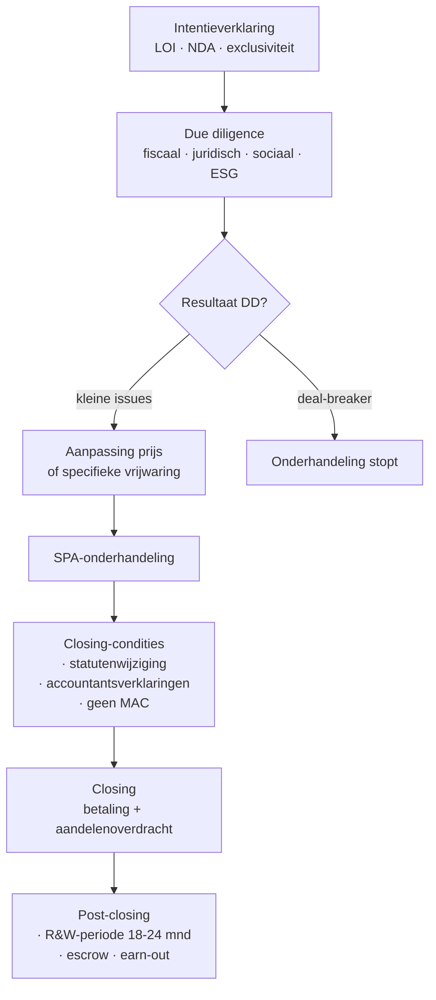

> **Leerstuk — één vraag, helemaal doorgewerkt.** Dit leerstuk dekt een breed programma-blok (SPA-mechaniek + Boek 12 herstructurering) dat examen-statistisch onderbevraagd is, maar in de praktijk de zwaarste mandaat-context van een accountant levert. Voor verhaal en routekaart: [[studiemateriaal/3-0|overzicht PO 3.0]].

## Antwoord in één blik

Een onderneming kan op **vier juridisch verschillende manieren** overgedragen of geherstructureerd worden — en die keuze bepaalt alles wat erna komt (prijs, fiscaliteit, aansprakelijkheid, contractwerk):

1. **Share deal** — aandelen verkopen. De koper neemt de hele vennootschap mee, inclusief historische schulden. R&W zwaar, due diligence kritisch.
2. **Asset deal** — geselecteerde activa en passiva verkopen. Koper kiest wat hij meeneemt, maar moet rekening houden met hoofdelijke aansprakelijkheid voor fiscale en sociale schulden van de overdrager (attesten vereist).
3. **Fusie** — twee vennootschappen smelten samen onder continuïteit van rechten (Boek 12 WVV).
4. **Splitsing** — één vennootschap verdeelt zich in twee of meer (eveneens Boek 12).

We werken dit uit op één doorlopende casus: de **Verhaeren-groep**. Marc Verhaeren (62) wil tegen 2030 zijn operationele werkmaatschappij **Verhaeren Bouw BV** verkopen. **Bouwer X NV** biedt 4,2 mln EUR voor 100 % van de aandelen — een klassieke share deal, in de praktijk gestructureerd via een **Share Purchase Agreement (SPA)** met zeven blokken.

We bouwen in drie blokken: eerst **share versus asset deal** (de fundamentele keuze), dan **de SPA-clausules** in detail, ten slotte de **Boek-12-vormen** (fusie, splitsing, inbreng bedrijfstak).

---

## Share deal versus asset deal — wat verschilt waar?

Bij overdracht van een onderneming staan twee structureel verschillende routes open. Het verschil zit niet in het economisch eindresultaat (de koper krijgt de activiteit in handen), maar in **wat juridisch overgedragen wordt** — en daaruit volgt alles.

Bij een **share deal** verkoopt de aandeelhouder zijn **aandelen** aan de koper. De vennootschap zelf wijzigt niet — alleen haar eigenaar wijzigt. De koper neemt over wat in de vennootschap zit: activa, passiva, lopende contracten, geschillen, fiscale historie, milieurisico's. Vandaar dat due diligence kritisch wordt, Representaties & Waarborgen ("R&W") zwaar zijn, en escrow + vrijwaring standaard in elke deal zitten.

Bij een **asset deal** verkoopt de **vennootschap** geselecteerde activa en passiva. De verkopende vennootschap blijft bestaan (vaak met een restwaarde of een latere liquidatie). De koper kiest wat hij overneemt — typisch het handelsfonds (klanten, naam, lopende contracten) zonder de oude schulden. Voor de verkoper-vennootschap is dit fiscaal zwaarder: de meerwaarde op de overgedragen activa is in principe belastbaar.

Concretiseer met Verhaeren: Bouwer X NV biedt 4,2 mln voor Verhaeren Bouw. Marc en zijn adviseurs kiezen voor een **share deal** — om twee redenen. Eerst praktisch: Bouwer X wil de hele activiteit overnemen mét de 14 werknemers en het lopende orderboek. Tweede reden is fiscaal: meerwaarde op aandelen verkocht door een holding is doorgaans vrijgesteld onder de meerwaarde-vrijstelling van vennootschappen. Bij een asset deal had Verhaeren Bouw zélf haar activa moeten verkopen, met belastbare meerwaarde in de vennootschap.

| Aspect | Share deal | Asset deal |
|---|---|---|
| Voorwerp | Aandelen vennootschap | Geselecteerde activa + passiva |
| Verkoper | Aandeelhouder (Holding) | Vennootschap zelf |
| Wat neemt koper over? | **Alles** wat in vennootschap zit (incl. historie) | Alleen wat is geselecteerd |
| Risico voor koper | **Hoog** — R&W + DD kritisch | Lager — koper kiest |
| Hoofdelijke aansprakelijkheid fiscaal | Geen (geen overdracht) | **Ja** — bij overdracht handelsfonds; attesten van fiscale en sociale rechtgeldigheid vereist |
| BTW | Buiten BTW-toepassingsgebied (overdracht aandelen) | Doorgaans niet-belaste handeling als overdracht algemeenheid of bedrijfsafdeling (strenge voorwaarden) |
| Registratierechten op onroerend goed | Geen (aandelen) | **Ja** — onroerend goed afzonderlijk geregistreerd tegen het tarief van het Gewest |
| Behoud werknemers | Automatisch (vennootschap blijft werkgever) | CAO 32bis — automatische overgang werknemers |
| Fiscaal voor verkoper (meerwaarde) | Vrijstelling meerwaarde op aandelen mogelijk | Meerwaarde belastbaar in vennootschap (gespreide taxatie mogelijk) |

> **Waarom is die hoofdelijke aansprakelijkheid zo'n harde rem op asset deals?** Bij overdracht van een handelsfonds (geheel van klanten + naam + activa) is de koper hoofdelijk aansprakelijk voor de fiscale en sociale schulden van de verkoper-vennootschap. Tenzij de verkoper attesten kan voorleggen die bevestigen dat hij fiscaal en sociaal in orde is, blijven die schulden de koper achtervolgen. Bij een share deal is er geen overdracht (de vennootschap blijft dezelfde rechtspersoon), dus deze regel speelt niet — maar via R&W kan de koper zich daar contractueel tegen indekken.

---

## De SPA — Share Purchase Agreement in zeven blokken

Het verkoopcontract bij een share deal — de **SPA** — is een zwaar document (50-100 pagina's) waarin koper en verkoper hun overeenkomst dichtspijkeren. Zeven blokken keren altijd terug, in min of meer dezelfde volgorde.

### Pre-SPA — intentieverklaring, NDA, exclusiviteit

Vóór iemand een SPA tekent, ligt er typisch al een **intentieverklaring** op tafel. Die intentieverklaring (in M&A-jargon de **Letter of Intent** of LOI) beschrijft de hoofdlijnen van de overwogen deal: prijs-orde van grootte, structuur (share of asset), DD-modaliteiten, exclusiviteits-termijn. Het document is **niet bindend op de prijs en de deal zelf**, maar wel bindend op procedurele clausules (vertrouwelijkheid, exclusiviteit, opzeg-modaliteit).

Gelijktijdig wordt een **geheimhoudingsovereenkomst** (NDA — *non-disclosure agreement*) ondertekend. De koper krijgt toegang tot vertrouwelijke informatie en verbindt zich tot geheimhouding én tot niet-gebruik buiten de DD-context.

Een **exclusiviteitsclausule** verbindt de verkoper om gedurende een periode (typisch 60-120 dagen) geen parallelle onderhandeling met een andere koper te voeren. Schending leidt tot schadevergoeding — in M&A-contracten vaak 1 tot 3 % van de voorgestelde prijs.

In januari 2027 ondertekenen Verhaeren Holding (verkoper) en Bouwer X NV (koper) een LOI: prijsvork 4,0 - 4,5 mln, share deal, DD-periode acht weken, exclusiviteit 90 dagen. NDA tegelijkertijd ondertekend. De data-room wordt geopend.

### Due diligence — wat onderzoekt de koper?

Due diligence is geen formaliteit. Het is de **basis voor de prijszetting, de R&W en de specifieke vrijwaringen** in de SPA. Wat niet in DD wordt ontdekt, leeft later via R&W-claims of vrijwaringen — vandaar dat een goede DD honderdduizenden euro's waard kan zijn.

Een KMO-DD heeft typisch vijf lagen:

- **Financieel** — jaarrekeningen 3 tot 5 jaar terug, genormaliseerde EBITDA (eenmalige posten eruit), werkkapitaal-analyse, kasstroom-prognose
- **Fiscaal** — aangiften vennootschapsbelasting en BTW, lopende controles, correcties op roerende voorheffing
- **Juridisch** — statuten, lopende contracten, geschillen, intellectuele eigendom
- **Sociaal** — CAO-naleving, lopende RSZ-controles, ontslagvergoedingen, sectorbarema's
- **Operationeel en ESG** — milieuvergunningen, hangende boetes, klimaatrisico

De DD identificeert risico's. Koper en verkoper onderhandelen vervolgens hoe ermee om te gaan — niet elke vondst is een deal-breaker:

| DD-vondst | Wat ermee doen? |
|---|---|
| Klein structureel issue | **Prijsverlaging** in de SPA opnemen |
| Specifiek geïdentificeerd risico (lopend dispuut) | **Specifieke vrijwaring** in de SPA — apart van de algemene R&W |
| Issue dat opgelost kán worden vóór closing | **Closing-condities** — de koper tekent pas als het is opgelost |
| Onaanvaardbaar risico of niet-oplosbaar | **Deal-breaker** — de onderhandeling stopt |

Vier red flags duiken op in de Verhaeren-DD:

- **Statutaire onbeschikbare inbreng** 18.550 EUR — overblijfsel van de BVBA→BV-overgang in 2020. Boekhoudkundig zuiver geboekt, maar de onbeschikbaarheid moet worden opgeheven. → *Closing-conditie*: statutenwijziging vóór closing.
- **Twee lopende disputen** met onderaannemers, samen circa 35.000 EUR risico. → *Specifieke vrijwaring* buiten de R&W-cap.
- **BTW-controle 2024** lopend, geen aanslag nog. → *Specifieke vrijwaring* tot afsluiting controle.
- **Hoofdelijke aansprakelijkheid voor onderaannemers** (CAO + sociaal-fiscaal) ⚠️ te verifiëren bij DD; geen schade vastgesteld, standaard R&W volstaat.

### Prijs-mechaniek — locked box, completion accounts, earn-out, escrow

Hoe wordt de prijs concreet vastgesteld en betaald? Twee grote families:

**Locked box** — koper en verkoper komen overeen dat de balans op een **referentiedatum** (bv. 31-12 van het jaar vóór closing) reeds vastligt. De prijs is van toepassing op die balans. Tussen referentiedatum en closing mag de vennootschap geen "leak" van waarde uitvoeren (geen uitkering, geen extra-ordinaire transactie). Eenvoudig en zekerheidsbiedend.

**Completion accounts** — de prijs wordt aangepast aan een tussentijdse balans opgemaakt op closing-datum, gebaseerd op overeengekomen target-werkkapitaal en target-nettoschuld. Complexer en vaak basis voor post-closing-disputen.

Daarnaast komen twee mechanismen vaak terug die geen prijsformule maar een **prijsspreiding** zijn:

**Earn-out** — een deel van de prijs (typisch 10-25 %) wordt uitgesteld en gekoppeld aan toekomstige prestatie (bv. EBITDA in een bandbreedte over 12-24 maanden na closing). Functie: het prijsverschil overbruggen tussen optimistische verkoper en voorzichtige koper. Risico voor de verkoper: het koper-management kan de prestatie negatief beïnvloeden (kostenboeking, investeringsuitstel) — vandaar dat earn-out-clausules vaak gedetailleerde EBITDA-definities en governance-rechten bevatten.

**Escrow** — een gedeelte van de prijs (typisch 10 %) wordt op een derdenrekening (bij advocaat of bank) geplaatst gedurende een periode (12-24 maanden), als buffer voor R&W-claims. Na afloop: vrijgave aan verkoper of compensatie aan koper.

Concreet voor Verhaeren: **4,2 mln** koopprijs, opgesplitst als
- **3.500.000 EUR** cash bij closing
- **700.000 EUR** earn-out gekoppeld aan EBITDA 2027-2028 (locked-box-referentiedatum 31-12-2026)
- **420.000 EUR** (10 %) in escrow gedurende 18 maanden voor R&W-claims

### Representaties en Waarborgen — de R&W

R&W (in Nederlandstalige contracten ook wel "verklaringen en waarborgen") zijn **verklaringen van de verkoper waarvan de juistheid gegarandeerd wordt door een schadevergoeding**. Het zijn de schade-verzekeringsclausules van de SPA: als de verkoper beweert dat de jaarrekening getrouw is en achteraf blijkt dat ze niet is, kan de koper schade claimen.

Een KMO-SPA bevat typisch een R&W-catalogus van een dertigtal verklaringen:

- Titel en bevoegdheid (vennootschap geldig opgericht, geen ontbinding hangend)
- Jaarrekeningen getrouw — geen verzwijgingen
- Geen verborgen schulden
- Fiscaal in orde — geen lopende geschillen of verborgen aanslagen
- Sociaal in orde — CAO-naleving, RSZ-aangiften
- Lopende geschillen > drempel-bedrag vermeld
- Lopende contracten geldig en niet-opzegbaar door overdracht
- Intellectuele eigendom in orde
- Milieu-compliance
- Verzekeringen lopend
- Statutaire onbeschikbare inbreng correct geboekt
- Geen *material adverse change* tussen referentiedatum en closing

De duur van een R&W is typisch **18-24 maanden** voor de algemene verklaringen, **5-7 jaar** voor fiscale en sociale (gelijklopend met verjaringstermijnen), en **onbeperkt** voor titel en bevoegdheid (de zogenaamde *fundamental representations*).

> **R&W met "kennis van de koper".** Een R&W dekt geen feiten waarvan de koper kennis had via DD. Wat de verkoper expliciet openbaart in de *disclosure schedule* (een bijlage bij de SPA) kan niet later via een R&W-claim worden teruggevorderd. Dit is een tweesnijdend zwaard: verkopers proberen veel te disclosen, kopers willen de schedule beperkt houden.

**Examenaccent.** Een klassieke vraag (bv. examen 2013-2 vraag 8) gaat over "overname handelsfonds: attesten en solidaire aansprakelijkheid". Het hoofdpunt: bij een **asset deal** (handelsfonds-overdracht) bestaat **hoofdelijke aansprakelijkheid** van de koper voor de fiscale en sociale schulden van de overdrager, tenzij attesten worden overgelegd dat de overdrager fiscaal en sociaal in orde is. Bij een **share deal** speelt deze aansprakelijkheidsregel niet (er is geen overdracht), maar de koper dekt zich via R&W in.

### Vrijwaring + cap + basket — begrenzing schadevergoeding

Een R&W-schending leidt tot **vrijwaring** (in M&A-jargon *indemnity*) — de koper vordert vergoeding van de verkoper. Maar het is in het belang van de verkoper om die vergoeding te begrenzen, en die begrenzing is contractueel onderhandelbaar:

**Cap** — de maximumvergoeding. Typisch 20-40 % van de koopprijs. Voor de *fundamental representations* (titel, bevoegdheid) is de cap typisch onbeperkt of gelijk aan de volledige koopprijs.

**Basket** — een dubbele filter om kleine claims uit te schakelen:
- *De minimis*-claim — een individuele claim onder een drempel (bv. 10.000 EUR) wordt niet meegerekend
- *Threshold* — de totaalsom van alle claims moet een drempel bereiken (bv. 50.000 EUR) voordat enige claim recupereerbaar is

Twee varianten van threshold komen voor: een **tipping basket** geeft, eenmaal de drempel overschreden, het volledige bedrag vrij; een **deductible basket** geeft alleen het bedrag boven de drempel vrij.

Naast cap en basket biedt **escrow** een directe verhaalbron: de koper kan rechtstreeks uit de geblokkeerde rekening putten zonder te moeten procederen. En in grotere deals zien we **R&W-insurance** opkomen — een externe verzekeraar verzekert het R&W-risico tegen premie, zodat de verkoper "clean exit" kan maken.

Concreet voor Verhaeren: cap = 30 % × 4,2 mln = **1.260.000 EUR**. De-minimis-ticket 10.000 EUR. Threshold 50.000 EUR (tipping). Escrow 10 % = 420.000 EUR gedurende 18 maanden.

> **Voorbeeld-claim.** Acht maanden na closing ontdekt Bouwer X een verborgen handelsschuld van 80.000 EUR die niet in de jaarrekening voorkwam en niet in de disclosure-schedule stond. De-minimis (10k) overschreden ✓. Aggregaat aan claims tot dan: 75.000 EUR — threshold (50k) overschreden ✓. Claim recupereerbaar tot het cap-niveau. Bouwer X trekt eerst uit escrow (snel + geen procedure); het saldo wordt zo nodig nagevorderd bij de verkoper.

### Niet-concurrentiebeding en closing-condities

Twee laatste blokken die altijd in een SPA voorkomen.

Het **niet-concurrentiebeding** verhindert dat de verkoper na verkoop een concurrerende activiteit start of klanten meeneemt. Verkoper en typisch ook het key-management verbinden zich gedurende een periode (typisch 3 tot 5 jaar) geen concurrerende activiteit op te zetten in een bepaalde geografische zone en in dezelfde sector. Tegen vergoeding — vaak 10 tot 25 % van de koopprijs wordt formeel toegerekend aan dit niet-concurrentiebeding (als "goodwill-allocatie").

De **redelijkheidstoets** is hier kritisch: een niet-concurrentiebeding is in België slechts geldig als het beperkt is in (a) duur, (b) geografische zone en (c) sector. Onbeperkt = nietig wegens schending van de vrijheid van ondernemen. Voor een KMO-M&A geldt 3-5 jaar + heel België + dezelfde activiteit als standaard aanvaardbaar.

De **closing-condities** zijn voorwaarden die vervuld moeten zijn vóór de koper effectief tekent. Typisch:

- DD-afronding zonder material adverse change (MAC-clausule)
- Closing-attest van de accountant (bevestiging continuïteit, geen verborgen feiten)
- Eventuele *closing-toelatingen* (concurrentie-autoriteit indien drempels overschreden — meestal niet in KMO-deal)
- Specifieke opvolging van DD-red-flags

Voor Verhaeren: niet-concurrentie Marc = 5 jaar, heel België, gericht op woningbouw + renovatie middensegment, vergoed met 200.000 EUR uit de koopprijs. Closing-condities: (a) statutenwijziging die de statutaire onbeschikbare inbreng opheft, (b) accountantsverklaring continuïteit, (c) DD afgerond zonder MAC.

---

## Reorganisatie via Boek 12 WVV — fusie, splitsing, inbreng

Boek 12 van het Wetboek van vennootschappen en verenigingen regelt drie **interne herstructureringsvormen** waar twee of meer vennootschappen onderling activa en passiva verschuiven met **continuïteit van rechten** — anders dan bij een M&A, waar er een derde-koper is. De drie vormen lijken op elkaar in procedure-aanpak, maar verschillen in eindresultaat.

### Fusie — twee vennootschappen smelten samen

Bij een fusie neemt **één vennootschap** (de overnemende) het hele vermogen van een andere vennootschap (de overgenomen) over onder **algemene rechtsopvolging**. De overgenomen vennootschap houdt op te bestaan. Aandeelhouders van de overgenomen vennootschap krijgen aandelen in de overnemende vennootschap volgens een **ruilverhouding**.

Drie varianten komen voor:

- **Fusie door overneming** — een bestaande vennootschap neemt een andere over
- **Fusie door oprichting** van een nieuwe vennootschap — beide oude vennootschappen verdwijnen, een nieuwe ontstaat
- **Moeder-dochter-fusie** (en zustervennootschappen 100 % gemeenschappelijke moeder) — vereenvoudigde procedure, geen ruilverhoudingsverslag indien de moeder 100 % van de dochter bezit

De **standaardprocedure** verloopt in vijf stappen:

1. Bestuursorganen stellen een **fusievoorstel** op (authentieke of onderhandse akte) + bestuursverslag + financiële cijfers
2. De **commissaris** of, als die er geen is, een aangewezen **bedrijfsrevisor of gecertificeerd accountant** maakt een schriftelijk verslag over het fusievoorstel — verklaart in het bijzonder of de **ruilverhouding relevant en redelijk** is, welke methoden zijn gebruikt en wat het relatieve gewicht ervan is. *Niet vereist* bij moeder-dochter-fusie met 100 %-deelneming.
3. De algemene vergadering van elke betrokken vennootschap besluit met **versterkte meerderheid**
4. **Notariële akte** stelt de fusie vast
5. Rechtsopvolging vanaf de datum van het besluit

Voordelen: eenvoudige overdracht (geen aparte overeenkomsten per actief), continuïteit van contracten + werknemers, **fiscale neutraliteit** mogelijk (cross-PO doorklik naar [[studiemateriaal/2-3|PO 2.3 — vennootschapsbelasting]]).

### Splitsing — één vennootschap verdeelt zich in meerdere

Spiegelbeeld van een fusie: één vennootschap verdeelt haar vermogen over twee of meer (nieuwe of bestaande) vennootschappen.

Drie varianten, parallel aan fusie:

- **Splitsing door overneming** — vermogen verdeeld over bestaande vennootschappen
- **Splitsing door oprichting** — nieuwe vennootschappen ontstaan
- **Gedeeltelijke splitsing** — de gesplitste vennootschap blijft bestaan; slechts een deel van haar vermogen verschuift

De procedure is analoog aan die van fusie: splitsingsvoorstel + bestuursverslag + revisor-/accountant-verslag over de ruilverhouding + AV-besluit met versterkte meerderheid + notariële akte.

Fiscale neutraliteit is ook hier mogelijk — typisch ingezet voor **scheiding van activiteiten** (bv. operationele tak vs vastgoed-tak in aparte vennootschappen).

> **Verhaeren — een alternatief scenario.** Stel dat Marc, in plaats van Verhaeren Bouw te verkopen, beslist om in 2027 een **gedeeltelijke splitsing** van Verhaeren Holding NV door te voeren — Vastgoed-tak (de aandelen in Vastgoed BV) splitst af naar een nieuwe holding "Verhaeren Vastgoed Holding NV", zodat de operationele tak en de vastgoed-tak apart worden beheerd en eventueel verschillend doorgegeven aan de kinderen. Mogelijk fiscaal-neutraal, mits de Boek 12-procedure én de WIB-voorwaarden correct gevolgd worden.

### Inbreng van bedrijfstak of algemeenheid — de derde variant

De **derde Boek-12-vorm** ligt halfweg tussen overdracht en herstructurering: een vennootschap brengt een afgebakend deel van haar onderneming (een **bedrijfstak** — bv. enkel de bouwafdeling) of haar **hele algemeenheid** (alle activa + passiva) in bij een andere vennootschap, in ruil voor aandelen.

Verschil met fusie/splitsing: de **inbrenger blijft typisch bestaan** (verkrijgt enkel aandelen in plaats van haar oude bedrijfstak). De procedure: inbreng-voorstel + verslag bestuur + commissaris-/revisorenverslag (analoog inbreng-in-natura-mechaniek).

Gebruik typisch in herstructureringen waar men een sectie van een vennootschap wil verzelfstandigen zonder een volledige splitsing op te tuigen.

### Ruilverhouding — kern van het revisorenverslag

In elke fusie, splitsing en inbreng is de **ruilverhouding** de centrale vraag: hoeveel nieuwe aandelen krijgt elke oude aandeelhouder in ruil voor zijn oude aandelen? Het antwoord vergt een **relatieve waardering** van de betrokken vennootschappen.

Verschillende waarderingsmethoden komen samen: discounted cash flow (DCF), peer-multiples (EBITDA-veelvouden van vergelijkbare transacties), nettoactief, herwaarderings-balans. De commissaris of de aangewezen bedrijfsrevisor of gecertificeerd accountant verklaart in zijn verslag:

- Welke methoden gebruikt zijn
- Of zij in het gegeven geval relevant en redelijk waren
- Wat het relatieve gewicht van elke methode is in de finale waardering
- Of de finale ruilverhouding aanvaardbaar is

Het is **geen waardering-verklaring** ("de juiste waarde van vennootschap X bedraagt 4,2 mln" zou nooit in dit verslag staan). Het is een **methodologisch + redelijkheids-oordeel**. De diepere mandaat-mechaniek werk je uit in het volgende leerstuk — zie [[bijzondere-mandaten-van-de-accountant]].

---

## Familiale opvolging — gunstregime + share deal

Familiale opvolging via **schenking of erfenis** van aandelen valt buiten de M&A-context (er is geen derde-koper), maar gebruikt **dezelfde share-deal-mechaniek**. Het belangrijkste fiscale instrument is het **gunstregime familiale onderneming** (cross-PO doorklik naar [[studiemateriaal/2-6|PO 2.6 — registratie- en successierechten]]) — schenk- en erfbelasting met verlaagd of nul-tarief, mits voorwaarden vervuld zijn.

De voorwaarden in samenvatting (details in PO 2.6):

- Familiale onderneming met werkmaatschappij-karakter
- Participatie ≥ 50 % door schenker + familie
- Drie jaar voortzettingsverplichting
- Tewerkstelling behouden
- Geen vastgoed-overheersing in het patrimonium tenzij gekoppeld aan operationele activiteit

> **Verhaeren — toekomstig scenario.** Stel dat Marc na 2030 alsnog zijn 60 % Holding-aandelen schenkt aan Sofie + Jeroen via het gunstregime. In het Vlaams Gewest betekent dat 0 % schenkbelasting voor de familiale onderneming, mits drie-jaars-voortzetting. Het gunstregime is geen onderwerp van dit leerstuk (zit volledig in PO 2.6), maar Marc moet de aandeelhoudersovereenkomst structureren in lijn met de voortzettingsverplichting — wat een drag-along- of lock-up-clausule mee bepaalt.

---

## Drie valkuilen

> **Valkuil 1 — hoofdelijke aansprakelijkheid bij asset deal negeren.** Bij overdracht van een handelsfonds (asset deal) is de koper hoofdelijk aansprakelijk voor de fiscale en sociale schulden van de verkoper-vennootschap, **tenzij attesten van fiscale en sociale rechtgeldigheid worden voorgelegd** vóór registratie. Vergeten = de schulden van de verkoper achtervolgen de koper. Bij share deal speelt deze regel niet (geen overdracht), maar de koper dekt zich via R&W in.

> **Valkuil 2 — de Boek-12-procedure als "optioneel" beschouwen.** Fusie of splitsing zonder de Boek-12-procedure (geen revisor-/accountantsverslag over de ruilverhouding, geen AV-besluit met versterkte meerderheid, geen notariële akte) is **nietig**. Bovendien valt de fiscale neutraliteit weg — want die vereist een correcte Boek-12-procedure als onderbouw.

> **Valkuil 3 — de R&W-cap onderschatten en escrow vergeten.** Een koper die een SPA tekent zonder escrow of zonder duidelijke vrijwaringsstructuur, riskeert dat een R&W-claim na closing niet meer recupereerbaar is — de verkoper is mogelijk insolvabel, vertrokken naar het buitenland, of heeft zijn cash uitgegeven. Standaardadvies aan een koper-cliënt: **escrow + R&W-insurance + een redelijke threshold**, niet alleen een nominale cap.

---

## Wettelijk fundament

- **Fusie — fusievoorstel**: WVV art. 12:24
- **Fusie — revisor-/accountantsverslag ruilverhouding** (fusie door overneming): WVV art. 12:26 (sinds W. 25-05-2023 mogen commissaris, bedrijfsrevisor óf gecertificeerd accountant dit verslag opstellen)
- **Fusie — revisor-/accountantsverslag ruilverhouding** (fusie door oprichting): WVV art. 12:39
- **Fusie — AV-meerderheid**: WVV art. 12:30
- **Splitsing — revisor-/accountantsverslag ruilverhouding**: WVV art. 12:78 (splitsing door oprichting); analoge bepaling bij splitsing door overneming
- **Inbreng van algemeenheid of bedrijfstak**: WVV art. 12:92 e.v. (procedure) + art. 12:96 (rechtsgevolgen) + art. 12:101 (inbreng door natuurlijke persoon)
- **Fiscale neutraliteit fusie/splitsing**: WIB92 art. 210-211 (verwijzing — uitgewerkt in [[studiemateriaal/2-3|PO 2.3]])
- **EU-fusierichtlijn 2009/133/EG art. 4** — geen belastingheffing over de vermogenswinst bij grensoverschrijdende fusie/splitsing
- **BTW — overdracht algemeenheid of bedrijfsafdeling**: art. 11 BTW-Wb (geen levering, mits overnemer belastingplichtige met aftrekrecht); modaliteiten in K.B. nr. 1 art. 11
- **Hoofdelijke aansprakelijkheid koper bij handelsfondsoverdracht — fiscale schulden**: Wetboek van de minnelijke en gedwongen invordering (federale fiscaliteit; oude WIB92 art. 442bis is hierin geïntegreerd) + voor de Vlaamse gewestbelastingen: VCF art. 3.12.1.0.14 — hoofdelijke aansprakelijkheid tenzij attesten voorgelegd en wachttermijn nageleefd
- **Hoofdelijke aansprakelijkheid sociale schulden bij overdracht onderneming**: RSZ-wet (analoge mechaniek aan fiscale hoofdelijkheid)
- **Niet-concurrentiebeding — redelijkheidstoets**: vrijheid van ondernemen (Boek II WER) + vaste cassatierechtspraak (beperkt in duur, geografie, sector)
- **Overgang werknemers bij overdracht onderneming**: CAO 32bis (NAR — Nationale Arbeidsraad)
- **Gunstregime familiale onderneming**: regionale fiscaliteit — Vlaams Gewest VCF art. 2.7.4.2.2 e.v. (verwijzing — uitgewerkt in [[studiemateriaal/2-6|PO 2.6]])

Drempelbedragen (registratierechten op onroerend goed, gunstregime-tarieven, basket-bedragen) — zie het **Cijferzakboekje**.

---

## Wanneer je dit snapt, ga dan naar

- **[[bestuur-algemene-vergadering-en-aandeelhouders]]** — voor de SHA-context: drag-along, tag-along en voorkooprecht zijn de instrumenten die een share deal mogelijk maken
- **[[ontbinding-vereffening-en-insolventie]]** — voor de alternatieve afsluit-route: bij gefaalde overdracht ontbinding of overdracht onder gerechtelijk gezag
- **[[bijzondere-mandaten-van-de-accountant]]** — voor de verslag-mechaniek: ruilverhoudingsverslag bij fusie/splitsing, closing-attest, werkkapitaalverklaring

Voor herhaling: zie de [[studiemateriaal/3-0/samenvatting|samenvatting PO 3.0]] — share/asset matrix + SPA-clausules + Boek-12-vormen + gunstregime cross-PO.

## Doorklik naar concepten

Voor wie definitorisch detail wil opzoeken:

- [[overdracht-onderneming]] · [[overnameovereenkomst-spa]] · [[bedrijfswaardering]]
- [[reorganisatie]] · [[fusie]] · [[splitsing]] · [[inbreng-bedrijfstak-of-algemeenheid]]
- [[fiscale-fusie-splitsing]] · [[gunstregime-familiale-onderneming]]

