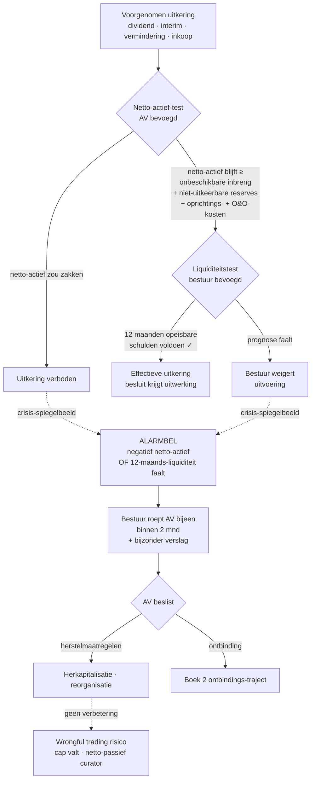
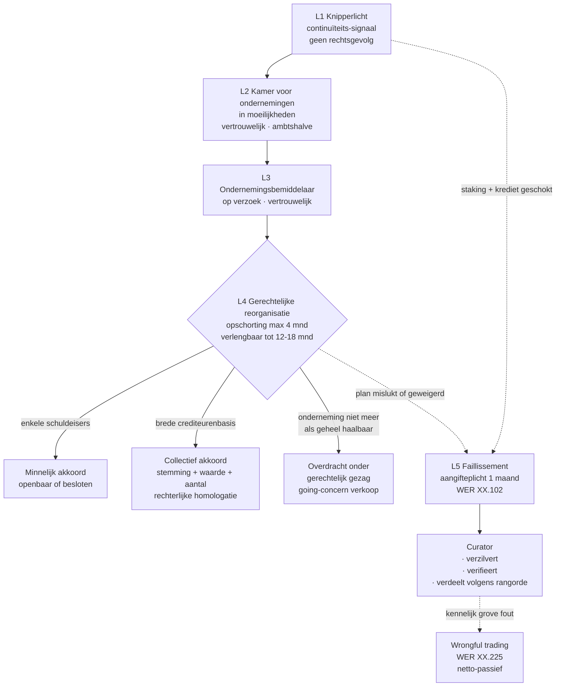

> **Samenvatting — kapstok voor herhaling.** Breed PO met zes leerstukken, één rode draad: van vorm-keuze bij oprichting, over besluitvorming en kapitaalbescherming, naar overdracht, insolventie en de wettelijke verslag-mandaten van de accountant. Deze samenvatting bundelt de rechtsvorm-matrix, de dubbele uitkeringstest + alarmbel-flow, de insolventie-gradatie, de ontbinding-vs-sluiting tabel en de mandaten-tabel met expliciet wie wat mag — accountant, revisor of beide. Voor verhaal en routekaart: [[studiemateriaal/3-0|overzicht PO 3.0]].

## 1. Take-away — wat je écht moet weten

- **WVV 2019 heeft het kapitaalbegrip uit de BV gehaald — niet de schuldeisersbescherming.** Schuldeisers worden niet meer beschermd door een minimumkapitaal, maar door een **dubbele test** (netto-actief + liquiditeit) bij elke uitkering en door het **financieel plan** bij oprichting. Begrijp je dat de hele kapitaalbescherming één toets is in twee gedaantes, dan begrijp je PO 3.0.
- **De alarmbel is het spiegelbeeld van de uitkeringstest.** Uitkering = test vooraf voorkomt afvloeiing. Alarmbel = trigger achteraf zodra de twee crisis-spiegelbeelden ontstaan (negatief netto-actief of 12-maands-liquiditeit faalt). Niet-naleving kost de bestuurder zijn aansprakelijkheids-cap én opent wrongful trading bij faillissement — drie hefbomen die de curator samen inzet.
- **Quasi-inbreng bestaat alléén in de NV — niet in de BV.** Zonder kapitaal is er geen percentage-drempel om aan te haken. Stagiairs gooien dit door elkaar met het oude BVBA-recht. De BV kent inbreng natura en belangenconflict-regels, maar geen aparte quasi-inbreng-procedure.
- **Accountant en revisor zijn niet inwisselbaar.** Voor zuivere waarderings-mandaten (inbreng natura, kapitaalverhoging natura, quasi-inbreng, beperking voorkeurrecht) is de bedrijfsrevisor exclusief bevoegd. Voor getrouwheidstoetsen op een staat A&P (omzetting Boek 14, ontbindings-AV, ontbinding-en-vereffening in één akte) én — sinds W.25-05-2023 — voor het fusie/splitsing-ruilverhoudingsverslag mag de gecertificeerd accountant óók. Examen-favoriet.
- **BVBA → BV (per 1.1.2020) is GEEN Boek 14-omzetting.** Eerste was van rechtswege, zonder AV-besluit, zonder accountantsverslag, zonder liquiditeitstest. Het oude BVBA-kapitaal werd statutair onbeschikbare inbreng (CBN 2019/14). Wie deze twee regimes door elkaar haalt, verliest punten op een terugkerende strikvraag — "is een accountantsverslag/liquiditeitstest/AV-besluit nodig?" — antwoord drievoudig **neen** bij de overgang.
- **Vrijwillige ontbinding kan een vennootschap met staking van betaling niet redden.** De faillissementsaangifteplicht is 1 maand vanaf ophouden te betalen (WER XX.102) — die plicht slaapt niet tijdens overwegingen van Boek 2. Wie probeert te ontbinden bij staking, riskeert ambtshalve faillietverklaring + bestuurdersaansprakelijkheid voor het netto-passief. Verzoekschrift gerechtelijke reorganisatie schorst de aangifteplicht — laatste uitweg.

## 2. Zeven rechtsvormen — vergelijkingsmatrix

BV is de WVV-default voor KMO's; NV voor grotere structuren en holdings boven werkmaatschappijen; CV voor coöperatief opzet; VOF/CommV/maatschap voor familiale vermogensplanning of historische structuren; VZW voor niet-commerciële doelen. Vier criteria volstaan om 90% van de keuzes te sturen. Voor uitwerking: [[vennootschapsvorm-kiezen-en-oprichten]].

| Vorm | Rechts-pers.? | Aansprakelijkheid | Minimumkapitaal | Overdracht aandelen | Bestuur |
|---|---|---|---|---|---|
| **BV** | Ja | Beperkt tot inbreng | **Geen** — toereikend aanvangsvermogen + financieel plan | Besloten (statutair vrij maakbaar) | 1+ zaakvoerders, flexibel |
| **NV** | Ja | Beperkt tot inbreng | Hard minimum (Cijferzakboekje — orde 61.500 EUR), volledig geplaatst, ¼ volgestort | Vrij (statutair beperkbaar) | Enige bestuurder · collegiale RvB (≥3) · duaal |
| **CV** | Ja | Beperkt tot inbreng | Geen + financieel plan | Vrije in-/uittreding (coöperatief) | Bestuursorgaan, flexibel |
| **Maatschap** | **Nee** | **Onbeperkt + hoofdelijk** voor maten | Geen | Intuitu personae | Maten of statutair zaakvoerder |
| **VOF** | Ja | **Onbeperkt + hoofdelijk** voor vennoten | Geen | Beperkt — intuitu personae | Vennoten of zaakvoerder |
| **CommV** | Ja | Beherend onbeperkt; stille beperkt tot inbreng | Geen | Beperkt | Beherende vennoot |
| **VZW** | Ja | Leden niet aansprakelijk; bestuur bij fout | Geen | n.v.t. (geen aandelen) | RvB ≥3 (≥2 bij 2 leden) |

> **Noot.** Stille vennoot CommV verliest zijn beperkte aansprakelijkheid zodra hij bestuurshandelt — strikt: stille = stille. Maatschap heeft geen rechtspersoonlijkheid maar **wel** UBO-plicht en boekhoudplicht — geen "onder de radar". "BVBA" en "S-BVBA" bestaan niet meer sinds WVV (2019); referenties in oude examens = historische context.

## 3. Dubbele uitkeringstest + alarmbel — één logica, twee momenten

Elke uitkering (gewoon dividend · interim · kapitaalvermindering met terugbetaling · inkoop eigen aandelen · tantième) moet door dezelfde dubbele test. De alarmbel is hetzelfde principe in crisis-modus: zodra het netto-actief negatief is of de 12-maandsliquiditeit faalt, schiet de plicht tot AV-bijeenroeping binnen 2 maanden. AV beslist tot uitkering, maar het bestuur voert de liquiditeitstest — pas dán heeft het besluit uitwerking. Voor uitwerking: [[kapitaalbescherming-uitkeringen-en-alarmbel]].

> **Noot.** **NV-bijzonderheid**: bij de alarmbel gelden in de NV nog kapitaalgebaseerde drempels (netto-actief onder ½ resp. ¼ van het kapitaal — WVV art. 7:228). In de BV niét — daar volstaan de twee crisis-spiegelbeelden (negatief NA of liquiditeit faalt — art. 5:153). Wie de oude BVBA-drempels 50%/25% op een huidige BV toepast: fout.

## 4. Bijzondere mandaten — wie mag wat?

In vennootschappen zonder commissaris kent de wet de accountant of bedrijfsrevisor een twaalftal verslag-mandaten toe. Vier zijn revisor-exclusief (zuivere waardering); de overige mogen óók door een gecertificeerd accountant — sinds **W.25-05-2023** ook fusie/splitsing-ruilverhouding. Examen-favoriet bij uitstek. Voor uitwerking: [[bijzondere-mandaten-van-de-accountant]].

| Verrichting | Accountant? | Revisor? | Wetsbron |
|---|---|---|---|
| **Inbreng in natura** BV/NV (oprichting + kapitaalverhoging) | nee | **ja** — exclusief | WVV 5:7 · 7:7 · 5:133 · 7:197 |
| **Quasi-inbreng** (NV alleen — bestaat niet in BV) | nee | **ja** — exclusief | WVV 7:8 |
| **Beperking voorkeurrecht** NV | nee | **ja** — exclusief | WVV 7:191 |
| **Interim-dividend** NV — tussentijdse staat | nee | **ja** (of commissaris) | WVV 7:199 |
| **Omzetting van rechtsvorm** — Boek 14 (binnenlands) | **ja** | ja | WVV 14:3-14:8 (staat A&P max 3 mnd) |
| Omzetting **grensoverschrijdend** | **ja** | ja | WVV 14:20-14:25 (staat max **4 mnd**) |
| **Ontbindings-AV** — verslag op staat A&P | **ja** | ja | WVV 2:67 (staat max 3 mnd) |
| **Ontbinding-en-vereffening in één akte** | **ja** | ja | WVV 2:91 (bevestigt schulden voldaan/geconsigneerd) |
| **Fusie / splitsing** — ruilverhouding | **ja** *(sinds W.25-05-2023)* | ja | WVV 12:26 (fusie) · 12:78 (splitsing) |
| **Inbreng bedrijfstak of algemeenheid** | nee | **ja** | WVV 12:103 e.v. |
| **Vereffenaarsmandaat** (orgaan, geen verslag) | **ja** | ja | WVV 2:79 e.v. |
| **Herstructureringsdeskundige** in GR | **ja** | ja | WER XX.49/2 · XX.83/22 |

> **Noot.** **Conclusie in blok 5 verschilt per mandaat-type**: bij waardering → *methoden redelijk + waarde ≥ tegenprestatie* (géén absolute prijs). Bij staat A&P → *getrouwheid + geen overwaardering nettoactief vastgesteld*. Bij ontbinding-en-vereffening in één akte → *alle schulden voldaan of geconsigneerd*. Bij ruilverhouding fusie/splitsing → *methoden + relatief gewicht + redelijkheid* — geen waardering. Dossier-bewaring 10 jaar (ITAA-norm).

## 5. Insolventie-gradatie — vroege detectie tot faillissement (Boek XX WER)

Lees Boek XX niet als zes losse procedures maar als één gradatie van interventie-intensiteit. Vroeg en zacht aan de top (signalering, vertrouwelijk), formeel en ingrijpend aan de basis. Hoe dieper de afdaling, hoe sterker de overheid intervenieert in het bestuur. Sinds Wet 7-6-2023 (i.v. 1-9-2023): besloten variant gerechtelijke reorganisatie + erkenning herstructureringsdeskundige. Voor uitwerking: [[ontbinding-vereffening-en-insolventie]].

> **Noot.** **Scharniervraag**: staat de vennootschap in staking van betaling? *Ja* → faillissementsaangifte 1 mnd (vrijwillige ontbinding kan niet meer). *Nee* → vrijwillige ontbinding open. *Onzeker + tijd nodig* → verzoekschrift GR — schorst de aangifteplicht en geeft opschorting onder rechterlijke bescherming.

## 6. Ontbindings-AV ≠ sluitings-AV — twee aparte regimes

Klassieke examen-instinker (vaak MCQ). Twee verschillende AV's met twee verschillende meerderheden, vormvereisten en verslag-vereisten. De versnelde variant — ontbinding-en-vereffening in één akte — is strict gereguleerd: alle schulden voldaan/geconsigneerd, geen vereffenaar, accountant- of revisorenverslag bevestigt in conclusies.

| Aspect | **Ontbindings-AV** | **Sluitings-AV** |
|---|---|---|
| **Meerderheid** | Versterkt (typisch 3/4 of 4/5) | Gewone (>50%) |
| **Quorum** | ½ van kapitaal/aandelen | Geen |
| **Vorm** | **Notariële akte** verplicht | Onderhands volstaat |
| **Bijzonder verslag bestuur + staat A&P (max 3 mnd)** | Ja | Niet voor sluiting zelf — wel eindrekening vereffenaar |
| **Accountant-/revisorverslag op staat A&P** | **Ja** — getrouwheid + overwaardering | Niet vereist — wel kwijting vereffenaar |
| **Vereffenaar** | Wordt op deze AV aangesteld | Brengt eindrekening uit + krijgt kwijting |
| **Gevolg** | Vennootschap *in vereffening* — bestuur weg, vereffenaar aan zet | Vennootschap **bestaat niet meer** — uitschrijving KBO |

> **Noot.** **Eén-akte-procedure (versneld pad)** — WVV art. 2:91. Cumulatieve voorwaarden: geen vereffenaar + alle schulden voldaan/geconsigneerd + accountant of revisor bevestigt dit in conclusies. Voor schulden aan vennoten/aandeelhouders: schriftelijke instemming in conclusies vermeld. Typisch voor dormante dochters zonder schulden.

## 7. Share deal ≠ asset deal — fundamentele keuze bij overname

Bij overname kies je tussen aandelen verkopen (vennootschap blijft intact, koper neemt alles mee) en activa selecteren (verkoper-vennootschap blijft, koper kiest wat hij wil). De keuze bepaalt prijs, fiscaliteit, garanties en contractwerk. Voor uitwerking + SPA-clausules (R&W, cap, basket, escrow, earn-out): [[overdracht-overname-en-herstructurering]].

| Aspect | **Share deal** | **Asset deal** |
|---|---|---|
| **Voorwerp** | Aandelen vennootschap | Geselecteerde activa + passiva |
| **Verkoper** | Aandeelhouder (typ. holding) | Vennootschap zelf |
| **Wat neemt koper over?** | **Alles** in vennootschap (incl. historie + risico's) | Alleen wat geselecteerd is |
| **Hoofdelijke aansprakelijkheid fiscaal/sociaal** | Geen (geen overdracht) | **Ja** bij handelsfonds — attesten vereist anders volgen schulden de koper |
| **Meerwaarde verkoper (VenB)** | Meerwaarde op aandelen — vaak vrijgesteld | Meerwaarde op activa — belastbaar |
| **BTW** | Buiten BTW (aandelen) | Doorgaans buiten BTW als overdracht algemeenheid (art. 11 W.BTW — strikte voorwaarden) |
| **Registratierechten onroerend goed** | Geen (aandelen) | **Ja** — tarief Gewest |
| **Garantie-architectuur** | Zwaar — R&W + cap + basket + escrow + MAC + DD-vrijwaringen | Lichter — vooral activa-staat + specifieke clausules |

> **Noot.** **Boek 12 WVV** voorziet drie reorganisatievormen met **continuïteit van rechten**: fusie (twee vennootschappen samen onder algemene rechtsopvolging) · splitsing (één vennootschap verdeelt zich) · inbreng bedrijfstak of algemeenheid (deel van onderneming ingebracht tegen aandelen, inbrenger blijft bestaan). Procedure analoog: voorstel + bestuursverslag + ruilverhoudingsverslag (accountant óf revisor sinds W.25-05-2023) + AV met versterkte meerderheid + notariële akte. Fiscale neutraliteit mogelijk (WIB92 art. 210-211).

## 8. Klassieke valkuilen

| Valkuil | Wat klopt er niet | Wat klopt wél |
|---|---|---|
| BVBA→BV als een omzetting Boek 14 behandelen | Stagiairs verwarren de van rechtswege-overgang van 1.1.2020 met een vrijwillige rechtsvorm-omzetting | BVBA→BV gebeurde **van rechtswege** — geen AV-besluit, geen accountantsverslag, geen liquiditeitstest, geen notariële akte. Oud kapitaal werd statutair onbeschikbare inbreng (CBN 2019/14). Boek 14 vereist hét volledige verslag-pakket (bestuursverslag + staat A&P max 3 mnd + accountant- of revisorverslag + AV met versterkte meerderheid + notariële akte). Drievoudig neen-antwoord op klassieke MCQ-strikvragen. |
| Alarmbel ≠ verlies van kapitaal — alleen de balans-test toepassen | De twee tests worden behandeld alsof het alternatieven zijn | De twee uitkeringstests én de twee alarmbel-triggers zijn **cumulatief / alternatief in trigger-zin**. Voor uitkering: BEIDE moeten slagen (netto-actief + 12-maands-liquiditeit). Voor alarmbel: ÉÉN van de twee triggers (negatief NA óf liquiditeit faalt) volstaat om de plicht te activeren. Een gezonde balans + zwakke kasstroom = uitkering verboden + alarmbel mogelijk geactiveerd. Sterkste examen-radar in PO 3.0. |
| Quasi-inbreng in een BV testen | Oude BVBA-recht of pre-WVV-cursussen vermelden quasi-inbreng ook voor BV | Quasi-inbreng bestaat **alléén in de NV** (WVV art. 7:8) — verkrijging door insider binnen 2 jaar na oprichting tegen vergoeding ≥ wettelijke drempel (% van geplaatst kapitaal — Cijferzakboekje). In de BV is dit mechanisme afgeschaft met het WVV (geen kapitaal = geen drempel). BV-verkrijging van insider valt onder belangenconflict-regels (art. 5:55) of — bij verkapte inbreng — gewone inbreng-natura-procedure. |
| Kwijting aan bestuur = volledige vrijwaring | De bestuurder waant zich onaantastbaar na een verleende kwijting | Kwijting bindt **enkel de algemene vergadering**. Niet gebonden: curator (faillissement), individuele schuldeisers, fiscus. Niet gedekt: verzwegen feiten (wat AV niet kende), het lopende ontslag-boekjaar, extrastatutaire verrichtingen die niet bepaaldelijk in de oproeping vermeld stonden. Cap art. 2:57 valt bovendien bij bedrog, grove fout en onrechtmatig financieel voordeel. |
| Inbreng-natura-verslag laten opmaken door externe accountant | De accountant van de cliënt wordt gevraagd het verslag te tekenen | Bedrijfsrevisor **exclusief** voor alle zuivere waarderingsmandaten: inbreng natura, kapitaalverhoging natura, quasi-inbreng (NV), beperking voorkeurrecht (NV), interim-dividend NV. Accountant mag wel begeleiden (cliënt voorbereiden, bestuursverslag helpen opstellen) maar geen wettelijk waarderingsverslag tekenen. Voor getrouwheidstoetsen op staat A&P (omzetting Boek 14, ontbindings-AV, één-akte-procedure) én sinds W.25-05-2023 ook fusie/splitsing-ruilverhouding: accountant óók bevoegd. |
| SHA-clausule = werking tegen elke nieuwe aandeelhouder | Een drag-along of voorkooprecht in de SHA wordt verondersteld iedereen te binden | Een aandeelhoudersovereenkomst bindt **alléén de ondertekenende partijen** — geen erga-omnes-effect, geen werking tegen derden of nieuwe aandeelhouders. Wie wil dat een overdrachtsbeperking iedereen bindt, schrijft ze in de **statuten** (publiek, notarieel). Statutaire aanbiedingsplicht ("verwerver moet tot SHA toetreden") = combinatie-clausule die quasi-erga-omnes-effect via achterdeur creëert. Schending SHA = wanprestatie tussen partijen, geen automatische nietigheid van het besluit dat de clausule miskent. |
| Vrijwillige ontbinding overwegen bij staking van betaling | Het bestuur denkt de cliënt te "redden" via een nette Boek 2-procedure | Faillissementsaangifteplicht (WER XX.102) = **1 maand** vanaf ophouden te betalen — die plicht slaapt niet. Ontbinden bij staking kan tot ambtshalve faillietverklaring leiden + persoonlijke bestuurdersaansprakelijkheid voor het netto-passief (wrongful trading WER XX.225) + niet-tegenwerpbaarheid van handelingen vóór het vonnis. Bij twijfel + tijd nodig: verzoekschrift gerechtelijke reorganisatie — schorst de aangifteplicht en biedt opschorting onder rechterlijke bescherming. |

## 9. Verdieping

### Leerstukken — voor pedagogische opfris

Werkt iets niet meer scherp? Klik door naar het leerstuk dat het uitwerkt:

- [[vennootschapsvorm-kiezen-en-oprichten]] — zeven rechtsvormen + drie scharniervragen + BV-oprichting in 5 stappen + financieel plan (5 onderdelen) + oprichtersaansprakelijkheid 3 jaar + BVBA→BV vs Boek 14
- [[bestuur-algemene-vergadering-en-aandeelhouders]] — drie organen + SHA als vierde kanaal + meerderheden-tabel + belangenconflict-protocol (BV vs NV) + lasthebber ad hoc afgeschaft + onrechtmatig financieel voordeel + kwijting (wat dekt het wel/niet)
- [[kapitaalbescherming-uitkeringen-en-alarmbel]] — dubbele uitkeringstest (netto-actief + liquiditeit) + vier toepassingen (dividend · interim · vermindering · inkoop) + quasi-inbreng NV-only + kapitaalverhoging natura + alarmbel BV (twee triggers) vs NV (½ en ¼ kapitaal) + bestuurdersaansprakelijkheid-cap + wrongful trading
- [[overdracht-overname-en-herstructurering]] — share deal vs asset deal + SPA in zeven blokken (LOI · DD · prijs · R&W · cap+basket · niet-concurrentie · closing) + Boek 12 (fusie · splitsing · inbreng bedrijfstak) + ruilverhoudingsverslag + gunstregime familiale onderneming
- [[ontbinding-vereffening-en-insolventie]] — Boek 2 (ontbindings-AV · vereffenaar · sluitings-AV · één-akte-procedure) + Boek XX gradatie (knipperlicht → KvO → bemiddelaar → GR drie modaliteiten → faillissement) + aangifteplicht 1 mnd + bestuurdersaansprakelijkheid in insolventie + scharniervraag staking van betaling
- [[bijzondere-mandaten-van-de-accountant]] — twaalf mandaten + accountant vs revisor + uniform werkprogramma (4 fasen) + vaste verslag-structuur (6 blokken) + drie-maanden-actualiteit + drie kwalificatie-rollen (privé-expertise · gerechtsexpertise · attest aan derden)

### Concept-fiches — voor definitorisch detail

Voor wie een wettekst-pointer of nauwkeurige definitie zoekt:

**Rechtsvormen en oprichting** — [[ondernemingsvormen]] · [[besloten-vennootschap]] · [[naamloze-vennootschap]] · [[cooperatieve-vennootschap]] · [[maatschap]] · [[vennootschap-onder-firma]] · [[commanditaire-vennootschap]] · [[vereniging-zonder-winstoogmerk]] · [[oprichting-vennootschap]] · [[financieel-plan]] · [[oprichtersaansprakelijkheid]] · [[vennootschap-groottecategorieen]]

**Bestuur, AV en aandeelhoudersovereenkomsten** — [[bestuur-vennootschap]] · [[algemene-vergadering]] · [[belangenconflict-bestuur]] · [[aandeelhoudersovereenkomsten]] · [[aandeel]] · [[tantieme]] · [[auditcomite]] · [[vennootschapsgeschillen]] · [[bestuurdersaansprakelijkheid]]

**Kapitaalbescherming en uitkeringen** — [[kapitaalbescherming]] · [[winstuitkering]] · [[winstbestemming]] · [[eigen-vermogen]] · [[kapitaalverhoging]] · [[kapitaalverhoging-in-natura]] · [[kapitaalvermindering]] · [[voorkeurrecht]] · [[quasi-inbreng]] · [[inkoop-eigen-aandelen]] · [[volstortingsplicht]]

**Overdracht en herstructurering** — [[overdracht-onderneming]] · [[overnameovereenkomst-spa]] · [[bedrijfswaardering]] · [[reorganisatie]] · [[fusie]] · [[splitsing]] · [[inbreng-bedrijfstak-of-algemeenheid]] · [[fiscale-fusie-splitsing]] · [[gunstregime-familiale-onderneming]]

**Ontbinding en insolventie** — [[ontbinding-en-vereffening]] · [[insolventierecht-wer-boek-xx]] · [[gerechtelijke-reorganisatie]] · [[faillissement]] · [[kamers-voor-ondernemingen-in-moeilijkheden]] · [[ondernemingsbemiddelaar]] · [[rehabilitatie-en-beroepsverbod]]

**Bijzondere mandaten en deontologie** — [[bijzondere-mandaten]] · [[opdrachtaanvaarding-en-opdrachtbrief]] · [[kwaliteitsmanagement-opdracht]] · [[onafhankelijkheid]] · [[deontologie]] · [[isae-opdracht]]

---

*Samenvatting PO 3.0. Status: voorgesteld — POC volgens ADR-039. Inhoud gemigreerd uit vier oude themafiches (vennootschapsvormen · kapitaalbescherming-en-alarmbel · reorganisatie-en-bijzondere-mandaten · insolventie-wer-boek-xx) en geconsolideerd onder de zes gerenderde leerstukken. Alle claims door leerstuk-renders bevestigd; W.25-05-2023 verruiming voor fusie/splitsing-ruilverhouding expliciet opgenomen.*
