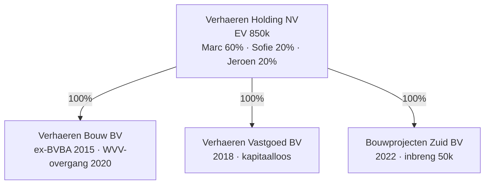

> **Leerstuk — één vraag, helemaal doorgewerkt.** Dit is het fundament-leerstuk van PO 3.0: zonder een vorm-keuze en een correcte oprichting is er geen vennootschap waarop bestuur, kapitaalbescherming, overdracht of insolventie kunnen rusten. De andere vijf leerstukken bouwen hierop voort. Voor verhaal en routekaart: [[studiemateriaal/3-0|overzicht PO 3.0]].

## Antwoord in één blik

De WVV onderscheidt **kapitaalvennootschappen** (de NV — hard minimumkapitaal) en **kapitaalloze vennootschappen** (BV en CV — geen minimum, schuldeisersbescherming via het financieel plan plus latere uitkeringstesten). Daarnaast bestaan vormen zonder rechtspersoonlijkheid (de **maatschap**) of met onbeperkte aansprakelijkheid voor de actieve vennoten (**VOF, CommV**), en de **VZW** voor niet-commerciële doelen. De vorm-keuze wordt geleid door drie scharnier-vragen — rechtspersoonlijkheid? beperkte aansprakelijkheid? vlotte overdraagbaarheid? — en in de meeste KMO-gevallen kom je uit op de BV.

Een correcte oprichting bevat vier elementen: notariële akte met statuten, een **financieel plan** dat het aanvangsvermogen verantwoordt over minstens twee jaar, plaatsing en volstorting van de inbrengen, en — bij inbreng in natura — een verslag van een bedrijfsrevisor. Wie tekortschiet, riskeert **oprichtersaansprakelijkheid** bij faillissement binnen drie jaar na oprichting.

> Het verhaal loopt in vier stappen: keuze-kader, oprichtingsprocedure met het financieel plan als kernstuk, oprichtersaansprakelijkheid, en de WVV-overgang BVBA→BV als examen-instinker.

---

## Het keuze-kader — drie scharnier-vragen

Een vennootschapsvorm kiezen is geen automatisme. Voor je naar de notaris stapt met de cliënt, leg je hem drie vragen voor — in deze volgorde. Het antwoord op elke vraag sluit een aantal vormen uit en leidt de cliënt naar de juiste keuze.

### Scharnier 1 — rechtspersoonlijkheid of niet?

Een **rechtspersoon** staat als juridische entiteit los van haar oprichters. Ze sluit zelf contracten, heeft eigen vermogen, kan zelf failliet gaan. De BV, NV, CV, VOF, CommV en VZW hebben rechtspersoonlijkheid.

De **maatschap** is anders. Ze heeft *geen* rechtspersoonlijkheid — de maten handelen samen in eigen naam. Een maatschap kan dus niet zelf een huurcontract tekenen of werknemers in dienst nemen; dat doen de maten gezamenlijk. Geschikt voor private vermogensplanning (familievermogen, gezamenlijke investering in vastgoed of effecten), niet voor een operationele activiteit met derden.

In de Verhaeren-groep zie je het verschil meteen: voor de werkmaatschappij Verhaeren Bouw — die contracteert met klanten, leveranciers en de bank — is een maatschap geen optie; daar is een rechtspersoon nodig. Voor de vastgoed-tak overwegen Marc en de kinderen wél een maatschap als constructie voor familiaal vermogensbeheer en opvolgings­planning.

### Scharnier 2 — beperkte of onbeperkte aansprakelijkheid?

Bij **BV, NV, CV en VZW** verliest de aandeelhouder of het lid hoogstens zijn inbreng. Het privévermogen blijft buiten schot, ook bij faillissement van de vennootschap. Dit is het regime van *beperkte aansprakelijkheid*.

Bij **maatschap en VOF** zijn de maten of vennoten **onbeperkt en hoofdelijk** aansprakelijk: schuldeisers van de vennootschap kunnen het privévermogen aanspreken, en dat van élke vennoot afzonderlijk voor de volle schuld. De **CommV** is een hybride — beherende vennoten onbeperkt, stille vennoten beperkt tot hun inbreng.

Voor een operationele activiteit met een normaal bedrijfsrisico — een bouwbedrijf, een handelszaak, een vrij beroep met een vennootschap — kiest men in de praktijk vrijwel altijd voor BV of NV. Het kostenverschil tussen een BV en een maatschap is klein; het risicoverschil is reusachtig.

### Scharnier 3 — vrije of beperkte overdracht van aandelen?

De **BV** is *besloten*: aandelen kunnen alleen worden overgedragen mits de statutaire of wettelijke overdrachts­beperkingen worden nageleefd. Zonder andersluidende statutenclausule geldt het wettelijk principe dat overdracht aan een derde de instemming vereist van de meerderheid van de mede-aandeelhouders. Geschikt voor een familiale werkmaatschappij waar de aandeelhouders elkaar willen kunnen blokkeren.

De **NV** is *open*: aandelen zijn vrij overdraagbaar, tenzij beperkt door statuten of door een aandeelhouders­overeenkomst. Geschikt voor grotere ondernemingen of holdings waar instappende investeerders niet telkens de mede-aandeelhouders willen vragen om toestemming.

Marc plant op termijn een verkoop van Verhaeren Bouw aan een externe groep. Toch is hij destijds niet voor de NV-vorm op de werkmaatschappij gegaan. De exit-flexibiliteit wordt in praktijk niet opgelost door op de werkmaatschappij voor NV te kiezen, maar door een **holding-structuur**: de werkmaatschappij blijft BV (besloten, kapitaalloos, eenvoudig), terwijl de holding boven de groep een NV is — open en geschikt voor latere intrede van investeerders of een share deal. Bij Verhaeren is dat precies de opzet — Verhaeren Holding NV boven drie BV-dochters.

---

## Zeven rechtsvormen op een rij — wat verschilt waar?

Hieronder de zeven vormen die de WVV erkent, langs de vier zware criteria. Lees de tabel niet als een opsom­ming maar als een diagnose-instrument: je legt een cliëntenprofiel ernaast en de juiste vorm volgt vanzelf.

| Vorm | Rechtspersoon? | Aansprakelijkheid vennoot | Minimumkapitaal | Bestuur | Overdracht aandelen | Jaarrekening publiek? |
|---|---|---|---|---|---|---|
| **BV** (Besloten Vennootschap) | Ja | Beperkt tot inbreng | Geen — vereiste van *toereikend aanvangsvermogen* + financieel plan | Eén of meer zaakvoerders | Besloten karakter — overdracht beperkt door statuten | Ja, neerlegging bij KBO |
| **NV** (Naamloze Vennootschap) | Ja | Beperkt tot inbreng | Wettelijk minimum (zie Cijferzakboekje — orde van grootte 61 500 EUR), volledig geplaatst | Enige bestuurder, collegiale raad van bestuur (≥3) of duaal bestuur | Vrij, tenzij beperkt in statuten of SHA | Ja |
| **CV** (Coöperatieve Vennootschap) | Ja | Beperkt | Geen + financieel plan | Bestuursorgaan | Vrije in- en uittreding eigen aan coöperatief opzet | Ja |
| **Maatschap** | **Nee** | **Onbeperkt + hoofdelijk** | Geen | Door de maten of aangewezen zaakvoerder | Bij overeenkomst — intuitu personae | Geen verplichte publicatie |
| **VOF** (Vennootschap onder firma) | Ja | **Onbeperkt + hoofdelijk** | Geen | Door de vennoten of zaakvoerder | Beperkt — intuitu personae | Ja |
| **CommV** (Commanditaire Vennootschap) | Ja | Beherende vennoot onbeperkt + hoofdelijk; stille vennoot beperkt tot inbreng | Geen | Door beherende vennoot — stille vennoten zonder bestuursbevoegdheid | Beperkt | Ja |
| **VZW** (Vereniging zonder winstoogmerk) | Ja | Leden niet aansprakelijk; bestuurders mogelijk bij fout | Geen | Raad van bestuur (≥3 personen, of ≥2 indien slechts 2 leden) | n.v.t. — geen aandelen | Ja |

Lees de tabel via typische cliëntenprofielen. De **BV** is de standaard-KMO-vorm (Verhaeren Bouw, Verhaeren Vastgoed). De **NV** komt in beeld voor grotere ondernemingen, holdings boven werkmaatschappijen en beurs­noteringen (Verhaeren Holding). De **CV** dient een coöperatief opzet — landbouwerscollectieven, energie­coöperaties. De **maatschap** leeft voor familiaal vermogensbeheer. **VOF** en **CommV** komen nog voor bij oudere zelfstandigen­structuren en opvolgings­constructies met stille investeerders. De **VZW** is voor niet-commerciële verenigingen.

In de Verhaeren-groep zie je het keuzewerk al verricht: holding-niveau in NV-vorm voor flexibele overdraagbaarheid bij latere exit, werkmaatschappijen in BV-vorm — kapitaalloos en eenvoudig, met een besloten karakter dat de familiale aandeelhouders­structuur beschermt.

---

## De oprichting — stappen, financieel plan, plaatsing en volstorting

De eigenlijke oprichting van een BV, NV of CV verloopt in een vaste sequentie. We werken het uit voor de BV — de referentievorm voor de cursus en in praktijk veruit de meest voorkomende — en geven daarna de eigenheden van NV en CV in een apart blok.

### BV-oprichting in vijf stappen

**Stap 1 — voorbereiding en statuten-ontwerp.** De oprichters (een of meer natuurlijke of rechtspersonen) bepalen samen de naam van de vennootschap, het maatschappelijk doel, de zetel, het aanvangsvermogen, het bestuursorgaan, de aandeelhouders en de overdrachts­beperkingen. De notaris werkt een ontwerp van statuten uit op basis van die keuzes.

**Stap 2 — financieel plan.** Vóór de oprichting overhandigen de oprichters aan de notaris een **financieel plan** waarin ze het aanvangsvermogen verantwoorden in het licht van de voorgenomen bedrijvigheid over **minstens twee jaar**. Dit stuk wordt *niet* met de akte neergelegd, maar door de notaris bewaard. Het wordt pas openbaar bij faillissement, ter ondersteuning van een eventuele oprichtersaansprakelijkheids­vordering. We werken het plan uit in de volgende sub-sectie.

**Stap 3 — plaatsing en volstorting van de inbrengen.** De aandelen worden onderschreven door de oprichters. Inbrengen kunnen in **geld** zijn (storting op een geblokkeerde bankrekening die wordt vrijgegeven na de notariële akte) of **in natura** — zaken of rechten zoals een terrein, een wagenpark, intellectuele rechten of een handelsfonds. Bij inbreng in natura is een verslag van een bedrijfsrevisor verplicht; we werken dat verder uit in een aparte sectie hieronder.

**Stap 4 — notariële akte en statuten.** De notaris stelt de oprichtingsakte op met de definitieve statuten. De oprichters tekenen ten overstaan van de notaris. Op dat moment verkrijgt de vennootschap **rechtspersoonlijkheid** — vanaf nu kan zij zelf contracten sluiten, een rekening openen op haar eigen naam en in rechte optreden.

**Stap 5 — neerlegging en KBO-registratie.** De notaris legt de akte en statuten neer bij de griffie van de ondernemings­rechtbank. Bekendmaking volgt in de Bijlagen bij het Belgisch Staatsblad. Inschrijving in de Kruispuntbank van Ondernemingen (KBO) sluit het traject af. Pas op dat moment is de vennootschap operationeel — kan ze haar btw-nummer aanvragen, sociale zekerheid registreren en aan de slag met klanten en leveranciers.

> **Terugblik Verhaeren Bouw, oprichting 2015.** Marc richtte de werkmaatschappij oorspronkelijk op als **BVBA** in 2015, met 18 550 EUR kapitaal — destijds het wettelijk minimum voor een BVBA, deels gestort bij oprichting. Vóór de WVV-overgang van 2020 was die 18 550 EUR de hoeksteen van het kapitaalsysteem. Door de overgang van rechtswege per 1 januari 2020 werd die 18 550 EUR omgevormd naar **statutair onbeschikbare inbreng**. Daarover meer in de laatste sectie.

### Het financieel plan — wat moet er in staan?

Het financieel plan is **geen formaliteit**. In de oude BVBA was het minimumkapitaal van 18 550 EUR het ankerpunt van de schuldeisersbescherming. In de huidige kapitaalloze BV is dat ankerpunt verdwenen — en het financieel plan heeft die rol overgenomen. De oprichters moeten kunnen aantonen dat het aanvangsvermogen toereikend is voor de geplande activiteit gedurende minstens twee jaar.

De wet schrijft vijf onderdelen voor die niet mogen ontbreken:

1. **Een nauwkeurige beschrijving van de voorgenomen bedrijvigheid.** Wat ga je doen, op welke markt, met welk soort cliënteel?
2. **Een overzicht van alle financierings­bronnen bij oprichting**, met opgave van eventueel verstrekte zekerheden. Eigen middelen, bankkrediet, achtergestelde leningen van aandeelhouders — alles wat de start financiert.
3. **Een openingsbalans + geprojecteerde balansen na 12 en 24 maanden**, opgesteld volgens het officiële balansschema.
4. **Een geprojecteerde resultatenrekening na 12 en 24 maanden**, eveneens volgens het officiële schema.
5. **Een beschrijving van de gebruikte hypothesen voor de prognoses.** Welke aannames zitten achter de cijfers?

Concretisering met Bouwprojecten Zuid, oprichting 2022. Het financieel plan dat Marc aan de notaris overhandigde, zag er ruwweg zo uit:

| Onderdeel | Inhoud |
|---|---|
| Voorgenomen bedrijvigheid | Kleine bouwprojecten en woningrenovatie in regio Henegouwen — middensegment |
| Financieringsbronnen | Inbreng in geld door Verhaeren Holding NV: 50 000 EUR. Geen bankfinanciering bij start |
| Openingsbalans (EUR) | Activa: rollend materieel 15 000 + kas 35 000 — Passiva: eigen vermogen 50 000 |
| Projectie jaar 1 | Omzet 150 000 · brutoresultaat +20 000 |
| Projectie jaar 2 | Omzet 220 000 · resultaat +35 000 |
| Hypothesen | 3 grote projecten per kwartaal · marge 15 % · geen herfinancierings­behoefte |

In retrospect blijkt het plan te optimistisch geweest. De werkelijke evolutie was: vier opeenvolgende verliesjaren (−10, −8, −12, −32 duizend EUR) op een inbreng van 50. Eind 2025 staat het eigen vermogen op −12 000 EUR — alarmbel-toestand. Daarover meer in [[kapitaalbescherming-uitkeringen-en-alarmbel]].

> **Wie kijkt het plan na?** De notaris bewaart het, maar toetst de inhoud *niet*. Een externe accountant of bedrijfsrevisor is niet wettelijk vereist. In de praktijk laten ondernemingen het opmaken — of toetsen — door hun externe accountant: het plan is hun bewijs van zorgvuldige oprichting bij een latere aansprakelijkheids­vordering.

### Wat verschilt voor NV en CV?

Drie eigenheden onderscheiden de NV en CV van het BV-model.

**De NV heeft wél een minimumkapitaal.** Voor de NV blijft een hard wettelijk minimum bestaan, volledig geplaatst bij oprichting (orde van grootte 61 500 EUR — exact bedrag in het Cijferzakboekje). Het minimum kan nadien worden verhoogd via klassieke kapitaal­verhogings­procedures.

**Volstorting bij NV-oprichting.** Bij de NV moet het geplaatste kapitaal bij oprichting minstens voor **één vierde** volgestort zijn per aandeel, en inbrengen in natura moeten binnen vijf jaar na oprichting volledig zijn volgestort. In de BV bestaat de volstortings­verplichting als concept, maar zonder vast minimum.

**Eigenheden van de CV.** De coöperatieve vennootschap heeft een coöperatief opzet als wettelijk doel — samenwerking ten bate van de vennoten. Vrije in- en uittreding is mogelijk volgens de statuten. Geen minimumkapitaal, wel financieel plan vereist.

Oudere voorbeeldexamens (2003-2014) verwijzen nog naar het BVBA-minimumkapitaal van 18 550 EUR. Onder WVV bestaat de BVBA niet meer, en de BV is kapitaalloos. Het oude BVBA-kapitaal werd bij de overgang van 2020 wel omgevormd naar statutair onbeschikbare inbreng — daarover de laatste sectie.

---

## Inbreng in natura bij oprichting — verslag bedrijfsrevisor verplicht

Als oprichters niet in geld maar in natura inbrengen — een terrein, een wagenpark, intellectuele rechten, een handelsfonds — moet de waardering worden geverifieerd door een onafhankelijk derde. De wet voorziet hiervoor een vast werkprogramma: **twee verslagen, samen**.

| Verslag | Wie maakt het op? | Wat staat erin? |
|---|---|---|
| Bijzonder verslag van de oprichters | De oprichters zelf | Motivatie van het belang van de inbreng voor de vennootschap · beschrijving van elk ingebracht goed · gemotiveerde waardering · vergoeding (= aantal toegewezen aandelen) |
| Verslag van een aangewezen bedrijfsrevisor | Een bedrijfsrevisor, aangewezen door de oprichters | Onderzoek van de toegepaste waarderings­methoden · verklaring of de waardering ten minste overeenkomt met de tegenprestatie · uitspraak of waardering en vergoeding *redelijk* zijn |

Beide verslagen worden samen ter beschikking gehouden van de algemene vergadering die over de inbreng beslist.

**Praktische gevolgtrekking.** Een gewone externe accountant mag dit verslag **niet** opmaken. Alleen een **bedrijfsrevisor** is wettelijk bevoegd voor de waarderings­verklaring. De accountant kan wél de cliënt begeleiden, de waardering helpen voorbereiden en als adviseur in het oprichtings­dossier optreden — maar het verslag zelf vraagt om een revisor. Dit is een vaak getest examenpunt: stagiairs verwarren systematisch de twee beroepen.

Concretisering met Verhaeren-case. Niet bij oorspronkelijke oprichting, maar later: in 2026 brengt Marc een privaat verworven terrein van 300 000 EUR in Verhaeren Bouw in als kapitaalverhoging. De wettelijke schema's voor inbreng natura bij oprichting en bij kapitaalverhoging in natura zijn identiek opgebouwd — twee verslagen, bedrijfsrevisor verplicht. Het volledige werkprogramma en de modelverslag-structuur worden uitgewerkt in [[bijzondere-mandaten-van-de-accountant]].

> **Geen quasi-inbreng in de BV.** Voor de NV kent de wet een aparte regeling: wanneer een insider (oprichter, bestuurder, controlerende aandeelhouder) binnen twee jaar na oprichting een goed verkoopt aan de vennootschap voor meer dan 10 % van het kapitaal, geldt een **quasi-inbreng**-regime — opnieuw met verplicht bedrijfsrevisoren­verslag. In de **BV** bestaat dit quasi-inbreng-mechanisme niet, omdat het verbonden was aan het kapitaalbegrip dat in de BV is afgeschaft. Voor een verkrijging door de BV van een insider gelden gewone civielrechtelijke regels (marktconforme prijs, belangenconflict-procedure indien van toepassing) — maar geen apart wettelijk verslag.

---

## Oprichtersaansprakelijkheid — drie jaar onder de financieel-plan-toets

Wanneer een BV of NV failliet gaat **binnen drie jaar na oprichting**, kan de rechtbank de oprichters **hoofdelijk aansprakelijk** stellen voor de verbintenissen van de vennootschap — als blijkt dat het aanvangsvermogen bij oprichting **kennelijk ontoereikend** was voor de normale uitoefening van de voorgenomen bedrijvigheid over minstens twee jaar. De rechter bepaalt het bedrag in functie van het tekort.

De toets is uitdrukkelijk *kennelijk* ontoereikend — niet "achteraf blijkt ontoereikend". De rechter beoordeelt of de oprichters op het ogenblik van de oprichting redelijkerwijze konden weten dat het aanvangsvermogen niet zou volstaan. Een ondernemer die te goeder trouw een realistisch plan opstelde en daarna door externe pech onderuitgaat, kan de aansprakelijkheid weerleggen.

Het **financieel plan** is hier het centrale bewijsstuk. Bij faillissement binnen drie jaar maakt de notaris het plan op verzoek van de rechter-commissaris of de procureur des Konings over aan de rechtbank. De rechter toetst de hypothesen tegen wat in de markt bekend was. Daarom is het plan geen formaliteit. Faillissement *na* drie jaar valt onder het regime van bestuurders­aansprakelijkheid — uitgewerkt in [[kapitaalbescherming-uitkeringen-en-alarmbel]].

| Aspect | Inhoud |
|---|---|
| Termijn | 3 jaar vanaf datum notariële oprichtingsakte |
| Toets | Kennelijk ontoereikend aanvangsvermogen voor de voorgenomen bedrijvigheid over minstens 2 jaar |
| Centraal bewijsstuk | Financieel plan, bewaard door de notaris |
| Wie kan vorderen? | Curator van het faillissement, namens de gezamenlijke schuldeisers |
| Wie is aansprakelijk? | Alle oprichters, hoofdelijk — bedrag verdeeld door de rechter |

Concretisering met een mock-fail-scenario. Stel dat Bouwprojecten Zuid (opgericht in 2022 met 50 000 EUR inbreng door Verhaeren Holding NV) in 2024 failliet was gegaan — *binnen* de driejaars-termijn. De curator zou het financieel plan opvragen bij de notaris en toetsen of die 50 000 EUR realistisch was voor "kleine bouwprojecten in Henegouwen". Als blijkt dat de hypothese "omzet 150 000 EUR in jaar 1" niet onderbouwd was, kan de curator Verhaeren Holding NV — als enige oprichter — aansprakelijk stellen voor het tekort. In werkelijkheid is het faillissement uitgebleven en zit de vennootschap eind 2025 in alarmbel-toestand; bij een faillissement nu zou de driejaars-termijn verstreken zijn en het regime van bestuurders­aansprakelijkheid spelen.

> **Oprichter ≠ bestuurder.** In KMO-praktijk vallen beide rollen vaak samen — één persoon is oprichter én zaakvoerder. Juridisch zijn het twee aparte aansprakelijkheids­regimes: oprichtersaansprakelijkheid kijkt naar de oprichtings­handeling (was het plan realistisch?), bestuurders­aansprakelijkheid kijkt naar latere bestuurs­beslissingen. Een externe bestuurder die later toetreedt en geen oprichter is, kan dus geen oprichtersaansprakelijkheid oplopen — wel bestuurders­aansprakelijkheid.

---

## WVV-overgangsproblematiek BVBA → BV — een examen-instinker

Het onderscheid tussen de **WVV-overgang van rechtswege** (alle BVBA's werden automatisch BV met ingang van 1 januari 2020) en een **vrijwillige omzetting via Boek 14** (een vennootschap zet zich om in een andere rechtsvorm) is een terugkerende voorbeeldexamen-instinker. Wie de twee regimes door elkaar haalt, verliest punten op de strikvraag.

### Wat gebeurde op 1 januari 2020?

Alle bestaande BVBA's werden van rechtswege omgevormd naar BV. Geen besluit van de algemene vergadering nodig. Geen notariële akte. **Geen accountantsverslag.** Geen liquiditeitstest. Het oude BVBA-kapitaal — in geval van Verhaeren Bouw 18 550 EUR — werd omgevormd tot **statutair onbeschikbare inbreng** conform CBN-advies 2019/14. Deze inbreng mag **niet** worden uitgekeerd zonder eerst de statuten te wijzigen die de onbeschikbaarheid opheffen.

In de huidige balans van Verhaeren Bouw staat onder eigen vermogen dus een rubriek "statutair onbeschikbare inbreng — 18 550 EUR". Wie die als gewoon kapitaal behandelt en uitkeert, schendt de uitkeringstest van de BV — uitgewerkt in [[kapitaalbescherming-uitkeringen-en-alarmbel]].

BVBA's die zich vóór 1 januari 2020 niet vrijwillig hadden omgevormd, moesten hun statuten ten laatste op **1 januari 2024** formeel in overeenstemming brengen met de WVV. De inhoudelijke regels golden al van rechtswege vanaf 1 januari 2020 — ook bij vennootschappen die hun statuten nog niet hadden bijgewerkt.

### Verschil met vrijwillige omzetting onder Boek 14

Een **vrijwillige omzetting** van vennootschapsvorm — bijvoorbeeld een BV die zich omzet naar maatschap — is een ander traject. Boek 14 van de WVV eist het volledige procedure-pakket: bestuursverslag, staat van activa en passiva van maximaal drie maanden oud, **accountant- of bedrijfsrevisorenverslag** over die staat, en AV-besluit bij notariële akte met versterkte meerderheid. De geplande omzetting van Verhaeren Vastgoed BV naar maatschap in 2026 volgt dit traject. De verslag-mechaniek staat in [[bijzondere-mandaten-van-de-accountant]].

| Aspect | WVV-overgang BVBA→BV (per 2020) | Vrijwillige omzetting Boek 14 |
|---|---|---|
| Rechtsgrond | WVV-overgangsbepalingen | Boek 14 WVV |
| AV-besluit? | Neen — van rechtswege | Ja — versterkte meerderheid |
| Notariële akte? | Neen | Ja |
| Bestuursverslag? | Neen | Ja |
| Staat A&P max 3 mnd oud? | Neen | Ja |
| Accountant- of revisorenverslag? | **Neen** | **Ja** — accountant óf revisor |
| Oud kapitaal? | Wordt statutair onbeschikbare inbreng (CBN 2019/14) | Verdwijnt of gaat over in de nieuwe vorm volgens omzettingsakte |

**Strikvraag-varianten.** "Is er een accountantsverslag nodig bij de BVBA→BV-overgang van 2020?" — **neen.** "Is er een liquiditeitstest nodig?" — **neen**, ook al wordt de BV bij latere uitkeringen wél aan de liquiditeitstest onderworpen. De automatische overgang creëert geen nieuw uitkerings­moment. "Is een AV-besluit nodig?" — **neen** voor de overgang zelf, **wel** voor de eventuele opheffing van de onbeschikbaarheid (statuten­wijziging).

---

## Drie valkuilen

⚠️ **De S-BVBA hanteren als een nog bestaande vorm.** Fout. Sinds de WVV (2019) bestaat geen apart starter-statuut meer. Een BV is gewoon kapitaalloos voor elke oprichter — zonder leeftijdsdrempel, zonder doorgroeitermijn. Wie in oude oefeningen of voorbeeldexamens nog "S-BVBA" tegenkomt: dat is historische context, geen actuele rechtsvorm.

⚠️ **Het financieel plan beschouwen als formaliteit.** Fout. Het plan is het *enige* bewijsstuk dat de oprichters het aanvangsvermogen zorgvuldig hebben afgewogen. Bij faillissement binnen drie jaar wordt het plan opgevraagd door de curator en door de rechter getoetst. Een dun of slordig plan is een bewijs *tegen* de oprichters, niet voor hen. Het is dus geen lijst die je voor de notaris afvinkt — het is de eerste verdediging van de cliënt tegen latere persoonlijke aansprakelijkheid.

⚠️ **De WVV-overgang BVBA→BV verwarren met een Boek 14-omzetting.** Fout. De eerste was van rechtswege per 2020 — zonder verslag, zonder accountant of revisor, zonder AV-besluit. De tweede is een vrijwillige omzetting *met* het volledige verslag-pakket (accountant of revisor) en met notariële akte. Examen-strikvragen verstoppen "is een accountantsverslag nodig?" of "is een liquiditeitstest nodig?" precies hier — het antwoord op beide bij de BVBA→BV-overgang is *neen*.

---

## Wanneer je dit snapt, ga dan naar

- [[bestuur-algemene-vergadering-en-aandeelhouders]] — Hoe de zojuist opgerichte vennootschap intern beslissingen neemt: bestuur, algemene vergadering, aandeelhouders­overeenkomsten.
- [[kapitaalbescherming-uitkeringen-en-alarmbel]] — Het kapitaalconcept verder uitgewerkt: wat mag uitgekeerd worden, wanneer luidt de alarmbel, hoe werkt de uitkeringstest in de BV.
- [[bijzondere-mandaten-van-de-accountant]] — De mechaniek van het Boek 14-omzettingsverslag en het inbreng-natura-verslag: wanneer is de accountant bevoegd, wanneer enkel de revisor, en hoe ziet het modelverslag eruit.
- [[studiemateriaal/3-0/samenvatting|Samenvatting PO 3.0]] — Voor herhaling: vergelijkingstabel rechtsvormen, financieel plan, oprichtersaansprakelijkheid en de WVV-overgang naast elkaar.

## Doorklik naar concepten

Voor wie definitorisch detail wil opzoeken:

- [[ondernemingsvormen]] · [[besloten-vennootschap]] · [[naamloze-vennootschap]] · [[cooperatieve-vennootschap]]
- [[maatschap]] · [[vennootschap-onder-firma]] · [[commanditaire-vennootschap]] · [[vereniging-zonder-winstoogmerk]]
- [[oprichting-vennootschap]] · [[financieel-plan]] · [[oprichtersaansprakelijkheid]] · [[vennootschap-groottecategorieen]]
- [[aandeel]] · [[volstortingsplicht]] · [[kapitaalverhoging-in-natura]] · [[quasi-inbreng]]

---

## Wettelijk fundament

- BV — geen minimumkapitaal, toereikend aanvangsvermogen + financieel plan: WVV art. 5:3 + art. 5:4. Het financieel plan wordt door de notaris bewaard (niet neergelegd) en wordt bij faillissement aan de rechtbank overgelegd.
- BV — inbreng in natura, bedrijfsrevisorenverslag verplicht: WVV art. 5:7. Twee verslagen: bijzonder verslag oprichters + verslag bedrijfsrevisor over waardering en redelijkheid.
- NV — minimumkapitaal, volledige plaatsing, één vierde volgestort bij oprichting: WVV art. 7:2 + art. 7:11. Exact minimumbedrag in het Cijferzakboekje (orde van grootte 61 500 EUR).
- NV — inbreng in natura, bedrijfsrevisorenverslag: WVV art. 7:7. Analoog aan BV art. 5:7.
- NV — quasi-inbreng (verkrijging tegen ≥ 10 % kapitaal door insider binnen 2 jaar na oprichting): WVV art. 7:8. Alleen in NV — niet in BV.
- Oprichtersaansprakelijkheid BV — drie jaar: WVV art. 5:15. Bij faillissement binnen drie jaar na oprichting zijn de oprichters hoofdelijk aansprakelijk voor de verbintenissen van de vennootschap als het aanvangsvermogen kennelijk ontoereikend was. Notaris maakt op verzoek van de rechter-commissaris of procureur des Konings het financieel plan over.
- Oprichtersaansprakelijkheid NV — drie jaar: WVV art. 7:17. Analoog aan BV art. 5:15.
- WVV-overgang BVBA → BV (van rechtswege per 1 januari 2020): WVV-overgangsbepalingen. Geen AV-besluit, geen accountantsverslag, geen liquiditeitstest. Oud BVBA-kapitaal en wettelijke reserve worden van rechtswege omgevormd tot statutair onbeschikbare eigen vermogensrekening. Boekhoudkundige verwerking: CBN-advies 2019/14. Uiterste statutenwijzigingsdatum: 1 januari 2024.
- Vrijwillige omzetting van rechtsvorm — Boek 14: WVV art. 14:3 e.v. (algemene procedure) + art. 14:5 (bestuursverslag + staat van activa en passiva) + art. 14:8 (verslag accountant of bedrijfsrevisor). Uitgewerkt in [[bijzondere-mandaten-van-de-accountant]].
- Groottecategorieën (kleine vennootschap, microvennootschap) — cross-PO verwijzing: WVV art. 1:24 (kleine vennootschap, drempels + tweejaars-regel + meetdatum) en art. 1:25 (microvennootschap). Bepalend voor jaarrekening-schema, audit-vereiste en aanverwante fiscale gunst­regimes. Geen kern-leerstof in PO 3.0 — zie [[studiemateriaal/1-2|overzicht PO 1.2]].

---

*Leerstuk PO 3.0. Status: voorgesteld — POC volgens ADR-037.*
