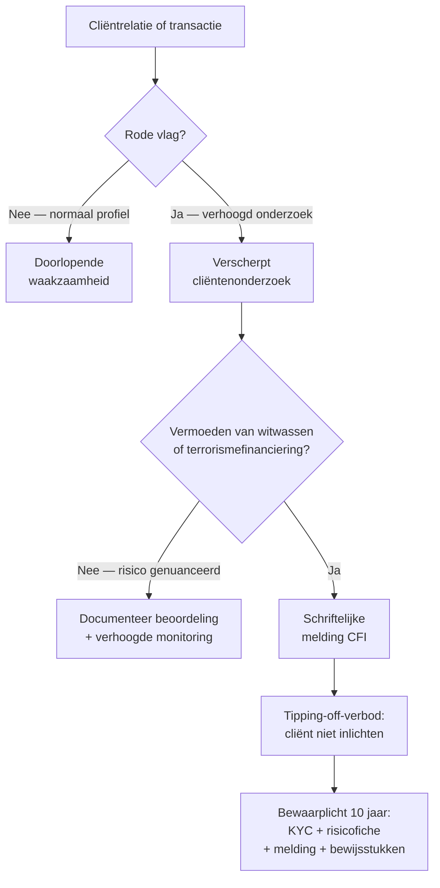

> **Leerstuk — één vraag, helemaal doorgewerkt.** Antiwitwas is geen aparte opdracht maar een doorlopende verplichting die in *elke* cliëntrelatie weeft. Dit leerstuk is in de voorbeeldexamens van de laatste jaren het meest bevraagde AML-onderwerp — cash-limiet, CFI, AMLCO, UBO en KYC komen telkens terug. Voor verhaal en routekaart: [[studiemateriaal/4-0|overzicht PO 4.0]].

## Antwoord in één blik

Antiwitwas leeft als een **doorlopende cyclus van vier fases** rond elke cliënt: je *identificeert* (cliënt + lasthebbers + uiteindelijke begunstigde), je *gradeert het risico* (laag, standaard, verhoogd), je houdt *doorlopende waakzaamheid* op de transacties, en bij vermoeden van witwassen of terrorismefinanciering doe je een *melding aan de Cel voor Financiële Informatieverwerking (CFI)* — zonder de cliënt in te lichten. Drie harde cijfers houden de hele praktijk in beweging: **uiteindelijke begunstigde = natuurlijke persoon met meer dan 25 % directe of indirecte eigendom, controle of winstrecht**; **cash-limiet 3.000 EUR per transactie**; **bewaarplicht 10 jaar** voor het volledige AML-dossier.

We werken de vier fases door op **De Smet & Partners**, een mock Gents kantoor met twee centrale cases: de *intake van Vrolijke Hap BV* (horeca, cash-zware sector, uiteindelijke begunstigde met Bulgaarse fiscaliteit) en de *cash-incident-melding bij Noordzee Vastgoed* (22.000 EUR cash boven de cap).

---

## Het AML-kader — wat rust er op jou?

De **Antiwitwaswet van 18 september 2017** zet de Europese vijfde en zesde antiwitwasrichtlijn om in Belgisch recht. De volledige titel laat de drie pijlers zien: *voorkoming van het witwassen van geld*, *financiering van terrorisme* én *beperking van het gebruik van contanten*. Die drie horen samen: de cash-cap is geen losse maatregel maar een instrument om witwasstromen vroeg te onderscheppen.

De gecertificeerd accountant en de gecertificeerd belastingadviseur zijn in die wet uitdrukkelijk aangewezen als **onderworpen entiteit** — gelijke verplichtingen als een bank. Er is geen schaal-onderscheid: ook een eenmanskantoor moet de hele cyclus doorlopen. De plichten gelden voor stagiairs (via hun stagemeester) en voor het kantoor als rechtspersoon. Werknemers zonder ITAA-titel vallen niet zelf onder de wet maar zijn verplicht mee te werken aan de kantoorprocedures.

> **Waarom net jij?** Witwasstromen passeren onvermijdelijk via professionele dienstverleners — boekhouders, advocaten, notarissen, banken. Criminele opbrengsten moeten via legitieme economische circuits worden "gewassen", en jij ziet die transacties dichter dan wie ook. De Europese richtlijnen verplichten de lidstaten daarom om die poortwachters waakzaamheids- en meldingsplichten op te leggen. De spanning met het beroepsgeheim is op wettelijk niveau opgelost: de CFI-melding is een uitdrukkelijke wettelijke uitzondering, het tipping-off-verbod is daarvan de spiegelregel — zie [[beroepsgeheim-en-aansprakelijkheid]] voor de diepere uitwerking.

Het regime rust op drie pijlers die elkaar versterken — *cliëntenonderzoek*, *doorlopende waakzaamheid* en *meldingsplicht* — bovenop een interne organisatie met AMLCO, opleiding van het personeel en het tienjarige bewaarbeleid. Bij De Smet & Partners ziet die cliëntenmix er zo uit:

| Cliënt | Sector + trigger | AML-risico | Frequentie review |
|---|---|---|---|
| Aurelia Industries NV | Industrie, 8 jaar relatie, 18 mln omzet | **Laag** | Driejaarlijks |
| Vrolijke Hap BV | Horeca, cash-zwaar, nieuwe BV 2026, UBO met Bulgaarse fiscaliteit | **Verhoogd** | Per kwartaal |
| Nordica Productions BV | Mediaproductie, 5 jaar relatie | **Laag** | Jaarlijks |
| GreenTech BVBA | Cleantech | **Laag** | Jaarlijks |
| Bouwgroep Vandersteen | Bouw, overname uit confrater | **Matig** | Halfjaarlijks (eerste jaar) |
| Noordzee Vastgoed NV | Vastgoed, 22.000 EUR cash 2025 | **Verhoogd** | Onmiddellijk verhoogd + CFI-overweging |

Pieter De Smet is **AMLCO** (Anti-Money Laundering Compliance Officer) van het kantoor. In een klein kantoor met minder dan tien beroepsbeoefenaars mag dezelfde persoon AMLCO én "verantwoordelijke op het hoogste niveau" zijn; vanaf tien beroepsbeoefenaars moet dat een onderscheiden persoon zijn. **Stagiairs mogen geen AMLCO zijn.**

---

## Fase 1 — Cliëntenonderzoek (KYC) en de uiteindelijke begunstigde

KYC — *Know Your Customer* — gebeurt **vóór** de opdracht-aanvaarding, niet erna. De volgorde is altijd dezelfde: KYC en integriteitscheck → competentie en onafhankelijkheid → opdrachtbrief → uitvoering. Wie eerst tekent en pas daarna identificeert pleegt een tuchtfeit én een strafrechtelijk feit.

Het cliëntenonderzoek bestaat uit **vijf componenten**. (a) Identificatie en verificatie van de **cliënt** op basis van een betrouwbare bron — eID, paspoort, KBO-uittreksel voor rechtspersonen. (b) Identificatie van de **lasthebbers** — volmachthouders, bestuurders, zaakvoerders die voor de cliënt handelen. (c) Identificatie van de **uiteindelijke begunstigde** — de natuurlijke persoon die ten gronde de eigendom of controle heeft. (d) Begrip van de **aard en het doel** van de zakelijke relatie. (e) **Doorlopende waakzaamheid** — dat zit in fase 3.

### De uiteindelijke begunstigde — meer dan 25 %

De **uiteindelijke begunstigde** is de natuurlijke persoon die uiteindelijk, direct of indirect, meer dan 25 % van de aandelen, stemrechten of winsten controleert. Bij een vennootschap zonder dominante aandeelhouder grijpt het *subsidiair mechanisme* in: de hoogste hiërarchische verantwoordelijke wordt als begunstigde aangewezen. Bij trusts of stichtingen zijn de oprichter, de trustees én de begunstigden samen uiteindelijke begunstigden.

Bij Vrolijke Hap BV zijn twee neven, Karim en Yusuf Y., elk voor 50 % aandeelhouder. **Beiden** zijn dus uiteindelijke begunstigde — de drempel "meer dan 25 %" is een drempel naar boven, niet een meerderheidsregel. Beiden moeten ook in het centraal Belgisch UBO-register staan.

### Het UBO-register

Het centraal **UBO-register** wordt beheerd door de FOD Financiën. Elke Belgische vennootschap, vereniging en stichting registreert haar uiteindelijke begunstigden zelf — de cliënt blijft eindverantwoordelijke voor de juistheid en de updates. Jouw rol als accountant is actief: bij intake raadpleeg je het register en cross-checkt het met je eigen onderzoek; bij wijziging herinner je de cliënt aan zijn update-plicht; en bij een *discrepantie* tussen het register en wat je zelf vaststelt, heb je een meldingsplicht aan de toezichthouder.

### Vrolijke Hap — de intake doorgewerkt

| Component KYC | Toepassing op Vrolijke Hap | Bewijsstuk in dossier |
|---|---|---|
| **Cliënt-identificatie** | KBO-uittreksel + statuten Vrolijke Hap BV | Kopie KBO + statuten |
| **Lasthebbers** | Karim en Yusuf als zaakvoerders + eID | eID-kopie + benoemingsbesluit |
| **Uiteindelijke begunstigde** | Beide neven 50/50 → beiden begunstigde; UBO-register raadplegen | UBO-uittreksel + interne fiche |
| **Aard zakelijke relatie** | Boekhouding + btw + vennootschapsbelasting in horeca-sector | AML-fiche met sectoranalyse |
| **Bron-middelen-onderzoek** *(verhoogd)* | Eerste cash-inleg uit persoonlijke spaargelden, gestaafd door bankafschrift | Schriftelijke verklaring + bankbewijs |

Yusuf heeft een tweede woning én fiscale verblijfplaats in Bulgarije. Dat is geen rode vlag op zich, maar het tilt het dossier naar verscherpt onderzoek — herkomst van de eerste investering, bestuurssamenstelling, plausibiliteit van de cash-omzet. Ongeveer 30 % van de omzet in horeca is contant: dat is sectoreigen en op zich niet abnormaal, maar het wordt wel een knipperlicht in de doorlopende waakzaamheid.

> **Als KYC niet kan voltooid worden, moet je weigeren of beëindigen.** Geen identificatie van cliënt of begunstigde mogelijk? Informatie ongeloofwaardig? Geen plausibele risicoanalyse? Dan moet je (a) de zakenrelatie *weigeren* of *beëindigen*, én (b) onderzoeken of een CFI-melding nodig is. "Tekenen met voorbehoud" bestaat niet — onmogelijke KYC betekent geen opdracht.

---

## Fase 2 — Risicogradering

De diepgang van je onderzoek is **evenredig** met het ingeschatte witwasrisico. Eén regel voor iedereen zou laag-risico-cliënten overbelasten én hoog-risico-cliënten te licht behandelen. De wet voorziet daarom drie regimes.

| Regime | Voor wie? | Wat anders dan standaard? | Bij De Smet |
|---|---|---|---|
| **Vereenvoudigd** | Beursgenoteerde EU-vennootschap · overheid · EU-financiële instelling onder toezicht | Lichter verificatiewerk | *Geen typische De Smet-cliënt* |
| **Standaard** | Overgrote deel van de cliënten | Volledige vijf-componenten-KYC + jaarlijkse review | Aurelia · Nordica · GreenTech |
| **Verscherpt** | Politiek prominente persoon · hoog-risico-land · onmogelijke voorafgaande verificatie · sector- of structuurrisico | Goedkeuring senior-niveau, herkomst-fondsen, kwartaalreview, extra documentatie | Vrolijke Hap · Noordzee na cash-incident |

Een **politiek prominente persoon** is iemand die een belangrijk openbaar mandaat uitoefent of recent uitoefende. De wet rekt die status uit tot **vijf jaar** na het einde van het mandaat, en strekt zich ook uit tot directe familie en bekende naasten. Andere triggers voor het verscherpte regime: cliënten in landen die de Europese Commissie aanwijst als hoog-risico, cliënten waarvan de identiteit niet voorafgaand geverifieerd kon worden, cash-zware sectoren, complexe vennootschapsstructuren en ongebruikelijke transacties.

Bij **verscherpt regime** doe je vier dingen extra. Eén: goedkeuring op senior-niveau (de kantoor-vennoot beslist mee, niet alleen de behandelende medewerker). Twee: bijkomend onderzoek naar de *herkomst van de fondsen* — niet alleen "wie?" maar "waarvandaan komt het geld?". Drie: doorlopende waakzaamheid met verhoogde frequentie, bijvoorbeeld per kwartaal in plaats van jaarlijks. Vier: alles documenteren — risicofiche, beslissingsproces, monitoring-frequentie.

Vrolijke Hap zit in het verscherpt regime om **drie redenen**: cash-zware sector, nieuwe BV zonder relatie-history, en een begunstigde met fiscale verblijfplaats in Bulgarije. Gevolg: Pieter (senior-vennoot) beslist mee over aanvaarding, het herkomst-onderzoek wordt expliciet gevoerd en de review-frequentie is per kwartaal.

> **Risicogradering is een levend proces, geen eenmalige beslissing.** Bij elke significante wijziging — nieuwe bestuurder, sectorwijziging, ongebruikelijke transactie, expansie naar een nieuw land — moet je de classificatie opnieuw bekijken. Een cliënt die start als laag risico kan na vijf jaar verhoogd risico worden. Bij kwaliteitstoetsing wordt naar die *dynamische actualisatie* gekeken, niet alleen naar de initiële fiche. Zie [[kwaliteitstoezicht-en-tucht]].

---

## Fase 3+4 — Doorlopende waakzaamheid en CFI-melding

KYC bij intake is de **deur**; doorlopende waakzaamheid is het **alarm**. Je monitort transacties op consistentie met het cliëntprofiel; bij rode vlaggen doe je verhoogd onderzoek; bij echt vermoeden meld je aan de CFI.

### Knipperlichten — de niet-limitatieve lijst

De ITAA-Handleiding interne procedures somt de klassieke knipperlichten op. Geen examenronde gaat eraan voorbij:

| Knipperlicht | Concreet teken | Volgende stap |
|---|---|---|
| Cash boven de cap van 3.000 EUR | Noordzee 22.000 EUR cash van koper | Interne melding AMLCO → onderzoek → CFI |
| Inbreng in contanten bij oprichting of kapitaalverhoging | 750.000 EUR cash-storting in nieuwe BV | Verscherpt onderzoek + CFI-overweging |
| Doorsluisrekeningen | Geld komt en gaat in dagen | Verhoogde transactie-monitoring |
| Cliënt leeft boven zijn stand | Aangegeven inkomen mismatch lifestyle | Bron-middelen-onderzoek |
| Offshorevennootschappen voor consultancy | Belgische cliënt betaalt aan Maltese consultancy-shell | Substantie-test + begunstigden van die shell |
| Geen werknemers in een sector waar dat onnormaal is | Bouw-BV zonder bouwarbeiders | Vermoeden cash-loon + onderzoek |
| Inbreng in natura overgewaardeerd | Apport van een immaterieel actief tegen onverklaarbare prijs | Waardering nazien + verhoogd onderzoek |
| Jaarrekening niet of laattijdig neergelegd | Patroon van laattijdigheid | Vraag naar verklaring + documenteer |

De lijst is *niet-limitatief* — je moet kunnen herkennen, niet uit het hoofd citeren. Examenvragen testen of je een gegeven situatie aan een patroon kan koppelen.

### De interne procedure bij een knipperlicht

Eens er een rood signaal opduikt, doorloop je vier interne stappen. **Eén:** de medewerker die het knipperlicht ziet doet een schriftelijke *interne melding* aan de AMLCO, via het kantoor-standaardformulier "Interne melding atypische verrichting". **Twee:** de AMLCO voert aanvullend onderzoek — financiële stukken nakijken, herkomst van de fondsen onderzoeken, eventueel nogmaals met de cliënt praten (zonder tipping-off als melding al overwogen wordt). **Drie:** geen verband met witwassen? Dan schrijft de AMLCO een intern verslag — tien jaar bewaren. **Vier:** wél vermoeden? Dan maakt de AMLCO een intern verslag met de onderzoeksresultaten én een CFI-melding.

### De CFI-melding — wettelijke uitzondering op het beroepsgeheim

Wanneer je feiten of verrichtingen identificeert waarvan je weet of vermoedt dat ze verband houden met witwassen of terrorismefinanciering, ben je *wettelijk verplicht* dit te melden aan de **Cel voor Financiële Informatieverwerking (CFI)**. In de praktijk verstuurt de AMLCO van het kantoor de melding via het beveiligd elektronisch loket. De wet biedt de melder die te goeder trouw handelt **immuniteit** — geen burgerrechtelijke, strafrechtelijke of tuchtrechtelijke aansprakelijkheid.

De CFI-melding is een **uitdrukkelijke wettelijke uitzondering op het beroepsgeheim**. Buiten die uitzondering ben je nog steeds gehouden aan strikte vertrouwelijkheid — zie [[beroepsgeheim-en-aansprakelijkheid]] voor wat dat in de praktijk betekent.

### Het tipping-off-verbod

Daartegenover staat het **tipping-off-verbod**: het is strafrechtelijk verboden om aan de cliënt of aan derden mee te delen dat een melding gedaan is, dat een onderzoek loopt, of dat een melding overwogen wordt. Dat geldt ook intern — medewerkers die door omstandigheden van de melding weten houden het onder zich, ook tegenover collega's. Doel: voorkomen dat de cliënt bewijsmateriaal vernietigt of vlucht.

Wat **wel** mag: een cliënt proberen te *ontraden* van een illegale verrichting (zonder verwijzing naar een CFI-melding), kennisgeving aan het ITAA als toezichthouder, kennisgeving aan parket of politie in een repressief kader, en intern overleg tussen collega's die aan dezelfde opdracht meewerken. Dat subtiele onderscheid keert in elke examenronde terug — zie de valkuilen verderop.

### Noordzee Vastgoed — de melding doorgewerkt

In maart 2026 ontdekt De Smet & Partners bij de jaarafsluiting dat Noordzee Vastgoed in 2025 22.000 EUR contant ontvangen heeft van een koper voor een aanbetaling — flagrant boven de cap.

1. **Stagiair Lina** merkt het op en doet een interne melding aan AMLCO Pieter.
2. **Pieter onderzoekt**: oorsprong van de betaling ("koper had cash uit verkoop andere zaak"), plausibiliteit, eerdere transacties van Noordzee. De combinatie van cash-overschrijding, onvoldoende documentatie en vastgoedtransactie versterkt het vermoeden.
3. **Pieter doet de CFI-melding** via het beveiligd loket — als AMLCO is hij de meldende persoon namens het kantoor.
4. **Strikt tipping-off**: niemand in De Smet & Partners — vennoten, medewerkers, stagiair Lina — mag aan Noordzee laten weten dat een melding gedaan is. Alle bewijsstukken worden tien jaar bewaard in beveiligde digitale opslag.

---

## Cash-cap 3.000 EUR + tien-jaar bewaarplicht

Twee cijfers die je *paraat* moet hebben.

### De cash-cap

Tussen ondernemingen onderling en tussen ondernemingen en consumenten geldt een **maximum van 3.000 EUR per transactie** in contanten. Tot 3.000 EUR cash mag; daarboven niet. Voor handelaars in kunst, edele metalen of oude metalen geldt een strenger regime — sectoren met klassiek witwasrisico. Sommige financiële instellingen vallen buiten de cap.

Voor jou als accountant geldt de cap **dubbel**. Aan de kantoor-kant: honoraria boven 3.000 EUR mogen niet contant ontvangen worden, ook niet via gespreide betaling als de totale opdracht boven de drempel uitkomt. Aan de cliënt-kant: cash-stromen die de drempel naderen of *splitsen* zijn een knipperlicht dat samen met andere indicatoren cumuleert.

**Opsplitsen is omzeilen.** Eén economische verrichting opdelen in meerdere deelbetalingen om onder de cap te blijven, is sanctioneerbaar. Concreet voorbeeld: 5.000 EUR splitsen in twee betalingen van 2.500 EUR over twee dagen voor één en dezelfde aankoop = strafbaar. De sanctie loopt tot een **geldboete van 250 tot 225.000 EUR**, met daarbovenop een plafond van **maximaal 10 % van het bedrag boven de cap**.

De drempel werkt **per transactie**, niet per maand of jaar. Een cliënt mag in principe vijftig keer per jaar 2.500 EUR cash ontvangen voor afzonderlijke transacties — elk binnen de cap. Maar één transactie van 22.000 EUR cash zoals bij Noordzee is een klare overtreding. Bij jaarafsluiting toets je dus cash-stromen tegen de cap per *individuele* transactie, niet op het totaal.

| Situatie | Cash toegestaan? | Behandeling bij detectie |
|---|---|---|
| Cliënt betaalt 2.500 EUR cash honorarium | Ja (onder de cap) | Standaardbon + boekhouding |
| Cliënt biedt 3.500 EUR cash honorarium | Nee (boven de cap) | Weigeren cash + overschrijving vragen |
| Cliënt splitst 5.000 EUR in 2 × 2.500 EUR | Nee — opsplitsen = omzeiling | Weigeren + interne melding AMLCO |
| Koper betaalt 22.000 EUR cash aanbetaling aan cliënt | Nee (Noordzee-case) | Knipperlicht → AMLCO → CFI-overweging |
| Notariële vastgoedakte | Volledig bancair | Notaris waakt + bankcontrole |

### De tien-jaar bewaarplicht

Alle stukken die de AML-cyclus produceert — KYC-fiches, risicogradering, interne meldingen, AMLCO-onderzoeksverslagen en CFI-meldingen — worden **tien jaar** bewaard, vanaf het einde van de verrichting of van de zakelijke relatie. Geldt voor positieve én negatieve bevindingen. Tegenover de cliënt mag retentierecht uitgeoefend worden (bij niet-betaling van erelonen, zie [[opdrachtaanvaarding-en-clientenrelatie]]), maar tegenover de toezichthouders (ITAA, CFI, FOD Financiën) **nooit** — bij inspectie moet alles beschikbaar zijn.

Voor Noordzee: na de CFI-melding loopt de bewaartermijn van het volledige dossier — KYC, verhoogde risicogradering, interne melding, AMLCO-onderzoek, CFI-melding-bevestiging, follow-up — tot 2036.

---

## Sancties — drie sporen tegelijk

Niet-naleving van het AML-regime kan op **drie sporen tegelijk** sanctie opleveren. Administratief: de toezichthouder (voor accountants is dat het ITAA) kan administratieve geldboetes opleggen, met een maximumbedrag dat oploopt tot meer dan een miljoen euro voor zware natuurlijke-personen-overtredingen — en nog hoger voor rechtspersonen. Strafrechtelijk: voor inbreuken op de cash-cap of voor opzettelijke belemmering van het toezicht geldt het geldboete-regime van 250 tot 225.000 EUR, eventueel met de 10 %-bovenkant. Tuchtrechtelijk: de tuchtcommissie van het ITAA kan zelfstandig optreden, met sancties van berisping tot schrapping.

De drie sporen zijn **cumulatief, niet alternatief**. Een ernstige AML-overtreding kan dus tegelijk administratief, strafrechtelijk én tuchtrechtelijk gesanctioneerd worden — een combinatie die in tuchtrechtspraak regelmatig opduikt.

---

## Drie valkuilen

⚠️ **"AML is paperwork voor banken, niet voor een accountantskantoor."** Fout. Je bent uitdrukkelijk onderworpen entiteit — gelijke verplichtingen als een bank. Geen schaal-onderscheid: ook een eenmanskantoor moet KYC, risicoclassificatie, AMLCO, meldingsplicht en tienjarige bewaring volledig naleven. De sanctie-cascade gaat tot ver in de zes cijfers per inbreuk.

⚠️ **De cliënt informeren uit "fair play" vóór of na een CFI-melding.** Strafrechtelijk verboden door het tipping-off-verbod. Wat *wel* mag: de cliënt proberen te ontraden van een illegale verrichting — zonder verwijzing naar een melding. Dat subtiele onderscheid tussen "ontraden" en "tippen" keert in examenvragen onophoudelijk terug. Vuistregel: als de cliënt na je opmerking *zou kunnen vermoeden* dat je een melding overweegt, ben je over de lijn.

⚠️ **De uiteindelijke begunstigde gelijkstellen aan de bestuurder of zaakvoerder.** Fout. De begunstigde is de natuurlijke persoon die *uiteindelijk* de eigendom of controle heeft — meer dan 25 % van aandelen, stemrechten of winsten. Bij Vrolijke Hap: twee neven elk 50 % = **beiden** begunstigde. Bij een vennootschap zonder dominante aandeelhouder grijpt het subsidiair mechanisme in. Bij trusts: oprichter, trustees en begunstigden zijn samen begunstigde. Zaakvoerderschap is een aparte vraag.

---

## Wanneer je dit snapt, ga dan naar

- [[kwaliteitstoezicht-en-tucht]] — Hoe wordt jouw AML-naleving getoetst? ITAA is voor accountants ook AML-toezichthouder; de kwaliteitstoetsing kijkt expliciet naar het AML-procedurehandboek, de opdrachtbrieven-templates en de risicofiches.
- [[beroepsgeheim-en-aansprakelijkheid]] — De diepere uitwerking van de spanning tussen beroepsgeheim en CFI-melding — wettelijke uitzondering, tipping-off als spiegel, en de juridisch-advies-uitzondering op de meldingsplicht.
- [[opdrachtaanvaarding-en-clientenrelatie]] — Hoe KYC in de opdracht-aanvaarding past — het is *stap 1* van het vier-stappen-proces dat aan de opdrachtbrief voorafgaat.
- [[studiemateriaal/4-0/samenvatting|Samenvatting PO 4.0]] — voor herhaling vlak vóór het examen.

## Doorklik naar concepten

Voor wie definitorisch detail wil opzoeken:

- [[antiwitwaspreventie]] · [[beroepsgeheim]]
- [[opdrachtaanvaarding-en-opdrachtbrief]] · [[gecertificeerd-accountant]]

---

## Wettelijk fundament

- **Antiwitwaswet — algemene basis**: Wet 18 september 2017 tot voorkoming van het witwassen van geld en de financiering van terrorisme en tot beperking van het gebruik van contanten. Zet de Europese vijfde en zesde antiwitwasrichtlijn om en vervangt de oude AML-wet van 11 januari 1993.
- **Onderworpen entiteiten — gecertificeerd accountant en gecertificeerd belastingadviseur**: Antiwitwaswet, hoofdstuk "Toepassingsgebied" (art. 5). Geldt ook voor stagiairs via de stagemeester en voor het kantoor als rechtspersoon; werknemers via de interne kantoorprocedures.
- **Cliëntenonderzoek — verplichte componenten**: Antiwitwaswet, hoofdstuk "Waakzaamheidsverplichtingen ten aanzien van de cliënten" — identificatie cliënt, lasthebbers, uiteindelijke begunstigde, aard van de zakelijke relatie en doorlopende waakzaamheid.
- **Uiteindelijke begunstigde — definitie + drempel meer dan 25 %**: Antiwitwaswet, hoofdstuk "Definities". Natuurlijke persoon met meer dan 25 % directe of indirecte eigendom, controle of winstrecht; subsidiair mechanisme bij versplinterd aandeelhouderschap.
- **UBO-register**: Wet 26 juni 2020 tot wijziging van diverse wetsbepalingen ter omzetting van de Europese vijfde antiwitwasrichtlijn — centraal Belgisch register beheerd door de FOD Financiën. Cliënt is verantwoordelijk voor registratie en update; accountant raadpleegt en signaleert discrepanties.
- **Risicogebaseerde benadering — drie regimes**: Antiwitwaswet, hoofdstuk "Risicogerichte benadering" — vereenvoudigd, standaard en verscherpt cliëntenonderzoek.
- **Cash-cap 3.000 EUR per transactie**: Antiwitwaswet, art. 67 (titel "Beperking van het gebruik van contanten"). Sanctie via art. 137: geldboete 250 tot 225.000 EUR, met plafond van maximaal 10 % van het bedrag boven de cap.
- **CFI-meldingsplicht — wettelijke uitzondering op het beroepsgeheim**: Antiwitwaswet, hoofdstuk "Analyse van atypische verrichtingen en melding van vermoedens". Bij vermoeden van witwassen of terrorismefinanciering. Immuniteit voor de melder die te goeder trouw handelt.
- **Tipping-off-verbod**: Antiwitwaswet, art. 55. Geen mededeling aan cliënt of derden dat melding gedaan is of onderzoek loopt.
- **Uitzonderingen op het tipping-off-verbod**: Antiwitwaswet, art. 56 §3 — ontraden van de cliënt, kennisgeving aan ITAA, parket of politie repressief, en collega's binnen dezelfde entiteit of verrichting.
- **Juridisch-advies-uitzondering op de meldingsplicht**: Antiwitwaswet, hoofdstuk "Uitzonderingen op de meldingsplicht" — bij het bepalen van de rechtspositie of bij verdediging in een rechtsgeding. Vervalt zodra de accountant zelf aan de witwasconstructie deelneemt.
- **AMLCO — aanstelling en profielvereisten**: Antiwitwaswet, hoofdstuk "Algemene voorschriften inzake interne organisatie". Onderscheiden persoon vanaf tien beroepsbeoefenaars; stagiairs uitgesloten.
- **UBO-discrepantie-melding**: Antiwitwaswet — bij discrepantie tussen het UBO-register en het eigen cliëntenonderzoek, meldingsplicht aan de toezichthouder.
- **Administratieve sancties**: Antiwitwaswet, art. 132. Door de toezichthouder (voor accountants het ITAA) opgelegd; cumulatief mogelijk met strafrechtelijke en tuchtrechtelijke sancties.
- **Knipperlichten-lijst (niet-limitatief)**: ITAA-Handleiding interne procedures AWW 2019, art. 19 — pedagogische lijst die de beroepsbeoefenaar moet kunnen herkennen.
- **Tien-jaar bewaarplicht AML-dossier**: ITAA-Handleiding interne procedures AWW 2019, punt 12.4.2.2-3 — vanaf einde verrichting of einde zakelijke relatie.

---

*Leerstuk PO 4.0. Status: voorgesteld — POC volgens ADR-037, gerenderd uit script + De Smet-voorbeeldgroep.*
