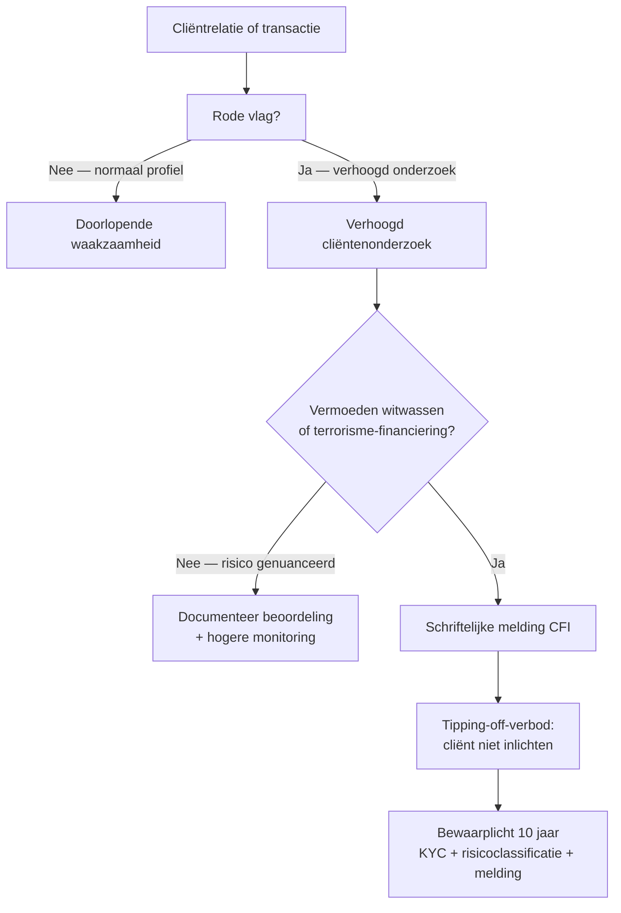

> **Leerstuk — één vraag, helemaal doorgewerkt.** Dit leerstuk koppelt twee onderwerpen die in de praktijk constant samenlopen: wat *mag* je zeggen (beroepsgeheim) en welk *schaderisico* loop je bij een fout (drie sporen aansprakelijkheid). Voor verhaal en routekaart: [[studiemateriaal/4-0|overzicht PO 4.0]]. Voor definitorisch opzoekwerk: zie de wikilinks doorheen de tekst.

## Antwoord in één blik

Het beroepsgeheim is voor de gecertificeerd accountant een **strafrechtelijk beschermde** geheimhoudingsplicht. Het wijkt niet voor cliëntbelang, commerciële druk of een rechtstreekse vraag van de fiscus — alleen voor uitdrukkelijk in de wet voorziene uitzonderingen (getuigenis in rechte, CFI-melding bij witwasvermoeden, en uitdrukkelijke instemming van de cliënt). Maak je toch een fout, dan loop je drie risico's tegelijk: **burgerrechtelijk** (schadevergoeding), **strafrechtelijk** (boete + gevangenis), en **tuchtrechtelijk** (sanctie van het ITAA, tot schrapping uit het register). Die drie sporen lopen onafhankelijk en cumulatief — één feit kan op alle drie tegelijk uitkomen. De verplichte BA-verzekering dekt enkel het burgerrechtelijke spoor; strafrechtelijke boetes en tuchtsancties zijn niet verzekerbaar.

| Spoor | Grondslag | Door wie ingesteld | Sanctie |
|---|---|---|---|
| **Burgerrechtelijk** | Wet-ITAA + opdrachtbrief (contractueel) of art. 1382 BW / Boek 5 BW (buitencontractueel) | Cliënt of derde (bv. een bank) | Schadevergoeding |
| **Strafrechtelijk** | Strafwetboek (o.a. art. 458 SW beroepsgeheim, art. 196 SW valsheid) | Parket | Geldboete + gevangenisstraf |
| **Tuchtrechtelijk** | Wet-ITAA — handhavingsbepalingen | Tuchtcommissie ITAA (klacht, vaststelling, ambtshalve) | Waarschuwing · berisping · schorsing · schrapping |

We werken het beroepsgeheim eerst uit op de Noordzee-Vastgoed bankvraag, daarna de drie sporen op een hypothetische jaarrekening-fout. Beide kruisen elkaar bij de CFI-melding — een wettelijke uitzondering waar het tipping-off-verbod op zijn beurt weer aan vasthangt.

## Het beroepsgeheim — wettelijke basis en absoluut karakter

Het beroepsgeheim is geen branchecode of zachte gedragsregel. Het is een **strafrechtelijk gesanctioneerde plicht**: de algemene strafbepaling die geldt voor alle vrije beroepen waaraan de wetgever geheimhouding heeft toevertrouwd — artsen, advocaten, notarissen, geestelijken — is door de wetgever sinds 2019 uitdrukkelijk van toepassing verklaard op de gecertificeerd accountant en de gecertificeerd belastingadviseur. De plicht reikt bovendien verder dan de persoon zelf: hij geldt ook voor stagiairs, medewerkers van het kantoor, ITAA-organen, toetsers en de rechtskundig assessor — kortom voor alle "personen voor wie de beroepsbeoefenaar instaat".

De sanctie bij schending is een **gevangenisstraf van één tot drie jaar plus een geldboete** (basis-tarief in het Strafwetboek, in de praktijk verhoogd met de wettelijke opdeciemen). Daarbovenop komt automatisch een tuchtprocedure bij het ITAA en kan de cliënt of een geschade derde een schadevergoeding eisen — de drie sporen die verderop centraal staan.

### Wat valt onder het geheim?

De wet hanteert geen lijst van beschermde documenten. In plaats daarvan beantwoord je drie tests achter elkaar:

1. Is de informatie **een geheim** — dus niet van nature uit publiek beschikbaar?
2. Is de informatie aan jou **toevertrouwd** — uitdrukkelijk of stilzwijgend, in de loop van de opdracht?
3. Gebeurde dat in het **kader van de beroepsuitoefening**?

Drie nuances die in examenvragen telkens terugkeren. De informatie hoeft niet van de cliënt zelf te komen — ook wat je *over* je cliënt verneemt via derden, valt onder het geheim. De plicht geldt na het einde van de opdracht en zelfs na het overlijden van de cliënt. En ze geldt tegen *derden* — niet tegen ITAA-collega's binnen hetzelfde kantoor of dezelfde verrichting (zij dragen dezelfde plicht en delen het geheim met je).

### Wel of niet onder het geheim?

Bij het onderscheid tussen stukken die wél en stukken die niet onder het strafrechtelijk gesanctioneerde geheim vallen, helpt onderstaande tabel. Belangrijk: stukken die buiten het strafrechtelijke geheim vallen, blijven contractueel en deontologisch beschermd — je gaat ze niet zomaar aan een derde geven, maar de strafrechtelijke sanctie speelt er niet.

| Document | Onder strafrechtelijk geheim? | Concrete behandeling |
|---|---|---|
| **Interne nota's** van de accountant (threats-analyse, draft-advies) | Ja | Niet aan derde zonder cliënt-instemming |
| **Cliënt-communicatie** over vertrouwelijke onderwerpen | Ja | Idem |
| **Opdrachtbrief** | Ja | Identificeert cliënt + scope — beschermd |
| **Timesheets** | Ja | Bevatten cliënt-identificatie — beschermd |
| **AML-fiche / CFI-melding** | Ja, plus tipping-off-verbod (zie verderop) | Strikt vertrouwelijk, ook intern |
| **Dagboeken en rekeningen cliënt** | Neen (cliënt-eigendom) | Contractueel + deontologisch beschermd → verwijs naar cliënt |
| **Ingediende belastingaangifte** | Neen | Cliënt-eigendom → verwijs naar cliënt |
| **Jaarrekening neergelegd bij NBB** | Neen (publiek) | Mag bezorgd worden zonder issue |
| **Contractenoverzicht door accountant samengesteld** (niet publiek) | Ja | Alleen op uitdrukkelijke cliënt-toelating |

### De bankvraag op Noordzee Vastgoed

Maart 2026. Een bank schrijft aan De Smet & Partners en vraagt twee documenten over cliënt Noordzee Vastgoed NV: de jaarrekening 2024 en een door de accountant *ondertekend* overzicht van de lopende contracten. De bank verwijst naar "de bestaande relatie" en argumenteert dat het in het belang van de cliënt is om snel duidelijkheid te scheppen.

Hoe behandel je dit verzoek? Drie stappen:

1. **Jaarrekening 2024** is neergelegd bij de Nationale Bank en dus publiek beschikbaar. De bank kan ze daar zelf opvragen. Je mag ze bezorgen zonder issue — geen geheim, geen toelating nodig.
2. **Contractenoverzicht** is niet-publiek en bovendien door jouw kantoor samengesteld. Dat valt voluit onder het beroepsgeheim. Je bezorgt het alleen op **uitdrukkelijke schriftelijke toelating** van Noordzee zelf — niet op de loutere mededeling van de bank dat de cliënt akkoord zou zijn.
3. **De ondertekening** door de accountant zou bovendien zekerheid suggereren waar er geen is. Een gewoon contractenoverzicht is geen attestatie. Wie het ondertekent in een vorm die zekerheid lijkt te geven, creëert een verwachtingsgap — dat is in zichzelf een aansprakelijkheidsrisico.

**Gedragslijn**: schrijf de bank terug met de bevestiging dat het kantoor gebonden is door het beroepsgeheim, verwijs voor de niet-publieke stukken door naar de cliënt zelf, en informeer Noordzee dat de bank de vraag stelde. Dat laatste mag — er is geen CFI-melding actief, dus geen tipping-off-verbod.

> **Cliëntbelang is geen vrijbrief.** Stagiairs redeneren soms dat "een goede relatie met de bank van de cliënt" gediend is met meegaandheid. Dat klopt economisch, maar deontologisch is het irrelevant. Het beroepsgeheim wijkt niet voor commercieel comfort. De enige route is via de cliënt zelf — die kan vrijwillig de stukken bezorgen of jou daartoe machtigen.

## Wettelijke uitzonderingen — getuigenis, cliëntinstemming, en de CFI-melding

Het beroepsgeheim is in beginsel absoluut, maar de wet voorziet enkele beperkte uitzonderingen. De drie die je voor het examen paraat hebt:

- **Getuigenis in rechte** of voor een parlementaire onderzoekscommissie. Dit is een *spreekrecht*, geen plicht: je *mag* getuigen, je *moet* het niet. De rechter beslist of je in dat specifieke geval moet antwoorden.
- **Uitdrukkelijke instemming van de cliënt zelf** (mondeling of schriftelijk, met aanrader om altijd schriftelijk vast te leggen).
- **Wettelijke meldingsplicht aan de Cel voor Financiële Informatieverwerking (CFI)** bij vermoeden van witwassen of terrorisme-financiering — uitgewerkt hieronder.

### CFI-melding als wettelijke uitzondering

De spanning lijkt op het eerste gezicht groot: het beroepsgeheim verbiedt openbaarmaking, maar de antiwitwaswet *legt* meldingsplicht op. Hoe valt dat te rijmen? De wetgever heeft het opgelost door de CFI-melding expliciet als **wettelijke uitzondering** op het beroepsgeheim te benoemen. Een melding maken is *geen* schending van het geheim — *niet* melden bij een gegrond vermoeden is daarentegen *wel* een overtreding (van de antiwitwaswet).

De melder geniet bovendien **immuniteit**: geen burgerrechtelijke, strafrechtelijke of tuchtrechtelijke aansprakelijkheid wanneer hij te goeder trouw meldt — ook al blijkt achteraf dat het vermoeden ongegrond was.

### Tipping-off — de spiegelregel

Zodra je gemeld hebt (of zodra een opsporingsonderzoek loopt), volgt het **tipping-off-verbod**: je mag dit feit niet ter kennis brengen van de cliënt of van derden. Ook medewerkers die door omstandigheden weten van de melding moeten het onder zich houden. Doel: voorkomen dat de cliënt bewijsmateriaal vernietigt of vlucht. Schending kan aanleiding geven tot zware administratieve sancties, oplopend tot meer dan een miljoen euro.

Vier scenarios waarin communicatie wel toegelaten is, omdat ze precies *geen* tipping-off zijn:

- Een poging om de cliënt te **ontraden** van een illegale activiteit, zonder verwijzing naar enige CFI-melding;
- Kennisgeving aan het **ITAA** als toezichthouder;
- Kennisgeving aan **parket, politie of onderzoeksrechter** voor repressieve doeleinden;
- Mededeling aan **andere beroepsbeoefenaars** binnen hetzelfde kantoor of in dezelfde verrichting.

### Juridisch-advies-uitzondering

Eén categorie ontsnapt aan de meldingsplicht zelf: wanneer je juridisch advies verstrekt "bij het bepalen van de rechtspositie" van de cliënt, of bij verdediging of vertegenwoordiging in een rechtsgeding. In dat geval blijft het beroepsgeheim onverkort gelden en moet (en mág) je niet melden. De uitzondering valt weg zodra je zélf deelneemt aan witwasactiviteiten, advies geeft *voor* witwasdoeleinden, of weet dat de cliënt het advies zoekt om witwasdoeleinden te dienen.

### De CFI-melding op Noordzee Vastgoed

Q1 2026. Bij doorlopende waakzaamheid ontdek je dat Noordzee Vastgoed in 2025 22 000 euro contant heeft ontvangen van een koper als aanbetaling — boven de wettelijke cash-cap (zie voor het concrete drempelbedrag het Cijferzakboekje). Een knipperlicht. AMLCO Pieter De Smet start een verhoogd onderzoek. Bron van de middelen onduidelijk, plausibiliteit van het bedrag in deze sector niet overtuigend. Vermoeden van witwassen → schriftelijke melding aan de CFI.

Vanaf dat moment geldt het tipping-off-verbod: noch Pieter, noch wie dan ook in het kantoor mag aan Noordzee laten weten dat een melding gemaakt is. Wat wél mag: Pieter had vóór de melding kunnen proberen Noordzee te ontraden om in de toekomst cash boven de cap te aanvaarden — zonder verwijzing naar enige CFI-melding. Die "ontrading" is uitdrukkelijk geen tipping-off.

### En de fiscus?

Examen-favoriet: mag de fiscale ambtenaar rechtstreeks bij jou cliëntdossiers opvragen? Antwoord: het beroepsgeheim is **tegenstelbaar** aan de fiscus. De ambtenaar moet zijn vraag aan de cliënt zelf richten, niet aan jou. Praktische gedragslijn: vriendelijk weigeren onder verwijzing naar het geheim, de cliënt verwijzen, en de cliënt onmiddellijk informeren dat de vraag werd gesteld. Dat is *geen* tipping-off — er is geen CFI-melding actief, en het verbod geldt enkel voor witwas-meldingen. De cliënt kan dan vrijwillig stukken delen of jou een mandaat geven om door te geven.

## Drie sporen aansprakelijkheid — cumulatief, niet alternatief

Stagiairs denken vaak dat een strafrechtelijke vrijspraak ook automatisch betekent dat de burgerrechtelijke vordering en de tuchtprocedure ophouden. **Dat klopt niet.** De drie sporen lopen onafhankelijk en zijn cumulatief — niet alternatief. Eén feit kan op alle drie sporen sancties opleveren, en vrijspraak op één spoor sluit veroordeling op een ander spoor allesbehalve uit. De reden zit in de verschillende bewijslasten en doelstellingen.

### Spoor 1 — burgerrechtelijk

Schadevergoeding aan de cliënt of aan een geschade derde. Tegen de cliënt: contractueel, op grond van de opdrachtbrief. Tegen een derde — bijvoorbeeld een bank die op een verkeerde jaarrekening is afgegaan: buitencontractueel, op grond van het gemene aansprakelijkheidsrecht (oud art. 1382 BW, vandaag Boek 5 BW).

De eiser moet bewijzen: **fout** (afwijking van de zorgvuldigheidsnorm), **schade**, en **causaal verband**. De zorgvuldigheidsnorm is die van een "normaal zorgvuldig en bekwaam beroepsgenoot in dezelfde omstandigheden geplaatst" — niet de standaard van een gewone burger, maar van een professionele peer. De bewijslast is civielrechtelijk: *waarschijnlijkheid*, niet "boven elke redelijke twijfel".

### Spoor 2 — strafrechtelijk

Boete plus gevangenisstraf, bij wettelijk omschreven misdrijven. Klassieke gevallen voor accountants:

- Schending van het beroepsgeheim (Strafwetboek);
- Valsheid in geschrifte (valse jaarrekening, valse attestering);
- Medeplichtigheid aan oplichting of witwassen;
- Fiscale strafmisdrijven bij actieve medewerking aan fraude;
- Strafbare deelneming aan vennootschapsmisdrijven.

Vervolging gebeurt door het parket. De bewijslast is strafrechtelijk: alle bestanddelen van het misdrijf moeten "beyond reasonable doubt" worden vastgesteld.

### Spoor 3 — tuchtrechtelijk

Sancties uitgesproken door de tuchtcommissie van het ITAA, op grond van een overtreding van wet, reglement of beroepsnorm. Vier oplopende sancties: **waarschuwing → berisping → schorsing (maximaal één jaar) → schrapping** uit het register. Daarnaast bestaat de "terechtwijzing" door de Raad voor minder ernstige feiten — geen formele tuchtsanctie, maar wel een dossier-spoor. Het tuchtproces zelf wordt uitgewerkt in [[kwaliteitstoezicht-en-tucht]].

Bewijslast: "inbreuk vastgesteld op het normatief kader" — niet strafrechtelijk streng, maar wel gemotiveerd op grond van de toepasselijke regelgeving en normen. Een schrapping is geen vergoeding aan de cliënt — voor schade moet de cliënt apart het civiele spoor inslaan.

### Drie sporen op één feit — de valse-aankoopfactuur-case

Stel: een accountant boekt opzettelijk fictieve aankoopfacturen om de belastbare basis van een cliënt te verlagen. De fiscus ontdekt het bij een controle.

- **Spoor 1.** De fiscus dwingt een herziening af. De cliënt loopt boetes en gemiste vrijstellingen op. Hij vordert die schade van de accountant op grond van de opdrachtbrief: contractuele aansprakelijkheid.
- **Spoor 2.** Het parket vervolgt voor valsheid in geschrifte (Strafwetboek) en voor fiscale strafmisdrijven (WIB92): gevangenisstraf, boete, mogelijke verbeurdverklaring.
- **Spoor 3.** Het ITAA opent een tuchtprocedure wegens integriteitsovertreding. Gezien de ernst van het feit is een schrapping uit het register de waarschijnlijke uitkomst.

| Scenario | Spoor 1 burgerlijk | Spoor 2 strafrechtelijk | Spoor 3 tucht | BA-verzekering dekt? |
|---|---|---|---|---|
| Vergeten vrijgestelde reserve (vergissing) | Ja — schadevergoeding cliënt | Neen | Mogelijk berisping bij herhaling | Ja — schadevergoeding |
| Slordige opdrachtbrief — scope-discussie achteraf | Ja — schade door scope-creep | Neen | Mogelijk bij ernstige slordigheid | Ja |
| Schending beroepsgeheim (lekken cliëntinfo) | Ja — schade aan cliënt en derden | Ja — Strafwetboek (1-3 jaar + boete) | Ja — tot schrapping | Alleen het burgerlijke deel; boete en tuchtsanctie niet |
| Valse aankoopfacturen boeken voor cliënt | Ja — schade aan crediteuren | Ja — valsheid + fiscale strafmisdrijven | Ja — schrapping waarschijnlijk | **Geen dekking — bedrieglijk opzet uitgesloten** |
| Foute inbreng-attestering (monopolieopdracht) | Ja — contractuele exoneratie wettelijk uitgesloten | Mogelijk bij opzet | Ja | Beperkt — wettelijk geen contractuele exoneratie mogelijk |

## Verzekeringsplicht en grenzen aan exoneratie

De wet verplicht elke gecertificeerd accountant tot een **beroepsaansprakelijkheidsverzekering** (BA-verzekering). Jaarlijks moet je een bevestiging van het lopende contract ter goedkeuring aan het ITAA bezorgen; de Koning bepaalt de minimumvoorwaarden na advies van de Raad. Bij De Smet & Partners loopt een collectieve polis met een minimum per schadegeval in lijn met de ITAA-vereisten.

### Wat dekt de polis?

Alleen het **burgerlijke spoor** — schadevergoeding aan cliënt of derde. Bij gewone vergissingen of nalatigheden (een vergeten vrijgestelde reserve, een gemiste fiscale aftrek, een laattijdige aangifte): de polis keert uit binnen de contractuele limieten. Voor De Smet: stel dat Bart Devos bij cliënt Aurelia een vrijgestelde reserve van 45 000 euro vergeet — contractuele aansprakelijkheid, polis dekt.

### Wat dekt de polis niet?

Vier categorieën vallen buiten de dekking:

1. **Strafrechtelijke boetes** — die hebben een publiek karakter en zijn niet verzekerbaar;
2. **Tuchtsancties** — idem;
3. **Fouten met bedrieglijk opzet of oogmerk te schaden** — wettelijk en in polisvoorwaarden uitgesloten;
4. **Verlies van cliëntèle of reputatie** na een schrapping.

De polis is essentieel, maar geen vrijbrief. Net wanneer je dekking het meest zou willen — bij zwaar opzettelijk handelen — valt ze weg.

### Mag je exonereren in de opdrachtbrief?

Examen-favoriet. Kort antwoord: deels. De wet kent twee **absolute verboden**:

- **Bedrieglijk opzet of oogmerk te schaden** — je kan je hiervoor nooit exonereren, in geen enkele opdracht. Dit is algemeen contractenrecht.
- **Opdrachten voorbehouden aan gecertificeerd accountants** (de "monopolie-opdrachten" zoals inbrengverslag, omzettingsverslag, quasi-inbreng) of opdrachten die de wet aan de commissaris of bedrijfsrevisor toevertrouwt — daar is contractuele aansprakelijkheidsbeperking wettelijk verboden.

Voor andere opdrachten (samenstelling, fiscaal advies, boekhouding) is een contractuele beperking — bijvoorbeeld tot een veelvoud van het honorarium — wél geldig en in de praktijk gangbaar.

> **De dossiers zijn de eerste verdedigingslijn.** De zorgvuldigheidsnorm wordt door de rechter getoetst aan de toepasselijke ITAA-normen, de IESBA-code, de stand van de techniek op het moment van de opdracht. Wie netjes documenteert hoe hij beslissingen nam — welke threats hij identificeerde, welke waarborgen hij trof, welke wettelijke checks hij draaide — krijgt makkelijker het voordeel van de twijfel bij een latere claim. De polis dekt de schade; het dossier voorkomt dat het tot een vordering komt. Dat is de volgorde, niet omgekeerd.

## Drie valkuilen

**Valkuil 1.** Denken dat een CFI-melding een schending van het beroepsgeheim is en dus moet worden vermeden. Fout. De CFI-melding is een **wettelijke uitzondering** op het beroepsgeheim, en de melder geniet volledige immuniteit als hij te goeder trouw handelt. *Niet* melden bij een gegrond vermoeden is daarentegen wél een overtreding — van de antiwitwaswet. Wie het beroepsgeheim als excuus gebruikt om de meldingsplicht te omzeilen, pleegt twee overtredingen tegelijk.

**Valkuil 2.** Het tipping-off-verbod verwarren met "ik mag de cliënt nooit iets vertellen over witwasvermoedens". Fout. Het tipping-off-verbod geldt enkel **ná** een melding (of bij een lopend onderzoek), en het verbiedt specifiek de mededeling dat een melding gemaakt is of dat een onderzoek loopt. **Vóór** een melding mag je nog steeds proberen de cliënt te *ontraden* van een illegale verrichting, mits zonder verwijzing naar enige CFI-procedure. Algemene compliance-gesprekken blijven toegelaten.

**Valkuil 3.** Denken dat de BA-verzekering een vrijbrief is. Fout. Vier dekkingsuitsluitingen tegelijk: strafrechtelijke boetes niet verzekerbaar, tuchtsancties niet verzekerbaar, bedrieglijk opzet uitgesloten (net wanneer je dekking het meest zou willen), en voor monopolie-opdrachten kan je niet eens contractueel beperken. De polis dekt vergissingen — niet opzet of zware fout. Dossierdiscipline is de echte verdedigingslijn.

---

## Wanneer je dit snapt, ga dan naar

- [[antiwitwasplichten-in-de-praktijk]] — Verdieping van de CFI-melding als wettelijke uitzondering: KYC, risicogradering, cash-cap, meldingsprocedure, tipping-off in detail.
- [[kwaliteitstoezicht-en-tucht]] — Hoe het tuchtspoor (spoor 3) concreet verloopt: klacht, rechtskundig assessor, tuchtcommissie, sancties — plus de kwaliteitstoetsing als preventief mechanisme.
- [[opdrachtaanvaarding-en-clientenrelatie]] — Toepassing op de opdrachtbrief: aansprakelijkheidsclausule binnen de wettelijke grenzen, scope-afbakening als risicomanagement.
- [[studiemateriaal/4-0/samenvatting|Samenvatting PO 4.0]] — Voor herhaling vlak vóór het examen: wat valt onder het beroepsgeheim, welke uitzonderingen, drie sporen aansprakelijkheid, dekkingsmatrix BA-verzekering.

## Doorklik naar concepten

Voor wie definitorisch detail wil opzoeken:

- [[beroepsgeheim]] · [[beroepsaansprakelijkheid]]
- [[deontologie]] · [[tuchtprocedure-itaa]]

---

## Wettelijk fundament

- **Beroepsgeheim — algemene strafbepaling**: Strafwetboek art. 458. Gevangenisstraf van één tot drie jaar plus geldboete (basis-tarief, in de praktijk verhoogd met de wettelijke opdeciemen).
- **Beroepsgeheim — uitdrukkelijke toepasselijkheid op ITAA-leden**: Wet 17 maart 2019 (Wet-ITAA) art. 120. Geldt voor beroepsbeoefenaars, stagiairs, de personen voor wie zij instaan, het Instituut en zijn organen, toetsers, de rechtskundig assessor en het personeel van het Instituut. Onderlinge informatie-uitwisseling tussen ITAA-organen blijft toegelaten voor zover noodzakelijk voor hun wettelijke of reglementaire opdrachten.
- **CFI-meldingsplicht als wettelijke uitzondering**: Wet 18 september 2017 (antiwitwaswet) art. 47 e.v. Schriftelijke melding aan de Cel voor Financiële Informatieverwerking bij vermoeden van witwassen of terrorisme-financiering; immuniteit voor de melder te goeder trouw.
- **Tipping-off-verbod**: Antiwitwaswet — geen mededeling aan cliënt of derden dat een melding gemaakt is of dat een onderzoek loopt. Sanctioneerbaar via administratieve geldboetes.
- **Uitzonderingen op tipping-off**: ontrading van een illegale activiteit zonder verwijzing naar enige melding, kennisgeving aan ITAA, kennisgeving aan parket/politie/onderzoeksrechter voor repressie, mededeling aan collega's binnen hetzelfde kantoor of dezelfde verrichting.
- **Juridisch-advies-uitzondering op meldingsplicht**: bij het bepalen van de rechtspositie van de cliënt of bij verdediging in een rechtsgeding. Vervalt zodra de beroepsbeoefenaar zelf deelneemt aan witwassen of weet dat het advies voor witwasdoeleinden wordt ingewonnen.
- **Burgerrechtelijke aansprakelijkheid + verbod contractuele exoneratie + verzekeringsplicht**: Wet-ITAA art. 44. De beroepsbeoefenaar is aansprakelijk overeenkomstig het gemeen recht voor de uitvoering van zijn opdrachten. Exoneratie is verboden bij fout gepleegd met bedrieglijk opzet of oogmerk te schaden, en bij opdrachten voorbehouden aan gecertificeerd accountants of toevertrouwd aan commissaris/bedrijfsrevisor. Verplichting tot BA-verzekering met jaarlijkse ITAA-goedkeuring.
- **Tuchtprocedure (spoor 3) — wettelijke basis**: Wet-ITAA — handhavingsbepalingen. Sancties: waarschuwing, berisping, schorsing (max. één jaar), schrapping uit het register. Uitgewerkt in [[kwaliteitstoezicht-en-tucht]].
- **Strafrechtelijke aansprakelijkheid — typische gevallen voor accountants**: Strafwetboek art. 458 (beroepsgeheim), art. 196 (valsheid in geschrifte), art. 322 (medeplichtigheid witwassen/oplichting); WIB92 art. 449-450 (fiscale strafmisdrijven). Drempelbedragen voor geldboetes komen niet rechtstreeks uit het Strafwetboek tot uitdrukking: de wettelijke basis-tarieven worden verhoogd met de toepasselijke opdeciemen — voor concrete bedragen: Cijferzakboekje.
- **Cash-cap antiwitwaswet**: voor het concrete drempelbedrag waarboven contante betalingen verdacht worden, zie het Cijferzakboekje (kapittel Antiwitwas).

---

*Leerstuk PO 4.0. Status: voorgesteld — POC volgens ADR-037.*
