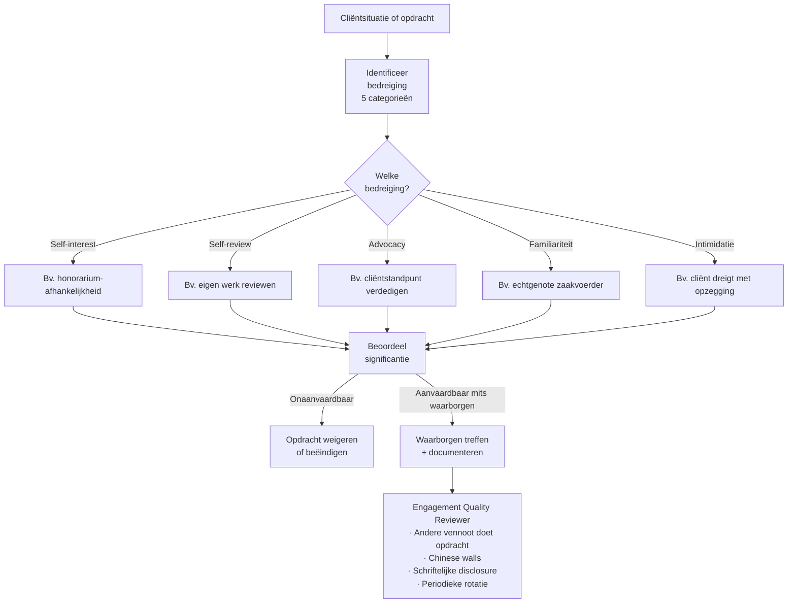

> **Leerstuk — één vraag, helemaal doorgewerkt.** Dit is het denkmotor-leerstuk van PO 4.0: niet een lijstje regels om af te vinken, maar een redeneerwijze die je bij elke opdracht doorloopt. De volgende leerstukken passen hem toe op opdrachtaanvaarding, beroepsgeheim en antiwitwas. Voor verhaal en routekaart: [[studiemateriaal/4-0|overzicht PO 4.0]].

## Antwoord in één blik

Het beroep van gecertificeerd accountant rust op **vijf fundamentele beginselen** die elk professioneel oordeel sturen — integriteit, objectiviteit, vakbekwaamheid en zorgvuldigheid, vertrouwelijkheid en professioneel gedrag. Geen vrijblijvende ethische idealen maar een juridische verplichting: de deontologische code verheft ze tot rechtsgrondslag, met tuchtsanctie bij schending. Bij elke opdracht doorloop je de **threats-and-safeguards-cyclus**: identificeer welke bedreiging speelt, evalueer of ze aanvaardbaar is, pak haar aan met waarborgen — of weiger de opdracht.

| Beginsel | Kern |
|---|---|
| **Integriteit** | Eerlijk en oprecht in alle professionele relaties |
| **Objectiviteit** | Geen vooroordeel, belangenconflict of ongeoorloofde beïnvloeding |
| **Vakbekwaamheid en zorgvuldigheid** | Kennis op peil houden en zorgvuldig handelen volgens standaarden |
| **Vertrouwelijkheid** | Cliëntinformatie beschermen — geen openbaarmaking of eigen gebruik |
| **Professioneel gedrag** | Wet en reglement naleven; geen handeling die het beroep in diskrediet brengt |

**Onafhankelijkheid is geen zesde beginsel.** Het is een strengere standaard die alleen geldt voor *assurance*-opdrachten (controle, review, ISAE, AUP) — daar moet objectiviteit niet alleen bestaan, ze moet ook voor een redelijke buitenstaander zichtbaar zijn. We werken alles uit op kantoor **De Smet & Partners BV** met als rode draad de case van **Nordica Productions**: een cliënt waarvan de zaakvoerder de echtgenote is van een vennoot.

---

## Vijf fundamentele beginselen — de denkmotor

De vijf beginselen zijn geen Belgische uitvinding. Ze stammen uit de internationale ethische code voor accountants (de IESBA Code of Ethics) en zijn doorgewerkt in de Belgische deontologische code voor het ITAA — het Koninklijk Besluit dat de uitvoering vormt van de wettelijke opdracht in de ITAA-wet. Het kernidee dat je moet onthouden: de beginselen zijn een **juridische rechtsgrondslag**, geen academische ethiek. Schending zet drie sporen in gang — tuchtrechtelijk via het ITAA, burgerrechtelijk bij schade en strafrechtelijk bij bepaalde overtredingen (denk aan het beroepsgeheim). Die drie sporen werk je verder uit in [[beroepsgeheim-en-aansprakelijkheid]].

Een tweede vuistregel: **geen beginsel staat los van een ander**. Een schending van vertrouwelijkheid is bijna altijd ook een schending van integriteit. Wie onzorgvuldig werkt, schaadt het professioneel gedrag van het hele beroep. De beginselen ondersteunen en versterken elkaar — zie ze als één weefsel, niet als vijf losse vakjes.

### Integriteit — de zwaartekracht

Integriteit vraagt dat je eerlijk en oprecht bent in elke professionele relatie. Concreet: geen valse of misleidende verklaringen, geen verzwijgen van problematische posten, en — het moeilijkste — **morele moed** om standpunten in te nemen die tegen het cliënt-belang ingaan. Bij De Smet merkt stagiair Lina dat zaakvoerder Karim van Vrolijke Hap een aantal cash-inkomsten van net onder de 9.000 EUR boekt als "kasinkomsten" zonder onderliggende kasstaten. Integriteit vereist dat ze dit aankaart bij haar stagemeester, niet wegkijkt omdat de cliënt belangrijk is voor het kantoor.

### Objectiviteit — voor élke opdracht

Objectiviteit eist dat je geen vooringenomenheid, belangenconflict of ongeoorloofde invloed laat doorwerken in je oordeel. Belangrijk: dit beginsel geldt voor **elke beroepsactiviteit** — fiscaal advies, boekhouding, samenstelling, assurance. Het hele beroep rust erop. Bij assurance komt daar nog een strengere standaard bovenop — onafhankelijkheid — maar de objectiviteitseis blijft altijd de bodem.

### Vakbekwaamheid en zorgvuldigheid

Twee aspecten in één beginsel. Vakbekwaamheid betekent dat je je kennis op peil houdt via permanente vorming (zie [[kwaliteitstoezicht-en-tucht]] voor het concrete vormingskader). Zorgvuldigheid betekent dat je opdrachten uitvoert volgens de toepasselijke standaarden en met de nodige diepgang. De praktische consequentie is hard: **een opdracht weigeren als de expertise ontbreekt**. De Smet & Partners heeft geen IFRS-specialist. Als een cliënt vraagt om een geconsolideerde jaarrekening onder IFRS, moet het kantoor ofwel de opdracht weigeren ofwel een externe IFRS-specialist inschakelen — niet "we doen ons best".

### Vertrouwelijkheid

Cliëntinformatie blijft binnen de opdrachtrelatie. In België is dit beginsel diepgaand verankerd: het strafrechtelijk beroepsgeheim sanctioneert schending met gevangenisstraf. Dat tilt vertrouwelijkheid op tot een ander niveau dan een gewone discretie-norm — wie cliëntinfo lekt riskeert geen berisping maar een strafblad. De grenzen en uitzonderingen (witwasmelding, bank-vragen, dossieroverdracht) komen aan bod in [[beroepsgeheim-en-aansprakelijkheid]].

### Professioneel gedrag

Het sluitstuk: je naleeft wet en reglement en stelt geen handelingen die het beroep in diskrediet brengen. Dat dekt veel meer dan integriteit alleen — denk aan reglementen rond reclame, correcte omgang met confraters, eerlijke acquisitie. Een concreet voorbeeld bij De Smet: stagiair Joris overweegt om op LinkedIn cliënt-namen te vermelden als "social proof" voor zijn stage-werk. Verboden — niet alleen omdat het vertrouwelijkheid schaadt, ook omdat het de toon naar derden niet respecteert die het beroep van zijn beoefenaars verwacht.

---

## Threats-and-safeguards — de cyclus die elke opdracht structureert

Hier maken stagiairs vaak één grote denkfout: ze beschouwen de vijf beginselen als een **checklist** die je bij de intake éénmaal afvinkt. Dat is onjuist. De beginselen leven via een **cyclus** — drie stappen die je bij elke wijziging in de opdracht opnieuw doorloopt.

| Bedreiging | Wat? | Concreet voorbeeld uit dit kantoor |
|---|---|---|
| **Self-interest** (eigenbelang) | Financieel of persoonlijk belang in de cliënt | Honorarium-afhankelijkheid bij een grote cliënt; aandelenbezit in cliënt |
| **Self-review** (zelftoetsing) | Eigen werk later opnieuw moeten beoordelen | Boekhouding zelf voeren én daarna controle erop willen doen |
| **Advocacy** (belangenbehartiging) | Standpunt voor cliënt verdedigen alsof het je eigen is | Fiscaal geschillenadvocaat én commissaris voor dezelfde cliënt |
| **Familiariteit** | Te nauwe relatie met cliënt-management | Vennoot Pieter — echtgenote is zaakvoerder van Nordica Productions |
| **Intimidatie** | Druk om je oordeel aan te passen | Cliënt dreigt met opzegging of klacht als de conclusie niet uitvalt zoals gehoopt |

### Stap 1 — Identificeer

Bij elke nieuwe opdracht en bij elke wijziging in een lopende opdracht stel je jezelf de vraag: welke van deze vijf bedreigingen kan hier spelen? De internationale code onderscheidt er vijf — self-interest, self-review, advocacy, familiariteit en intimidatie. Ze sluiten elkaar niet uit. De Nordica-case combineert eigenlijk twee bedreigingen: familiariteit (de echtelijke band) én een mogelijke self-interest (een huishouden deelt economische voordelen).

### Stap 2 — Evalueer

Niet elke bedreiging is even ernstig. De evaluatie kent drie niveaus: **laag** (geen actie nodig), **middel** (waarborgen vereist) en **onaanvaardbaar** (de opdracht moet je weigeren of beëindigen). De toetssteen die je leert toepassen is de zogenaamde "redelijke en geïnformeerde derde": zou een buitenstaander die de feiten kent twijfelen aan ons oordeel? Antwoord *ja* → minstens niveau middel. Antwoord *zou twijfel onvermijdelijk zijn* → onaanvaardbaar.

### Stap 3 — Pak aan

Drie families aanpakken zijn beschikbaar. **Eerste**: elimineer de omstandigheid zelf — verkoop bijvoorbeeld de aandelen die je in de cliënt aanhoudt, of beëindig de bestuursrelatie. **Tweede**: pas waarborgen toe die de bedreiging terugbrengen tot aanvaardbaar niveau. Klassieke waarborgen zijn een Engagement Quality Reviewer (een ervaren collega die niet aan de opdracht meewerkt en een onafhankelijke review doet), team-rotatie, functie-scheiding via Chinese walls, of schriftelijke disclosure aan de cliënt. **Derde**: als geen waarborg volstaat, weiger of beëindig de opdracht.

### De Nordica-case — de cyclus in actie

> **Hoe De Smet & Partners de cyclus toepast.** Bij de intake in 2021 stelde het kantoor de **familiariteitsbedreiging** vast: zaakvoerder Sofie Vandenbroucke is gehuwd met vennoot Pieter De Smet. Evaluatie: zou een redelijke geïnformeerde derde twijfelen? Voor een samenstellingsopdracht — geen zekerheid, dus geen volledige onafhankelijkheidseis maar wel een objectiviteitseis — werd het niveau ingeschat als middel. Drie waarborgen werden toegepast: (1) collega-vennoot Eva Janssens voert de opdracht uit; (2) Pieter onthoudt zich uitdrukkelijk van enige tussenkomst; (3) de regeling wordt schriftelijk vastgelegd in de opdrachtbrief én in het interne onafhankelijkheidsregister van het kantoor. Belangrijk: bij élke wijziging — Sofie wordt bestuurder elders, de cliënt vraagt om scope-uitbreiding naar fiscaal advies, een nieuw teamlid sluit aan — wordt de cyclus opnieuw doorlopen en de documentatie bijgewerkt.

Onthoud de synthese: **threats-and-safeguards is geen formaliteit maar professionele denkdiscipline**. Bij elke opdrachtwijziging, elke teamlid-mutatie, elke nieuwe gevraagde dienst doorloop je de cyclus opnieuw. De documentatie in het opdrachtdossier is je bewijsstuk bij een tuchtprocedure of een kwaliteitstoetsing — wie alleen een intake-fiche kan tonen, krijgt prompt de kritiek "continuous monitoring afwezig".

---

## Onafhankelijkheid — de strengere standaard voor assurance-opdrachten

Stagiairs gebruiken "objectiviteit" en "onafhankelijkheid" vaak door elkaar. Dat is een fout met examen-gevolgen. **Onafhankelijkheid is geen synoniem van objectiviteit** — het is een verbijzondering, een strengere standaard die alleen geldt voor **assurance-opdrachten**: controle (audit), review, ISAE-opdrachten, AUP (Agreed-Upon Procedures), bepaalde bijzondere wettelijke verslagen. Voor niet-assurance-opdrachten zoals boekhouding, fiscaal advies of samenstelling geldt de gewone objectiviteitseis — niet de volledige onafhankelijkheidsstandaard.

Waarom strenger bij assurance? Omdat bij assurance-opdrachten **derden steunen op het oordeel** van de accountant — banken, fiscus, beleggers, aandeelhouders, het publiek. Het verschil tussen "de accountant heeft mijn cijfers samengesteld" (een cliënt-relatie waar de gebruiker de cliënt zelf is) en "de accountant verklaart dat deze cijfers een getrouw beeld geven" (een verklaring aan de wereld) is enorm. Hoe meer zekerheid de accountant publiek belooft, hoe groter de geloofwaardigheidsdraagkracht — en hoe strikter de onafhankelijkheidsregels moeten zijn om die belofte te onderbouwen.

### Twee dimensies — beide moeten voldoen

Onafhankelijkheid kent twee dimensies, en ze moeten **allebei** voldoen. Dat is geen academisch detail maar de kern van de norm.

**Independence of mind** — interne stand. De accountant moet zijn conclusies kunnen vormen zonder beïnvloeding door belangen of relaties die zijn professionele oordeel zouden kunnen aantasten.

**Independence in appearance** — externe stand. Een redelijke en geïnformeerde derde mag geen aanleiding hebben om te twijfelen aan de objectiviteit van de accountant.

Een audit-partner die zichzelf overtuigd weet van zijn eigen onpartijdigheid maar zichtbaar grote financiële belangen heeft in de cliënt, voldoet dus *niet*. Zijn eigen overtuiging is irrelevant — schijn telt evenveel als feit.

| Aspect | Objectiviteit | Onafhankelijkheid |
|---|---|---|
| **Toepassingsgebied** | Elke beroepsactiviteit | Alleen assurance-opdrachten (controle, review, ISAE, AUP, bijzondere verslagen) |
| **Aard** | Geesteshouding — geen ongepaste invloed | Mentaal **én** zichtbaar — schijn telt |
| **Concrete verboden** | Geen absolute — case-by-case via threats-and-safeguards | Wettelijke lijst (financiële belangen, familie, niet-assurance-diensten bij beursgenoteerden en banken) |
| **Sanctie bij schending** | Tucht via deontologie | Tucht + nietigheid van het verslag + bijkomende sancties bij organisaties van openbaar belang |

### Onverenigbaarheden — wat absoluut verboden is

Naast de threats-and-safeguards-cyclus bestaat er een **lijst kernverboden** die niet via waarborgen op te lossen zijn. De ITAA-wet bevat een algemene bepaling die activiteiten verbiedt die de onafhankelijkheid hypothekeren of een belangenconflict creëren. De internationale code werkt dit in detail uit: geen direct financieel belang in een audit-cliënt (geen aandelen, geen leningen), geen onmiddellijke familieleden in posities van invloed bij de cliënt, en bepaalde combinaties van assurance- en niet-assurance-diensten zijn verboden — zeker bij organisaties van openbaar belang (beursgenoteerde vennootschappen en financiële instellingen).

Concrete voorbeelden op De Smet & Partners. Vennoot Pieter mag **geen bezoldigd bestuursmandaat** aanvaarden in cliënt-vennootschap Aurelia Industries — dat zou een onverenigbaarheid creëren die geen waarborg ophelpt. Eva mag wél onbezoldigd penningmeester blijven van de Gentse Schaakclub: geen cliëntrelatie, geen probleem. Maar zou de Schaakclub plotseling een ITAA-opdracht aanvragen, dan moet Eva ofwel haar mandaat opgeven, ofwel mag het kantoor de opdracht niet aanvaarden.

### Chinese walls — organisatorisch instrument, geen wondermiddel

Bij grotere kantoren waar twee cliënten potentieel tegenstrijdige belangen hebben — bijvoorbeeld tegenpartijen in een onderhandeling, of een audit-cliënt waarvoor een ander team niet-assurance-werk doet — kun je een **Chinese wall** opzetten. De vier bouwstenen: functionele scheiding (verschillende teams), fysieke scheiding (andere werkzones), informatiescheiding (geen toegang tot elkaars dossiers) en een toezicht-laag (een onafhankelijke partner die de scheiding bewaakt).

Belangrijke nuance: Chinese walls zijn een instrument voor de **grijze zone**, niet voor de absolute verboden. Bij fundamentele onverenigbaarheden — bijvoorbeeld een controle uitvoeren bij een vennootschap waarin de auditor zelf grote aandeelhouder is — blijft opdracht-weigering de enige uitweg. Een muur in het kantoor lost een eigendomsbelang in de cliënt niet op.

---

## Twee speciale gevallen — bestuursmandaat en honorarium-afhankelijkheid

### Bestuursmandaat in cliëntvennootschap

Examen-favoriet. Mag een gecertificeerd accountant tegelijk bestuurder zijn van een cliënt? Het antwoord vraagt nuance.

**Geen bezoldigd bestuursmandaat in een cliënt** die hij ook professioneel bedient — die combinatie creëert tegelijk self-review, advocacy en een wettelijke onverenigbaarheid. Een onbezoldigd mandaat in een vereniging zonder cliëntrelatie (zoals Eva in haar schaakclub) is wél toegestaan. Een bestuursmandaat in de eigen kantoor-vennootschap (Pieter is vennoot in De Smet & Partners BV) is uiteraard geen probleem — dat is de eigen praktijk.

### Honorarium-afhankelijkheid

Wanneer één cliënt een te groot aandeel van de kantoor-omzet uitmaakt, ontstaan twee bedreigingen tegelijk: **self-interest** (het kantoor wordt economisch afhankelijk) en **intimidation** (de cliënt kan druk uitoefenen). De internationale code stelt waarborgen voor: jaarlijkse herevaluatie, externe partner-review, een diversificatie-plan. Bij De Smet (totaal 1,8 mln EUR jaaromzet) doet Aurelia Industries 360 k EUR — ongeveer 20% van de omzet. Dat zit binnen de veilige zone, maar bij groeiende cliënt-omzet moet het kantoor opnieuw toetsen en eventueel zelf actie ondernemen.

| Situatie | Bedreiging | Aanvaardbaar mits... | Verboden wanneer... |
|---|---|---|---|
| Onbezoldigd bestuursmandaat in vereniging zonder cliëntrelatie | Geen | Geen waarborgen nodig | Cliëntrelatie ontstaat met die vereniging |
| Bezoldigd bestuursmandaat in cliënt | Self-review + advocacy + onverenigbaarheid | Onmogelijk — fundamenteel conflict | Altijd verboden bij cliëntrelatie |
| Familielid in cliënt-management (bv. echtgenoot zaakvoerder) | Familiariteit | Andere vennoot doet de opdracht + interne review + register-vermelding | Bij assurance-opdracht voor een organisatie van openbaar belang |
| Hoge honorarium-afhankelijkheid van één cliënt | Self-interest + intimidation | Jaarlijkse review + externe Engagement Quality Reviewer + diversificatieplan | Aanhoudende sterke afhankelijkheid zonder mitigatie |
| Aanbrengcommissie tussen kantoren | Ronselverbod (deontologische code) | Onmogelijk — absoluut verbod | Altijd verboden onder ITAA-deontologie |

> **Aansluiting met de meeneem-clienten-case.** Senior medewerker Bart Devos (geen ITAA-titel) overweegt vertrek en wil enkele cliënten meenemen naar een nieuw kantoor. Drie beginselen kruisen elkaar hier. Vertrouwelijkheid: een cliëntenlijst is geheim, Bart mag die niet meenemen of doorgeven. Professioneel gedrag: het ronselverbod uit de deontologische code verbiedt aanbrengcommissies tussen kantoren — geldt voor de **ontvangende ITAA-vennoot**. Onverenigbaarheid: een cliëntenportefeuille "kopen" is een verboden vorm van aanbrengcommissie. Tucht-uitkomst: de klacht treft niet Bart (geen ITAA-lid) maar de confrater die hem aanwerft en de overstap accommodeert. Verder uitgewerkt in [[kwaliteitstoezicht-en-tucht]].

> **De principles-based aard van de code.** De internationale ethische code is bewust **geen rigide checklist**. Er bestaat geen uitputtende lijst van verboden situaties — wel een lijst kernverboden (financiële belangen, familie, bepaalde dienst-combinaties bij organisaties van openbaar belang) en daarnaast de threats-and-safeguards-cyclus voor alle andere gevallen. Wie zich alleen de verboden-lijst eigen maakt, mist 80% van de praktijksituaties — net die waar de redenering écht moet worden gevoerd.

---

## Drie valkuilen

⚠️ **Onafhankelijkheid gelijkstellen aan objectiviteit.** Fout: objectiviteit is een fundamenteel beginsel voor élke opdracht. Onafhankelijkheid is een strengere afgeleide, alleen voor assurance-opdrachten, met twee dimensies (mind én appearance). Een examen-klassieker is een vraag in een fiscaal-advies-context met de val "onafhankelijkheid" — daar geldt objectiviteit, niet onafhankelijkheid in strikte zin.

⚠️ **Denken dat eigen overtuiging volstaat.** Fout: "ik weet zelf dat ik onpartijdig ben" volstaat niet. Independence in appearance vereist dat een redelijke buitenstaander ook geen aanleiding heeft om te twijfelen. Een audit-partner met groot aandelenbezit in de cliënt schaadt de schijn — zijn eigen overtuiging is irrelevant. Schijn weegt evenveel als feit.

⚠️ **Threats-and-safeguards éénmaal doen en vergeten.** Fout: de cyclus is doorlopend. Bij elke nieuwe ontwikkeling — cliënt wijzigt bestuur, een nieuwe niet-assurance-dienst wordt gevraagd, een teamlid huwt iemand uit de cliënt-organisatie — loop je "identificeer-evalueer-aanpak" opnieuw door, mét documentatie. Wie alleen een intake-fiche kan tonen bij een kwaliteitstoetsing krijgt de kritiek "continuous monitoring afwezig" — een serieuze opmerking in het toetsingsverslag.

---

## Wanneer je dit snapt, ga dan naar

- [[wat-is-het-accountantsberoep]] — Het bredere kader: wat is het beroep, welke titels en monopolies, welke rol speelt het ITAA, en hoe verhouden de beginselen zich tot de normbronnen van het beroep.
- [[opdrachtaanvaarding-en-clientenrelatie]] — Threats-and-safeguards in actie bij intake: wat doet de accountant in de opdrachtbrief, hoe verloopt confraterne overdracht, hoe documenteer je in een onafhankelijkheidsregister.
- [[beroepsgeheim-en-aansprakelijkheid]] — Verdieping van vertrouwelijkheid (strafrechtelijk beschermd) plus de drie sporen aansprakelijkheid bij schending van een beginsel.
- [[kwaliteitstoezicht-en-tucht]] — Hoe naleving van de beginselen wordt afgedwongen: kantoor-kwaliteitssysteem, kwaliteitstoetsing, tuchtprocedure.
- [[studiemateriaal/4-0/samenvatting|Samenvatting PO 4.0]] — Vijf beginselen, vijf bedreigingen en de onafhankelijkheids-checklist op één pagina, voor herhaling vlak vóór het examen.

## Doorklik naar concepten

Voor wie definitorisch detail wil opzoeken:

- [[deontologie]] · [[onafhankelijkheid]]
- [[gecertificeerd-accountant]] · [[normbronnen]]

---

## Wettelijk fundament

- **Deontologische beginselen — wettelijke verankering**: ITAA-wet (Wet 17 maart 2019) — algemene rechtsgrondslag dat de gecertificeerd accountant handelt met respect voor de beginselen van de deontologie en in het publiek belang.
- **Onverenigbaarheden en objectieve uitvoering**: ITAA-wet — bepaling die activiteiten verbiedt die de onafhankelijkheid hypothekeren of een belangenconflict creëren.
- **Deontologische code als KB**: Koninklijk Besluit van 9 december 2019 — uitvoeringsbesluit van Hoofdstuk 6 van de ITAA-wet. Werkt de vijf fundamentele beginselen plus het threats-and-safeguards-kader uit voor het ITAA-lidmaatschap.
- **Ronselverbod en aanbrengcommissies**: deontologische bepaling die verbiedt dat de vergoeding van de beroepsbeoefenaar afhangt van andere diensten — verbod op aanbrengcommissies en pakket-aanbiedingen tussen kantoren.
- **Vijf fundamentele beginselen — internationale grondslag**: IESBA Code of Ethics 2024, Deel 1 (Sections 110-115) — integriteit, objectiviteit, vakbekwaamheid en zorgvuldigheid, vertrouwelijkheid, professioneel gedrag. Bindend voor het Belgische beroep via doorverwijzing in het KB van 9 december 2019 en in de ITAA-normen.
- **Threats-and-safeguards-cyclus**: IESBA Code of Ethics 2024, Section 120 — conceptual framework dat het identificeren, evalueren en aanpakken van bedreigingen voor naleving van de vijf beginselen voorschrijft.
- **Vijf categorieën bedreigingen**: IESBA Code of Ethics 2024, Section 120 — self-interest, self-review, advocacy, familiariteit, intimidatie.
- **Onafhankelijkheid — mind en appearance**: IESBA Code of Ethics 2024, International Independence Standards (Part 4A en Part 4B) — Section 400 en volgende voor audit en review-opdrachten, Section 900 en volgende voor andere assurance-opdrachten.
- **Concrete onafhankelijkheidsregels**: IESBA Code of Ethics 2024, Sections 510 e.v. (financiële belangen), 521 e.v. (familie en persoonlijke relaties), 600 e.v. (provisie van niet-assurance-diensten), strenger voor organisaties van openbaar belang.
- **Onafhankelijkheidsverklaring commissaris**: Wet 7 december 2016 — formele verklaring aan de algemene vergadering bij de commissaris-opdracht; cross-PO doorklik naar het leerpad rond commissaris-opdrachten.

---

*Leerstuk PO 4.0. Status: voorgesteld — POC volgens ADR-037, gerenderd uit script + De-Smet-voorbeeldgroep.*
