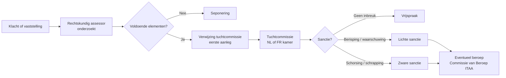

> **Leerstuk — één vraag, helemaal doorgewerkt.** Dit is het afsluitende leerstuk van PO 4.0. De vorige vijf leerstukken legden vast *wat* je moet doen — als accountant, als kantoor, ten aanzien van je cliënt. Dit leerstuk legt vast *hoe* die regels worden afgedwongen. Voor verhaal en routekaart: [[studiemateriaal/4-0|overzicht PO 4.0]].

## Antwoord in één blik

Vier mechanismen werken samen, in oplopende ernst: **vorming** voorkomt fouten door je kennis op peil te houden, **intern kwaliteitsmanagement** structureert je werk op kantoor- en opdrachtniveau, **externe kwaliteitstoetsing** door het ITAA controleert periodiek of het systeem werkt, en **tucht** sanctioneert wie buiten de lijntjes kleurt. Wie alle vorige vijf leerstukken kent maar niet weet hoe ze worden afgedwongen, mist de helft van het beeld.

We doorlopen de vier mechanismen van licht naar zwaar. Centraal in dit leerstuk: de aangekondigde ITAA-kwaliteitstoetsing van 15 juni 2026 bij De Smet & Partners — wat moet er klaar liggen, wat kan er misgaan?

---

## Permanente vorming — preventie via vakbekwaamheid

Vakbekwaamheid en zorgvuldigheid zijn één van de vijf fundamentele beginselen die we in [[deontologische-beginselen-en-onafhankelijkheid|leerstuk 2]] uitwerkten. Dat klinkt abstract — *je houdt je kennis op peil* — totdat het ITAA er een concrete tellings-verplichting van maakt. De norm permanente vorming, in werking sinds 1 januari 2021, vertaalt het beginsel in cijfers die je over jaren moet bijhouden.

### De dubbele drempel

De norm legt **twee** cumulatieve voorwaarden op die je tegelijk moet halen:

- **120 uur** over drie opeenvolgende kalenderjaren (cumulatieve drempel — niet "gemiddeld 40 per jaar")
- **Minimum 20 uur** in elk individueel kalenderjaar (jaarlijkse drempel — voorkomt dat je drie jaar wacht en dan een marathon doet)

Het verschil tussen die twee drempels is examen-favoriet. Bekijk twee patronen voor dezelfde 120-uren-portefeuille:

| Patroon | Jaar 1 | Jaar 2 | Jaar 3 | Totaal | Voldoet? |
|---|---|---|---|---|---|
| Patroon A | 20 u | 20 u | 80 u | 120 u | **Ja** — beide drempels gehaald |
| Patroon B | 10 u | 10 u | 100 u | 120 u | **Nee** — jaar 1 en 2 onder de 20-uur-drempel |

Bij overmacht of bij (her)inschrijving in de loop van het jaar wordt de berekening pro rata temporis aangepast. Bij stagiairs verloopt de opvolging via de stagecommissie, niet via de Cel Permanente Vorming.

### Wat telt — categorie A en categorie B

De norm onderscheidt twee tellings-regimes:

- **Categorie A** — externe vorming: seminaries en opleidingscycli van erkende vormingsoperatoren, doceren bij erkende instellingen, vorming op afstand mét afsluitende toets, wetenschappelijke en technische publicaties.
- **Categorie B** — intern of bijdragend: meewerken aan commissies en werkgroepen van het ITAA, vormingen door je eigen kantoor of netwerk voor de eigen beroepsbeoefenaars.

Er is geen verplichte minimum-mix — wel kijkt een kwaliteitstoetsing naar het evenwicht en naar de relevantie van de gevolgde vorming voor jouw concrete praktijk.

Drie tellings-bijzonderheden die geregeld terugkomen op de toetsing:

- **Doceren** bij een erkende instelling telt voor **twee uur per gegeven uur** (bonus voor voorbereiding).
- **Publicaties** van wetenschappelijke of technische aard tellen voor twee uur per drie­duizend tekens.
- Doceren en publicaties samen zijn beperkt tot **maximum dertig uur** per kalenderjaar.
- **E-learning** telt als categorie A op cumulatieve voorwaarden: minstens dertig minuten lang, met ingebouwde controle dat je alle onderdelen doorloopt, plus een afsluitende toets. Zonder toets zakt het naar categorie B.

### Wat NIET telt

Vormingsactiviteiten die *duidelijk gericht zijn op de promotie van een commercieel product of dienst* tellen niet mee. De uitzondering: tools-opleidingen die minstens vijfenveertig minuten duren én duidelijke opleidingsdoelen hebben in relevante vakgebieden. Concreet: een demo van een nieuwe boekhoudsoftware door de leverancier zonder pedagogisch plan telt niet; een gestructureerde training over de fiscale modules van een ERP-systeem mét leerdoelen telt wél.

Concretiseer met De Smet & Partners — drie vennoten, twee gecertificeerde medewerkers (Karolien recent gecertificeerd), twee stagiairs. Een mogelijk vormingsdossier voor één jaar:

| Vormingsactiviteit | Categorie | Telling | Bewijsstuk |
|---|---|---|---|
| ITAA-najaarscongres BTW-actualia (1 dag) | A | 7 u | Aanwezigheidsattest ITAA |
| Webinar IFRS 16 met afsluitende toets (90 min) | A | 1,5 u | Toets-resultaat + login-log |
| Webinar fiscale hervorming zonder toets (90 min) | B | 1,5 u (als B) | Login-log + aanwezigheidsverklaring |
| Doceren stagecyclus 1 uur | A | 2 u (bonus) | Verklaring erkende instelling |
| Publicatie van 6.000 tekens in beroeps-vakblad | A | 4 u (2× 3.000) | Publicatie zelf + tekens-bewijs |
| Intern kantoor-seminarie BTW-aangifte (2 uur) | B | 2 u | Aanwezigheidslijst + agenda |
| Software-demo zonder leerdoelen (< 45 min) | telt NIET | 0 u | — |

### Sanctie-cascade bij niet-naleving

De norm voorziet drie graden — oplopend in ernst. Eerst een **terechtwijzing door de Raad ITAA**: formele waarschuwing zonder tuchtgevolgen, plus drie maanden om de achterstand in te halen. Volgt geen remediëring, dan kan de Raad de **hoedanigheid van beroepsbeoefenaar intrekken** — de facto verwijdering uit het openbaar register. Bij zware of herhaalde gevallen volgt **verwijzing naar de tuchtcommissie**.

---

## Intern kwaliteitsmanagement — kantoor en opdracht

Vorming alleen volstaat niet. Een goed-opgeleide accountant zonder methodische werkstroom kan nog altijd missers maken. Daarom verplicht het ITAA elk kantoor — niet alleen audit-kantoren — om een **kwaliteitsmanagementsysteem** te hebben. Het geldt voor elk kantoor dat audit, review, assurance of aanverwante diensten (samenstelling, AUP) uitvoert. De ITAA-norm intern kwaliteitsmanagement is de Belgische vertaling van **ISQM 1** — een internationale standaard uitgegeven door de IAASB (de International Auditing and Assurance Standards Board, het normerend orgaan binnen IFAC).

### Van procedure-checklist naar risico-gestuurd systeem

Pre-2022 werkte het systeem reactief: kantoren stelden procedures op en hoopten dat ze werkten. Na de Carillion-, Wirecard- en Steinhoff-affaires bleek dat te veel controles door de mazen van die procedures vielen. **ISQM 1** (in werking voor boekjaren vanaf 15 december 2022) draait dit om. Het kantoor moet voortaan:

1. zelf zijn kwaliteits-risico's identificeren;
2. beleidsmaatregelen formuleren om die te mitigeren;
3. monitoren of die maatregelen werken;
4. tekortkomingen remediëren.

Geen one-size-fits-all. Het systeem is principle-based — de invulling is proportioneel naar omvang en activiteit. Een eenmanskantoor heeft geen audit-comité nodig, wel een geschreven kwaliteitsprocedure. Een multi-partner-kantoor draagt een complexere governance-laag. Bij De Smet & Partners: Pieter als verantwoordelijke op het hoogste niveau, Eva als ISQM-eigenaar (kwaliteits-verantwoordelijke), Tom voor permanente vorming.

### Drie niveaus

De norm werkt op drie niveaus, elk met een eigen standaard:

| Niveau | Standaard | Wie verantwoordelijk? | Resultaat in dossier |
|---|---|---|---|
| **Kantoor** | ISQM 1 + ITAA-norm intern kwaliteitsmanagement | Verantwoordelijke op hoogste niveau (Pieter) | Schriftelijk kwaliteitssysteem + jaarlijkse evaluatie + remediation-acties |
| **Opdracht** | ISA 220 (herzien) voor audit · ISRE-vereisten voor review · ISRS-vereisten voor samenstelling/AUP | Opdrachtpartner | Revisiedossier per opdracht — invulling 8 ISQM-componenten aantonen |
| **Engagement Quality Review** | ISQM 2 (IAASB) | Onafhankelijke reviewer (ervaren partner, niet in team) | Review-werkpapieren + concept-verslag-vrijgave |

Op **opdrachtniveau** draagt de opdrachtpartner volgens **ISA 220 (herzien)** persoonlijk de eindverantwoordelijkheid: hij vergewist zich dat het team voldoende bekwaam, beschikbaar en onafhankelijk is, hij is zelf direct betrokken bij planning, kritieke oordelen en eindverslag, hij volgt de review-procedures, hij escaleert bij twijfel, en hij geeft het verslag pas uit na voldoende bewijswerk.

Daarbovenop bestaat de **Engagement Quality Review** (EQR), beheerst door **ISQM 2**. Dat is een aparte kwaliteitsreview op opdrachtniveau door een ervaren onafhankelijke reviewer — niet betrokken bij de uitvoering — bij specifieke hoog-risico-opdrachten. De reviewer evalueert significante oordelen, conclusies en het concept-verslag *vóór* uitgifte. EQR is dwingend bij audits van Public Interest Entities (beursgenoteerden en financiële entiteiten) en optioneel-aan-te-wijzen voor andere hoog-risico-opdrachten zoals een eerste-jaar-controle van een grote groep of een complexe consolidatie met fraude-indicatoren. Bij De Smet & Partners spelen EQR-opdrachten niet — geen PIE-cliënten in de portefeuille.

---

## Externe kwaliteitstoetsing ITAA — peer review als systemische check

Intern kwaliteitsmanagement is goed. Maar wie controleert dat het systeem effectief werkt? Antwoord: de externe peer review. De Wet-ITAA verplicht elke gecertificeerd accountant en belastingadviseur tot periodieke kwaliteitstoetsing — **om de zeven jaar** in het reguliere ritme, met aankondiging **minstens twee maanden vooraf**. Niet een inspectie om te sanctioneren, maar in de eerste plaats een pedagogisch en preventief instrument: feedback van een ervaren peer.

### Vier stappen

1. **Aankondiging**. Een schriftelijke brief van de Commissie kwaliteitstoetsing vermeldt de naam van de toetser, de scope (organisatie + opdrachten) en de voor te bereiden documenten. De wettelijke termijn van minstens twee maanden geeft het kantoor lucht om alles in orde te krijgen.
2. **Bezoek** ter plaatse. De toetser bekijkt typisch: de algemene organisatie (kwaliteitssysteem, opdrachtbrieven-templates, AML-procedure), een steekproef van opdrachten, permanente-vormings­attesten en het klachten-register.
3. **Rapportering**. Een gemotiveerd verslag met bevindingen en een voorgesteld eindoordeel. De beroepsbeoefenaar heeft hoorrecht — je kan opmerkingen formuleren vóór het eindoordeel definitief wordt.
4. **Gevolgen**. Geen, een actieplan, of doorverwijzing naar het tuchtspoor.

### Drie uitkomsten

- **Conform** — alles in orde, volgende toetsing in het reguliere ritme.
- **Conform met opmerkingen** — kleinere bevindingen worden bij de volgende cyclus opnieuw nagekeken, geen verdere actie.
- **Niet-conform** — verplicht actieplan binnen zes maanden + heronderzoek na één à twee jaar. Bij blijvende of ernstige tekortkomingen wordt het dossier overgedragen aan de rechtskundig assessor en start het tuchtspoor.

### Beroepsgeheim tegenover de toetser

De wet verplicht **inzage in alle informatie die betrekking heeft op de beroepsuitoefening**. De toetser is zelf gebonden door beroepsgeheim — cliëntinformatie blijft beschermd binnen het toetsings-kader. **Inzage weigeren is op zich een tuchtfeit.** Voor de positionering ten opzichte van het beroepsgeheim algemeen: zie [[beroepsgeheim-en-aansprakelijkheid]].

### De Smet & Partners — 15 juni 2026

Op 15 april 2026 ontvangt Pieter de aankondiging voor een toetsing op 15 juni 2026 — exact het wettelijke minimum van twee maanden. Stagiair Lina krijgt de opdracht de voorbereiding te coördineren. Wat moet klaarliggen?

- **AML-procedure** up-to-date + AMLCO-aanstellings-document (Pieter is AMLCO).
- **Opdrachtbrieven-templates** met alle inhoudsvelden uit [[opdrachtaanvaarding-en-clientenrelatie|leerstuk 3]].
- **Threats-and-safeguards-fiches** per cliënt — bijzonder relevant: het onafhankelijkheids-register voor Nordica (echtgenote-zaakvoerder) en de verhoogd-risico-fiche voor Vrolijke Hap.
- **Permanente-vormings-attesten** per beroepsbeoefenaar.
- **Klachten- en incidenten-register** — leeg of met remediatie-acties gedocumenteerd.

Constructieve houding aanbevolen: de toetser is geen tegenstander, en een goed voorbereide toetsing eindigt vaak met enkele aanbevelingen die het kantoor sterker maken.

---

## Tuchtprocedure — bij ernstige overtreding

Tucht is publiekrechtelijk. Het beschermt de kwaliteit en integriteit van het beroep — niet de individuele cliënt (daarvoor bestaat het burgerrechtelijke spoor — zie [[beroepsgeheim-en-aansprakelijkheid]]). De Wet-ITAA werkt het uit in een afzonderlijk hoofdstuk "Handhaving" met een procedure in vier stappen en een sanctiegamma in vier graden.

### Vier stappen

**Stap 1 — klacht of vaststelling.** Drie kanalen openen de procedure:

- een **belanghebbende** (cliënt, derde, ITAA-collega);
- de **procureur-generaal** bij het hof van beroep;
- **ambtshalve** — eigen vaststelling door de rechtskundig assessor of de Raad ITAA, bijvoorbeeld op basis van een audit-bevinding, een resultaat van de kwaliteitstoetsing of een mediasignaal.

**Stap 2 — onderzoek door de rechtskundig assessor.** Een magistraat onderzoekt de feiten, ondervraagt de beroepsbeoefenaar, hoort getuigen en wordt bijgestaan door referendarissen. Je bent **verplicht mee te werken**. Cassatie-rechtspraak is hier expliciet: het beroepsgeheim is **niet tegenstelbaar** aan de tuchtoverheid. Op het einde van het onderzoek beslist de assessor: ofwel verwijzing naar de tuchtcommissie wanneer voldoende bezwaren bestaan, ofwel klassering zonder gevolg.

**Stap 3 — tuchtcommissie — eerste aanleg.** NL- of FR-kamer, gemengd samengesteld uit beroepsmagistraten en ITAA-leden (juridische rigor + vakkennis). Je wordt opgeroepen en mag je laten bijstaan door een advocaat. De zitting is in principe niet openbaar (tuchtgeheim). De beslissing is met redenen omkleed.

**Stap 4 — beroep bij de Commissie van Beroep ITAA.** Tegen de beslissing in eerste aanleg is hoger beroep mogelijk. Tegen de uitspraak in beroep staat cassatieberoep open bij het Hof van Cassatie — beperkt tot rechtsvragen, niet tot feiten-herziening.

### Vier sancties — oplopend

| Sanctie | Wat? |
|---|---|
| **Waarschuwing** | Formele berisping zonder verdere gevolgen — eerste graad |
| **Berisping** | Strenger geformuleerde afkeuring |
| **Schorsing** | Tijdelijk verbod om het beroep uit te oefenen (maximum één jaar) |
| **Schrapping** | Definitief verbod + verlies van titel — verwijdering uit het openbaar register |

Daarnaast bestaat de **terechtwijzing** door de Raad voor minder ernstige feiten — formeel, maar geen tuchtsanctie. Bij de sanctie-bepaling weegt de tuchtcommissie zes factoren af: ernst en duur van de inbreuk, verantwoordelijkheidsgraad, financiële draagkracht, omvang van behaalde of vermeden winst, mate van medewerking met het ITAA, en recidive. De waarschuwing en de berisping worden na vijf jaar zonder nieuwe tuchtstraf uitgewist; de schorsing en de schrapping blijven definitief in het tucht-track.

> **Drie sporen blijven gescheiden.** Tucht oordeelt over de **geschiktheid** om het beroep verder uit te oefenen — niet over schadevergoeding (= burgerlijk spoor) en niet over strafmaat (= strafrechtelijk spoor). Eén feit kan op alle drie sporen sancties opleveren — en dat is geen dubbele bestraffing maar de onafhankelijkheid van procedures. Een strafrechtelijke vrijspraak ("beyond reasonable doubt") sluit een tuchtsanctie ("inbreuk vastgesteld op het normatief kader") niet uit.

### De klager is geen procespartij

Examen-favoriet: in tuchtrecht is de klager **geen procespartij**. Hij krijgt het gemotiveerd resultaat meegedeeld, kan worden gehoord wanneer de commissie dat nodig acht, maar voert geen pleidooi en krijgt geen schadevergoeding via deze weg. Wie schadevergoeding wil, moet apart het burgerrechtelijke spoor inslaan via de gewone rechtbank.

### De meeneem-cliënten-case

Senior medewerker Bart Devos (boekhouder, geen ITAA-lid) overweegt vertrek naar een ander kantoor en wil cliënten meenemen. De ontvangende ITAA-vennoot stelt een aanbrengcommissie voor. Wat gebeurt er, langs welke sporen?

- **Tegen Bart zelf**: civielrechtelijk (concurrentiebeding van zijn arbeidsovereenkomst, eventueel oneerlijke concurrentie). Geen ITAA-tucht — Bart is geen lid.
- **Tegen de ontvangende ITAA-vennoot**: tuchtklacht mogelijk wegens aanbrengcommissie (verboden onder de ITAA-deontologie als ronselverbod) en overname van een cliëntenbestand zonder confraternele predecessor-procedure.
- Mogelijk **strafrechtelijk** als cliënteninformatie effectief gestolen is, en **civiel** door De Smet & Partners (schade aan het kantoor).

Drie sporen, drie procedures, drie types sancties — niet uitwisselbaar.

---

## Wanneer je dit snapt, ga dan naar

- [[wat-is-het-accountantsberoep]] — eerste leerstuk: beroep, instituut en normbronnen. Recap voor wie het kantoorniveau-perspectief wil vasthouden.
- [[deontologische-beginselen-en-onafhankelijkheid]] — tweede leerstuk: vijf beginselen en threats-and-safeguards. Wat het kwaliteitsmanagement structureert en het tuchtspoor afdwingt.
- [[beroepsgeheim-en-aansprakelijkheid]] — vierde leerstuk: drie sporen aansprakelijkheid in detail. Het tuchtspoor is één van die drie.
- [[studiemateriaal/4-0/samenvatting|Samenvatting PO 4.0]] — voor herhaling vlak vóór het examen: vier afdwingings-mechanismen + cijfers + sanctie-cascade + drie-sporen-recap op één pagina.

## Doorklik naar concepten

Voor wie definitorisch detail wil opzoeken:

- [[kwaliteitsmanagement-opdracht]] · [[kwaliteitstoetsing-itaa]]
- [[tuchtprocedure-itaa]] · [[permanente-vorming]]
- [[deontologie]] · [[itaa-beroepsorganisatie]]

---

## Wettelijk fundament

- **Permanente vorming — wettelijke basis**: ITAA-norm permanente vorming, in het bijzonder art. 3 (120 u over drie opeenvolgende kalenderjaren + min. 20 u per kalenderjaar; pro rata bij overmacht of (her)inschrijving). In werking sinds 1 januari 2021.
- **Permanente vorming — categorieën en tellings-bijzonderheden**: ITAA-norm permanente vorming art. 6 (welke activiteiten in aanmerking komen + uitsluiting "duidelijk commercieel-promotioneel") en art. 7 (categorie A/B + bonus-telling voor doceren en publicaties, plafond doceren + publicaties).
- **Permanente vorming — sanctie-cascade**: terechtwijzing door de Raad als minder ernstige reactie (Wet-ITAA art. 85, 3°), tot intrekking hoedanigheid en doorverwijzing naar tuchtcommissie bij blijvende niet-naleving.
- **Intern kwaliteitsmanagement kantoor**: ITAA-norm intern kwaliteitsmanagement, Belgische vertaling van **ISQM 1** (International Standard on Quality Management 1, IAASB) — acht componenten, in werking voor boekjaren vanaf 15 december 2022.
- **Kwaliteitsmanagement opdrachtniveau (audit)**: **ISA 220 (herzien)** — verantwoordelijkheid opdrachtpartner. Voor review en aanverwante diensten: ISRE- en ISRS-vereisten met gelijkaardige opzet.
- **Engagement Quality Review**: **ISQM 2** (IAASB) — onafhankelijke reviewer bij hoog-risico-opdrachten, dwingend bij PIE-audits.
- **Externe kwaliteitstoetsing ITAA**: Wet 17 maart 2019 (Wet-ITAA), hoofdstuk over kwaliteitstoetsing. Periodieke toetsing in een reguliere cyclus van zeven jaar. Aankondiging minstens twee maanden vooraf. Inzage-plicht: beroepsgeheim niet tegenstelbaar aan de toetser (die zelf gebonden is).
- **Onafhankelijkheid en kwalificatie van de toetser**: selectie volgens objectieve procedure, specifieke ITAA-opleiding, voorkoming van belangenconflicten.
- **Tuchtprocedure — wettelijke basis**: Wet 17 maart 2019, hoofdstuk "Handhaving" (de beroepstucht). Klacht-initiatie via belanghebbende, procureur-generaal of ambtshalve. Onderzoek door rechtskundig assessor; verwijzing naar tuchtcommissie (NL/FR-kamer); beroep bij Commissie van Beroep ITAA; eventueel cassatieberoep beperkt tot rechtsvragen.
- **Sanctiegamma**: waarschuwing · berisping · schorsing (max. één jaar) · schrapping uit register. Plus terechtwijzing door de Raad voor minder ernstige feiten (geen tuchtsanctie). Sanctie-bepaling weegt zes factoren af: ernst, duur, verantwoordelijkheidsgraad, draagkracht, behaalde of vermeden winst, medewerking met het ITAA, recidive.
- **Uitwissing tuchtstraffen**: na vijf jaar voor waarschuwing en berisping, mits geen nieuwe tuchtstraf in tussentijd. Schorsing en schrapping worden niet uitgewist.
- **Klager geen procespartij**: KB 1 maart 1998 — Reglement van plichtenleer (art. 6 en 7). Klager krijgt gemotiveerd resultaat meegedeeld, kan worden gehoord, voert geen pleidooi.
- **Schorsing — bekendmaking aan cliënten**: KB 1 maart 1998 art. 8. Bij schorsing van meer dan één maand brengt de accountant zelf de cliënten op de hoogte.

---

*Leerstuk PO 4.0. Status: nieuw — gerendered uit script + De Smet-voorbeeldgroep.*
