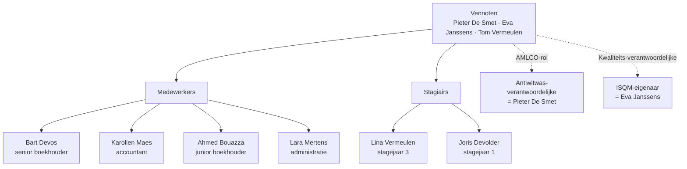

> **Leerstuk — één vraag, helemaal doorgewerkt.** Dit is het zwaarste leerstuk van PO 4.0: je doorloopt de hele cliëntcyclus, van eerste intake-gesprek tot afscheid bij beëindiging. Bouwt voort op [[deontologische-beginselen-en-onafhankelijkheid]] — vooral de threats-and-safeguards-redenering die in stap 3 van de aanvaarding terugkomt. Voor verhaal en routekaart: [[studiemateriaal/4-0|overzicht PO 4.0]].

## Antwoord in één blik

Elke nieuwe cliënt doorloopt **vier aanvaardingsstappen**: (1) cliëntenonderzoek met integriteits-check (KYC voor antiwitwas), (2) competentie- en capaciteitstoets (kan het kantoor de opdracht aan?), (3) onafhankelijkheids- en ethiek-evaluatie (threats-and-safeguards), (4) overdrachtsgesprek met de vorige beroepsbeoefenaar bij wisseling. Pas bij groen licht op alle vier wordt een **schriftelijke opdrachtbrief** opgesteld — wettelijk verplicht voor *élke* opdracht, met dertien inhoudsvelden en ondertekening in tweevoud vóór uitvoering. Tijdens de uitvoering bewaakt het kantoor kwaliteit via een review-piramide, dossiervoering en stakeholder-communicatie. Bij **beëindiging** geldt geen administratieve formaliteit maar een deontologisch reglement-blok: confraterne overdracht met voorafgaand predecessor-gesprek (geen aanbrengcommissie), behoorlijke overdracht van eigendomsstukken, en — bij honoraria-geschil — retentierecht binnen strakke deontologische grenzen.

We doorlopen de cyclus op vier cliëntcases van De Smet & Partners: **Vrolijke Hap** (intake horeca, verhoogd antiwitwasrisico), **Bouwgroep Vandersteen** (confraterne overdracht uit een gepensioneerde collega), **GreenTech** (retentie-vraag bij wanbetaling) en **Nordica** (familiariteitsbedreiging, al ingericht in [[deontologische-beginselen-en-onafhankelijkheid]]).

---

## Vier stappen vóór je tekent

Aanvaarding is geen administratieve formaliteit. Wie te snel "ja" zegt, zit vier fases lang vast aan een dossier dat hij eigenlijk niet had moeten aannemen — of moet de opdracht halverwege teruggeven met reputatie-impact. De ITAA-norm voor kmo-controleopdrachten schrijft daarom een **cumulatief vier-stappen-proces** voor. Eén "nee" volstaat om de cliënt af te wijzen of de opdracht te weigeren.

### Stap 1 — Cliëntenonderzoek + integriteits-check

De **KYC-component** ("ken uw cliënt") is verplicht onder de antiwitwaswet en wordt uitgewerkt in [[antiwitwasplichten-in-de-praktijk]]: identificatie van cliënt, lasthebbers en uiteindelijke begunstigden via eID, KBO en UBO-register. Bovenop de KYC voert het kantoor een algemene integriteitsbeoordeling uit: open bronnen, gerechtelijke databanken (faillissementsregister, persvermeldingen), referenties bij confraters. Bij wisseling is contact met de vorige accountant verplicht — zie stap 4.

Rode vlaggen zijn een lopende strafprocedure tegen een bestuurder, een weigerachtige vorige accountant, een onverklaarbaar complexe groepsstructuur of UBO's in jurisdicties met verhoogd risico. Bij Vrolijke Hap (nieuwe horeca-BV, twee neven als 50/50-aandeelhouders waarvan één een tweede woning in Bulgarije, cash-zware sector) wordt KYC aangevuld met **verhoogd cliëntenonderzoek**: extra documentatie over herkomst van middelen, plausibiliteit van de geprojecteerde omzet en bron van de cash-stortingen.

### Stap 2 — Competentie en capaciteit

Kan dit kantoor de opdracht aan? Vier sub-vragen, allemaal cumulatief te beantwoorden:

- **Sector-kennis** — heeft het kantoor expertise in de sector van de cliënt? Een mediaproductie-BV vraagt andere fiscale reflexen dan een bouwgroep.
- **Volume** — zijn er voldoende uren beschikbaar in de geplande periode? Een dossier aanvaarden dat structureel onderbezet wordt, betekent dat kwaliteit niet kan worden gegarandeerd.
- **Juiste hoedanigheid** — wie tekent? Voor monopolieopdrachten (omzettingsverslag, inbrengverslag in natura, gerechtelijke expertise) moet de ondertekenaar gecertificeerd accountant zijn. Voor commissaris-mandaten moet het een bedrijfsrevisor zijn. Een ondertekening door de verkeerde hoedanigheid is een tuchtfeit.
- **Externe expertise** — is een specialist nodig (IT-audit, internationale fiscaliteit, juridisch)? Zo ja, en het kantoor heeft die expertise niet in huis: ofwel inschakelen onder duidelijke voorwaarden, ofwel de opdracht weigeren.

Het vakbekwaamheids-beginsel dwingt: aanvaarden bij ontbrekende expertise is een schending van het deontologisch beginsel zelf, niet alleen een commerciële inschattingsfout.

### Stap 3 — Onafhankelijkheids- en ethiek-evaluatie

Hier komt de **threats-and-safeguards-cyclus** uit [[deontologische-beginselen-en-onafhankelijkheid]] terug. Vijf bedreigingen scannen (eigenbelang, zelftoetsing, belangenbehartiging, familiariteit, intimidatie), niveau evalueren, waarborgen treffen — of, als waarborgen niet volstaan, de opdracht weigeren of beëindigen.

Bij Nordica Productions BV (zaakvoerder is de echtgenote van vennoot Pieter De Smet) is bij intake in 2021 een familiariteitsbedreiging vastgesteld. Geen onafhankelijkheids-eis voor een samenstellingsopdracht — wel een objectiviteits-eis. Toegepaste waarborgen: andere vennoot (Eva Janssens) voert de opdracht uit, Pieter onthoudt zich, interne review door een derde, schriftelijke vermelding in opdrachtbrief én onafhankelijkheids-register. Voor zekerheidsopdrachten gelden strengere checklist-vereisten — denk aan financiële belangen, familiebanden, niet-assurance-diensten bij dezelfde cliënt.

### Stap 4 — Overdrachtsgesprek bij wisseling

Alleen bij wisseling. **De opvolger moet vóór aanvaarding schriftelijk contact opnemen met de voorganger.** Dat is geen beleefdheidsvorm maar een deontologische plicht, met drie doelen tegelijk: cliënt-instemming verkrijgen voor de informatie-uitwisseling, polsen of er deontologische bezwaren liggen (ereloon-achterstand, lopende discussies, integriteitstwijfels), en bij commissaris-opdrachten kennis krijgen van het laatste verslag en de werkdocumenten.

> **Geen aanbrengcommissie.** De voorganger mag *geen vergoeding ontvangen* voor het doorgeven van een cliënt. Dat verbod is hard: substantie boven vorm — "consultancyhonorarium", "opleidingsvergoeding" of welke verpakking dan ook telt niet als verdediging. Bouwgroep Vandersteen wordt overgenomen omdat collega Bart Janssen op pensioen gaat. Pieter belt Bart vóór hij Bouwgroep tekent, krijgt schriftelijke bevestiging dat er geen bezwaren zijn, en er vloeit geen euro tussen de twee kantoren.

| Stap | Wat checken? | Bewijsstuk in dossier | Cross-link |
|---|---|---|---|
| **1. KYC + integriteits-check** | Identificatie cliënt + UBO + bestuurders · gerechtelijke databanken · vorige opzegging | Kopie identiteitsstukken + UBO-bewijs + integriteits-fiche | [[antiwitwasplichten-in-de-praktijk]] |
| **2. Competentie + capaciteit** | Sector-kennis · uren-budget · juiste hoedanigheid · externe expertise nodig? | Competentie-memo | — |
| **3. Onafhankelijkheid + ethiek** | Vijf bedreigingen scannen · waarborgen plannen · onafhankelijkheidsregister checken | Threats-and-safeguards-fiche | [[deontologische-beginselen-en-onafhankelijkheid]] |
| **4. Overdrachtsgesprek (bij wisseling)** | Cliënt-instemming · contact voorganger · geen aanbrengcommissie | Schriftelijke bevestiging gesprek + cliënt-mandaat | — |

**De vier stappen zijn cumulatief. Eén "nee" = geen aanvaarding.** Documentatie van elke stap in een engagement-acceptance-memo, ge-reviewed door een tweede partner — bij kwaliteitstoetsing is dat memo het hoofdbewijsstuk. Ontbreekt het, dan is de tekortkoming direct vaststelbaar zonder enige verdedigingslijn.

---

## De opdrachtbrief — verplicht schriftelijk, dertien inhoudsvelden

Pas wanneer alle vier de aanvaardingsstappen "groen" staan, wordt de **opdrachtbrief** opgesteld. Een schriftelijke opdrachtbrief is wettelijk verplicht voor **élke opdracht** — niet alleen voor commissaris-mandaten, ook voor courante boekhoudingen, BTW-aangiften en fiscale aangiftes. Bij doorlopende mandaten geldt ofwel een jaarlijks nieuwe brief, ofwel een raamovereenkomst met jaarlijkse bevestiging. "We doen dat altijd zo bij die vaste cliënt" is geen verdedigingslijn bij tucht of kwaliteitstoetsing.

De opdrachtbrief vervult tegelijk drie functies. **Contractueel** legt hij vast wat het kantoor levert tegen welke vergoeding en welke verantwoordelijkheden cliënt en accountant respectievelijk dragen. **Risico-management** verloopt via een nauwkeurige scope-afbakening (voorkomt het verwijt "we dachten dat u dat ook deed") en aansprakelijkheidsclausules binnen wettelijke grenzen. **Deontologisch** bepaalt hij vanaf welke begindatum de accountant zijn beroepsverantwoordelijkheid draagt en welk type opdracht wordt uitgevoerd — controle, review, samenstelling of overeengekomen specifieke werkzaamheden geven elk een verschillend zekerheidsniveau aan de externe lezer.

### Dertien verplichte inhoudsvelden

Sommige velden zijn intuïtief, andere subtieler. Drie velden vragen extra aandacht: de **vertegenwoordiger-natuurlijke persoon** (niet enkel de kantoornaam), de **begindatum** (vanaf welk moment loopt de deontologische verantwoordelijkheid) en de **aansprakelijkheidsclausule** (waar mag je contractueel beperken en waar niet).

| Nr. | Veld | Cruciaal omdat... |
|---|---|---|
| 1 | Identificatie partijen + vertegenwoordiger-natuurlijke persoon | De natuurlijke persoon draagt persoonlijk de deontologische verantwoordelijkheid; bij monopolieopdrachten moet de hoedanigheid kloppen |
| 2 | **Begindatum opdracht** | Vanaf wanneer draagt de accountant zijn deontologische verantwoordelijkheid |
| 3 | **Type opdracht** + verwijzing toepasselijke norm | Maakt het zekerheidsniveau duidelijk (controle / review / samenstelling / overeengekomen werkzaamheden) — voorkomt verwachtingsgap |
| 4 | Scope — welke financiële overzichten of procedures | Beperkt scope creep |
| 5 | Verantwoordelijkheden management — toegang verschaffen, informatie aanleveren | Wettelijke afbakening cliënt-plichten |
| 6 | Verantwoordelijkheden beroepsbeoefenaar | Uitvoeren volgens norm + beroepsgeheim + professioneel oordeel |
| 7 | Honoraria — bedrag of methode + betalingsvoorwaarden + opschortingsclausule | Onderbouwt inning en eventueel retentierecht achteraf |
| 8 | Termijnen — aanlevering documenten + rapport-deadline | Verantwoordelijkheid cliënt bij laattijdige aanlevering wordt expliciet |
| 9 | Vertrouwelijkheid + AVG/GDPR | Beroepsgeheim contractueel bevestigd, gegevensbescherming geregeld |
| 10 | **Aansprakelijkheid** — contractuele beperking (binnen wettelijke grenzen) | Geen beperking bij monopolieopdrachten of bij bedrieglijk opzet |
| 11 | Duurtijd + beëindiging — onbepaalde of bepaalde duur, opzegtermijn | Vormt de basis voor latere confraterne overdracht |
| 12 | **Klachtenprocedure** — intern + ITAA-mediator | Voorkomt directe escalatie naar tucht |
| 13 | Algemene voorwaarden — bijlage, mee te ondertekenen | Compleetheid van het contract |

> **Aansprakelijkheidsclausule — examen-favoriet.** Mag de accountant zijn aansprakelijkheid contractueel beperken? **Ja, maar niet in twee gevallen.** Geen contractuele beperking is mogelijk bij fout met bedrieglijk opzet of oogmerk te schaden — dat volgt uit het algemene contractenrecht. En geen beperking voor de aan gecertificeerd accountants voorbehouden opdrachten (monopolieopdrachten): de wet staat hier geen exoneratie toe. Voor commissaris-opdrachten geldt hetzelfde verbod op exoneratie op grond van de revisorenwet. Voor alle andere opdrachten is een beperking gangbaar tot bijvoorbeeld vijfmaal of tienmaal het jaarhonorarium.

### Mock-opdrachtbrief Vrolijke Hap — uittreksel

Een leesbaar voorbeeld zegt vaak meer dan een opsomming van regels. Hieronder staan zeven clausules uit de opdrachtbrief Vrolijke Hap. **Let op**: dit is illustratieve voorbeeldtekst, geen wettelijke voorschriftformulering — de juiste bewoording hangt af van norm-update, kantoorbeleid en specifieke opdracht.

| Rubriek | Voorbeeldtekst (uittreksel) |
|---|---|
| **Identificatie partijen** | Kantoor De Smet & Partners BV (ITAA B-50.123), vertegenwoordigd door Pieter De Smet (gecertificeerd accountant, ITAA-nummer 12345) ↔ Vrolijke Hap BV (KBO 0123.456.789), vertegenwoordigd door zaakvoerders Karim en Yusuf Y. |
| **Begindatum opdracht** | 1 maart 2026 — vanaf die datum draagt het kantoor zijn deontologische verantwoordelijkheid. |
| **Type opdracht** | Samenstellingsopdracht jaarrekening volgens de toepasselijke norm + BTW-aangifte + VenB-aangifte. Geen audit, geen review — er wordt géén zekerheidsverklaring afgegeven. |
| **Honoraria** | Forfait 850 EUR/maand voor de boekhouding + 1.200 EUR per kwartaal voor de BTW-aangifte + 2.500 EUR voor VenB-aangifte en jaarrekening. Indexatie jaarlijks volgens gezondheidsindex. |
| **Werkdocumenten + eigendom** | Eigendomsstukken van de cliënt (originele facturen, contracten) blijven cliënt-eigendom. Werkdocumenten van het kantoor (interne nota's, threats-analyses, AML-fiche) blijven kantoor-eigendom. |
| **Retentierecht** | Bij niet-betaling van vervallen erelonen kan het kantoor werkdocumenten achterhouden, mits formele aanmaning en ingebrekestelling per aangetekend schrijven. Eigendomsstukken van de cliënt worden ten minste in kopie ter beschikking gesteld. |
| **Antiwitwas** | Cliënt erkent de KYC-procedure en stelt UBO-stukken jaarlijks of bij wijziging ter beschikking. Het kantoor is wettelijk gehouden tot CFI-melding zonder kennisgeving aan de cliënt bij vermoeden van witwassen. |
| **Beëindiging** | Door beide partijen opzegbaar mits drie maanden vooropzeg per aangetekend schrijven. Bij beëindiging zorgt het kantoor voor confraternele overdracht aan de opvolger. |

De brief wordt **in twee exemplaren ondertekend** vóór uitvoering — beide partijen ontvangen een ondertekend exemplaar.

> **Dringende prestaties — uitzondering, geen vrijbrief.** De norm laat toe dat dringende prestaties worden uitgevoerd vóór ondertekening — denk aan een fiscaal bezwaarschrift dat de volgende dag vervalt. De opdrachtbrief volgt dan zo snel mogelijk, met een retroactiviteits-clausule en een schriftelijke rechtvaardiging waarom de tijd er niet was. Mág niet door eigen nalatigheid van de accountant veroorzaakt zijn — "ik vergat te tekenen" is geen rechtvaardiging.

---

## Kantoor-organisatie tijdens de opdracht

De opdrachtbrief is het beginpunt. De uitvoering vraagt structuur op vier dimensies tegelijk — niet als bureaucratische overdaad, maar als manier om kwaliteit en deontologische naleving systematisch te bewaken. De internationale standaard voor intern kwaliteitsbeheer is hier de leidraad: een kantoorsysteem dat *redelijke zekerheid* biedt over kwaliteit, niet absolute zekerheid.

**Dimensie 1 — Team-coördinatie en supervisie.** Opdrachten worden toegewezen op basis van competentie en ervaring, niet op basis van wie toevallig vrij heeft. Het werk verloopt langs een **review-piramide**: junior werkt → senior reviewt → vennoot tekent. Voor monopolieopdrachten geldt een hard verbod op handtekening-delegatie: de vennoot tekent zelf. Voor risicovolle opdrachten komt daar een bijkomende kwaliteitsreview door een tweede partner bovenop. Concreet bij Bouwgroep Vandersteen: stagiair Joris bereidt voor, senior Karolien reviewt, vennoot Eva tekent.

**Dimensie 2 — Dossiervoering.** Voor monopolieopdrachten is een **schriftelijke aantekening van de werkzaamheden** verplicht. Voor alle opdrachten bevat het dossier minimum: de getekende opdrachtbrief, de threats-analyses, de werkpapieren per uitgevoerde verrichting, de cliëntcommunicatie en de afgeleverde verslagen. De bewaartermijn is minstens tien jaar voor antiwitwas-gerelateerde stukken; voor andere opdrachten geldt eveneens een ruime bewaartermijn. Vorm is vrij — papier of digitaal — maar de inhoud moet ordentelijk en retrieve-baar zijn voor latere kwaliteitstoetsing of een klacht.

**Dimensie 3 — Stakeholder-communicatie.** Drie informatieniveaus, met scherpe grenzen:

- **Publiek toelaatbaar** — naam cliënt + algemene aard opdracht. Op de website van het kantoor mag staan dat Aurelia tot de portefeuille behoort.
- **Vertrouwelijk** — boekhouding, aangiftes, interne nota's. Niet "geheim" in de strafrechtelijke zin, maar contractueel beschermd.
- **Beroepsgeheim** — vertrouwelijke informatie in de beroepsuitoefening, strafrechtelijk beschermd.

Externe communicatie (banken, fiscus, sociale zekerheid, rechtbank) verloopt op **cliënt-mandaat**: de cliënt is de bron, de accountant is de mandataris. Dat onderscheid wordt verder uitgewerkt in [[beroepsgeheim-en-aansprakelijkheid]].

**Dimensie 4 — Digitale werkomgeving en AVG.** Cliëntportaal, dossierbeheer, e-signature, cloud-hosting. De beveiliging is geen vrijblijvend hygiëne-thema: een datalek wegens onvoldoende IT-beveiliging is tegelijk een AVG-overtreding (administratieve boete door de Gegevensbeschermingsautoriteit) en een schending van het beroepsgeheim (tuchtspoor). Concrete vereisten zijn tweefactor-authenticatie, versleutelde opslag, toegangscontrole per dossier, een verwerkersovereenkomst met de cloud-leverancier en melding van een datalek aan de Gegevensbeschermingsautoriteit binnen 72 uur.

Het organogram van De Smet & Partners maakt de rolverdeling concreet: Pieter is verantwoordelijke op het hoogste niveau én AMLCO (antiwitwas-verantwoordelijke), Eva is ISQM-eigenaar (kwaliteitsmanager), Tom is gecertificeerd belastingadviseur. Twee stagiairs werken onder stagemeester-vennoten. Externe IT-systeembeheerder Wouter bewaakt cybersecurity. Een maandelijks partner-overleg behandelt threats-incidenten en de cliënt-portfolio-evaluatie — kwaliteit is daar een vast agendapunt.

---

## Beëindiging en confraterne overdracht

Beëindiging is geen administratieve formaliteit. Het is een deontologisch reglement-blok met vier scharniermomenten — overtreding van één scharnier volstaat voor een tuchtklacht. We bekijken ze vanuit De Smet als **opvolger** van Bouwgroep Vandersteen: confrater Bart Janssen draagt zijn portefeuille over bij pensionering.

**Scharnier 1 — Predecessor-procedure vóór aanvaarding.** De opvolger neemt schriftelijk contact op met de voorganger. Doel: bezwaren, ereloon-achterstand, lopende discussies, deontologisch voorbehoud. De voorganger is gebonden door zijn beroepsgeheim en mag in dat gesprek alleen in algemene termen antwoorden — dat is precies wat de uitzondering op het beroepsgeheim bij collegiale overdracht beoogt. De algemene controlenorm formuleert het kort: wie een confrater opvolgt, treedt vooraf met hem in contact; de opvolger mag de werkdocumenten van de voorganger inzien, maar de voorganger geeft zijn oorspronkelijke stukken niet uit handen.

**Scharnier 2 — Cliënt-instemming voor informatie-uitwisseling.** De cliënt (Bouwgroep) moet schriftelijk toestaan dat voorganger en opvolger met elkaar praten. Zonder die instemming blokkeert de voorganger op zijn beroepsgeheim, en de opvolger kan zijn aanvaardingsbeslissing niet volledig motiveren — gevolg: weigeren of aanvaarden onder strikt geformuleerd voorbehoud.

**Scharnier 3 — Geen aanbrengcommissie.** Het verbod op vergoeding tussen voorganger en opvolger voor het doorgeven van een cliënt is hard en absoluut. De Bouwgroep-overdracht verloopt **gratis**: Bart Janssen ontvangt geen euro voor het meegeven van zijn cliëntenportefeuille aan De Smet. Tegenvoorbeeld in eigen kantoor: senior boekhouder Bart Devos overweegt vertrek en wil een aantal cliënten meenemen. Hij is geen ITAA-lid, maar de overnemende ITAA-vennoot wél — die vennoot pleegt een tuchtfeit als hij Bart een aanbrengcommissie betaalt, ongeacht of die wordt verpakt als "consultancyhonorarium" of "opleidingsvergoeding". Substantie boven vorm. Bart Devos zelf valt buiten de ITAA-tucht, maar valt mogelijk wel onder een contractueel concurrentiebeding van zijn werkgever.

**Scharnier 4 — Dossier-overdracht.** Drie categorieën stukken met verschillende behandeling. **Eigendomsstukken cliënt** (originele facturen, contracten, statuten, salarisfiches) moeten naar de cliënt of de nieuwe accountant — dat is een wettelijke verplichting: de beroepsbeoefenaar geeft alle aan de cliënt toebehorende stukken onverwijld uit handen wanneer de cliënt erom verzoekt. **Werkdocumenten** van het kantoor (interne nota's, threats-analyses, draft-rapporten) blijven bij de voorganger — dat zijn diens eigendom. **Hybride stukken** (afgeronde aangiften, jaarrekening klaar voor neerlegging) zijn grijs gebied: vermogensrechtelijk werkdocument, functioneel onmisbaar voor de cliënt. In de praktijk worden ze meestal overgedragen, tenzij een honoraria-geschil speelt — dan komt het retentierecht in beeld (volgende hoofdstuk).

| Scharnier | Wie? | Wat? | Tucht-risico bij overtreding |
|---|---|---|---|
| **1. Predecessor-procedure** | Opvolger contacteert voorganger schriftelijk | Bezwaren? Ereloon? Lopende discussies? | Geen contact = overtreding deontologische norm |
| **2. Cliënt-instemming** | Cliënt geeft schriftelijke toestemming | Zonder instemming zwijgt voorganger op beroepsgeheim | Beroepsgeheim absoluut, gesprek geblokkeerd |
| **3. Geen aanbrengcommissie** | Voorganger ↔ opvolger | Vergoeding voor doorgeven cliënt = verboden | Tuchtfeit voor ontvangende ITAA-vennoot |
| **4. Dossier-overdracht** | Voorganger naar cliënt/opvolger | Eigendomsstukken cliënt onverwijld uit handen | Achterhouden = tuchtfeit + wettelijke schending |

---

## Retentierecht bij honoraria-geschil

GreenTech BVBA betaalt sinds Q3 2025 niet meer. Drie facturen liggen open voor een totaal van 7.200 EUR. De cliënt vraagt nu de boekhouding en werkdocumenten terug — en overweegt naar een ander kantoor over te stappen. Stagiair Lina vraagt of het kantoor stukken kan achterhouden tot betaling. Mag dat?

Het **retentierecht** van de accountant is het recht om bij niet-betaling van vervallen honoraria of bij een geschil dossiers en stukken onder zich te houden tot de schuld voldaan is. Er bestaat geen specifieke wettelijke bepaling voor accountants — het recht is afgeleid uit het gemeen verbintenissenrecht (algemene retentie-leer) én scherp ingeperkt door deontologische beginselen: zorgplicht voor de cliënt, objectiviteit, publiek belang. Bovenop die beperking staat een uitdrukkelijke wettelijke ondergrens: alle aan de cliënt toebehorende stukken (boeken, documenten, elektronische of andere gegevens) moeten **onverwijld** worden teruggegeven wanneer de cliënt erom verzoekt. Die wettelijke regel — die hoort thuis in het Wettelijk fundament achteraan — beperkt het retentierecht direct.

### Drie categorieën stukken — verschillend lot

Het onderscheid bepaalt of retentie überhaupt verdedigbaar is.

| Soort stuk | Eigendom | Retentie deontologisch? | Voorbeeld bij GreenTech |
|---|---|---|---|
| **Eigendomsstuk cliënt** | Cliënt | Erg moeilijk — wettelijke teruggave-plicht; minstens kopie ter beschikking | Originele aankoopfacturen, statuten, contracten |
| **Werkdocument accountant** | Accountant | Verdedigbaar mits aan vier voorwaarden voldaan | Threats-analyses, interne nota's, draft-fiches |
| **Hybride resultaat** | Accountant (vermogensrechtelijk) | Grijs — meestal ongepast bij vervaltermijn | Afgeronde VenB-aangifte vóór de indien-deadline |
| **Antiwitwas-stuk** (KYC, transactie-bewijs) | Accountant | Tegen cliënt: OK · Tegen toezichthouder: nooit | Bewaring tien jaar — beschikbaar voor inspectie |

### Vier cumulatieve voorwaarden

Retentie van werkdocumenten is enkel legitiem wanneer **alle vier** voorwaarden tegelijk vervuld zijn:

1. **Duidelijke schuldvordering** — een vervallen factuur of een erkend geschilbedrag. Een betwiste factuur waar de cliënt argumenten tegen aanvoert is géén duidelijke schuldvordering.
2. **Connexiteit** — het achtergehouden stuk komt voort uit dezelfde prestaties die tot de onbetaalde factuur leidden. Werkdocumenten van een ander, wél betaald dossier mogen niet als hefboom gebruikt worden.
3. **Voorafgaande aanmaning** — per aangetekend schrijven, met ingebrekestelling en redelijke betaaltermijn.
4. **Proportionaliteit** — de schade die voor de cliënt ontstaat mag niet buiten verhouding staan tot het onbetaalde bedrag.

### Absolute grenzen — wanneer nooit retentie

Drie situaties waarin retentie zonder meer ongepast is, ongeacht of de vier voorwaarden vervuld lijken:

- **Acute wettelijke vervaltermijn.** Wanneer de cliënt de stukken nodig heeft om een wettelijke verplichting binnen vervaltermijn na te komen (BTW-aangifte, VenB-aangifte, jaarrekening-neerlegging), veroorzaakt retentie boetes voor de cliënt. De schade staat dan buiten verhouding tot het onbetaalde bedrag, de zorgplicht wordt geschonden, en de proportionaliteits-voorwaarde valt weg.
- **Toezichthouders.** ITAA-kwaliteitstoetsing, CFI, FOD Financiën hebben recht op de stukken binnen hun wettelijk kader. Retentie tegenover de cliënt is een ding; weigeren mee te werken aan toezicht is iets anders en altijd onaanvaardbaar.
- **Geen vervallen factuur of erkend geschil.** Retentie als preventief drukmiddel — "ik zou wel eens niet betaald kunnen worden" — is deontologisch ongepast. Eerst de vordering volgens contract laten ontstaan en vervallen, dán pas retentie overwegen.

### Concrete gedragslijn bij GreenTech

1. **Inventariseer** de stukken per categorie. Welke originele cliënt-stukken liggen er? Welke werkdocumenten? Welke afgeronde aangiften?
2. **Check acute vervaltermijnen.** Loopt er een BTW-kwartaalaangifte? Een VenB-aangifte? Een jaarrekening-neerlegging? Zo ja: die stukken zijn buiten retentie-toepassing.
3. **Ingebrekestelling** per aangetekend schrijven, met aankondiging van retentie en een redelijke termijn (typisch 15 dagen) om alsnog te betalen.
4. **Bij niet-betaling**: schriftelijke kennisgeving dat werkdocumenten worden achtergehouden, mét aanbod om eigendomsstukken in kopie ter beschikking te stellen.
5. **Parallelle invorderingsprocedure** opstarten via de gewone civiele weg — retentie als enige drukmiddel werkt zelden en is deontologisch zwak.
6. **Bij twijfel**: bemiddeling vragen via de ITAA voorgaand aan harde maatregelen.

### Preventie staat in de opdrachtbrief

De beste preventie tegen een retentie-discussie is een **clausule in de opdrachtbrief**: heldere betalingstermijnen, verwijlinterest, voorbehoud van retentie voor werkdocumenten bij niet-betaling boven 60 dagen, *uitdrukkelijk uitsluitend* voor stukken die de cliënt niet acuut nodig heeft voor wettelijke verplichtingen, en bemiddeling via de ITAA-mediator als eerste escalatiepad. Een contractueel onderbouwd retentierecht is deontologisch beter verdedigbaar dan een ad-hoc beslissing.

---

## Drie valkuilen

⚠️ **Denken dat een vaste cliënt geen nieuwe opdrachtbrief nodig heeft.** Fout. De opdrachtbrief is wettelijk verplicht voor *elke* opdracht. Bij doorlopende mandaten: ofwel jaarlijks een nieuwe brief, ofwel een raamovereenkomst met jaarlijkse bevestiging. Bij kwaliteitstoetsing is een ontbrekende opdrachtbrief een direct vaststelbare tekortkoming zonder verdedigingsmogelijkheid — "we doen dat al 15 jaar zo" telt niet.

⚠️ **Aanbrengcommissie betalen of ontvangen bij dossier-overdracht.** Fout. De ITAA-deontologie verbiedt elke vorm van vergoeding tussen voorganger en opvolger voor het doorgeven van een cliënt. Substantie boven vorm: of de betaling "consultancyhonorarium" of "opleidingsvergoeding" heet maakt niet uit. Bij Bart Devos: als de ontvangende ITAA-vennoot hem zou betalen voor meegenomen cliënten, pleegt die vennoot een tuchtfeit — onafhankelijk van of Bart zelf onder ITAA-tucht valt.

⚠️ **Retentierecht zien als drukmiddel zonder grenzen.** Fout. Drie absolute grenzen breken retentie altijd: stukken nodig voor acute wettelijke vervaltermijn (proportionaliteit weg, zorgplicht geschonden), eigendomsstukken van de cliënt (wettelijke teruggave-plicht, ten minste kopie verplicht), en antiwitwas-stukken die toezichthouders moeten kunnen inzien. Wie de VenB-aangifte van GreenTech achterhoudt tot vlak vóór de vervaltermijn riskeert een tuchtklacht — en had de invorderingsprocedure intussen sowieso parallel kunnen voeren.

---

## Wanneer je dit snapt, ga dan naar

- [[beroepsgeheim-en-aansprakelijkheid]] — Wat mag je tegen welke derde zeggen — predecessor-gesprek, bank-vragen, communicatie met fiscus — en welke aansprakelijkheid loopt je bij een fout. Drie sporen: burgerlijk, strafrechtelijk, tucht.
- [[antiwitwasplichten-in-de-praktijk]] — Verdieping van de KYC- en risicogradering uit stap 1 van de aanvaarding, plus doorlopende waakzaamheid en CFI-melding.
- [[kwaliteitstoezicht-en-tucht]] — Hoe de kantoor-organisatie wordt getoetst en wat er gebeurt bij overtreding (tuchtprocedure).
- [[studiemateriaal/4-0/samenvatting|Samenvatting PO 4.0]] — voor herhaling vlak vóór het examen: vier-stappen-aanvaarding + opdrachtbrief-checklist + retentie-grenzen op één pagina.

## Doorklik naar concepten

Voor wie definitorisch detail wil opzoeken:

- [[opdrachtaanvaarding-en-opdrachtbrief]] · [[kantoor-organisatie]]
- [[retentierecht-accountant]] · [[onafhankelijkheid]]

---

## Wettelijk fundament

- **Opdrachtbrief — wettelijke basis**: Wet 17 maart 2019 (Wet-ITAA) art. 41 — schriftelijke opdrachtbrief verplicht voor elke opdracht, hernemen van de verplichting die sinds 21 september 2017 geldt voor alle beroepsbeoefenaars.
- **Teruggave van cliënt-stukken**: Wet 17 maart 2019 art. 43 — alle aan de cliënt toebehorende boeken, documenten en elektronische of andere gegevens onverwijld uit handen geven op verzoek. Vormt de bovengrens van het retentierecht.
- **Aansprakelijkheid + verbod op exoneratie**: Wet 17 maart 2019 art. 44 — burgerrechtelijke aansprakelijkheid; geen exoneratie bij bedrieglijk opzet of bij aan gecertificeerd accountants voorbehouden opdrachten; verzekeringsplicht.
- **Onverenigbaarheden bij opdrachtaanvaarding**: Wet 17 maart 2019 art. 48 — geen voorwaarden die de objectieve uitvoering in het gedrang brengen.
- **Opdrachtbrief-vormvereisten + inhoud**: ITAA-norm-opdrachtbrief — algemeen kader, inhoudsvelden, ondertekening in tweevoud, uitzondering voor dringende prestaties met retroactiviteits-clausule.
- **Opdrachtbrief voor kmo-controleopdrachten**: ITAA-norm-kmo-controlenorm § 2.2.1 (aanvaarding/behoud) en § 2.2.2 (opdrachtbrief) — vier-stappen-aanvaarding en inhoudsvelden specifiek voor controle-context. § 39 vereist een verklaring van het management over zijn verantwoordelijkheden.
- **Predecessor-procedure** (opvolging van een confrater): ITAA-norm algemene controlenorm § 5 — opvolger neemt vooraf schriftelijk contact op met de voorganger; werkdocumenten inzien mag, originele stukken blijven bij de voorganger.
- **Intern kwaliteitsbeheer + dossiervoering**: ITAA-norm intern kwaliteitsmanagement (gebaseerd op de internationale ISQM-standaard) — review-piramide, documentatie, supervisie.
- **Internationale aanvaardings-standaard**: ISA 210 (overeenkomen van de voorwaarden van controleopdrachten) + ISA 220 herzien (cliëntaanvaarding en -continuering). Bindend voor commissaris-opdrachten.
- **IESBA Code of Ethics** — Section 120 (bedreigingen + waarborgen), Section 320 (predecessor-procedure bij wisseling), Section 310 (belangenconflicten + informed consent + scheidingsmaatregelen).
- **Verbod handtekening-delegatie + schriftelijke aantekening werkzaamheden**: KB 9 december 2019 (deontologische code ITAA) — geldt voor de aan gecertificeerd accountants voorbehouden opdrachten; de vertegenwoordiger-natuurlijke persoon tekent zelf.
- **Ronselverbod** (= geen aanbrengcommissie): KB 9 december 2019 (deontologische code ITAA) — vergoeding mag niet afhangen van andere diensten; geldt ook bij cliënt-overdracht tussen ITAA-leden.
- **KYC bij opdrachtaanvaarding**: Wet 18 september 2017 (antiwitwaswet) — identificatie cliënt en uiteindelijke begunstigden, risicoclassificatie, doorlopende waakzaamheid. Verder uitgewerkt in [[antiwitwasplichten-in-de-praktijk]].
- **Retentierecht — grondslag en grenzen**: gemeen verbintenissenrecht (algemene retentie-leer in Boek 5 Burgerlijk Wetboek) — afgeleid recht voor accountants, ingeperkt door deontologische beginselen en door de teruggave-plicht uit art. 43 Wet-ITAA.

---

*Leerstuk PO 4.0. Status: voorgesteld — POC volgens ADR-037, gerenderd uit script + De Smet & Partners-voorbeeldgroep.*
