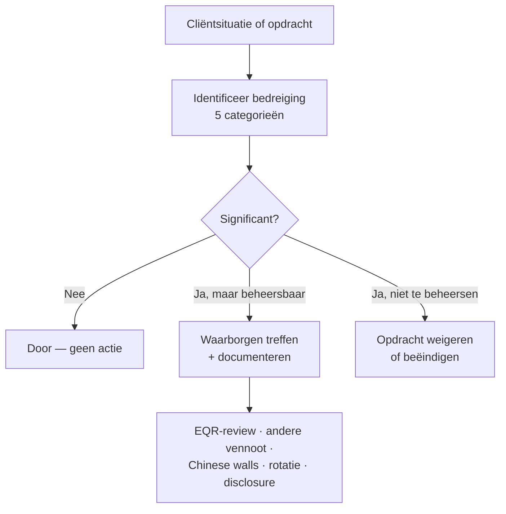
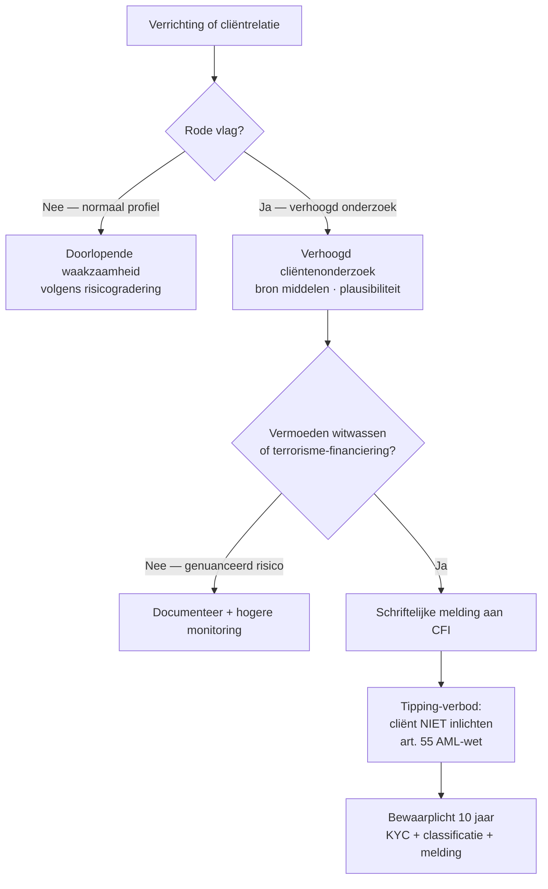
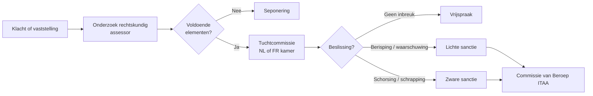

> **Samenvatting — kapstok voor herhaling.** Enkele A4 die het hele PO samenvatten in vaste blokken: vijf beginselen, threats-and-safeguards, opdrachtcyclus, drie sporen aansprakelijkheid, AML-cyclus, tucht en valkuilen. Bedoeld om in de week vóór het examen nog snel door te lopen — niet om voor het eerst te leren. Voor uitleg en doorwerking: de zes leerstukken van dit leerpad. Voor verhaal en routekaart: [[studiemateriaal/4-0|minicursus PO 4.0]].

---

## 1. Take-away — wat je écht moet weten

- **Vijf fundamentele beginselen** sturen elk professioneel oordeel: integriteit · objectiviteit · vakbekwaamheid en zorgvuldigheid · vertrouwelijkheid · professioneel gedrag. **Onafhankelijkheid** is een verbijzondering van objectiviteit voor zekerheidsopdrachten — feitelijk én in schijn.
- **Threats-and-safeguards**: elke situatie eerst toetsen aan vijf bedreigingen (self-interest · self-review · advocacy · familiariteit · intimidatie). Aanvaardbaar mits gepaste waarborgen, anders opdracht weigeren.
- **Beroepsgeheim is strafrechtelijk gesanctioneerd** (art. 458 SW, 1-3 jaar + boete). Drie sporen aansprakelijkheid lopen *cumulatief*: burgerrechtelijk (art. 44 ITAA-wet) + strafrechtelijk + tuchtrechtelijk (Hoofdstuk 8 ITAA-wet).
- **AML-cyclus in 4 fases**: identificeren (KYC + UBO) → risicogradering → doorlopende waakzaamheid → bij vermoeden melden aan CFI *zonder cliënt te tippen*. Cash-cap = 3.000 EUR (Wet 18-09-2017).
- **Opdrachtbrief verplicht voor *elke* opdracht** (art. 42 ITAA-wet) — geen uitzonderingen. Bij dossieroverdracht: **predecessor contacteren vóór aanvaarding**, geen aanbrengcommissie.

---

## 2. Vergelijking — vijf beginselen vs onafhankelijkheid

De vijf beginselen gelden voor **elke** opdracht; onafhankelijkheid is een verbijzondering die alléén voor zekerheidsopdrachten geldt.

| Beginsel / vereiste | Geldt voor wie? | Concretisering | Bron |
|---|---|---|---|
| **Integriteit** | Élke opdracht, élk lid | Eerlijk + oprecht; standpunt durven innemen tegen cliënt-belang in | IESBA Section 111 |
| **Objectiviteit** | Élke opdracht | Geen vooroordeel / belangenconflict / ongeoorloofde beïnvloeding | IESBA Section 112 |
| **Vakbekwaamheid + zorgvuldigheid** | Élke opdracht | Kennis op peil + werk volgens standaarden — opdracht weigeren bij ontbreken expertise | IESBA Section 113 |
| **Vertrouwelijkheid** | Élke opdracht (zelfs ná einde mandaat) | Geen openbaarmaking / gebruik buiten mandaat; strafrechtelijk via art. 458 SW | IESBA Section 114 + art. 458 SW |
| **Professioneel gedrag** | Élke opdracht + privé-handelen dat het beroep raakt | Wet + reglement naleven; geen handeling die beroep in diskrediet brengt | IESBA Section 115 |
| **Onafhankelijkheid** *(verbijzondering)* | Zekerheidsopdrachten (audit, review, andere assurance) | *Mind*: geesteshouding zonder beïnvloeding · *Appearance*: geen redelijke derde mag twijfelen | IESBA Section 400.4 |

---

## 3. Vijf bedreigingen voor onafhankelijkheid (IESBA Section 120)

| Bedreiging | Wat? | Klassiek voorbeeld |
|---|---|---|
| **Self-interest** (eigenbelang) | Financieel of persoonlijk belang in cliënt | Honorarium-afhankelijkheid (één cliënt > 30 % kantooromzet); aandelenbezit in cliënt |
| **Self-review** (zelftoetsing) | Eigen werk later opnieuw moeten beoordelen | Boekhouding zelf voeren én daarna willen controleren |
| **Advocacy** (belangenbehartiging) | Cliënt-standpunt verdedigen alsof eigen | Fiscale geschillenadvocaat én commissaris voor dezelfde cliënt |
| **Familiariteit** | Te nauwe relatie met cliënt-management | Echtgenoot is zaakvoerder cliënt; langjarige opdracht zonder rotatie |
| **Intimidatie** | Druk om oordeel aan te passen | Cliënt dreigt met opzegging of klacht als oordeel niet gunstig is |

> **Noot.** **Waarborgen** *(safeguards)*: andere vennoot doet opdracht · EQR-reviewer · Chinese walls · rotatie · schriftelijke disclosure · in laatste instantie: opdracht weigeren.

---

## 4. Threats-and-safeguards — beslisboom

---

## 5. Opdrachtcyclus — wat moet vóór wat?

| Fase | Wat gebeurt er? | Documenteren |
|---|---|---|
| **1. Pre-aanvaarding** | KYC (cliënt + UBO) · integriteits-check · bekwaamheidstoets · onafhankelijkheidstoets · AML-risicoclassificatie | Aanvaardings-memo + threats-analyse |
| **2. Opdrachtbrief** | Schriftelijk vastleggen vóór start (art. 42 ITAA-wet) — verplicht voor élke opdracht type | Ondertekend door beide partijen |
| **3. Uitvoering** | Doorlopende waakzaamheid (AML + ethiek) · supervisie · dossieropbouw · ISQM-kwaliteitscontroles | Werkdossier + AML-fiche actueel |
| **4. Beëindiging** | Voorafgaande opzeg (typisch 3m) · cliënt informeren over gevolgen · confraternele overdracht aan opvolger | Slot-memo + dossier-overdracht-bewijs |

> **Noot.** Bij overname van confrater: **predecessor schriftelijk contacteren** vóór aanvaarding — geen aanbrengcommissie (verboden).

---

## 6. Drie sporen aansprakelijkheid — cumulatief, niet alternatief

Eén feit kan in alle drie de sporen aansprakelijkheid genereren. De accountant verdedigt zich apart in elk spoor.

| Spoor | Grondslag | Sanctie | Wie stelt in? |
|---|---|---|---|
| **Burgerrechtelijk** | Art. 44 ITAA-wet + opdrachtbrief (contractueel) of art. 1382 BW (buitencontractueel) | Schadevergoeding — gedekt door verplichte beroepsaansprakelijkheidsverzekering (min. ITAA-cap) | Cliënt of derde (bv. bank die op JR afging) |
| **Strafrechtelijk** | Specifieke misdrijven: art. 458 SW (beroepsgeheim) · art. 196 SW (valsheid) · art. 322 SW (medeplichtigheid) | Boete + gevangenisstraf | Parket |
| **Tuchtrechtelijk** | Hoofdstuk 8 Wet 17-03-2019 (ITAA-wet) | Berisping → waarschuwing → schorsing → schrapping | Tuchtcommissie ITAA (klacht of ambtshalve) |

> **Noot.** Tegenover de tuchtoverheid geldt het beroepsgeheim **niet** (vaste rechtspraak Cassatie). Naar derden buiten de drie sporen blijft het geheim absoluut.

---

## 7. Beroepsgeheim — wat valt er onder, wat niet?

| Categorie | Onder beroepsgeheim? | Voorbeeld |
|---|---|---|
| Interne nota's accountant | ✅ Ja | Threats-analyse, AML-fiche, opdrachtbrief |
| Communicatie met cliënt over inhoud | ✅ Ja | E-mails over fiscale optimalisatie |
| Timesheets | ✅ Ja | Identificeren de cliënt |
| Dagboeken + rekeningen cliënt zelf | ❌ Nee *(maar contractueel beschermd)* | Originele factuur cliënt |
| Bewijsstukken cliënt | ❌ Nee *(idem)* | Bankafschrift, contract |
| Jaarrekening na NBB-neerlegging | ❌ Nee (publiek) | Geconsolideerde JR online raadpleegbaar |

> **Noot.** **Uitzonderingen op het beroepsgeheim** (limitatief): rechtsgetuigenis · parlementaire onderzoekscommissie · tuchtonderzoek · CFI-melding (AML-wet) · vraag van bevoegde fiscale ambtenaar met aangepaste basis · uitdrukkelijke schriftelijke cliënt-toelating.

---

## 8. AML — vier fases per cliëntrelatie

| Fase | Wat doet de accountant? | Sleutel-drempel / wet |
|---|---|---|
| **1. Identificatie (KYC)** | Cliënt + lasthebbers + UBO identificeren via eID, KBO, UBO-register | Wet 18-09-2017 art. 21-32 |
| **2. Risicogradering** | Laag / standaard / hoog risico op basis van sector + geografie + structuur + opdracht-type | Risicogebaseerde benadering — art. 19 |
| **3. Doorlopende waakzaamheid** | Transacties monitoren op consistentie met cliëntprofiel; verhoogd onderzoek bij rode vlaggen | Permanent — geen wachttermijn |
| **4. Melding CFI** | Schriftelijke melding bij vermoeden witwassen of terrorisme-financiering — *geen tipping cliënt* | Art. 47-50 + tipping-verbod art. 55 |

> **Noot.** Cash-cap = **3.000 EUR** (art. 67 AML-wet) · Bewaarplicht = **10 jaar** voor KYC-stukken, risicoclassificatie, melding-bewijs · AMLCO = verantwoordelijke voor beleid en CFI-meldingen.

---

## 9. AML — beslisboom voor verdachte transactie

---

## 10. Tuchtprocedure ITAA — vier stappen + beroep

---

## 11. Kwaliteitsmechanismen + permanente vorming

| Mechanisme | Wat? | Frequentie / drempel |
|---|---|---|
| **ISQM 1** — kantoorniveau | Kwaliteitsmanagementsysteem (8 componenten) op kantoor | Permanent · jaarlijkse evaluatie |
| **ISQM 2** — opdrachtniveau (EQR) | Engagement Quality Review door onafhankelijke reviewer bij hoog-risico-opdrachten | Per relevante opdracht |
| **ITAA-kwaliteitstoetsing** | Externe peer review door ITAA-toetser — kantoor-organisatie + opdrachten-steekproef + vormings-bewijs | Aankondiging min. 2 maanden vooraf · cyclus ~6 jaar |
| **Permanente vorming** | Vakbekwaamheid op peil houden via erkende activiteiten | **120 uur per 3 jaar** + min. **20 uur per jaar** |

> **Noot.** Tucht-doorverwijzing kan ontstaan uit kwaliteitstoetsing-rapport, ITAA-Raad-vaststelling, klacht cliënt of derde, of procureur-generaal.

---

## 12. Klassieke valkuilen (examen-radar)

| Valkuil | Wat klopt er niet | Wat klopt wél |
|---|---|---|
| "Onafhankelijkheid geldt voor élke opdracht" | Onafhankelijkheid is een *verbijzondering* voor zekerheidsopdrachten — niet voor samenstellings- of advies-opdrachten | **Objectiviteit** geldt voor élke opdracht. Onafhankelijkheid alleen bij audit / review / assurance. |
| "Cash-cap = 3.000 EUR is een AML-meldingsdrempel" | De cap is een **verbod** op cash-betalingen boven 3.000 EUR — geen meldingsdrempel | CFI-melding gebeurt bij *vermoeden* van witwassen (geen vast bedrag). Cash-cap is een separate verbodsregel met eigen sanctie. |
| "Ik mag aan de fiscus alles vertellen wat hij vraagt" | Het beroepsgeheim is absoluut tegenover de fiscus, behalve bij bevoegde ambtenaar met aangepaste wettelijke basis | Cliënt informeren, cliënt zelf de info laten geven, of schriftelijke uitdrukkelijke toelating cliënt — anders weigeren. |
| "Bij tucht mag ik me beroepen op beroepsgeheim" | Tegenover de tuchtoverheid geldt het beroepsgeheim *niet* (vaste Cassatie-rechtspraak) | Volledige medewerking met rechtskundig assessor verplicht — wel via beroep op rechten van verdediging. |
| "Aanbrengcommissie naar collega is OK bij overdracht" | Aanbrengcommissie is *verboden* onder ITAA-deontologie — voor zowel de aanbrenger als de ontvanger | Predecessor schriftelijk contacteren · cliënt-instemming · geen vergoeding voor het 'aanbrengen' zelf. |
| "Retentierecht laat me alle dossierstukken achterhouden bij wanbetaling" | Eigendomsstukken cliënt (originele facturen, statuten, bankafschriften) blijven cliënt-eigendom — minstens kopie ter beschikking | Alleen *werkdocumenten kantoor* mogen na ingebrekestelling effectief worden achtergehouden — en deontologisch ingeperkt door zorgplicht. |
| "Permanente vorming = 40 uur per jaar" | Norm is **120 uur over 3 jaar** met minimum 20 uur per individueel jaar | Concentratie in één jaar mag — mits totaal 120/3 jaar én minimum 20/jaar gehaald wordt. |

---

## 13. Verdieping

### Leerstukken — voor pedagogische opfris

Werkt iets niet meer scherp? Klik door naar het leerstuk dat het uitwerkt:

- [[wat-is-het-accountantsberoep]] — titel, instituut, monopolieopdrachten, normen-hiërarchie
- [[deontologische-beginselen-en-onafhankelijkheid]] — vijf beginselen + threats-and-safeguards + onafhankelijkheid + onverenigbaarheden
- [[opdrachtaanvaarding-en-clientenrelatie]] — intake-procedure, opdrachtbrief, kantoorvoering, dossieroverdracht, retentierecht
- [[beroepsgeheim-en-aansprakelijkheid]] — reikwijdte geheim + uitzonderingen + drie sporen aansprakelijkheid + verzekeringsplicht
- [[antiwitwasplichten-in-de-praktijk]] — AML-cyclus (4 fases), KYC, UBO, CFI-melding, tipping-verbod, cash-cap, bewaarplicht
- [[kwaliteitstoezicht-en-tucht]] — ISQM 1 + 2 · kwaliteitstoetsing ITAA · tuchtprocedure · permanente vorming

### Concept-fiches — voor definitorisch detail

Voor wie een wettekst-pointer of nauwkeurige definitie zoekt:

**Beroep & instituut** — [[gecertificeerd-accountant]] · [[itaa-beroepsorganisatie]] · [[normbronnen]] · [[opdracht-types]]

**Fundamentele beginselen** — [[deontologie]] · [[onafhankelijkheid]]

**Cliëntenrelatie & kantoor** — [[opdrachtaanvaarding-en-opdrachtbrief]] · [[kantoor-organisatie]] · [[retentierecht-accountant]]

**Geheim & aansprakelijkheid** — [[beroepsgeheim]] · [[beroepsaansprakelijkheid]]

**Antiwitwas** — [[antiwitwaspreventie]]

**Kwaliteit & tucht** — [[kwaliteitsmanagement-opdracht]] · [[kwaliteitstoetsing-itaa]] · [[tuchtprocedure-itaa]] · [[permanente-vorming]]

---

*Samenvatting PO 4.0. Status: nieuw — gebouwd vanuit de zes leerstukken, vervangt de oude cluster-themafiches (antiwitwas-praktijk, beroepsgeheim-en-aansprakelijkheid, deontologische-beginselen, opdrachtaanvaarding-en-tucht) per ADR-039.*
