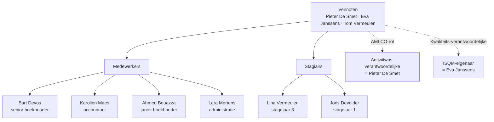

> **Leerstuk — één vraag, helemaal doorgewerkt.** Dit is de entry-fiche voor PO 4.0: vóór je over deontologie, opdrachtbrieven of antiwitwasplichten leert, moet je weten wie de hoofdpersoon van dit hele PO is en onder welke regels hij werkt. De volgende leerstukken bouwen voort op het vocabulaire dat hier wordt neergezet — "gecertificeerd accountant", "ITAA", "monopolieopdracht", "normbronnen". Voor verhaal en routekaart: [[studiemateriaal/4-0|overzicht PO 4.0]].

## Antwoord in één blik

Een **gecertificeerd accountant** is een natuurlijke of rechtspersoon die ingeschreven is in het openbaar register van het **ITAA** — het Belgische beroepsinstituut dat in 2019 ontstond uit de fusie van het oude IAB en BIBF. De titel is wettelijk beschermd: wie hem voert zonder inschrijving pleegt een strafbaar feit. Naast gewone advies-, samenstellings- en fiscale opdrachten heeft de gecertificeerd accountant een **monopolie** op een handvol opdrachten — expertise, attesterende verslagen en andere wettelijk voorbehouden verslagen.

Eén instituut, drie petten: het ITAA *reglementeert* (normen + register), *controleert* (kwaliteitstoetsing + tucht) én *vertegenwoordigt* (de beroepsstand). Op elke opdracht rusten **zes lagen normbronnen** — van de wet bovenaan tot de tuchtrechtspraak onderaan. Bij elk dossier vraag je: welke laag levert de regel? Een hogere laag wijkt nooit voor een lagere; een lagere mag wel verfijnen of strenger maken.

We werken de vier vragen achtereen uit op het kantoor De Smet & Partners — beroep, instituut, normen, opdrachten — zodat je bij elk volgend leerstuk weet wie er handelt onder welke regels.

---

## Wie is de gecertificeerd accountant?

Stel je het kantoor voor: drie vennoten met ITAA-titel, vijf medewerkers en twee stagiairs. Pieter De Smet, Eva Janssens en Tom Vermeulen dragen de titel; Lina en Joris staan midden in hun stagetraject; Bart Devos voert al twaalf jaar boekhoudingen, maar zonder ITAA-titel. Wie binnen dit kantoor wat mag doen, hangt niet af van de werkplek — het hangt af van de titel.

Een **gecertificeerd accountant** is een natuurlijke persoon óf rechtspersoon die in het openbaar register van het ITAA is ingeschreven met die hoedanigheid, op grond van de Wet van 17 maart 2019. Die titel komt er niet vanzelf. Het toelatingstraject is cumulatief: een universitair diploma, slagen voor het toelatingsexamen, drie jaar stage onder een erkende stagemeester, het bekwaamheidsexamen, en ten slotte een eedaflegging. Lina zit in het derde stagejaar; Pieter, met vijftien jaar anciënniteit, heeft het traject volledig doorlopen.

Het verschil tussen wie de titel draagt en wie hem nog niet draagt is geen formaliteit. Het bepaalt wat je mag tekenen en welke opdrachten je zelfstandig mag uitvoeren. De volgende tabel zet de kantoorbewoners naast elkaar.

| Wie? | Mag boekhouding voeren? | Mag fiscaal advies geven? | Mag attesterende opdracht doen? | Mag handtekening delegeren bij monopolie-opdracht? |
|---|---|---|---|---|
| **Volwaardig gecertificeerd accountant** (Pieter, Eva, Tom) | Ja | Ja | Ja | Neen |
| **Stagiair gecertificeerd accountant** (Lina, Joris) | Ja, onder stagemeester | Ja, onder stagemeester | Neen — alleen bijstaan | n.v.t. |
| **Boekhouder zonder ITAA-titel** (Bart Devos) | Ja (voor eigen erkenning of als werknemer ITAA-kantoor) | Beperkt | Neen | n.v.t. |
| **Bedrijfsrevisor (IBR-lid)** | Geen typische opdracht | Ja, mits geen cumul | Ja, op wettelijke controle | Neen |

De stagiair mag de meeste activiteiten uitvoeren die de wet aan de gecertificeerd accountant toekent — máár enkel onder de verantwoordelijkheid van zijn stagemeester en uitdrukkelijk *niet* voor de monopolieopdrachten. Die blijven exclusief voor de volwaardig gecertificeerd accountant. Lina mag dus een boekhouding voeren en een fiscale aangifte voorbereiden, maar zij mag niet zelfstandig een inbrengverslag ondertekenen.

> **Een terminologie-nuance om vroeg op te pikken.** De oude titels "accountant" en "accountant-belastingconsulent" uit de pre-2019-wetgeving zijn formeel vervangen door "gecertificeerd accountant" en "gecertificeerd belastingadviseur". Wie vóór 2019 was ingeschreven, is automatisch omgezet via een overgangsbepaling. Examenmateriaal of vakliteratuur van vóór 2019 dat "IAB" of "accountant" noemt, lees je dus als "ITAA" respectievelijk "gecertificeerd accountant". Inhoudelijk gaat het over hetzelfde beroep — de naamgeving werd door de fusie van IAB en BIBF in één instituut hertekend.

---

## Wat is het ITAA?

Het Instituut van de Belastingadviseurs en de Accountants is de instantie waar de gecertificeerd accountant zijn beroepsregels vandaan haalt, waar hij zijn permanente vorming verantwoordt en — desnoods — waar hij voor zijn handelen rekenschap aflegt. Het ITAA draagt drie petten tegelijk: het is *poort* (wie tot het beroep toetreedt loopt via de stagecommissie), *referentiekader* (normen + permanente vorming) én *toezichthouder* (kwaliteitstoetsing + tucht).

De structuur van het instituut is op één blik te overzien. De algemene vergadering — alle ingeschreven leden — kiest een Raad van zestien leden plus voorzitter en ondervoorzitter, met een driejarig mandaat, paritair tussen Nederlandstaligen en Franstaligen en tussen gecertificeerd accountants en gecertificeerd belastingadviseurs. Die Raad benoemt uit zijn midden een uitvoerend comité voor het dagelijks bestuur en stelt verschillende commissies in.

Vijf van die commissies kom je in dit PO meermaals tegen. De tabel zet ze naast elkaar, met telkens een verwijzing naar het leerstuk waar het onderwerp wordt uitgewerkt.

| Orgaan | Samenstelling (grof) | Bevoegdheid voor PO 4.0 | Uitgewerkt in |
|---|---|---|---|
| **Algemene vergadering** | Alle ingeschreven leden (geen stagiairs) | Verkiezing Raad + bijdragen + procedurekosten | — |
| **Raad ITAA** | Voorzitter + ondervoorzitter + 16 leden — 3-jarig mandaat | Normen + reglementen + register | Doorheen alle leerstukken |
| **Stagecommissie** | Door Raad benoemd | Toelating beroep + opvolgen stage + bekwaamheidsexamen | — |
| **Cel Permanente Vorming** | Paritair NL/FR + GA/GBA | Controle bijscholings-uren | [[kwaliteitstoezicht-en-tucht]] |
| **Commissie kwaliteitstoetsing** | Door Raad benoemd + magistraat-voorzitter | Periodieke peer review | [[kwaliteitstoezicht-en-tucht]] |
| **Tuchtcommissie + Commissie van Beroep** | Magistraten + beroepsbeoefenaars | Tuchtonderzoek + sancties + beroep | [[kwaliteitstoezicht-en-tucht]] |

Eén onderscheid blijft cruciaal en keert telkens terug: **ITAA is niet hetzelfde als IBR**. Het ITAA, opgericht door de Wet van 17 maart 2019, verenigt de gecertificeerd accountants en gecertificeerd belastingadviseurs. Het Instituut van de Bedrijfsrevisoren, opgericht door de Wet van 7 december 2016, verenigt de bedrijfsrevisoren — diegenen die de wettelijke audit uitvoeren. Twee aparte instituten, twee aparte registers, twee aparte tuchtsporen. Een bedrijfsrevisor kan *niet* tegelijk gecertificeerd belastingadviseur worden: die cumul is wettelijk uitgesloten. Tussen beide instituten bestaan wel confraternele gedragslijnen voor opdrachten die ze samen behandelen, zoals fusies, splitsingen en inbreng in natura.

In De Smet & Partners zie je dit verschil concreet. Pieter is gecertificeerd accountant *en* gecertificeerd belastingadviseur — die cumul binnen het ITAA is wel toegestaan. Tom is alleen gecertificeerd belastingadviseur, Eva alleen gecertificeerd accountant. Bart Devos is geen ITAA-lid en kan dus geen vennoot worden — alleen werknemer.

---

## Zes lagen normbronnen rusten op elke opdracht

Een jonge accountant stelt zich bij elk nieuw dossier dezelfde vraag: *in welke tekst staat dit?* Het antwoord ligt zelden in één bundel. Op elke opdracht rusten zes lagen normbronnen, en wie weet welke laag actief is voor zijn vraag, vindt de regel binnen vijf minuten in plaats van een uur. De zes lagen, van boven naar onder:

| Laag | Inhoud | Voorbeeld voor PO 4.0 |
|---|---|---|
| **1. Wet** | Parlementaire wet — bovenste laag | Wet 17 maart 2019 (ITAA) + Wet 18 september 2017 (AML) |
| **2. KB** | Uitvoeringsbesluit | KB 9 december 2019 (deontologische code ITAA) |
| **3. Reglement ITAA** | Door Raad ITAA, na publicatie in Staatsblad | Reglement antiwitwasprocedure ITAA |
| **4. ITAA-norm** | Beroepsnorm voor specifieke opdrachten | Norm-opdrachtbrief, Norm permanente vorming, Norm intern kwaliteitsbeheer |
| **5. Internationale standaard** | IFAC / IAASB / IESBA — toegepast via verwijzing in ITAA-norm | IESBA Code of Ethics, ISA 210, ISQM 1 + 2, ISRE 2400 |
| **6. Tuchtrechtspraak** | Beslissingen tuchtcommissie + Commissie van Beroep — interpretatieve laag | Uitspraken over confraternele dossieroverdracht, ereloon-billijkheid |

De eerste laag, de **wet**, is het kader. De ITAA-wet bepaalt wie het beroep mag uitoefenen, welke titel hij draagt, welke opdrachten aan hem zijn voorbehouden, welke onverenigbaarheden gelden, hoe de organen van het ITAA zijn samengesteld en welke tuchtsancties mogelijk zijn. Daarnaast spelen sectorwetten een rol: het Wetboek van Vennootschappen en Verenigingen, het Wetboek van de inkomstenbelastingen, Boek III en XX van het Wetboek van Economisch Recht, en de Antiwitwaswet uit 2017.

De tweede laag bestaat uit **koninklijke besluiten** die de wet concretiseren. Voor de stagiair zijn er twee om te onthouden. Het KB van 9 december 2019 bevat de huidige deontologische code van het ITAA, op grond van de delegatie in de ITAA-wet. Daarnaast leeft het oudere KB van 1 maart 1998 — het reglement van plichtenleer der accountants — nog actief door: het is niet integraal vervangen, en bepalingen zoals het verbod op delegatie van de handtekening bij monopolieopdrachten en het ronselverbod sturen vandaag nog de praktijk.

De derde laag bevat de **reglementen** die de Raad van het ITAA zelf uitvaardigt — bijvoorbeeld het reglement permanente vorming of het reglement kwaliteitstoetsing — gepubliceerd in het Belgisch Staatsblad. Daarboven, in laag vier, vind je de **ITAA-beroepsnormen**: technische normen voor specifieke opdracht-types, zoals de norm opdrachtbrief, de norm samenstellingsopdrachten (gebaseerd op de internationale ISRS 4410), de norm intern kwaliteitsmanagement, de norm antiwitwas en de norm permanente vorming. Een ITAA-norm wordt door de Raad goedgekeurd na advies van de Hoge Raad voor de Economische Beroepen — als die binnen drie maanden geen advies uitbrengt, geldt zijn advies als gunstig.

Laag vijf — de **internationale standaarden** van IAASB en IESBA (ISA, ISRE, ISRS, ISAE, de Code of Ethics) — heeft op zichzelf geen bindende werking in België. Ze worden bindend zodra een ITAA-norm of een KB ernaar verwijst. Eén belangrijke uitzondering: voor beursgenoteerde EU-groepen zijn IFRS en IAS rechtstreeks bindend via een Europese verordening uit 2002. Onderaan, in laag zes, de **tuchtrechtspraak**: beslissingen van de tuchtcommissie en de Commissie van Beroep ITAA, plus cassatie-arresten over tucht-zaken. Geen formele precedentwerking, maar wel de facto richtinggevend; geanonimiseerde uitspraken zijn beschikbaar via het ITAA.

De synthese is eenvoudig en kun je bij elk dossier toepassen: **een hogere laag wijkt nooit voor een lagere; een lagere mag wel verfijnen of strenger maken**. Een ITAA-norm kan de wet niet wegmaken, maar wel concretiseren of bovenop de wettelijke minimumeis een strengere praktijkregel leggen. Drie voorbeelden van hoe meerdere lagen samenvallen op één onderwerp:

| Onderwerp | Welke lagen actief? | Concrete tekst |
|---|---|---|
| Opdrachtbrief verplicht stellen | Laag 1 + 2 + 4 | ITAA-wet → KB plichtenleer → ITAA-norm-opdrachtbrief |
| Threats-and-safeguards-cyclus | Laag 2 + 4 + 5 | KB 9-12-2019 → ITAA-norm intern kwaliteitsmanagement → IESBA Code Section 120 |
| Melding bij vermoeden van witwassen | Laag 1 + 3 + 4 | Antiwitwaswet 18-09-2017 → reglement AWW → ITAA-norm AWW |
| Permanente vorming 120u/3jr | Laag 4 | ITAA-norm permanente vorming |

---

## Welke opdracht-types voert hij uit?

De gecertificeerd accountant levert twee grote families van werk. De ene kant is **niet-assurance**-werk: boekhouding voeren, fiscale aangiften opstellen, advies geven, samenstellingsopdrachten uitvoeren. De andere kant is **assurance**-werk — opdrachten waarbij hij in de een of andere mate zekerheid verschaft over financiële informatie. Het onderscheid is niet zomaar typologisch. Het bepaalt het zekerheidsniveau dat hij in zijn verslag uitspreekt, de norm waaronder hij werkt, en zijn aansprakelijkheid.

Zoom je in op de zekerheidsladder, dan zie je vier types, in dalende volgorde van zekerheid. **Controle** geeft een redelijke mate van zekerheid en mondt uit in een positief oordeel ("getrouw beeld"); de internationale ISA-standaarden vormen het kader. **Beoordeling** ("review") geeft beperkte zekerheid en mondt uit in een conclusie in negatieve vorm ("niets is gebleken"); de ISRE 2400 / 2410 staan hier centraal. **Samenstelling** geeft geen zekerheid — de accountant vermeldt enkel dat de informatie samengesteld is, in lijn met de ISRS 4410. Dit is de meest courante kmo-opdracht. **Overeengekomen procedures** (in het Engels: agreed-upon procedures of AUP) leveren ook geen zekerheid; de accountant rapporteert puur feitelijke bevindingen volgens de afgesproken procedures, op grond van de ISRS 4400.

Eén afbakening is voor de stagiair belangrijk. Drie van de vier types kan de gecertificeerd accountant zelf uitvoeren. **Controle in de strikte zin — de wettelijke commissaris-opdracht boven de WVV-groottecriteria — is voorbehouden aan de bedrijfsrevisor.** Die opdracht hoort daarom thuis in PO 1.6 ("Commissaris"), waar je het ISA-stelsel in diepte leert.

Naast deze zekerheidsladder bestaat er een aparte groep: de **monopolieopdrachten**. De ITAA-wet behoudt een handvol opdrachten exclusief voor de gecertificeerd accountant. Het gaat om drie categorieën:

| Categorie | Voorbeelden | Reden monopolie |
|---|---|---|
| **Expertise** | Gerechtelijk expertiseverslag inzake boekhouding; expertise bij vereffening of omvorming | Gerecht of overheid vereist een beëdigd professional |
| **Attesterende opdrachten** | Inbrengverslag in natura, omzettingsverslag (WVV), quasi-inbreng | Bescherming van derden / kapitaalbehoud |
| **Andere wettelijk voorbehouden** | Bijzondere wettelijk vereiste verslagen, attestering jaarrekening kleine vzw | Wet wijst expliciet aan |

Op die monopolieopdrachten rusten vier strikte discipline-regels. Eerst en vooral is de **handtekening niet delegeerbaar**: de natuurlijke persoon — gecertificeerd accountant ondertekent zelf. Ten tweede zijn de **essentiële elementen niet overdraagbaar** aan derden. Ten derde mag de accountant zich enkel laten **bijstaan** door andere ITAA-leden, stagiairs of vaste medewerkers van het kantoor — niet door externen. En ten vierde geldt het **ronselverbod**: de vergoeding voor een monopolieopdracht mag in geen enkel opzicht afhankelijk zijn van andere diensten die hetzelfde kantoor aan dezelfde of een verbonden onderneming levert.

Een let-op-de-randen: pure boekhouding voeren is *geen* monopolie. Dat kan ook door een erkende boekhouder of door de eigen administratie van de onderneming. Het monopolie zit specifiek in expertise, attestering en wettelijk voorbehouden verslagen.

| Type opdracht | Zekerheidsniveau | Norm-stelsel | Wie voert uit? |
|---|---|---|---|
| Wettelijke controle (commissaris) | Redelijk — "getrouw beeld" | ISA + ITAA-KMO-controlenorm | **Bedrijfsrevisor (IBR)** — niet ITAA-accountant |
| Vrijwillige controle / beoordeling (review) | Beperkt — "niets gebleken" | ISRE 2400 + ITAA-KMO-controlenorm | Gecertificeerd accountant + bedrijfsrevisor |
| Samenstelling | Geen | ISRS 4410 + ITAA-norm samenstelling | Gecertificeerd accountant — meest courante KMO-opdracht |
| Overeengekomen procedures | Geen — alleen feiten | ISRS 4400 | Gecertificeerd accountant + bedrijfsrevisor |
| Bijzondere wettelijke verslagen (inbreng in natura, omzetting, quasi-inbreng) | Attestering volgens wet | WVV + ITAA-norm bijzondere mandaten | **Monopolie gecertificeerd accountant** — niet delegeerbaar |

In De Smet & Partners zie je deze typologie elke maand bewegen. Voor Aurelia Industries doet het kantoor een samenstellingsopdracht — geen zekerheid, ISRS 4410. Voor Vrolijke Hap voert het de gewone boekhouding plus de BTW- en VenB-aangiften — gewoon dienstverleningswerk. En in 2025 stelde Pieter een omzettingsverslag op voor een cliënt die zijn BVBA omvormde naar een BV — een monopolieopdracht, die hij zelf moest ondertekenen, niet kon delegeren aan een collega-vennoot.

---

## Drie valkuilen

> **Valkuil 1 — "accountant" en "gecertificeerd accountant" als inwisselbare termen.** Sinds 2019 bestaat één wettelijk beschermde titel: "gecertificeerd accountant" (of "gecertificeerd belastingadviseur"). De oude termen uit de pre-2019-wet zijn formeel vervangen. Als je op een examenvraag het woord "accountant" leest, vraag jezelf meteen: *staat dat hier als wettelijke term of als algemeen woord?* Alleen "gecertificeerd accountant" is wettelijk.

> **Valkuil 2 — ITAA en IBR verwarren.** Twee aparte instituten, twee aparte wetten, twee aparte registers, twee aparte tuchtsporen. ITAA verenigt gecertificeerd accountants en belastingadviseurs; IBR verenigt bedrijfsrevisoren — diegenen die wettelijke audits uitvoeren. Cumul tussen beide hoedanigheden is uitgesloten. Confraterneliteits-gedragslijnen regelen hun samenwerking bij gedeelde opdrachten zoals fusies of inbrengen.

> **Valkuil 3 — handtekening delegeren bij een monopolieopdracht.** Dat verbod uit het KB plichtenleer is hard: bij attesterende verslagen, expertise en andere wettelijk voorbehouden opdrachten ondertekent de aangeduide natuurlijke persoon zelf. Bijstand door medewerkers is toegelaten, de handtekening niet. Wie het toch delegeert, riskeert tuchtmaatregelen en mogelijk nietigheid van het verslag.

---

## Wanneer je dit snapt, ga dan naar

- [[deontologische-beginselen-en-onafhankelijkheid]] — De vijf beginselen die op elke opdracht rusten (integriteit, objectiviteit, vakbekwaamheid, vertrouwelijkheid, professioneel gedrag), plus onafhankelijkheid als strengere standaard voor assurance-opdrachten. Met de threats-and-safeguards-cyclus.
- [[opdrachtaanvaarding-en-clientenrelatie]] — Hoe je een nieuwe cliënt opneemt: intake, opdrachtbrief, kantoorvoering en beëindiging incl. confraternele overdracht.
- [[kwaliteitstoezicht-en-tucht]] — Welke mechanismen naleving afdwingen: kwaliteitsmanagement op kantoor, ITAA-kwaliteitstoetsing, tuchtprocedure en permanente vorming.
- [[studiemateriaal/4-0/samenvatting|Samenvatting PO 4.0]] — voor herhaling vlak vóór het examen: beroepsstructuur, organen-tabel en normbronnen-hiërarchie op één pagina.

## Doorklik naar concepten

Voor wie definitorisch detail wil opzoeken:

- [[gecertificeerd-accountant]] · [[itaa-beroepsorganisatie]]
- [[normbronnen]] · [[opdracht-types]]

---

## Wettelijk fundament

- Beroepsstatuut + titel + toelatingsvoorwaarden: Wet 17 maart 2019 (ITAA-wet) art. 3 + 10 + 13 + 16 (art. 3 = beroepsactiviteiten; art. 10 = toelatingsvoorwaarden; art. 13 = stage; art. 16 = stagiair-grenzen).
- Monopolieopdrachten — voorbehouden activiteiten: Wet 17 maart 2019 art. 3, 6° tot 8° (expertise + attesterende opdrachten + andere wettelijk voorbehouden). Discipline-regels in KB plichtenleer art. 16-17 + 30.
- Onverenigbaarheden + objectieve uitvoering: Wet 17 maart 2019 art. 48 (algemene basis voor de onverenigbaarheden-leer; uitgewerkt in [[deontologische-beginselen-en-onafhankelijkheid]]).
- ITAA als instituut + organen + register: Wet 17 maart 2019 art. 29 + 32 + 65 + 69 + 70 (openbaar register, algemene vergadering, Raad, uitvoerend comité).
- Cumul-verbod ITAA ↔ IBR: Wet 17 maart 2019 art. 10 §5 (bedrijfsrevisor kan niet om hoedanigheid gecertificeerd belastingadviseur verzoeken).
- Deontologische code als KB: KB 9 december 2019 (deontologische code ITAA), op grond van art. 49 ITAA-wet (uitgewerkt in [[deontologische-beginselen-en-onafhankelijkheid]]).
- Plichtenleer — oudere KB nog deels in voege: KB 1 maart 1998 — Reglement van plichtenleer art. 16 + 17 + 30 (niet vervangen; art. 16 = verbod handtekening-delegatie; art. 17 = bijstand alleen door medewerkers; art. 30 = ronselverbod).
- Publiek toezicht — Hoge Raad voor de Economische Beroepen: Wet 17 maart 2019 art. 80 (adviezen op nieuwe ITAA-normen; geen advies binnen 3 maanden = geacht gunstig).
- IFRS rechtstreekse bindendheid voor beursgenoteerde EU-groepen: Verordening (EG) 1606/2002 art. 2 (uitzondering op de regel dat internationale standaarden alleen via verwijzing bindend zijn).
- Drempel-bedragen (bijv. minimum beroepsaansprakelijkheidsverzekering, cash-cap antiwitwaswet): zie Cijferzakboekje.

---

*Leerstuk PO 4.0. Status: voorgesteld — POC volgens ADR-037.*
