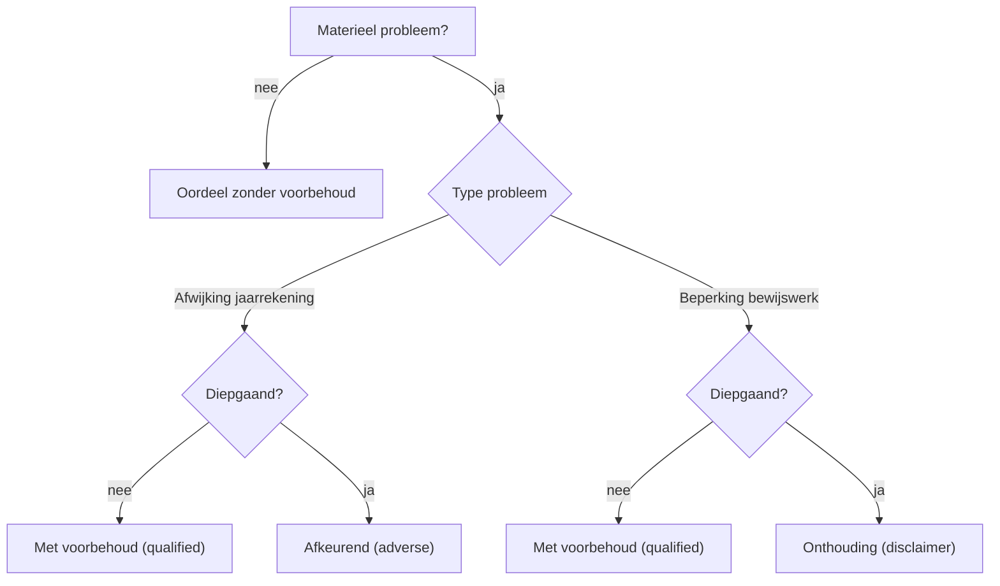
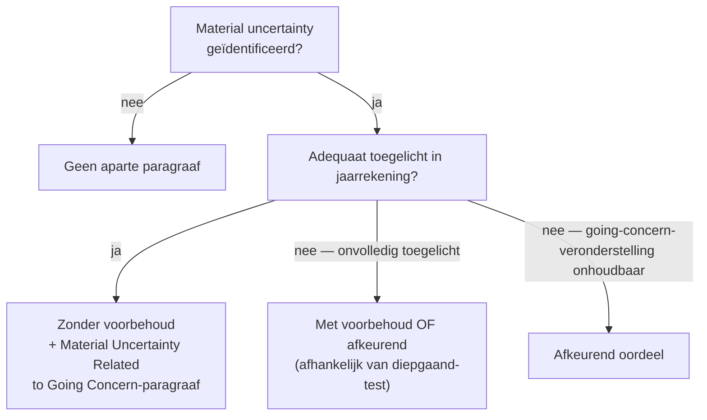

> ⚠️ **Voorlopig — themafiche-laag wordt uitgefaseerd.** Per **ADR-039** vervangt één PO-samenvatting per programmaonderdeel de cluster-themafiches. Deze fiche blijft beschikbaar tot het relevante PO een leerpad krijgt — dan migreert de inhoud naar `content/studiemateriaal/<po-slug>/samenvatting.md`. Voor cross-PO themafiches (vergelijkingen tussen verschillende PO's) volgt een aparte beslissing per fiche: incorporeren in alle relevante samenvattingen, óf upgraden naar concept-fiche.

> **Themafiche — kapstok voor herhaling.** Vier oordeel-types + materieel-diepgaand-matrix + KAM + going-concern op één pagina. Voor verhaal en routekaart: [[studiemateriaal/1-6|overzicht PO 1.6]].

---

## Take-away

- **Oordeel volgt uit twee assen**: is de afwijking *materieel*? Is ze *diepgaand* (pervasive)?
- **Onthouding is geen veilige optie** — signaleert dat auditor geen oordeel kan vormen; markt-impact identiek aan afkeurend
- **Emphasis of Matter ≠ aangepast oordeel** — EOM benadrukt iets dat correct is toegelicht; vervangt nooit een voorbehoud
- **KAM = significante aandachtspunten** voor de controle, geen probleem-lijst — verplicht voor genoteerde entiteiten (ISA 701)
- **Going-concern-onzekerheid → adequaat toegelicht ⇒ zonder voorbehoud + Material Uncertainty-paragraaf**; niet automatisch voorbehoud

---

## Beslis-matrix — oordeel bij afwijking of beperking

|  | **Materieel** | **Materieel én diepgaand (pervasive)** |
|---|---|---|
| **Afwijking** (bewijs is verzameld; jaarrekening klopt niet) | Oordeel **met voorbehoud** (qualified) | **Afkeurend** oordeel (adverse) |
| **Beperking** (auditor kan onvoldoende bewijs verzamelen) | Oordeel **met voorbehoud** (qualified) | **Onthouding** van oordeel (disclaimer) |
| **Geen materieel probleem** | Oordeel **zonder voorbehoud** (unqualified) | — |

**Diepgaand** (pervasive) = ofwel niet beperkt tot specifieke posten · ofwel wel beperkt maar essentieel deel jaarrekening · ofwel essentieel voor begrip jaarrekening (ISA 705 §5).

---

## Beslisboom — welk oordeel?

---

## Bouwstenen van de verklaring (ISA 700)

| Sectie | Inhoud | Standaard |
|---|---|---|
| **Adressering + titel** | Aan wie? Welke entiteit? | ISA 700 |
| **Opinion paragraph** | Voert het oordeel — kop eerst | ISA 700 |
| **Basis for opinion** | Basis + onafhankelijkheid + ethiek | ISA 700 |
| **Material Uncertainty (going concern)** | Indien adequaat toegelicht maar significant twijfel | ISA 570 |
| **Key Audit Matters (KAM)** | Significante aandachtspunten voor de controle | ISA 701 (verplicht beursgenoteerd) |
| **Emphasis of Matter (EOM)** | Wijst op iets correct toegelicht maar fundamenteel | ISA 706 |
| **Other Matter (OM)** | Andere kwestie relevant voor begrip controle | ISA 706 |
| **Responsibilities** | Management · governance · auditor | ISA 700 |
| **Other Information** | Verslagonderdelen buiten jaarrekening | ISA 720 |

---

## Going-concern — flow (ISA 570 herzien)

**Belangrijk**: significant twijfel + adequate toelichting ⇒ géén voorbehoud (anders dan vroegere praktijk).

---

## Andere assurance-verslagen (ISAE/ISRE/ISRS)

| Opdracht-type | Zekerheidsniveau | Verklarings-vorm |
|---|---|---|
| Audit (ISA 700) | Redelijke | Positief geformuleerd |
| Review (ISRE 2400) | Beperkte | Negatief geformuleerd ("we hebben geen redenen om te denken dat...") |
| ISAE 3000-serie | Redelijke OF beperkte | Subject-matter-afhankelijk (prognoses · ESG · interne controle) |
| ISRS 4400 AUP | Geen zekerheid | Feitelijke bevindingen (factual findings only) |

---

## ⚠️ Valkuilen

| Valkuil | Wat klopt er niet | Wat klopt wél |
|---|---|---|
| Onthouding als 'veilige optie' | Bij twijfel altijd disclaimer = risicoloos | Disclaimer signaleert geen oordeel mogelijk — markt-impact identiek aan afkeurend |
| EOM als compromis voor moeilijk oordeel | Gevoelige zaak ⇒ EOM toevoegen als verzachting | EOM mag NIET dienen om aangepast oordeel te vermijden (ISA 706 §8b) |
| Going-concern-twijfel = altijd voorbehoud | Significant continuïteitstwijfel ⇒ automatisch qualified | Bij adequate toelichting: zonder voorbehoud + Material Uncertainty-paragraaf (ISA 570) |
| KAM = probleem-lijst | Kernpunten zijn waar controle 'vastliep' | KAM = meest significante aandachtspunten voor de controle, niet 'problemen' (ISA 701) |
| Voorbehoud zonder vermelding alternatief | Qualified-paragraaf zegt 'we kunnen het niet weten' | Auditor moet beschrijven *wat* de afwijking/beperking is + impact kwantificeren waar mogelijk |
| Diepgaand = groot bedrag | Pervasive = enkel hoge eurowaarde | Pervasive = niet beperkt tot posten · OF essentieel voor jaarrekening · OF essentieel voor begrip (ISA 705 §5) |

---

## Doorklik — losse concept-fiches

**Kern-record**
- [[controleverklaring]] — 4 oordeel-types + KAM + EOM + going-concern
- [[audit-afronding]] — fase die uitmondt in verklaring

**ISA-kapstok**
- [[isa-overzicht]] — alle ISA's per audit-fase

**Verwante themafiches**
- [[themafiches/controleopdracht-aanpak|Themafiche — Controleopdracht-aanpak (4 fases)]]
- [[themafiches/opdracht-types|Themafiche — Opdracht-types & zekerheidsniveaus]]
- [[themafiches/continuiteit-en-diagnose|Themafiche — Continuïteit & diagnose]] (cross PO 1.3/1.9)

---

*Themafiche afgeleid uit cluster controle-opdracht (PO 1.6). Status: voorgesteld.*
