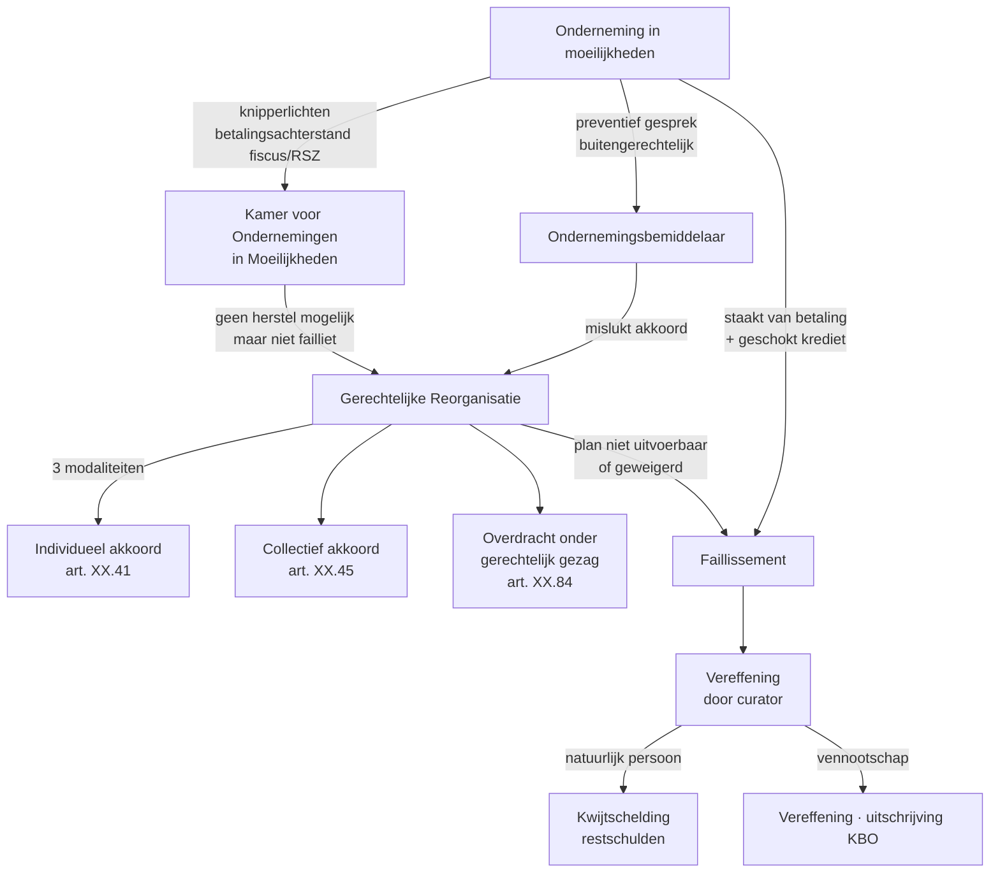

> ⚠️ **Voorlopig — themafiche-laag wordt uitgefaseerd.** Per **ADR-039** vervangt één PO-samenvatting per programmaonderdeel de cluster-themafiches. Deze fiche blijft beschikbaar tot het relevante PO een leerpad krijgt — dan migreert de inhoud naar `content/studiemateriaal/<po-slug>/samenvatting.md`. Voor cross-PO themafiches (vergelijkingen tussen verschillende PO's) volgt een aparte beslissing per fiche: incorporeren in alle relevante samenvattingen, óf upgraden naar concept-fiche.

> **Themafiche — kapstok voor herhaling.** WER Boek XX framework: vroegtijdige opsporing → gerechtelijke reorganisatie (3 modaliteiten) → faillissement. Plus rol accountant. Voor verhaal en routekaart: [[studiemateriaal/3-0|overzicht PO 3.0]].

---

## Take-away

- **Boek XX ≠ enkel faillissement** — covereert opsporing (Kamer OOM), preventie (bemiddelaar), reorganisatie (GR) én liquidatie (faillissement)
- **GR = procedure van bescherming**, niet vrijwaring van bestuurder — wrongful trading-aansprakelijkheid blijft
- **Accountant heeft meldingsplicht** richting bestuur bij ernstige continuïteits-feiten (gewichtige en overeenstemmende feiten — art. XX.23 WER)
- **Verschoonbaarheid is voor natuurlijke personen**; vennootschap-faillissement leidt tot vereffening, niet "second chance"
- **Hoger beroep schorst niet** automatisch — faillissementsvonnis is uitvoerbaar bij voorraad

---

## Insolventie-cyclus — vier stations

**Twee voorwaarden faillissement** (art. XX.99 WER): staking van betaling **én** geschokt krediet — cumulatief.

---

## Gerechtelijke reorganisatie — drie modaliteiten

| Modaliteit | Wie beslist? | Opschorting | Wanneer kiezen? |
|---|---|---|---|
| **Individueel akkoord** (art. XX.41) | Onderneming + min. 2 schuldeisers | Schorsing executie | Beperkte schuldeisers-kring · vertrouwelijk |
| **Collectief akkoord** (art. XX.45) | Onderneming + meerderheid schuldeisers (per categorie) | Algemene opschorting | Bredere schuldeisers-groep · plan voor herstructurering |
| **Overdracht onder gerechtelijk gezag** (art. XX.84) | Gerechtsmandataris organiseert overdracht | Algemene opschorting | Onderneming niet meer levensvatbaar als geheel, wel onderdelen |

**Plan-homologatie**: rechter homologeert **niet automatisch** bij meerderheidsgoedkeuring — toetst plan-haalbaarheid + naleving openbare orde + gelijkheid schuldeisers.

**Opschorting** beschermt tegen executie + uitwinning. Geldt voor schuldeisers in opschorting; niet voor nieuwe schulden tijdens GR.

---

## Rol accountant + meldingsplicht (art. XX.23 WER)

| Trigger | Plicht accountant | Termijn |
|---|---|---|
| Gewichtige en overeenstemmende feiten die continuïteit bedreigen | Schriftelijk aan bestuur — onderbouwd | Onverwijld |
| Bestuur reageert niet of weigert maatregelen | Schriftelijk aan voorzitter ondernemingsrechtbank (Kamer OOM) | Binnen redelijke termijn |
| Aanhoudende betalingsachterstand fiscus/RSZ ≥ 6 maand | Vermoeden gewichtige feiten | Bij elke vaststelling |
| Cliënt-faillissement is geen einde rol | Mandaat blijft m.b.t. open dossiers (boekhouding · aangiftes · facturen vóór faillissement) | Loopt tot eindrekening curator |

**Onverenigbaarheid**: wanneer accountant melding deed aan Kamer OOM, voorzichtigheid in voortzetting opdracht — risico belangenconflict.

**Vrijwaring beroepsgeheim**: meldingsplicht art. XX.23 = wettelijke uitzondering op art. 458 Sw.

---

## Faillissement — sleutelstappen

| Stap | Actor | Output |
|---|---|---|
| 1. Aangifte | Bestuur (binnen 1 maand na staking) of vordering schuldeiser/parket | Faillissements-vonnis |
| 2. Aanstelling curator | Rechtbank | Curator beheert massa |
| 3. Aangifte schuldvorderingen | Schuldeisers (termijn in vonnis) | Toelating tot massa |
| 4. Verificatie + verkoop activa | Curator | Boedel-actief |
| 5. Verdeling | Curator volgens rangorde (voorrechten · achterstellingen) | Uitkering schuldeisers |
| 6. Sluiting | Rechtbank | Vereffening vennootschap of kwijtschelding NP |

**Hoger beroep schorst niet** — vonnis uitvoerbaar bij voorraad; curator zet werk voort.

**Verschoonbaarheid** (art. XX.173 WER): enkel natuurlijke personen → kwijtschelding restschulden mits "te goeder trouw". Vennootschappen worden vereffend.

---

## ⚠️ Valkuilen

| Valkuil | Wat klopt er niet | Wat klopt wél |
|---|---|---|
| Boek XX = enkel faillissement | Covereert opsporing → preventie → reorganisatie → faillissement | Vier stations; faillissement is laatste fase |
| GR = vrijwaring bestuurder | Wrongful trading-aansprakelijkheid (art. XX.225) blijft; GR ≠ schild voor fouten | Bestuurder moet ook tijdens GR zorgvuldig handelen; verkeerd boekjaar-verlengen → aansprakelijkheid |
| Meerderheid schuldeisers = automatische homologatie GR | Rechter toetst nog plan-haalbaarheid + openbare orde + gelijke behandeling | Plan zonder vooruitzicht wordt geweigerd, ook bij meerderheid |
| Onderneming in moeilijkheden fiscaal = WER | Fiscaal art. 2 WIB92 = eigen criteria; WER = continuïteits-criteria | Beide kunnen samenlopen maar zijn niet identiek; aparte toetsen |
| Hoger beroep tegen faillietvonnis schorst procedure | Uitvoerbaar bij voorraad; curator zet werk voort | Beroep heroriënteert mogelijk; intussen blijft de massa beheerd |
| Verschoonbaarheid voor failliete vennootschap | Enkel natuurlijke personen — vennootschap wordt vereffend | Verschoonbaarheid geeft kwijtschelding restschulden aan ondernemer-NP, niet aan rechtspersoon |
| Faillissement = einde rol accountant | Mandaat blijft voor open dossiers + samenwerking curator | Boekhouding afsluiten · btw-aangiftes finaliseren · jaarrekening laatste periode · loonbrieven sluiten |

---

## Doorklik — losse concept-fiches

**Framework + opsporing**
- [[insolventierecht-wer-boek-xx]] — WER boek XX overzicht + 3 procedures
- [[kamers-voor-ondernemingen-in-moeilijkheden]] — vroegtijdige opsporing + meldingsplicht
- [[ondernemingsbemiddelaar]] — buitengerechtelijke tussenpersoon

**Procedures**
- [[gerechtelijke-reorganisatie]] — 3 modaliteiten + opschorting + homologatie
- [[faillissement]] — voorwaarden + cyclus + curator + rol accountant
- [[reorganisatie]] — overkoepelend bij WVV-reorganisatie

**Adjacent**
- [[ontbinding-en-vereffening]] — vrijwillige vereffening (niet via faillissement)
- [[rehabilitatie-en-beroepsverbod]] — gevolgen + opheffing

**Verwante themafiches**
- [[themafiches/kapitaalbescherming-en-alarmbel|Themafiche — Kapitaalbescherming & alarmbel]]
- [[themafiches/continuiteit-en-diagnose|Themafiche — Continuïteit & diagnose]] (PO 1.9, knipperlichten + ratio's)

---

*Themafiche afgeleid uit cluster insolventie (PO 3.0). Status: voorgesteld.*
