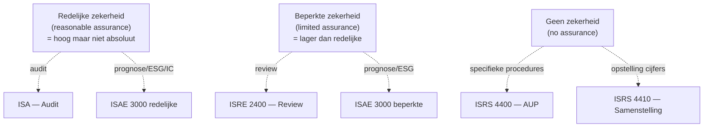

> ⚠️ **Voorlopig — themafiche-laag wordt uitgefaseerd.** Per **ADR-039** vervangt één PO-samenvatting per programmaonderdeel de cluster-themafiches. Deze fiche blijft beschikbaar tot het relevante PO een leerpad krijgt — dan migreert de inhoud naar `content/studiemateriaal/<po-slug>/samenvatting.md`. Voor cross-PO themafiches (vergelijkingen tussen verschillende PO's) volgt een aparte beslissing per fiche: incorporeren in alle relevante samenvattingen, óf upgraden naar concept-fiche.

> **Themafiche — kapstok voor herhaling.** Vijf dienstverlenings-types + zekerheidspiramide + verklarings-vorm op één pagina. Voor verhaal en routekaart: [[studiemateriaal/1-6|overzicht PO 1.6]].

---

## Take-away

- **Drie assurance-niveaus**: redelijke (audit) · beperkte (review/ISAE limited) · géén (AUP/samenstelling)
- **Verklarings-vorm volgt zekerheidsniveau**: positief (audit) · negatief (review) · feitelijk (AUP) · zonder oordeel (samenstelling)
- **Samenstelling ≠ assurance** — accountant ordent cijfers maar controleert niet (ISRS 4410)
- **AUP-procedures zijn cliënt-specifiek** — niet vergelijkbaar met "klein audit"; rapport bevat enkel feitelijke bevindingen (ISRS 4400)
- **ISAE 3000-serie** dekt assurance over *andere* informatie dan jaarrekening — prognoses · ESG · interne controle bij dienstverlener

---

## Vergelijkings-matrix — vijf opdracht-types

| Dimensie | **Audit** (ISA) | **Review** (ISRE 2400) | **ISAE 3000+** | **AUP** (ISRS 4400) | **Samenstelling** (ISRS 4410) |
|---|---|---|---|---|---|
| **Zekerheid** | Redelijke | Beperkte | Redelijke OF beperkte | Geen | Geen |
| **Subject** | Historische jaarrekening | Historische jaarrekening | *Andere* informatie (ESG · prognose · IC) | Specifieke posten / aspecten | Historische jaarrekening (opstelling) |
| **Procedures** | Risk-based; volledig bewijswerk | Cijferanalyse + inquiry overwegend | Subject-matter-afhankelijk | Vooraf overeengekomen met cliënt | Geen verificatie — enkel ordenen |
| **Verklaring** | Positief geformuleerd | Negatief ("geen redenen om te denken") | Subject-matter-afhankelijk | Factual findings only | "Samengesteld op basis van" |
| **Wie?** | Commissaris/revisor; gecert. accountant (KMO) | Idem | Idem (subject-matter expertise) | Idem | Gecert. accountant typisch |
| **Onafhankelijkheid** | Verplicht | Verplicht | Verplicht | Vereist (compliance) | Geen assurance-onafhankelijkheid |

---

## Zekerheidspiramide

---

## Normenkader-piramide

| Laag | Normenkader | Voorbeeld |
|---|---|---|
| **Internationaal** | IFAC-standaarden (IAASB) | ISA · ISRE · ISAE · ISRS |
| **Nationaal kwaliteitskader** | ITAA-normen + ISQM | KMO-controlenorm · Algemene controlenorm · ISQM 1/2 |
| **Beroepscode** | ITAA-deontologie + IESBA | Onafhankelijkheid · objectiviteit · vertrouwelijkheid |
| **Wet** | WVV + Wet 17/3/2019 | Commissaris-mandaat · monopolie-opdrachten · bijzondere mandaten |

**België-specifiek**: ITAA-normen primeren in B-context; ISA-toepassing via verwijzing.

---

## Welk opdracht-type bij welke vraag?

| Cliënt-vraag | Opdracht-type | Why? |
|---|---|---|
| "Geef zekerheid over jaarrekening" | Audit (ISA) | Hoogste zekerheid; wettelijk verplicht bij groot-grote vennootschap |
| "Geef beperkte zekerheid — sneller, goedkoper" | Review (ISRE 2400) | KMO-context; bv. voor financiering of overname-discussie |
| "Geef zekerheid over duurzaamheidsrapport / ICOFR / prognose" | ISAE 3000-serie | Niet-historische informatie |
| "Check enkele specifieke saldi / kostenposten" | AUP (ISRS 4400) | Cliënt + derde-gebruiker definiëren scope vooraf |
| "Stel mijn jaarrekening op uit boekhouding" | Samenstelling (ISRS 4410) | Geen assurance; deliverable = jaarrekening + samenstellingsverklaring |

---

## ⚠️ Valkuilen

| Valkuil | Wat klopt er niet | Wat klopt wél |
|---|---|---|
| Samenstelling = light assurance | Samenstelling met "kleine" verklaring | Samenstelling is *geen* assurance; accountant verifieert niet (ISRS 4410 par. 7) |
| Negatief oordeel = positief oordeel light | Review-verklaring = audit-verklaring "voor kmo" | Negatieve formulering reflecteert beperkter bewijswerk; bv. cijferanalyse + inquiry, geen substantive procedures volledig |
| AUP als 'klein audit' | Auditor kiest zelf welke procedures | AUP-procedures vooraf overeengekomen met cliënt (en evt. derde); géén oordeel, enkel feitelijke bevindingen |
| ISAE 3000 = "audit op alles" | Eén standaard voor alle assurance | Subject-matter-afhankelijk; bv. ISAE 3402 (servicebureau) · ISAE 3410 (broeikasgas) · ISAE 3000 herzien (residueel) |
| Alle bedrijfsrevisor-opdrachten = audit | Revisor doet alleen audits | Revisor kan ook ISAE/review/AUP/bijzondere mandaten uitvoeren; gecert. accountant óók review + samenstelling + AUP |

---

## Doorklik — losse concept-fiches

**Kern-record**
- [[opdracht-types]] — vergelijking + normenkader-piramide
- [[controleopdracht]] — audit-flow per fase
- [[beoordeling-cyclus]] — review (ISRE 2400)
- [[isae-opdracht]] — assurance over andere informatie
- [[overeengekomen-procedures-opdracht]] — AUP (ISRS 4400)

**Context**
- [[isa-overzicht]] — ISA-kapstok per fase
- [[opdrachtaanvaarding-en-opdrachtbrief]] — aanvaarding + opdrachtbrief per type
- [[kwaliteitsmanagement-opdracht]] — ISQM 1/2

**Verwante themafiches**
- [[themafiches/controleopdracht-aanpak|Themafiche — Controleopdracht-aanpak]]
- [[themafiches/controleverklaring|Themafiche — Controleverklaring]]
- [[themafiches/bijzondere-mandaten|Themafiche — Bijzondere mandaten]]

---

*Themafiche afgeleid uit cluster controle-opdracht (PO 1.6). Status: voorgesteld.*
