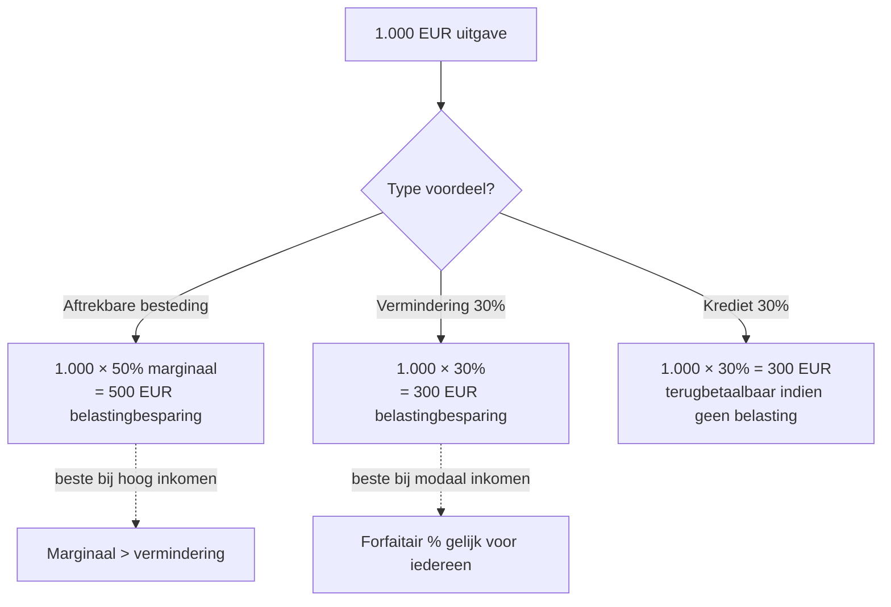

> ⚠️ **Voorlopig — themafiche-laag wordt uitgefaseerd.** Per **ADR-039** vervangt één PO-samenvatting per programmaonderdeel de cluster-themafiches. Deze fiche blijft beschikbaar tot het relevante PO een leerpad krijgt — dan migreert de inhoud naar `content/leerpaden/<po-slug>/samenvatting.md`. Voor cross-PO themafiches (vergelijkingen tussen verschillende PO's) volgt een aparte beslissing per fiche: incorporeren in alle relevante samenvattingen, óf upgraden naar concept-fiche.

> **Themafiche — kapstok voor herhaling.** Drie verschillende fiscale gunsten — aftrek van inkomen, vermindering van belasting, terugbetaalbaar krediet — met verschillende impact en cumul-regels. Federaal ↔ gewestelijk = de tweede splitsing. Voor verhaal en routekaart: [[leerpaden/2.2|minicursus PO 2.2]].

---

## Take-away

- **Aftrek ≠ vermindering ≠ krediet** — een aftrekbare besteding daalt het belastbaar inkomen (marginale impact); een vermindering vermindert de belasting (vaak forfaitair %); een belastingkrediet kan terugbetaalbaar zijn
- **Federaal ↔ gewestelijk** sinds Bijz. Wet Financiering — verminderingen vallen onder federaal OF onder het gewest van fiscale woonplaats op 1/1
- **Aftrekbare besteding werkt via marginaal tarief** (typisch 50% bij hoger inkomen → 50% × besteding = belastingbesparing); vermindering werkt via vast % (vaak 30% of 45%)
- **Onderhoudsuitkering is symmetrisch** — 80% aftrekbaar bij betaler ↔ 80% belastbaar als divers inkomen bij ontvanger
- **Aanvullende gemeentebelasting krijgt GEEN vermindering** (art. 468 lid 3 WIB) — frequente examenstrik

---

## Drie mechanismen — hoe verschillen ze?

| Mechanisme | Werkt op | Voordeel | Voorbeeld |
|---|---|---|---|
| **Aftrekbare besteding** | Belastbaar inkomen (BIG) | Marginaal tarief (25-50%) | Onderhoudsuitkering betaald, giften erkende instellingen |
| **Belastingvermindering** | Hoofdsom belasting | Forfaitair % (typisch 30% of 45%) | Pensioensparen, dienstencheques, woonbonus (gewest) |
| **Belastingkrediet** | Berekende belasting | Volledig (eventueel terugbetaalbaar) | Werknemersbonus laaglonen, kind ten laste met verhoging |

---

## Verschil in impact — voorbeeld 1000 EUR besteding

---

## Aftrekbare bestedingen (XI) — overzicht

| Besteding | % aftrek | Bron | Bijzonderheid |
|---|---|---|---|
| Onderhoudsuitkering betaald | 80% | Art. 104 WIB | Symmetrisch met ontvanger (divers inkomen) |
| Giften erkende instellingen (federaal) | 100% (drempel + plafond) | Cijferzakboekje | Min. 40 EUR per begunstigde |
| Bezoldiging huispersoneel | (gevallen-specifiek) | Cijferzakboekje | Beperkt regime |
| Andere kleinere aftrekken | div | KB-WIB | Cijferzakboekje |

---

## Federale vs gewestelijke belastingverminderingen

| Federaal (XIII fed) | Gewestelijk (XIII gewest) |
|---|---|
| Pensioensparen (30%) | Woonbonus / geïntegreerde woonbonus (per gewest) |
| Langetermijnsparen (30%) | Energiebesparende investeringen (per gewest) |
| Dienstencheques (federaal deel) | Dienstencheques (gewestelijk deel) |
| Giften erkende instellingen (federale lijst) | Win-winlening (Vlaanderen) |
| Auteursrecht-regime (sinds 2023 hervormd) | Vlabel-verminderingen (Vl): adoptie, schenking aan goede doelen |
| Kapitaalaflossing hypothecaire lening (overgangsregime) | Renovatie · isolatie · dakwerken (per gewest) |

⚠️ Concrete percentages, plafonds en drempels: **Cijferzakboekje bij examen** verplicht. Drempels verschillen tussen Vlaanderen, Brussel en Wallonië.

---

## Vergelijkingsmatrix gewesten — woonbonus (richting)

| Aspect | Vlaanderen | Brussel | Wallonië |
|---|---|---|---|
| Woonbonus nieuw | Afgeschaft sinds 2020 (overgangsregime tot 2024) | Afgeschaft sinds 2017 | Afgeschaft sinds 2017 |
| Vervangregime | Geen — vrijstelling KI eigen woning | Abattement registratierechten (verhoogd) | Wooncheque (chèque-habitat) |
| Bestaande dossiers | Lopende contracten behouden voordeel tot einde looptijd (max 20 jaar) | Idem | Idem (over te schakelen?) |

---

## Belastingkrediet — wanneer terugbetaalbaar?

| Krediet | Terugbetaalbaar? | Wie? |
|---|---|---|
| Werkbonus laaglonen | Ja | Werknemer onder loondrempel |
| Krediet kind ten laste (verhoging) | Ja (deel) | Gezinnen onder BVS-drempel |
| Verrekenbare RV (Belgische dividenden niet bevrijdend aangegeven) | Ja (geheel) | Bij overschot t.o.v. PB |
| Buitenlandse RV (via DBV) | Beperkt verrekenbaar | Cf. DBV-bepalingen |
| Forfait beroepskosten | Nee (= aftrek, niet krediet) | Iedereen met beroepsinkomen |

---

## ⚠️ Valkuilen

| Valkuil | Wat klopt er niet | Wat klopt wél |
|---|---|---|
| Aftrek + vermindering dubbel toepassen | Cumul-regels per regime | Niet dubbel: zelfde besteding kan niet én aftrekken én verminderen tenzij wettelijk voorzien |
| AGB verminderen | Art. 468 lid 3: GEEN verminderingen op AGB | Verminderingen werken alleen op PB Staat + gewest |
| Federale pensioensparen op Vlabel toepassen | Federaal vs gewestelijk | Federale verminderingen onafhankelijk van gewest |
| Woonbonus nog beschikbaar voor nieuwe leningen | Afgeschaft (per gewest, verschillende data) | Alleen overgangsregime voor bestaande contracten |
| Onderhoudsuitkering 100% aftrekken | 80% bij betaler ↔ 80% belast bij ontvanger | Symmetrie houden |
| Giften zonder erkenning aftrekken | Alleen erkende instellingen (lijst FOD/Vlabel) | Niet erkende = geen aftrek |
| Krediet en vermindering door elkaar gebruiken | Verschillende mechanismen | Krediet = volledig (mogelijk terugbetaalbaar); vermindering = % |

---

## Doorklik — losse concept-fiches

**Aftrekken**
- [[aftrekbare-bestedingen-pb]] — XI-aftrekken
- [[onderhoudsuitkering]] — symmetrisch 80%-regime

**Verminderingen**
- [[federale-belastingverminderingen-pb]] — pensioensparen + langetermijnsparen + giften
- [[gewestelijke-belastingverminderingen-pb]] — woonbonus + win-win + isolatie

**Eigen-woning-vrijstelling**
- [[eigen-woning-fiscaal]] — gewestelijke vrijstelling KI

**Verwante themafiches**
- [[themafiches/pb-berekeningsschema|Themafiche — PB-berekeningsschema]]
- [[themafiches/inkomstencategorieen|Themafiche — Inkomstencategorieën PB]]

---

*Themafiche afgeleid uit cluster personenbelasting (PO 2.2). Status: voorgesteld.*
