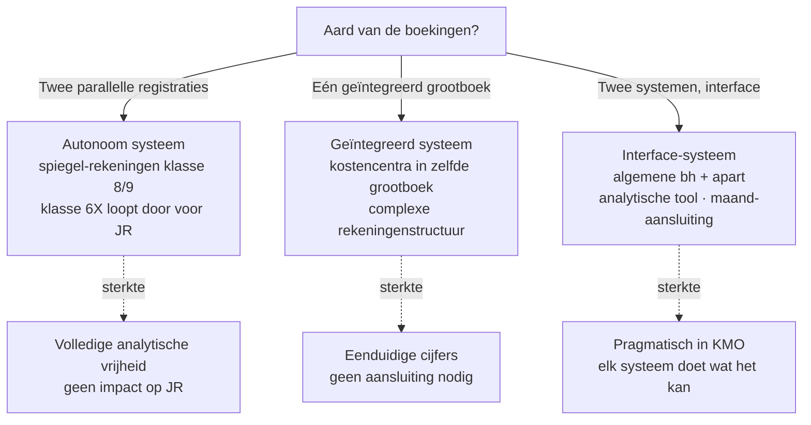

> **Themafiche — kapstok voor herhaling.** Hoe de analytische boekhouding zich *boekt* — klassen 8/9, drie registratiesystemen, kostentypologie. Voor verhaal en routekaart: [[leerpaden/1.8|minicursus PO 1.8]].

---

## Take-away

- **Algemene bh** rapporteert naar buiten (jaarrekening, fiscus); **analytische bh** stuurt naar binnen (kostprijs, marge per product)
- **Klasse 6 = naar aard** (loon, huur, afschrijving); **klasse 9X = naar bestemming** (welk product, welke afdeling) — twee assen op dezelfde werkelijkheid
- Klassen 8/9 zijn **spiegel-rekeningen** in autonoom systeem — sluiten niet mee in de wettelijke jaarrekening
- **Geen wettelijke verplichting** — vrijheid in opzet, maar rekenkundige beheersing is critical
- Drie registratiesystemen op een continuüm: autonoom · geïntegreerd · interface — keuze hangt af van automatisatie en sturings-behoefte

---

## Twee assen op dezelfde kost

| Aspect | **Algemene boekhouding** | **Analytische boekhouding** |
|---|---|---|
| Wettelijk verplicht? | ✅ Ja (WER + KB-WVV) | ❌ Nee — interne keuze |
| Primaire doel | Externe rapportering (fiscus, derden) | Interne sturing (calculatie, beslissing) |
| Indelings-as | Naar **aard** (klasse 6X: loon, huur, afschrijving) | Naar **bestemming** (klasse 9X: product, afdeling, klant) |
| Tijdshorizon | Boekjaar (afgesloten cijfers) | Continu (real-time sturing) |
| Toerekening overhead | Niet expliciet gevraagd | Centraal vraagstuk — sleutels + drivers |
| Audit-gevoelig? | ✅ Sterk | Indirect (via kostprijs-impact op voorraad/COGS) |

---

## Drie registratiesystemen

**Keuze-as**: hoe sterk willen we de twee werelden integreren? Hoe meer automatisering, hoe minder bezwaar tegen geïntegreerd.

---

## Kostentypologie — kruisen van assen

| | **Direct** | **Indirect** |
|---|---|---|
| **Variabel** | Grondstoffen · direct loon · provisie | Verbruiks-goederen werkplaats · energie productiehal |
| **Vast** | Specifieke machine-afschrijving · supervisor specifiek product | Algemene huur · administratie · IT · directie-loon |

**Vier kostbewijzingen, vier toerekenings-uitdagingen**:
- Direct + variabel = makkelijk (per eenheid)
- Direct + vast = pro-rata over normale productie
- Indirect + variabel = via verdelingssleutel (kostendrijver)
- Indirect + vast = pijnpunt — full vs direct vs ABC kiest hier verschillend

---

## ⚠️ Valkuilen

| Valkuil | Wat klopt er niet | Wat klopt wél |
|---|---|---|
| Klasse 9X mee opnemen in jaarrekening | Klassen 8/9 zijn intern — niet wettelijk JR-conform | Klasse 9X stopt bij de drempel JR; klasse 6X loopt door |
| Autonoom systeem zonder maand-aansluiting | Cijfers algemene en analytische bh divergeren onmerkbaar | Maandelijkse aansluiting verplicht — verschillen onderzoeken |
| Sleutel ≠ driver | Verdelings-sleutel = praktische vuistregel; cost-driver = causaal verband | ABC vereist drivers; full costing volstaat met sleutel |
| Indirect-vast "verstoppen" in overhead-pool | Maakt kostprijs onzuiver — verdeelde fictie | Onderscheid pure indirect-vast (periodekost) vs activity-gerelateerd (toewijsbaar) |
| Analytische bh "achteraf" voor budget | Sturing-doel vraagt actualiteit; te late cijfers = te laat reageren | Maand-cyclus is minimum; week of dag bij volume-intensieve operaties |

---

## Doorklik — losse concept-fiches

**Overkoepelend**
- [[analytische-boekhouding]] — cluster-hoofdrecord (kostentypologie, kostencomponenten, klasse 8/9, registratiesystemen, specifieke problemen)

**Verwante themafiches**
- [[themafiches/kostprijsmethoden|Themafiche — Kostprijsmethoden]] — keuze van calculatie-methode
- [[themafiches/break-even-en-marginale-analyse|Themafiche — Break-even & marginale analyse]] — instrumenten voor beslissingen
- [[themafiches/budget-en-variantieanalyse|Themafiche — Budget & variantieanalyse]] — vooraf en achteraf

---

*Themafiche afgeleid uit cluster analytische-boekhouding (PO 1.8). Status: voorgesteld.*
