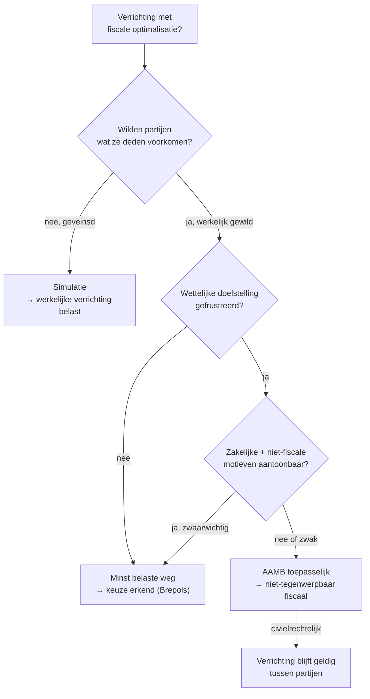

> **Themafiche — kapstok voor herhaling.** Drie figuren — minst belaste weg (toegelaten) · simulatie (verboden, civielrechtelijk) · AAMB (verboden, fiscaal-rechtelijk) — én hoe ze samenhangen. Voor verhaal en routekaart: [[leerpaden/2.1|minicursus PO 2.1]].

---

## Take-away

- **Drie figuren — drie tests** — minst belaste weg = vrije keuze tussen echt gewilde alternatieven; simulatie = veinzen; AAMB = wettelijk doel frustreren
- **Brepols-doctrine (1961)** — recht op minst belaste weg blijft het uitgangspunt; AAMB is de uitzondering, niet de regel
- **AAMB werkt fiscaal-rechtelijk, niet civielrechtelijk** — de verrichting blijft civielrechtelijk geldig; ze is alleen niet-tegenwerpbaar aan de fiscus
- **Tegenbewijs AAMB moet zwaarwichtig + contemporain zijn** — gedocumenteerd op het moment van de verrichting (board minutes, business plan, ratio's); achteraf-rationalisering werkt niet
- **ATAD-bepalingen (CFC · hybride · interest-aftrek)** zijn aparte anti-misbruik-tools naast AAMB — vergeet niet bij grensoverschrijdende structuren

---

## De drie figuren — vergelijkingsmatrix

| Aspect | Minst belaste weg | Simulatie | AAMB (art. 344 §1 WIB / art. 1 §10 WBTW) |
|---|---|---|---|
| **Status** | Toegelaten | Verboden | Verboden |
| **Wat is er aan de hand?** | Echt gewilde rechtshandeling, fiscaal voordelig | Geveinsde rechtshandeling — partijen wilden iets anders | Reëel gewilde handeling die wettelijk doel frustreert |
| **Bewijslast** | Bij fiscus om aan te tasten | Bij fiscus: bewijs van geveinsdheid | Bij fiscus: objectieve elementen die misbruik bewijzen |
| **Toetsing** | Brepols-test: vrije keuze tussen reële opties | Wilsverklaring vs werkelijke wil | Wettelijke doelstelling (ratio legis) gefrustreerd? |
| **Gevolg** | Geen — keuze wordt erkend | Werkelijke verrichting belast | Verrichting niet-tegenwerpbaar aan fiscus (civielrechtelijk geldig) |
| **Tegenbewijs** | n.v.t. | Geen — feitenvaststelling | Zakelijke + niet-fiscale motieven (zwaarwichtig, contemporain) |
| **Bron** | Brepols-arrest (1961) | Cassatie-rechtspraak | Art. 344 §1 WIB · art. 1 §10 WBTW · art. 18 §2 W.Reg. |

---

## Wanneer welke figuur? — beslisboom

---

## AAMB in detail (art. 344 §1 WIB)

| Element | Inhoud |
|---|---|
| **Tweetraps-test** | (1) Fiscus toont objectief misbruik aan (frustratie wettelijk doel) → (2) belastingplichtige levert tegenbewijs |
| **Objectief element** | Verrichting valt buiten het toepassingsgebied van een gunstregime, of net binnen — in strijd met de doelstelling |
| **Subjectief element** | Niet vereist — geen opzet aan te tonen door fiscus |
| **Tegenbewijs** | Niet-fiscale motieven: economische, financiële, organisatorische — zwaarwichtig en contemporain |
| **Sanctie** | Niet-tegenwerpbaarheid + heffing alsof de "normale" verrichting was gesteld |
| **Geen toepassing op** | Civielrechtelijke nietigheid (apart) · keuze tussen twee fiscaal voorziene opties zonder wettelijke doel-frustratie |

**Pendant BTW** (art. 1 §10 WBTW) — zelfde logica: hoofddoel of één van hoofddoelen = belastingvoordeel verkrijgen in strijd met BTW-richtlijn-doelstellingen.

---

## ATAD-bepalingen — aparte anti-misbruik-tools VenB

| Bepaling | Wat doet ze? | WIB-omzetting |
|---|---|---|
| **EBITDA-aftrekbeperking** | Interest-aftrek beperkt tot 30% EBITDA of 3 M€ | Art. 198/1 WIB |
| **CFC-regels** | Niet-uitgekeerde winst van laagbelaste buitenlandse dochter belasten bij Belgische moeder | Art. 185/2 WIB |
| **Hybride mismatches** | Geen dubbele aftrek of aftrek-zonder-inclusie via verschil in kwalificatie | Art. 198 10°/2-3 WIB |
| **Exit-tax** | Latente meerwaarden belasten bij zetelverplaatsing of activa-overdracht | Art. 210bis WIB |
| **GAAR-bepaling (ATAD)** | Algemene anti-misbruik — overlap met AAMB | Art. 344 §1 WIB |

---

## ⚠️ Valkuilen

| Valkuil | Wat klopt er niet | Wat klopt wél |
|---|---|---|
| Simulatie en AAMB gelijkstellen | Andere voorwaarden + bewijslast + gevolg | Simulatie = geveinsdheid (feitenvraag); AAMB = doel-frustratie (rechtsvraag) |
| AAMB als 'restbevoegdheid' op alles toepassen | Wettelijke doelstelling moet concreet gefrustreerd zijn | Een gunstige keuze tussen twee fiscaal voorziene opties zonder doelfrustratie ≠ misbruik |
| AAMB = civielrechtelijke nietigheid | Onjuist | AAMB werkt enkel fiscaal — verrichting blijft tussen partijen geldig |
| Tegenbewijs achteraf rationaliseren | Niet aanvaard | Tegenbewijs moet contemporain zijn (op moment verrichting gedocumenteerd) |
| ATAD vergeten bij grensoverschrijdende planning | Aparte tools naast AAMB | ATAD I + II: thin-cap (198/1), CFC (185/2), hybride (198 10°) raken vaak vóór AAMB |
| Minst belaste weg als blanco cheque | Brepols staat onder voorbehoud AAMB + simulatie | Vrije keuze tussen reële alternatieven; geen recht op kunstmatige constructie |

---

## Doorklik — losse concept-fiches

**De drie figuren**
- [[anti-misbruik]] — kader-record met overzicht en samenhang
- [[algemene-anti-misbruik-bepaling]] — AAMB art. 344 §1 WIB
- [[simulatie-leer]] — civielrechtelijke simulatie + Brepols-doctrine

**ATAD-cluster (VenB-specifiek)**
- [[ebitda-aftrekbeperking]] — art. 198/1 WIB
- [[atad-richtlijn]] — ATAD I + II overzicht
- [[abnormale-goedgunstige-voordelen]] — art. 26 + 79 WIB
- [[transfer-pricing]] — arm's length-beginsel

**Verwante themafiches**
- [[themafiches/fiscale-beginselen|Themafiche — Fiscale beginselen]] (realiteitsbeginsel)
- [[themafiches/dvb-ruling|Themafiche — DVB & ruling]] (vóór-zekerheid)

---

*Themafiche afgeleid uit cluster algemene-fiscale-beginselen (PO 2.1). Status: voorgesteld.*
