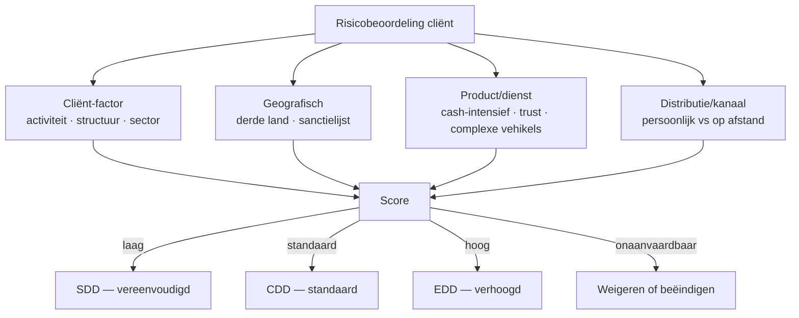

<div class="no-print">

> ⚠️ **Voorlopig — themafiche-laag wordt uitgefaseerd.** Per **ADR-039** vervangt één PO-samenvatting per programmaonderdeel de cluster-themafiches. Deze fiche blijft beschikbaar tot het relevante PO een leerpad krijgt — dan migreert de inhoud naar `content/studiemateriaal/<po-slug>/samenvatting.md`. Voor cross-PO themafiches (vergelijkingen tussen verschillende PO's) volgt een aparte beslissing per fiche: incorporeren in alle relevante samenvattingen, óf upgraden naar concept-fiche.

</div>

<div class="no-print">

> **Themafiche — kapstok voor herhaling.** AML-wet 18/9/2017 + ITAA-norm AWW: KYC bij aanvaarding · UBO-identificatie · risicogebaseerde benadering · CFI-melding zonder tipping-off · cap op contante betalingen. Voor verhaal en routekaart: [[studiemateriaal/4-0|overzicht PO 4.0]].

</div>

---

## Take-away

- **KYC vóór opdrachtaanvaarding** — niet na ondertekening opdrachtbrief; opdracht aanvaarden eerst = inbreuk
- **CFI-melding is wettelijke uitzondering op beroepsgeheim** (art. 458 Sw) — verplicht, niet optioneel · ITAA fungeert als filter (art. 90)
- **Tipping-off = strikt verboden** — cliënt mag niet weten dat melding gebeurde of in voorbereiding is
- **UBO ≠ bestuurder** — UBO is uiteindelijke begunstigde (> 25% kapitaal/stemrecht of feitelijke controle); fallback = hoger-leidinggevende
- **Contant-cap 3.000 EUR** (NP-NP buiten betalingsdienst-uitsluitingen) — ITAA-kantoor mag geen honoraria contant boven die grens aanvaarden

---

## Cliëntenonderzoek (CDD) — drie niveaus

| Niveau | Wanneer? | Wat? |
|---|---|---|
| **Vereenvoudigd** (SDD) | Laag-risico-cliënt (genoteerde EU-vennootschap · publieke overheid) | Beperkt identificatie + monitoring |
| **Standaard** (CDD) | Default | Identificatie + verificatie + UBO + doel/aard relatie + lopende monitoring |
| **Verhoogd** (EDD) | Hoog-risico (PEP · derde land met strategische tekortkomingen · ongewone structuur) | Aanvullende verificatie + hogere management-approval + verhoogde monitoring |

**Identificatie ≠ verificatie** — identificatie verzamelt gegevens; verificatie toetst aan **onafhankelijke documenten** (eID · register · KBO).

---

## Risicogebaseerde benadering — vier factoren



**PEP** (politically exposed person) = automatische hoog-risico-classificatie; geldt ook voor familieleden + naaste collaborators tot 12 maand na functie-einde.

**Sanctielijst-check** (EU + nationaal) verplicht bij elke nieuwe cliënt + periodiek.

---

## UBO — wie is uiteindelijke begunstigde?

| Type entiteit | UBO-criterium | Fallback |
|---|---|---|
| **Vennootschap** | Natuurlijke persoon met > 25% kapitaal of stemrecht; of feitelijke controle | Hoger-leidinggevende (bestuurder met meeste invloed) |
| **VZW/IVZW** | Bestuurders + dagelijks bestuur + personen die feitelijk controleren | Idem |
| **Trust/stichting** | Oprichter · trustee · beschermer · begunstigden · andere personen met feitelijke controle | n.v.t. — alle categorieën cumulatief |

**UBO-register-plicht** (KB 30/7/2018) — actueel houden + verifiëren bij intake + jaarlijks bevestigen.

**Indirecte controle**: bij gelaagde structuren (holdings · maatschappen) **doorkijken** tot natuurlijke persoon — niet bij eerste vennootschap-laag stoppen.

---

## CFI-melding — procedure

```mermaid
flowchart TD
    F[Vermoeden witwas/financiering terrorisme] --> A[Interne analyse<br/>AML-verantwoordelijke]
    A -->|gegrond| M[Melding aan CFI<br/>via veilig platform]
    A -->|via ITAA als filter<br/>art. 90 AML-wet| ITAA[ITAA toetst<br/>doorzending CFI]
    M --> SW[Stand-still bevoegdheid CFI<br/>(verzet tegen verrichting)]
    M --> SC[Geheim houden<br/>tipping-off verboden]
    ITAA --> M
    SC -.->|verboden| C[Cliënt informeren ❌]
    SC -.->|verboden| D[Derden informeren ❌]
    SC -.->|toegelaten| O[Auditor/revisor binnen kantoor ✓]
```

| Aspect | Detail |
|---|---|
| Wie meldt? | AML-verantwoordelijke binnen kantoor (in praktijk: gecertificeerd accountant of partner) |
| Via wie? | Direct CFI · **of** via ITAA (art. 90) — accountant kan kiezen filter |
| Tipping-off | Verboden — cliënt niet inlichten · ook niet "ik adviseer u me niet meer te betalen" |
| Stand-still | CFI kan verrichting 5 werkdagen blokkeren (verlenging mogelijk) |
| Bewaartermijn dossier | 10 jaar minimum (langer voor lopende relatie) |

**Vrijwaring beroepsgeheim**: CFI-melding = wettelijke uitzondering op art. 458 Sw — geen tuchtsanctie of strafsanctie mogelijk.

---

## Contante betalingen — caps

| Verrichting | Cap |
|---|---|
| Verkoop goederen/diensten door professional aan consument | **3.000 EUR** (boven die grens: niet-cash) |
| Verkoop onroerend goed | **Geen cash** (volledig giraal) |
| Lonen | Niet-cash verplicht |
| Honorarium ITAA-kantoor | Volgt de algemene cap 3.000 EUR |

⚠️ Concrete bedragen + uitzonderingen: **Cijferzakboekje bij examen**.

---

## ⚠️ Valkuilen

| Valkuil | Wat klopt er niet | Wat klopt wél |
|---|---|---|
| AML = "extra paperwork voor banken" | ITAA-kantoor is onderworpen subject (art. 5) — kernopdracht, niet bijwerk | KYC vóór opdrachtaanvaarding · risicobeoordeling · UBO · monitoring · CFI-melding |
| Aanvaarden eerst, KYC daarna | KYC = voorwaarde aanvaarding; opdrachtbrief tekenen zonder KYC = inbreuk | Volgorde: KYC + risicobeoordeling → opdrachtbrief → uitvoering |
| Cliënt informeren vóór CFI-melding (fair-play) | Tipping-off-verbod (art. 55 AML-wet) — strafsanctie | Geheim houden · ook niet impliciet via "neem een andere accountant" |
| UBO = bestuurder of zaakvoerder | UBO = uiteindelijk begunstigde > 25% of feitelijke controle; bestuurder is fallback | Doorkijken tot NP · cascaded ownership · bij gedeelde controle: meerdere UBO's |
| Vereenvoudigd cliëntenonderzoek = "snel afvinken" | SDD nog steeds CDD-componenten; alleen minder zwaar | Identificatie blijft + monitoring blijft · enkel verificatie/aanvullingen lichter |
| CFI-melding = schending beroepsgeheim | Wettelijke uitzondering art. 458 Sw + immuniteit AML-wet | Geen straf/tuchtsanctie + ITAA-filter mogelijk |
| Geïndexeerd bedrag uit hoofd kennen | Cap 3.000 EUR kan wijzigen; uitzonderingen evolueren | Cijferzakboekje raadplegen tijdens examen |
| Indirecte structuur stopt UBO-zoektocht | Doorkijken cascade — vennootschap > maatschap > NP | Alle controle-niveaus identificeren tot natuurlijke personen of fallback hoger-leidinggevende |

---

<div class="no-print">

## Doorklik — losse concept-fiches

**AML-kern**
- [[antiwitwaspreventie]] — AML-wet 2017 + ITAA-norm AWW

**Verwant beroep-statuut**
- [[beroepsgeheim]] — uitzonderingen + samenloop met CFI-melding
- [[deontologie]] — 5 beginselen
- [[opdrachtaanvaarding-en-opdrachtbrief]] — KYC-volgorde
- [[kantoor-organisatie]] — AML-verantwoordelijke + procedures

**Verwante themafiches**
- [[themafiches/deontologische-beginselen|Themafiche — Deontologische beginselen]]
- [[themafiches/beroepsgeheim-en-aansprakelijkheid|Themafiche — Beroepsgeheim & aansprakelijkheid]]
- [[themafiches/opdrachtaanvaarding-en-tucht|Themafiche — Opdrachtaanvaarding & tucht]]

</div>

---

*Themafiche afgeleid uit cluster beroepsbeoefening (PO 4.0). Status: voorgesteld.*
