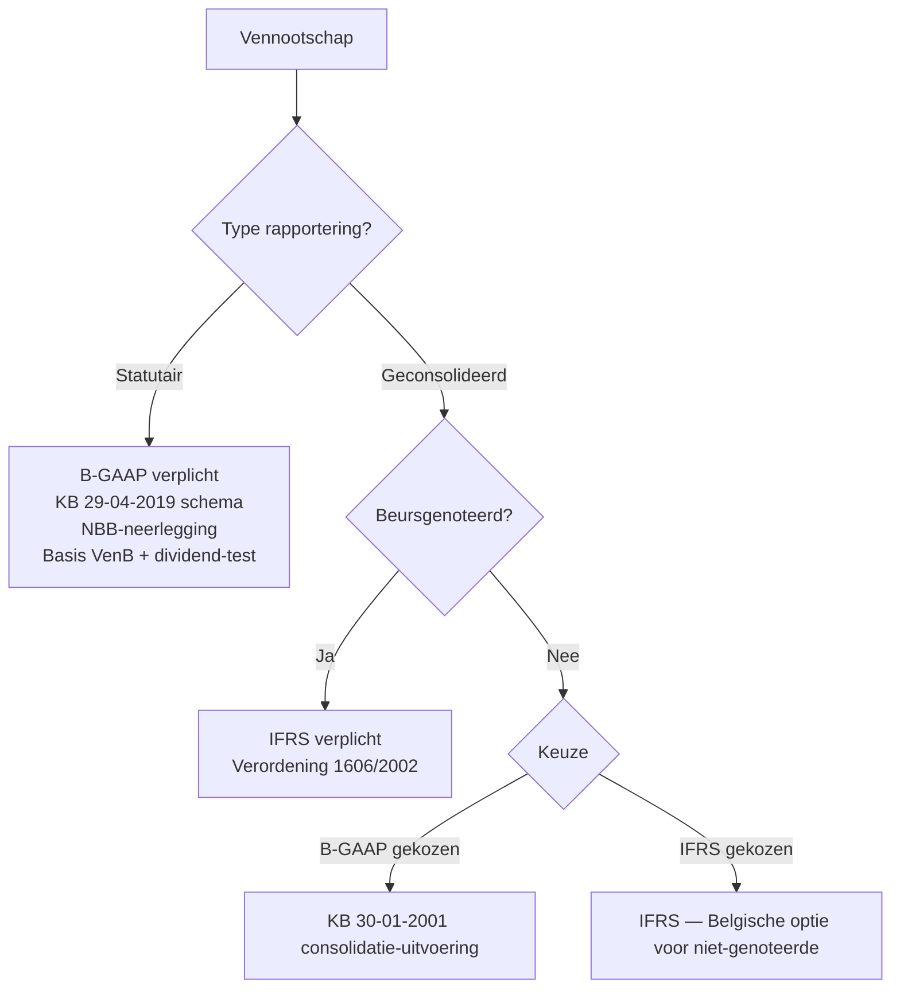

> **Themafiche — kapstok voor herhaling.** Per balanspost: waar verschilt IFRS van B-GAAP? Voor verhaal en routekaart: [[leerpaden/1.5|minicursus PO 1.5]].

---

## Take-away

- **B-GAAP = voorzichtigheid + juridische vorm** · **IFRS = economische realiteit + fair value** — alle verschillen zijn variaties op deze as
- **Statutaire jaarrekening blijft B-GAAP** zelfs voor IFRS-rapporterende groep — VenB-grondslag, NBB-neerlegging, dividend-test gebeuren op B-GAAP
- **Substance over form** stuurt drie kernverschillen: leasing (IFRS 16 on-balance) · revenue (IFRS 15 5-stappen) · consolidatie (IFRS 10 control)
- **Cost vs revaluation model** (IAS 16/38) — IFRS biedt keuze; B-GAAP standaard cost + uitzonderlijke herwaardering art. 57 KB
- **Geen goodwill-afschrijving onder IFRS** — verplichte jaarlijkse impairment-test (IAS 36); B-GAAP schrijft af over levensduur

---

## Vergelijkingsmatrix — per balanspost

| Post | **B-GAAP** | **IFRS** | Standaard |
|---|---|---|---|
| **Materiële vaste activa** | Cost − afschrijving; herwaardering uitzonderlijk (art. 57 KB) | Cost-model of revaluation-model (keuze per klasse); componentbenadering verplicht | IAS 16 |
| **Immateriële vaste activa** | Activering R&D streng beperkt; afschrijving over economische levensduur | Onderzoek: kost; ontwikkeling: activering bij criteria; cost-of-revaluation-model | IAS 38 |
| **Goodwill (consolidatie)** | Afschrijving over economische levensduur (max te verantwoorden) | **Geen afschrijving** · jaarlijkse impairment-test op CGU-niveau | IFRS 3 + IAS 36 |
| **Voorraden** | FIFO / gewogen gemiddelde; LCN; LIFO verboden | Idem (LIFO verboden); netto-realisatiewaarde-test | IAS 2 |
| **Leasing (lessee)** | Onderscheid financieel (on-balance) vs operationeel (off-balance + kost) | **Alle leases on-balance** — right-of-use-actief + lease-verplichting (behalve short-term + low-value) | IFRS 16 |
| **Opbrengsten** | Realisatie bij prestatieleer + factuurmoment | **5-stappen-model** · prestatieverplichtingen · over time vs point-in-time | IFRS 15 |
| **Voorzieningen** | Voorzichtigheidsbeginsel + waarschijnlijk + meetbaar | Idem, maar disconteren bij lange termijn | IAS 37 |
| **Uitgestelde belastingen** | Optioneel boeken (klasse 168), strikt | **Verplicht** boeken op alle timing-verschillen | IAS 12 |
| **Eigen vermogen** | Klassieke structuur (kapitaal · reserves · overgedragen) | Aandelen-categorieën + OCI (other comprehensive income) | IAS 1 |
| **Presentatie jaarrekening** | Schema vast (KB 29-04-2019) | Voorgeschreven minima IAS 1; vorm vrij | IAS 1 |

---

## Drie systeem-keuzes die alles bepalen

| Keuze | B-GAAP | IFRS | Praktische impact |
|---|---|---|---|
| **Doel rapportering** | Schuldeisers-bescherming + fiscaal | Investeerder-informatie | IFRS toont volatiliteit; B-GAAP smoot via voorzichtigheid |
| **Waarderings-basis** | Historische kostprijs (default) | Fair value waar relevant (IFRS 13) | IFRS-balans meer schommelend |
| **Vorm vs substantie** | Juridische vorm primair | Economische substantie primair | Leasing IFRS 16 = klassiek voorbeeld |

---

## Wanneer welke jaarrekening?

---

## ⚠️ Valkuilen

| Valkuil | Wat klopt er niet | Wat klopt wél |
|---|---|---|
| "Statutaire JR in IFRS bij IFRS-groep" | Statutaire vennootschap blijft B-GAAP-verplicht | IFRS alleen op geconsolideerd niveau; statutair = B-GAAP voor VenB + dividend + NBB |
| Operationele leasing off-balance onder IFRS | IFRS 16 (sinds 2019) zet alle leases on-balance lessee-zijde | Uitzonderingen: short-term (< 12 m) + low-value-asset |
| Goodwill afschrijven onder IFRS | IFRS 3 + IAS 36: **geen afschrijving** · jaarlijkse impairment-test verplicht | B-GAAP: afschrijven; IFRS: testen (kan tot impairment-cliff leiden) |
| Revenue bij factuurmoment IFRS | IFRS 15 5-stappen — opbrengst volgt prestatieverplichting, niet factuur | Over time of point-in-time afhankelijk van overdracht-controle |
| Ontwikkelingskosten activeren = altijd | IAS 38 §57 vereist 6 criteria (technische haalbaarheid + intentie + middelen + ...) | Geen automatiek; criteria-toets verplicht |
| Belasting-latenties optioneel IFRS | IAS 12 verplicht uitgestelde belastingen op alle timing-verschillen | B-GAAP: facultatief (klasse 168); IFRS: imperatief |

---

## Doorklik — losse concept-fiches

**IFRS-records (PO 1.5 cluster-eigen)**
- [[ifrs]] — Σ-hoofdrecord (IASB · IAS-Verordening · afwijkingen-tov-be-gaap)
- [[materiele-vaste-activa]] — IAS 16
- [[immateriele-vaste-activa]] — IAS 38
- [[opbrengstverantwoording]] — IFRS 15

**B-GAAP-records (cross-perspectief)**
- [[vaste-activa]] — cost · afschrijving · herwaardering art. 57 KB
- [[voorraden]] — FIFO / GMP onder IAS 2
- [[bedrijfsopbrengsten]] — klasse 70-74 · realisatie
- [[leasing]] · [[financiele-leasing]] · [[operationele-leasing]] — IFRS 16 on-balance

**Verwante themafiches**
- [[themafiches/ifrs-toepassingskader|Themafiche — IFRS-toepassingskader & EU-richtlijn]]
- [[themafiches/eindejaarsverrichtingen-en-waardering|Themafiche — Eindejaarsverrichtingen & waardering]] *(B-GAAP-mechaniek)*
- [[leerpaden/1-4/samenvatting|Samenvatting PO 1.4 — Consolidatie]] *(IFRS 10/3/11/12)*

---

*Themafiche afgeleid uit cluster ifrs-rapportering (PO 1.5). Status: voorgesteld.*
