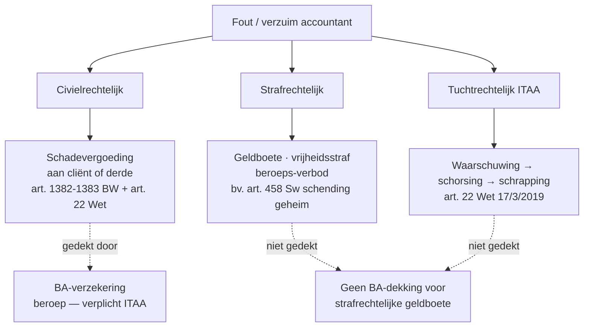

> ⚠️ **Voorlopig — themafiche-laag wordt uitgefaseerd.** Per **ADR-039** vervangt één PO-samenvatting per programmaonderdeel de cluster-themafiches. Deze fiche blijft beschikbaar tot het relevante PO een leerpad krijgt — dan migreert de inhoud naar `content/leerpaden/<po-slug>/samenvatting.md`. Voor cross-PO themafiches (vergelijkingen tussen verschillende PO's) volgt een aparte beslissing per fiche: incorporeren in alle relevante samenvattingen, óf upgraden naar concept-fiche.

> **Themafiche — kapstok voor herhaling.** Strafrechtelijk beroepsgeheim art. 458 Sw + wettelijke uitzonderingen + drie sporen beroepsaansprakelijkheid + BA-dekking. Voor verhaal en routekaart: [[leerpaden/4.0|minicursus PO 4.0]].

---

## Take-away

- **Beroepsgeheim = strafrechtelijk** (art. 458 Sw) — schending = misdrijf · ook na beëindiging opdracht
- **CFI-melding + getuigenis voor strafrechter + wettelijke fiscale verplichtingen** = wettelijke uitzonderingen — geen schending
- **Drie sporen aansprakelijkheid lopen parallel** — vrijspraak strafrechter = geen automatische vrijwaring tucht of burgerlijk
- **BA-verzekering dekt civielrechtelijk** (schadevergoeding aan cliënt of derde) — NIET tuchtboete · strafrechtelijke geldboete · sanctie-impact
- **Exoneratie-clausule** beperkt aansprakelijkheid, maar niet bij **opzet of grove fout** + niet ten aanzien van derden

---

## Beroepsgeheim — wat valt eronder, wat niet?

| Vertrouwelijke info | Onder beroepsgeheim? | Toelichting |
|---|---|---|
| Inhoud advies | Ja | Specifiek voor cliënt opgemaakt |
| Cijfers boekhouding cliënt | Beperkt | Boekhouding is van de cliënt — geheim wat door cliënt is toevertrouwd, niet de boeken zelf |
| Aangiftes (PB · VenB · BTW) | Beperkt | Inhoud aangifte is fiscale info; relatie cliënt-accountant blijft beschermd |
| Identiteit cliënt | Ja (in beginsel) | Tenzij cliënt zelf relatie publiek maakt |
| UBO-informatie | Wettelijke meldingsplicht UBO-register — geen geheim daar | Register is openbaar; intern dossier blijft vertrouwelijk |
| Witwasvermoeden | Geheim **vóór CFI-melding** + verboden om cliënt in te lichten (tipping-off) | Wettelijke uitzondering art. 458 Sw |
| Eigen ereloon-vordering | Geen geheim ten aanzien van rechter (procedure betaling) | Voor verdediging eigen rechten — beperkt openbaar |

---

## Uitzonderingen op beroepsgeheim

| Uitzondering | Grond | Voorbeeld |
|---|---|---|
| **Wettelijke verplichting** | Wet of decreet | CFI-melding (AML-wet) · ITAA-melding tucht · meldingsplicht art. XX.23 WER bij continuïteit |
| **Getuigenis voor rechter** | Cassatie 2003 — accountant *kan* maar moet niet | Strafrechter mag horen; accountant maakt eigen afweging belang openbare orde |
| **Toestemming cliënt** | Schriftelijke ontheffing | Bij hypotheek-aanvraag bank · vorige accountant raadplegen |
| **Verdediging eigen rechten** | Wettelijke noodweer | Aansprakelijkheidsprocedure · tuchtprocedure · ereloon-vordering |
| **Confraters-overleg ITAA** | Aanvaardbaar binnen kring | Predecessor-procedure bij dossieroverdracht — confrater contacteren |
| **Anonieme advies-vraag** | Wanneer cliënt niet identificeerbaar | Casuïstiek-overleg binnen kantoor toegelaten |

---

## Drie sporen beroepsaansprakelijkheid

| Spoor | Drempel | Sanctie | Verjaring |
|---|---|---|---|
| **Civielrechtelijk** | Fout + schade + causaal verband | Schadevergoeding | 5 jaar (10 jaar bedrog) |
| **Strafrechtelijk** | Misdrijf-bestanddelen vervuld | Boete · gevangenis · beroeps-verbod | Variabel per misdrijf |
| **Tuchtrechtelijk** | Inbreuk plicht art. 22 Wet 17/3/2019 | Waarschuwing · berisping · schorsing · schrapping | Tucht: 6 maand na kennisname (relatieve) / 6 jaar na feit (absolute) |

**Drie sporen lopen parallel** — vrijspraak strafrechter = geen vrijwaring tucht of civiel. Tucht kan ook zonder strafzaak.

---

## BA-verzekering — wat dekt, wat niet?

| Wel gedekt | Niet gedekt |
|---|---|
| Civielrechtelijke schadevergoeding aan cliënt/derde | Strafrechtelijke geldboete |
| Verdediging kosten in civiel proces | Tuchtrechtelijke sancties |
| Schade door fout in advies/aangifte/audit | Opzet of bedrog (zelfs civiel) |
| Stagiairs en medewerkers onder verantwoordelijkheid | Boetes RSZ/fiscus voor eigen kantoor |
| Cyber-schade bij dataverlies cliënt (vaak) | Activiteiten buiten ITAA-statuut |

⚠️ Verplichte minimum-dekking voor gecertificeerd accountants — bedrag in KB + Norm Permanente Vorming + Norm Inschrijving + Cijferzakboekje.

**Geen automatische dekking** voor:
- Activiteiten als bedrijfsleider commerciële vennootschap
- Adviesfunctie buiten ITAA-perimeter (vermogensplanning ≠ ITAA-monopolie)
- Volg-jaren na pensionering (vereist "uitloop"-dekking)

---

## Exoneratie-clausule in opdrachtbrief

| Werkt wel | Werkt niet |
|---|---|
| Beperking aansprakelijkheid voor lichte fout | Bij opzet of grove fout |
| Beperking tot honorarium of veelvoud | Ten aanzien van derden (niet-contractanten) |
| Tijdsbeperking voor klacht-instelling | Bij overtreding wettelijke bepalingen (AML · audit-normen) |
| Cap per dossier | Voor strafrechtelijke verantwoordelijkheid |

Vereiste: **expliciet** en **leesbaar** in opdrachtbrief; cliënt moet kennis kunnen nemen.

---

## ⚠️ Valkuilen

| Valkuil | Wat klopt er niet | Wat klopt wél |
|---|---|---|
| CFI-melding = schending beroepsgeheim | Wettelijke uitzondering art. 458 Sw + immuniteit AML-wet art. 57 | Geen straf · geen tucht · zelfs verplicht |
| Tipping-off = "ik mag niets meer met cliënt bespreken" | Tipping-off-verbod ziet op **onthullen van melding of voorbereiding** — niet alle communicatie | Lopende dossier-werk gaat door; alleen het meldings-element is verboden te onthullen |
| Drie sporen = alternatieven | Drie sporen lopen **parallel** | Vrijspraak strafrechter ≠ vrijwaring tucht of civiel; kan elk apart leiden tot sanctie |
| BA-verzekering = bescherming tegen alle gevolgen | Dekt enkel civielrechtelijke schadevergoeding | Strafboete + tuchtsanctie blijven eigen last; reputatie + uitsluiting markt zijn ondekbaar |
| Exoneratie-clausule = waterdicht | Werkt niet bij opzet/grove fout · niet tegen derden | Beperkt impact maar geen vrijbrief |
| Boekhouding cliënt = strikt geheim | Boeken zelf zijn cliënt-eigendom; geheim ziet op wat toevertrouwd werd | Aangiftes + boekjes ter beschikking cliënt; vertrouwelijkheid blijft, maar wettelijke verplichtingen primeren |
| Beroepsgeheim ook tegen rechtskundig assessor ITAA | Tucht-organen hebben toegang tot dossiers in tuchtprocedure | Discreet maar transparant tegen ITAA-instanties — beroepsgeheim niét tegenwerpelijk |

---

## Doorklik — losse concept-fiches

**Kern**
- [[beroepsgeheim]] — strafrechtelijk + uitzonderingen
- [[beroepsaansprakelijkheid]] — 3 sporen + BA-verzekering

**Procedure + sanctie**
- [[tuchtprocedure-itaa]] — verloop + sancties + beroep
- [[retentierecht-accountant]] — financieel zekerheidsrecht eigen ereloon

**Cross-cutting**
- [[deontologie]] — 5 beginselen (vertrouwelijkheid)
- [[antiwitwaspreventie]] — CFI-melding-uitzondering

**Verwante themafiches**
- [[themafiches/deontologische-beginselen|Themafiche — Deontologische beginselen]]
- [[themafiches/antiwitwas-praktijk|Themafiche — Antiwitwas-praktijk]]
- [[themafiches/opdrachtaanvaarding-en-tucht|Themafiche — Opdrachtaanvaarding & tucht]]

---

*Themafiche afgeleid uit cluster beroepsbeoefening (PO 4.0). Status: voorgesteld.*
