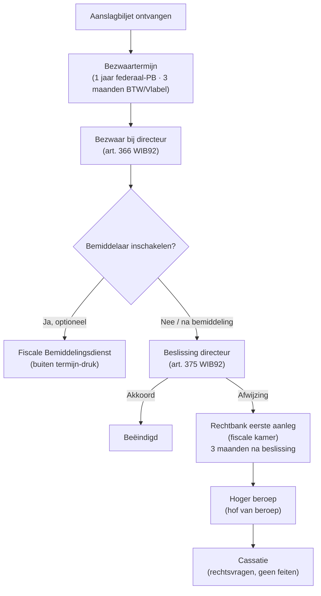

> **Themafiche — kapstok voor herhaling.** Administratieve fase (bezwaar + bemiddeling) → gerechtelijke fase (4 niveaus) — termijnen + bewijslast + grenzen aan reformatio in pejus. Voor verhaal en routekaart: [[leerpaden/2.5|minicursus PO 2.5]].

---

## Take-away

- **Bezwaar = verplicht administratief vóór gerechtelijk**: zonder bezwaar geen rechtbankprocedure (uitputtings-vereiste)
- **Bezwaartermijn 1 jaar vanaf 1e dag 3e maand na verzending aanslagbiljet** (federaal-PB); BTW 3 maanden; Vlabel 3 maanden
- **Bezwaar schorst invordering NIET**: onbetwist deel blijft eisbaar; betwist deel = bewarend beslag mogelijk
- **Reformatio in pejus verboden binnen bezwaarvoorwerp** — directeur mag niet verhogen, maar aanvullende aanslag voor ANDERE bedragen wel
- **Bemiddelaar = optioneel + buiten termijn-druk**: schorst geen bezwaartermijn, wel bestuurlijke beslissing
- **Rechtbank eerste aanleg → hoger beroep → cassatie**: rechter heeft volle rechtsmacht over fiscale sancties (verminderen mogelijk)

---

## Volledige procedure-flow

---

## Bezwaartermijn — verschillen per niveau

| Belasting | Termijn | Vanaf wanneer? | Bij wie? |
|---|---|---|---|
| **Federaal-PB / VenB** | 1 jaar | 1e dag 3e maand na verzending aanslagbiljet | Adviseur-generaal directeur (FOD Financiën) |
| **BTW (federaal)** | 3 maanden | Datum kennisgeving | Adviseur-generaal directeur (FOD Financiën) |
| **Vlabel — erfbelasting, registratie, OV** | 3 maanden | Datum aanslagbiljet | Vlabel |
| **Gemeentebelasting** | Termijn in reglement (typisch 3 maanden) | Datum kohier/aanslag | College Burgemeester & Schepenen |
| **Federale aanvullende gemeentebelasting PB** | Volgt PB-termijn | Idem PB | Idem PB |

---

## Bezwaar — inhoud + vormvereisten

| Element | Vereiste |
|---|---|
| **Vorm** | Schriftelijk — per aangetekend, deurwaarder, MyMinfin, e-mail |
| **Wie tekent?** | BP zelf, of gevolmachtigde (advocaat / accountant) — mandaat vermelden |
| **Inhoud** | Identificatie aanslag + redenen betwisting + bewijsstukken |
| **Termijn** | Strikt (vervaltermijn) — verlenging quasi-onmogelijk |
| **Schorsing invordering?** | Nee — alleen onbetwist deel mag onbetaald blijven |
| **Reformatio in pejus?** | Verboden binnen bezwaarvoorwerp (art. 375). Maar nieuwe aanvullende aanslag (binnen termijn) op andere elementen = wel |

---

## Fiscale bemiddelingsdienst

| Element | Toelichting |
|---|---|
| **Wat?** | Onafhankelijke bemiddelingsdienst tussen BP en fiscus |
| **Wanneer inroepen?** | Tijdens bezwaarprocedure (vóór beslissing directeur) |
| **Wie?** | BP eenzijdig — geen toestemming directeur nodig |
| **Effect op termijnen?** | Schorst beslissing directeur (max 4 maanden) — schorst geen bezwaartermijn |
| **Bindend?** | Nee — bemiddelingsvoorstel niet bindend voor partijen |
| **Kostprijs** | Gratis |

⚠️ Bemiddelaar = waardevol bij feitelijke discussies. Bij zuivere rechtsvragen direct naar rechtbank vaak efficiënter.

---

## Gerechtelijke fase — vier niveaus

| Niveau | Termijn beroep | Wat behandelt? | Beslissing |
|---|---|---|---|
| **Rechtbank eerste aanleg — fiscale kamer** | 3 maanden na beslissing directeur (of na 6 mnd zonder beslissing — fictieve afwijzing) | Feiten + recht | Bevestigt / vernietigt / vermindert |
| **Hof van beroep** | 1 maand na betekening vonnis | Feiten + recht (volle hervorming) | Idem |
| **Hof van cassatie** | 3 maanden na betekening arrest | Alleen rechtsvragen + procedurele schending | Verbreking of verwerping (geen feiten-her-evaluatie) |
| **EHRM / HvJ EU** | Specifieke procedures | Mensenrechten · EU-recht | Veroordeling lidstaat (vraagt vaak nationale uitvoering) |

---

## Volle rechtsmacht over sancties

| Sanctie | Rechter kan? |
|---|---|
| **Belastingverhoging (10/20/50/100/200%)** | Verminderen (proportionaliteit) + vernietigen + opheffen |
| **Administratieve boete BTW** | Idem |
| **Fiscale geldboete (strafrechtelijk)** | Volledige strafrechter-bevoegdheid |
| **Engel-criteria EHRM** | Belastingverhoging ≥ 50% = "penal" → strafrechtelijke waarborgen (non-bis-in-idem, proportionaliteit) |

⚠️ Vergeet niet de **sanctie zelf** in bezwaar/beroep mee te betwisten — niet alleen het bedrag van de belasting.

---

## Wie kan in beroep gaan?

| Partij | Federaal | BTW | Vlabel |
|---|---|---|---|
| **Belastingplichtige** | Ja | Ja | Ja |
| **Fiscus** | Beperkt — niet tegen eigen beslissing directeur | Ja | Ja |
| **Cassatie BP + fiscus** | Beide | Beide | Beide |

---

## ⚠️ Valkuilen

| Valkuil | Wat klopt er niet | Wat klopt wél |
|---|---|---|
| Bezwaartermijn vanaf datum biljet | 1 jaar vanaf opmaak biljet | Vanaf **1e dag 3e maand na verzending** (federaal PB). Verzending ≠ opmaak |
| Bezwaar schorst betaling | Tijdens bezwaar mag BP wachten met betalen | Onbetwist deel = onmiddellijk eisbaar. Betwist deel = bewarend beslag mogelijk. Betaal onder voorbehoud bij groot betwist deel |
| Reformatio in pejus = altijd verboden | Directeur mag niet verhogen | Verbod alleen binnen bezwaarvoorwerp. Voor andere belastingelementen = aanvullende aanslag mogelijk (binnen aanslagtermijn) |
| Direct naar rechtbank zonder bezwaar | Rechtbank meteen bevoegd | Uitputtings-vereiste: bezwaar verplicht eerst. Zonder bezwaar = onontvankelijk |
| Bemiddelaar schorst bezwaartermijn | Tijdens bemiddeling mag termijn lopen | Bemiddeling schorst beslissing directeur, niet de externe bezwaartermijn |
| Sanctie staat vast na bezwaar | Belastingverhoging onaantastbaar | Rechter heeft volle rechtsmacht — kan verminderen mits proportionaliteit |

---

## Doorklik — losse concept-fiches

**Administratieve fase**
- [[bezwaarprocedure]] — termijn + vorm + reformatio in pejus
- [[fiscale-bemiddelingsprocedure]] — bemiddelaar + werkwijze
- [[fiscale-sancties]] — boetes + verhogingen + rechter-toets

**Gerechtelijke fase**
- [[fiscale-procedure]] — kader rechtbank → cassatie

**Cross-cutting per niveau**
- [[gewestelijke-fiscale-procedure]] — Vlabel-route
- [[lokale-en-regionale-belastingen]] — gemeente/provincie-route

**Verwante themafiches**
- [[themafiches/fiscale-termijnen|Themafiche — Fiscale termijnen]]
- [[themafiches/taxatieprocedure|Themafiche — Taxatieprocedure]]
- [[themafiches/invordering-en-dwangbevel|Themafiche — Invordering & dwangbevel]]
- [[themafiches/fiscale-procedure-gewest-gemeente|Themafiche — Procedure gewest/gemeente]]

---

*Themafiche afgeleid uit cluster fiscale-procedure (PO 2.5). Status: voorgesteld.*
