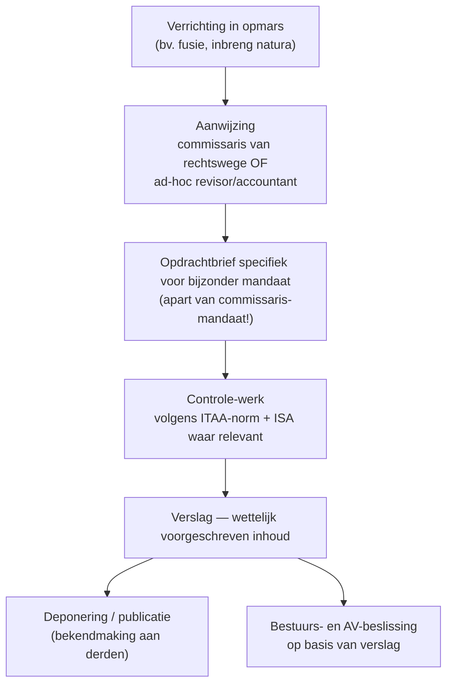

> ⚠️ **Voorlopig — themafiche-laag wordt uitgefaseerd.** Per **ADR-039** vervangt één PO-samenvatting per programmaonderdeel de cluster-themafiches. Deze fiche blijft beschikbaar tot het relevante PO een leerpad krijgt — dan migreert de inhoud naar `content/leerpaden/<po-slug>/samenvatting.md`. Voor cross-PO themafiches (vergelijkingen tussen verschillende PO's) volgt een aparte beslissing per fiche: incorporeren in alle relevante samenvattingen, óf upgraden naar concept-fiche.

> **Themafiche — kapstok voor herhaling.** Bijzondere mandaten per WVV-verrichting + wie mag uitvoeren + verslag-vorm. Voor verhaal en routekaart: [[leerpaden/1.6|minicursus PO 1.6]].

---

## Take-away

- **Bijzonder mandaat ≠ commissarismandaat** — eenmalig per gebeurtenis (één verrichting, één verslag), niet doorlopend
- **Twee toegangs-regels**: sommige mandaten zijn **exclusief voor bedrijfsrevisor** (inbreng natura · quasi-inbreng · ruilverhouding bij fusie/splitsing met EV-impact); andere staan ook open voor gecertificeerd accountant
- **Bij vennootschap met commissaris**: commissaris is *van rechtswege* belast met de meeste bijzondere mandaten — maar het blijft juridisch een aparte opdracht (eigen opdrachtbrief + honorarium + verslag)
- **Ruilverhouding-verslag (fusie/splitsing)** kent slechts twee mogelijke conclusies: zonder voorbehoud OF afkeurend — een voorbehoud is niet toegelaten
- **Resultaatsafhankelijk honorarium verboden** (art. 30 KB plichtenleer) — vast honorarium in opdrachtbrief

---

## Matrix — wie mag wat?

| Verrichting | Wettekst | Bedrijfsrevisor | Gecert. accountant | Verslag-focus |
|---|---|---|---|---|
| **Inbreng in natura** | WVV 5:7 (BV) · 7:7 (NV) | Ja — standaard | Alleen bij kleine vennootschap zonder commissaris | Beschrijving methodes + redelijkheids-oordeel waardering |
| **Quasi-inbreng** | WVV 5:8-10 · 7:8-10 | Ja | Ja (ook met commissaris) | Redelijkheid van prijs (≥ 10% kapitaal binnen 2j na oprichting) |
| **Fusie** | WVV 12:25 | Ja (commissaris van rechtswege) | Beperkt | Ruilverhouding + waarderings-methodes + bijzondere problemen |
| **Splitsing** | WVV 12:62 | Ja (commissaris van rechtswege) | Beperkt | Idem fusie + partiële-splitsing-modaliteiten |
| **Omzetting rechtsvorm** | WVV 14:3 | Ja | Ja (KMO) | Staat van activa/passiva + redelijkheid netto-actief |
| **Ontbinding & vereffening** | WVV 2:71 e.v. | Ja | Ja | Boekenstaat bij ontbinding + tussentijdse staat |
| **Inkoop eigen aandelen** | WVV 7:215 | Commissaris (indien aanwezig) | — | Bevestiging voorwaarden + uitkeerbare middelen |
| **Kapitaalvermindering door aanzuivering** | WVV 7:208 | Commissaris (indien aanwezig) | — | Bestemming + schuldeisers-bescherming |

---

## Procedure-flow per bijzonder mandaat

---

## Verslag-conclusies per type

| Mandaat-type | Toegelaten conclusies |
|---|---|
| Inbreng natura · quasi-inbreng | Beschrijving + oordeel: vergoeding **wel/niet** in overeenstemming met inbreng |
| **Ruilverhouding fusie/splitsing** | **Enkel** zonder voorbehoud OF afkeurend — geen voorbehoud toegelaten (WVV) |
| Omzetting · ontbinding · boekenstaat | Verklaring zonder voorbehoud / met voorbehoud / afkeurend / onthouding (4-oordelen-schaal) |
| Vereffenaars-controle | Idem 4-oordelen-schaal |

---

## Honorarium-discipline

| Regel | Wettelijke basis | Praktijk |
|---|---|---|
| Honorarium **vast** in opdrachtbrief | KB plichtenleer 1-3-1998 art. 30 | Geen success-fee, geen koppeling aan andere diensten |
| **Onafhankelijkheid** geldt onverkort | Wet 17/3/2019 + ITAA-deontologie | Geen kruisverwijzingen naar consultancy bij dezelfde cliënt |
| Aansprakelijkheid **niet inkortbaar** voor monopolieopdracht | Wet 17/3/2019 art. 44 | Verzekering beroepsaansprakelijkheid blijft cruciaal |
| Onverenigbaarheden | ITAA-deontologie | Eigen partij worden bij verrichting verboden |

---

## ⚠️ Valkuilen

| Valkuil | Wat klopt er niet | Wat klopt wél |
|---|---|---|
| Bijzonder mandaat = commissarismandaat | Commissaris doet automatisch alles als deel van zijn 3-jarig mandaat | Bijzonder mandaat = juridisch aparte opdracht — eigen aanvaarding · opdrachtbrief · honorarium · verslag, óók als commissaris van rechtswege uitvoert |
| Gecert. accountant mag alle bijzondere mandaten | Beroepswet geeft generieke bevoegdheid | Inbreng in natura · quasi-inbreng · sommige fusie/splitsings-verslagen blijven in de meeste gevallen exclusief voor bedrijfsrevisor |
| Voorbehoud bij ruilverhouding-verslag | Standaard 4-oordeel-schaal toepassen | Enkel zonder voorbehoud OF afkeurend toegelaten bij fusie/splitsing-ruilverhouding (WVV 12:25) |
| Success-fee voor "snelle inbreng-attestatie" | Resultaatsgebonden vergoeding bespreekbaar | Ronselverbod (KB plichtenleer art. 30) — vergoeding niet afhankelijk van resultaat of andere diensten |
| Verslag-inhoud als sjabloon hergebruiken | Generieke template volstaat | Verslag-vorm + minimuminhoud wettelijk voorgeschreven *per* verrichting (WVV) — methodes + redelijkheidsoordeel specifiek voor dossier |
| Mondelinge aanvaarding bij vaste cliënt | Vertrouwde relatie maakt opdrachtbrief overbodig | ITAA-norm opdrachtbrief vereist altijd schriftelijk — bijzonder mandaat is nooit "doorlopend" |

---

## Doorklik — losse concept-fiches

**Kern-record**
- [[bijzondere-mandaten]] — overzicht + per-verrichting + wie-mag-wat

**Per verrichting (cross-cluster)**
- [[kapitaalverhoging-in-natura]] — inbreng-natura-procedure
- [[quasi-inbreng]] — 2-jaarsregel + 10%-drempel
- [[fusie]] · [[splitsing]] · [[fiscale-fusie-splitsing]] — reorganisatie-cluster
- [[ontbinding-en-vereffening]] — vrijwillig (WVV) vs gerechtelijk (WER)
- [[inkoop-eigen-aandelen]] — kapitaalstructuur-cluster

**Context**
- [[opdrachtaanvaarding-en-opdrachtbrief]] — aanvaarding bij bijzonder mandaat
- [[onafhankelijkheid]] — geldt onverkort
- [[oprichtersaansprakelijkheid]] — financieel-plan-toets bij faillissement < 3j

**Verwante themafiches**
- [[themafiches/controleopdracht-aanpak|Themafiche — Controleopdracht-aanpak]]
- [[themafiches/opdracht-types|Themafiche — Opdracht-types & zekerheidsniveaus]]

---

*Themafiche afgeleid uit cluster controle-opdracht (PO 1.6). Status: voorgesteld.*
