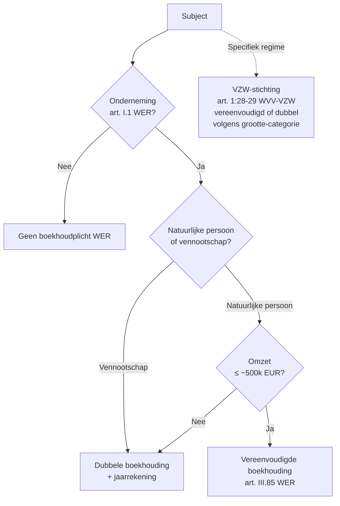

> **Themafiche — kapstok voor herhaling.** Waar staat het en wie zegt het? Boekhoudrecht-bronnen + boekhoudplicht-test op één pagina. Voor verhaal en routekaart: [[leerpaden/1.2|minicursus PO 1.2]].

---

## Take-away

- **Boekhoudplicht is onderneming-test, geen handel-test** — sinds Wet 15-04-2018 valt elke "onderneming" eronder, inclusief vrije beroepen en VZW's
- **Vereenvoudigde boekhouding is omzet-test op natuurlijke persoon** — drempel ~500 000 EUR (art. III.85 WER); vennootschappen altijd dubbel
- **WER Boek III + KB 29-04-2019 = ruggengraat** — Boekhoudwet 1975 niet "weg" maar geabsorbeerd; CBN verwijst nog naar oude artikels
- **CBN-advies is interpretatie, geen wet** — gezaghebbend maar niet bindend; rechtspraak kan afwijken
- **EU-richtlijn 2013/34 stuurt B-GAAP** — drempels groottecategorie, schema's, jaarverslag-vereisten worden EU-geharmoniseerd

---

## Wie moet boekhouden?

**Concrete drempel: Cijferzakboekje bij examen** raadplegen.

---

## Vereenvoudigd vs dubbel — wat verandert?

| Aspect | **Vereenvoudigde boekhouding** | **Dubbele boekhouding** |
|---|---|---|
| Wettelijke basis | Art. III.85 WER + KB 12-09-1983 | Art. III.82-95 WER + KB 29-04-2019 |
| Verplichte boeken | Financieel dagboek + inkopen + verkopen + inventarisboek | Volledige boekhouding (dagboek · grootboek · MAR · proefbalans) |
| Jaarrekening NBB | Geen | Verplicht (schema volgens groottecategorie) |
| Wie? | Natuurlijke persoon onder omzet-drempel | Alle vennootschappen + grote zelfstandigen |
| Voldoende voor accountant? | Voor zelfstandige correct; niet voor vennootschap | Standaard verwachting |

---

## Hiërarchie van rechtsbronnen

| Laag | Bron | Karakter | Waar? |
|---|---|---|---|
| 1. EU | Richtlijn 2013/34/EU (jaarrekening) · Verordening 1606/2002 (IAS) | Bindend kader | EUR-Lex |
| 2. Wet | WER Boek III (boekhouding) + WVV (vennootschapsrecht) | Federaal · bindend | Staatsblad |
| 3. KB | KB 29-04-2019 (uitvoering Boek III + MAR + waardering) | Bindend | Staatsblad |
| 4. Norm | ITAA-normen · NBB-richtlijnen | Bindend voor beroep | ITAA / NBB |
| 5. Advies | CBN-adviezen | Gezaghebbend, niet bindend | CBN-website |
| 6. Praktijk | Doctrine + rechtspraak | Interpretatief | Beroepspubli. |

---

## Autoriteiten — wie doet wat?

| Instituut | Rol |
|---|---|
| **NBB** (Nationale Bank) | Centrale balanscentrale · neerlegging jaarrekeningen · statistieken |
| **CBN** (Commissie voor Boekhoudkundige Normen) | Interpretatie boekhoudrecht · adviezen (ambtshalve of op vraag) |
| **ITAA** | Beroepsorganisatie GA + GBA · normen · tucht · toezicht |
| **IBR** (Instituut Bedrijfsrevisoren) | Bedrijfsrevisoren · auditnormen ISA |
| **FSMA** | Toezicht beursgenoteerde + financieel toezicht |
| **CRB** (Centrale Raad voor Bedrijfsleven) | Sociaal overleg · macro-economisch advies |
| **Griffies ondernemingsrechtbank** | KBO-inschrijving · vennootschapsakten |

---

## ⚠️ Valkuilen

| Valkuil | Wat klopt er niet | Wat klopt wél |
|---|---|---|
| Vrije beroepen vrijgesteld | Sinds 01-11-2018 (Wet 15-04-2018) wel boekhoudplichtig als onderneming | Dokter/advocaat/architect: dubbele tenzij omzet < drempel |
| Boekhoudwet 1975 afgeschaft | Geabsorbeerd in WER Boek III; inhoud ongewijzigd | CBN-adviezen blijven naar oude artikels verwijzen — beide systemen lezen |
| CBN-advies = wet | Gezaghebbend maar niet bindend; rechter kan motiveren-en-afwijken | Standaardpraktijk volgt CBN tenzij andere wet voorrang |
| VZW geen boekhouding | WVV-VZW art. 1:28-29: ofwel vereenvoudigd ofwel dubbel afhankelijk drempel | Groottecategorie-test bepaalt; grote VZW = volledig schema |
| EU-richtlijn rechtstreeks toepasbaar | Richtlijn moet omgezet — bindt staten in resultaat, niet rechtstreeks | Verordening (bv. 1606/2002 IAS) wél rechtstreeks |
| ITAA-norm vrijblijvend | Bindend voor leden — tuchtrechtelijk sanctioneerbaar | Bindend op niveau beroep, niet algemeen recht |

---

## Doorklik — losse concept-fiches

**Wettelijk kader**
- [[boekhouding]] — Σ-discipline-hoofdrecord
- [[boekhoudplicht]] — art. III.82-95 WER · drempel-test
- [[belgisch-boekhoudrecht]] — WER + KB + CBN
- [[autoriteiten-boekhoudrecht]] — NBB · CBN · ITAA · IBR · FSMA
- [[boekhoudbeginselen]] — 8 beginselen
- [[dubbele-boekhouding]] — mechaniek + MAR
- [[groottecategorie-vereniging]] — VZW/stichting-regime

**Verwante themafiches**
- [[themafiches/jaarrekening-schema-en-publicatie|Themafiche — Jaarrekening: schema & publicatie]]
- [[themafiches/eindejaarsverrichtingen-en-waardering|Themafiche — Eindejaarsverrichtingen & waardering]]

---

*Themafiche afgeleid uit cluster boekhouding (PO 1.2 + 1.1). Status: voorgesteld.*
