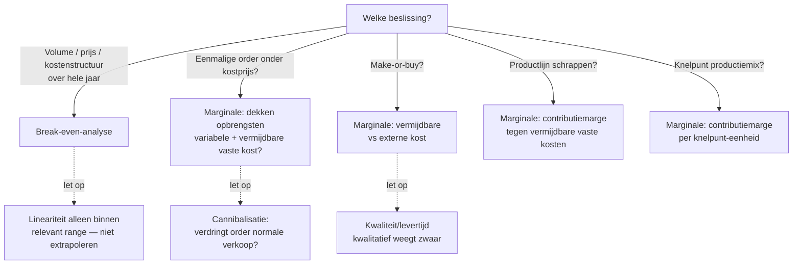

> ⚠️ **Voorlopig — themafiche-laag wordt uitgefaseerd.** Per **ADR-039** vervangt één PO-samenvatting per programmaonderdeel de cluster-themafiches. Deze fiche blijft beschikbaar tot het relevante PO een leerpad krijgt — dan migreert de inhoud naar `content/leerpaden/<po-slug>/samenvatting.md`. Voor cross-PO themafiches (vergelijkingen tussen verschillende PO's) volgt een aparte beslissing per fiche: incorporeren in alle relevante samenvattingen, óf upgraden naar concept-fiche.

> **Themafiche — kapstok voor herhaling.** Twee beslissings-instrumenten naast elkaar: break-even-analyse (winstgevoeligheid) + marginale analyse (incrementele beslissingen). Verhaal en routekaart: [[leerpaden/1.8|minicursus PO 1.8]].

---

## Take-away

- Beide instrumenten bouwen op **contributiemarge** — nauwe link met [[direct-costing|direct costing]]
- **Vermijdbaar = relevant · sunk = irrelevant** — eenvoudig principe, vaak fout toegepast (alloceerde overhead lijkt "relevant")
- Bij **knelpunt-productie**: CM per *knelpunt-uur*, niet per eenheid — vaak het verschil tussen winst en verlies
- **Hoge vaste kosten ⇒ hoge operationele hefboom** ⇒ kleine omzet-schommeling = grote winst-schommeling (BEP-gevoeligheid)
- **Multi-product BEP** is examen-klassieker — gewogen-CM verandert mee met mix

---

## Twee analyses naast elkaar

| Dimensie | **Break-even-analyse** | **Marginale analyse** |
|---|---|---|
| Vraag | *Vanaf welk volume winst?* | *Verandert deze beslissing iets ten goede?* |
| Tijds-horizon | Korte termijn (lineair, vast bereik) | Eenmalig of korte termijn |
| Welke kosten tellen? | Alle vaste + variabele (in CM) | Alleen **relevante** (= vermijdbaar) |
| Sleutelvariabele | Contributiemarge per eenheid | Marginale kost ↔ marginale opbrengst |
| Klassieke toepassing | Productie-ondernemingen, dienstenketen | Special order · outsourcing · productmix · keep-or-drop |
| Output | BEP-volume + veiligheidsmarge | Beslissings-tabel met netto-effect |

---

## Beslisboom — welke analyse?

---

## Formules

**Break-even — punt in eenheden**
$$
\text{BEP}_{\text{eenheden}} = \frac{\text{Vaste kosten}}{\text{Contributiemarge per eenheid}}
$$

**Break-even — punt in omzet**
$$
\text{BEP}_{\text{omzet}} = \frac{\text{Vaste kosten}}{\text{CM-percentage}} \quad \text{waar CM\%} = \frac{\text{CM per eenheid}}{\text{Verkoopprijs}}
$$

**Veiligheidsmarge**
$$
\text{Veiligheidsmarge} = \frac{\text{Werkelijke omzet} - \text{BEP}_{\text{omzet}}}{\text{Werkelijke omzet}}
$$

**Marginale beslissing — special order**
$$
\Delta \text{Winst} = (P_{\text{order}} - C_{\text{variabel}}) \times Q_{\text{order}} - C_{\text{vermijdbare vaste}}
$$

**Marginale beslissing — bij knelpunt**
$$
\text{Voorkeur} = \max\left(\frac{\text{CM per eenheid}}{\text{Knelpunt-verbruik per eenheid}}\right)
$$

---

## ⚠️ Valkuilen

| Valkuil | Wat klopt er niet | Wat klopt wél |
|---|---|---|
| BEP extrapoleren buiten relevant range | Lineariteit geldt alleen binnen capaciteit + productmix | Bij grote uitbreiding: nieuwe vaste kosten → nieuw BEP |
| Multi-product BEP als één product | Gewogen-gemiddelde CM verandert mee met mix | BEP geldt alleen bij constante mix; mix-shift → her-berekenen |
| Vaste overhead toerekenen bij marginale beslissing | Niet-vermijdbare overhead loopt door, ongeacht beslissing | Alleen **vermijdbare** kosten zijn relevant |
| Sunk cost als argument om door te gaan | Reeds gemaakte uitgaven beïnvloeden toekomstige cash niet | Alleen toekomstige kosten/opbrengsten tellen |
| Gunstige variantie negeren | Onverwacht gunstig is even verdacht als ongunstig | Onderzoek beide: gunstig kan kwaliteitsdaling verbergen |

---

## Verdieping

### Leerstukken — voor pedagogische opfris

Werkt iets niet meer scherp? Klik door naar het leerstuk dat het uitwerkt:

- [[break-even-en-marginale-beslissing]] — BEP solo + multi-product, special order, make-or-buy, knelpunt, keep-or-drop — telkens met Meridia-cijfers
- [[kostprijsmethoden-kiezen]] — direct costing als bouwsteen voor contributiemarge
- [[wat-is-analytische-boekhouding]] — kostentypologie (vast/variabel) als vocabularium
- [[budget-en-variantieanalyse]] — sturings-cyclus na de beslissing

### Concept-fiches — voor definitorisch detail

Voor wie een wettekst-pointer of nauwkeurige definitie zoekt:

**De twee analyses** — [[break-even-analyse]] (CVP-analyse + veiligheidsmarge + multi-product) · [[marginale-analyse]] (relevant cost + sunk cost + opportunity cost)

**Voedingsbasis (kostprijs-methodes)** — [[direct-costing]] (contributiemarge als bouwsteen) · [[full-costing]] (wat NIET in marginale analyse hoort)

### Andere themafiches in dit cluster

- [[themafiches/kostprijsmethoden|Themafiche — Kostprijsmethoden]]
- [[themafiches/budget-en-variantieanalyse|Themafiche — Budget & variantieanalyse]]
- [[themafiches/analytische-boekhouding-stelsel|Themafiche — Analytische bh: stelsel & registratie]]

---

*Themafiche afgeleid uit cluster analytische-boekhouding (PO 1.8). Status: voorgesteld.*
