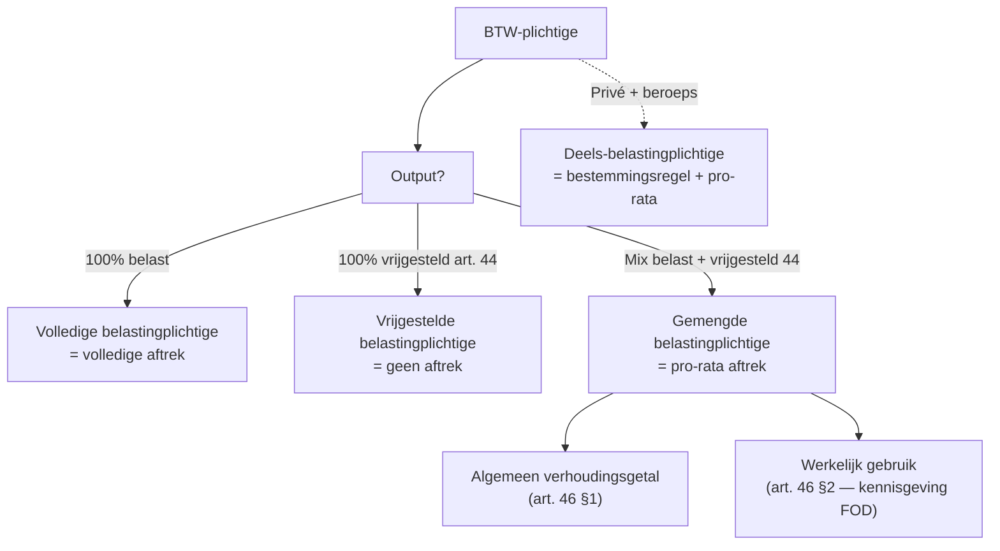

> **Themafiche — kapstok voor herhaling.** Drie aftrek-regimes + uitsluitingen art. 45 §3 + herzieningsmechaniek bedrijfsmiddelen. Voor verhaal en routekaart: [[leerpaden/2.4|minicursus PO 2.4]].

---

## Take-away

- **Aftrek volgt output**: belaste output → aftrek · vrijgestelde output art. 44 → geen aftrek · vrijgestelde output art. 39-42 (export, ICL) → wél aftrek
- **Gemengd ≠ deels-belastingplichtige** — twee verschillende pro-rata-mechanieken (algemeen vs werkelijk gebruik)
- **Art. 45 §3 sluit uit ondanks belaste output** — wagens, onthaal, geschenken, tabak, dranken (uitzondering: spijzen/dranken voor personeel op verplaatsing = aftrekbaar)
- **Wagen 50% standaard-aftrek** (semi-forfaitair); werkelijke methode mag, drie formules
- **Herziening bedrijfsmiddelen 5j (roerend) / 15j (onroerend)** — wijziging bestemming = pro-rata terugnemen of bijbetalen
- **Factuur < 250 EUR**: vereenvoudigde factuur volstaat; **> 250 EUR**: regelmatige factuur verplicht voor aftrek

---

## Drie aftrek-regimes

---

## Aftrek-mechaniek per categorie

| Categorie | Aftrek-regel | Concrete uitwerking |
|---|---|---|
| **Volledige belastingplichtige** | 100% mits factuurvereisten OK | Rooster 59 = BTW input |
| **Gemengd — algemeen pro-rata** | (belaste omzet) / (totale omzet) | Voorlopig + definitief; herrekening jaar+1 |
| **Gemengd — werkelijk gebruik** | Per input-element specifieke bestemming | Vereist FOD-kennisgeving + voorafgaand jaar info |
| **Deels-belastingplichtige (privé/beroep)** | Pro-rata beroepsgebruik | Forfait of bewezen verhouding |
| **Bedrijfsmiddel — herziening 5j roerend / 15j onroerend** | Pro-rata bestemming-wijziging | (initial aftrek × herzieningsfractie) ± aanpassing |

---

## Specifieke uitsluitingen art. 45 §3

| Categorie | Aftrek-beperking | Uitzondering |
|---|---|---|
| **Tabak** | 0% | Geen |
| **Sterke dranken** | 0% | Geen — wel personeel op verplaatsing toegestaan |
| **Onthaalkosten** | 0% | Geen (klanten ontvangen op kantoor) |
| **Geschenken klanten** | 0% boven 50 EUR/jaar/begunstigde | < 50 EUR: aftrekbaar mits commercieel doel |
| **Restaurant- en hotelkosten** | 0% | (a) personeel op verplaatsing belast met levering of dienst = 100% (b) seminarie aan derden = mogelijk aftrekbaar |
| **Personenwagens** | Max 50% (semi-forfait) | Werkelijke methode mag — drie formules KB nr. 3 |
| **Lichte vrachtwagens** | 100% | Mits geen privégebruik (anders pro-rata) |

---

## Wagens — drie methodes (art. 45 §2 + KB nr. 3)

| Methode | Wanneer? | Wat? |
|---|---|---|
| **1. Semi-forfait 50%** | Default | Vast 50% aftrek ongeacht beroepsgebruik |
| **2. Werkelijk-gebruik forfait** | Eenmaal vastgelegd / jaar | (privé-km / totale km) × forfait |
| **3. Werkelijk-gebruik gedetailleerd** | Bewezen ritteboek | Beroepskm / totale km |

⚠️ Methode-keuze geldt voor heel het kalenderjaar. Eenmaal gekozen = niet shoppen.

---

## Herziening bedrijfsmiddelen

| Type bedrijfsmiddel | Herzieningstermijn | Herzieningsfractie | Wanneer herzien? |
|---|---|---|---|
| **Roerend** | 5 jaar (1/5 per jaar) | (resterende jaren) / 5 | Bestemmingswijziging / verkoop / einde activiteit |
| **Onroerend gebouwd** | 15 jaar (1/15 per jaar) | (resterende jaren) / 15 | Idem |
| **Onroerend grond + zakelijke rechten** | 15 jaar (na BTW-optie verhuur) | Idem | Idem |

**Vereenvoudigde regel**: voor bedrijfsmiddelen < 1000 EUR aankoop excl. BTW = geen herziening vereist.

---

## Factuurvereisten voor aftrek

| Bedrag | Vereiste | Wat moet erop? |
|---|---|---|
| **< 250 EUR** | Vereenvoudigde factuur (KB nr. 1 art. 13) | Identiteit leverancier + bedrag totaal incl. BTW + tarief |
| **≥ 250 EUR** | Regelmatige factuur (KB nr. 1 art. 5) | Volledige factuur-vermeldingen — identiteit + BTW-nummers + maatstaf + tarief + BTW + datum |
| **Vereenvoudigd voor B2C** | Kassabon volstaat | Geen aftrek mogelijk |

⚠️ HvJ-rechtspraak (substance over form): formele tekortkomingen mogen aftrek niet verhinderen indien materiële voorwaarden voldaan. In praktijk: controle vereist altijd factuur.

---

## ⚠️ Valkuilen

| Valkuil | Wat klopt er niet | Wat klopt wél |
|---|---|---|
| Belastingplichtige = altijd aftrek | Vrijstelling art. 44 (artsen, financieel, onderwijs) = geen aftrek | Aftrek volgt output: art. 44 → geen aftrek; export/ICL → wel aftrek |
| Restaurant op verplaatsing = onthaal | Art. 45 §3 4° gemengd toegepast | Uitzondering (a) art. 45 §3 3°: personeel op verplaatsing belast met dienst = 100% aftrek |
| Vereenvoudigde factuur volstaat voor aftrek > 250 EUR | Kassabon goed genoeg | Regelmatige factuur verplicht (KB nr. 1 art. 5) — vraag factuur aan elke leverancier |
| Wagen-aftrek wisselen per maand | Methode mag binnen jaar herzien | Eenmaal gekozen = heel kalenderjaar dezelfde methode |
| Bedrijfsmiddel herziening = bij verkoop | Alleen bij verkoop | Bestemmingswijziging (privé, vrijgesteld) triggert ook herziening — 1/5 of 1/15 per jaar |
| Gemengd-pro-rata op alle aankopen | Algemeen pro-rata toegepast | Algemeen pro-rata = default; werkelijk gebruik mag per input-element bij FOD-kennisgeving |

---

## Doorklik — losse concept-fiches

**Aftrek-mechaniek**
- [[btw-aftrek]] — drie regimes + pro-rata
- [[btw-herziening-bedrijfsmiddelen]] — 5j roerend / 15j onroerend

**Uitsluitingen + specifieke aftrek**
- [[autokosten]] — wagen-aftrek BTW + IB
- [[factuur-btw]] — factuurvereisten + mentions

**Cross-cutting**
- [[btw-belastingplichtige]] — types belastingplichtige
- [[btw-vrijstellingen]] — art. 44 vs art. 39-42
- [[btw-controle]] — controle-bevoegdheden + herzieningen

**Verwante themafiches**
- [[themafiches/btw-vier-kernvragen|Themafiche — BTW vier kernvragen]]
- [[themafiches/btw-vastgoed|Themafiche — BTW & vastgoed]]

---

*Themafiche afgeleid uit cluster btw (PO 2.4). Status: voorgesteld.*
