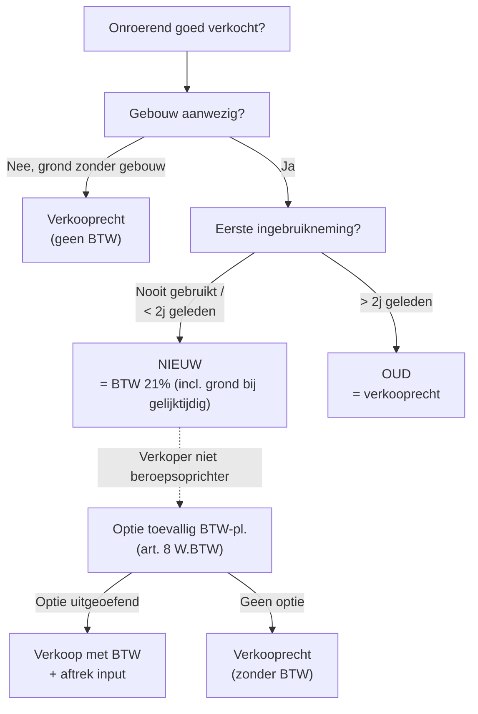

> ⚠️ **Voorlopig — themafiche-laag wordt uitgefaseerd.** Per **ADR-039** vervangt één PO-samenvatting per programmaonderdeel de cluster-themafiches. Deze fiche blijft beschikbaar tot het relevante PO een leerpad krijgt — dan migreert de inhoud naar `content/leerpaden/<po-slug>/samenvatting.md`. Voor cross-PO themafiches (vergelijkingen tussen verschillende PO's) volgt een aparte beslissing per fiche: incorporeren in alle relevante samenvattingen, óf upgraden naar concept-fiche.

> **Themafiche — kapstok voor herhaling.** Nieuwbouw-criterium · 2-jaarstermijn · optie toevallige belastingplichtige · optie B2B-verhuur · samenloop verkooprecht. Voor verhaal en routekaart: [[leerpaden/2.4|minicursus PO 2.4]].

---

## Take-away

- **Nieuw gebouw = eerste ingebruikneming binnen 2j** (niet vanaf voltooiing) — telt voor BTW i.p.v. verkooprecht
- **Sinds 2011 valt de grond mee onder BTW** wanneer dezelfde persoon gebouw + grond gelijktijdig vervreemdt
- **Verhuur principieel vrijgesteld** (art. 44 §3 2°) — optie B2B-verhuur sinds 1 okt 2018 mogelijk voor nieuwbouw, mits gezamenlijke verklaring vóór ingebruikneming
- **Toevallige belastingplichtige** (art. 8): particulier die nieuwbouw verkoopt kan optioneel BTW-regime kiezen → wel aftrek input
- **Samenloop verkooprecht-BTW**: gebouw < 2j = BTW 21% + verkooprecht alleen op grond (uitz: gelijktijdige overdracht door beroepsoprichter = alles BTW)

---

## Wanneer is een gebouw "nieuw"?

**Sleutel**: 2-jaarstermijn telt vanaf **eerste ingebruikneming of inbezitneming**, niet vanaf voltooiing.

---

## Vier verkoop-scenario's

| Scenario | Verkoper | Goed | Regime |
|---|---|---|---|
| **Beroepsoprichter — nieuw + grond gelijktijdig** | BTW-pl. oprichter | Gebouw < 2j + grond | BTW 21% op geheel (gebouw + grond) |
| **Beroepsoprichter — alleen gebouw** | BTW-pl. oprichter | Gebouw < 2j | BTW 21% op gebouw + verkooprecht op grond (apart) |
| **Toevallige BTW-plichtige (art. 8)** | Particulier — optie | Nieuwbouw < 2j | BTW 21% bij optie; recht op aftrek input |
| **Oud gebouw (> 2j)** | Eender wie | Gebouw oud | Verkooprecht (gewest-tarief) |

---

## Verhuur — vrijstelling én opties

| Type verhuur | Regime | Voorwaarden |
|---|---|---|
| **Standaard onroerende verhuur** | Vrijgesteld art. 44 §3 2° | Default; geen aftrek input |
| **Kortdurend verblijf (hotel, B&B)** | BTW 6% / 12% verplicht | < 3 maanden continuïteit |
| **Parkeerplaats, opslag, evenement** | BTW 21% verplicht | Geen vrijstelling — uitzondering art. 44 §3 2° |
| **Optie B2B-verhuur (sinds 1 okt 2018)** | BTW 21% (met aftrek) | Gezamenlijke optie verhuurder + huurder; nieuwbouw na 1 okt 2018; voor ingebruikneming opteren |
| **Onroerende leasing (financiering)** | BTW mogelijk | Aparte regeling KB nr. 30 — financieringscriterium |

⚠️ Optie B2B-verhuur is een **gezamenlijke verklaring** — beide partijen tekenen. Eenmaal geopteerd: 15j vast (= herzieningstermijn bedrijfsmiddel).

---

## Werk in onroerende staat — verlegging (KB nr. 1 art. 20)

| Situatie | BTW-schuldenaar | Toelichting |
|---|---|---|
| **Aannemer B2B aan BTW-pl. afnemer** | Afnemer (verlegging) | Rooster 87 + 56 + 59 |
| **Aannemer B2C aan particulier** | Aannemer | Standaard 21% / 6% (renovatie > 10j) |
| **Onderaanneming aan hoofdaannemer** | Hoofdaannemer (verlegging) | Identieke regel |

---

## Samenloop verkooprecht ↔ BTW

| Wat? | Verkooprecht | BTW |
|---|---|---|
| **Oud gebouw (> 2j)** | Tarief gewest (10-12.5%) | Geen |
| **Nieuw gebouw alleen** | Op grond-aandeel | 21% op gebouw |
| **Nieuw gebouw + grond gelijktijdig (zelfde persoon, beroepsoprichter)** | Geen | 21% op geheel |
| **Nieuw gebouw + grond door verschillende personen** | Op grond | 21% op gebouw |
| **Inbreng vastgoed in vennootschap (vrijstelling 115bis Wb Reg)** | Vrijgesteld | Idem als verkoop nieuwbouw |

---

## ⚠️ Valkuilen

| Valkuil | Wat klopt er niet | Wat klopt wél |
|---|---|---|
| 2-jarige termijn vanaf voltooiing | Studenten tellen vanaf voltooiingsdatum of akte | Art. 1 §9 2° W.BTW: vanaf **eerste ingebruikneming of inbezitneming** |
| Grond automatisch onder verkooprecht | "Gebouw onder BTW / grond onder verkooprecht" als reflex | Sinds 2011: bij gelijktijdige vervreemding zelfde persoon = ook grond onder BTW |
| Verhuur belasten zonder formele optie | BTW factureren omdat huurder + verhuurder beiden BTW-plichtig zijn | Optie B2B-verhuur vereist gezamenlijke verklaring vóór ingebruikneming + nieuwbouw na 1 okt 2018 |
| Werk onroerende staat altijd BTW factureren | Aannemer factureert standaard 21% | B2B-afnemer = verlegging (KB nr. 1 art. 20): rooster 87 + 56 + 59 bij afnemer |
| Toevallige BTW-plichtige automatisch | Particulier-verkoper van nieuwbouw moet BTW factureren | Optie art. 8 W.BTW is keuze (eenmaal binnen 6 maanden) — zonder optie = verkooprecht |
| Herzieningstermijn 5j voor onroerend | Bedrijfsmiddel-herziening uniform | Onroerend = 15j (vs roerend 5j) — kritisch bij optie-vastgoed-verhuur |

---

## Doorklik — losse concept-fiches

**Vastgoed-mechaniek**
- [[btw-vastgoed]] — nieuwbouw + grond + samenloop
- [[optie-btw-verhuur-vastgoed]] — B2B-optie sinds 2018

**Cross-cutting**
- [[btw-herziening-bedrijfsmiddelen]] — 15j onroerend
- [[btw-tarieven]] — 6% renovatie > 10j

**Verwant fiscaal**
- [[verkooprecht]] — registratierecht-tegenhanger
- [[inbreng-onroerend-in-vennootschap]] — vrijstelling 115bis

**Verwante themafiches**
- [[themafiches/registratierechten|Themafiche — Registratierechten]]
- [[themafiches/btw-vier-kernvragen|Themafiche — BTW vier kernvragen]]
- [[themafiches/btw-aftrek|Themafiche — BTW-aftrek]]

---

*Themafiche afgeleid uit cluster btw (PO 2.4). Status: voorgesteld.*
