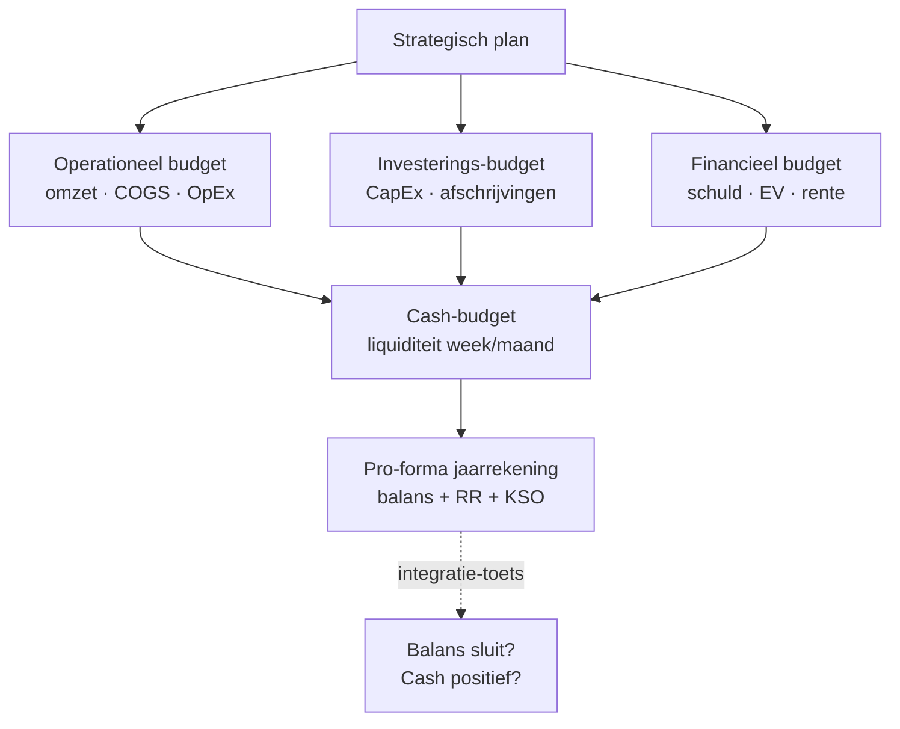

> ⚠️ **Voorlopig — themafiche-laag wordt uitgefaseerd.** Per **ADR-039** vervangt één PO-samenvatting per programmaonderdeel de cluster-themafiches. Deze fiche blijft beschikbaar tot het relevante PO een leerpad krijgt — dan migreert de inhoud naar `content/leerpaden/<po-slug>/samenvatting.md`. Voor cross-PO themafiches (vergelijkingen tussen verschillende PO's) volgt een aparte beslissing per fiche: incorporeren in alle relevante samenvattingen, óf upgraden naar concept-fiche.

> **Themafiche — kapstok voor herhaling.** Budget = vooraf, variantie = achteraf — samen het sturings-instrument. Verhaal en routekaart: [[leerpaden/1.8|minicursus PO 1.8]].

---

## Take-away

- **Budget ≠ forecast** — budget = afspraak, forecast = voorspelling; verwarring is dagelijkse praktijk
- **Pro-forma balans MOET sluiten** — niet-sluiten = integratie-fout, vaak dividend dat ergens verdwijnt
- **Decompositie prijs/hoeveelheid** sluit de cirkel met [[standaardkostenmethode|standaardkosten]] — variantie is de "norm-test"
- **Materiele varianties → IAS 2 → voorraad én KGV** (pro-rata) — niet zomaar in resultaat
- Bias om alléén ongunstige varianties te onderzoeken is gevaarlijk — onverwacht gunstig kan kwaliteits-daling verbergen

---

## Masterbudget — vier deelbudgetten

**Twee struikelblokken**:
1. **Pro-forma balans sluit niet** → fout in integratie (typisch: dividend niet in EV verwerkt)
2. **Cash-budget negatief** → werkkapitaal of financiering ontbreekt

---

## Variantie-decompositie

| | **Norm-prijs × Norm-hoeveelheid** | **Norm-prijs × Werk-hoeveelheid** | **Werk-prijs × Werk-hoeveelheid** |
|---|---|---|---|
| Begrip | *Wat zou het kosten?* | *Wat had het mogen kosten?* | *Wat heeft het gekost?* |
| Verschil-as | | Hoeveelheidsvariantie ← | → Prijsvariantie |

**Decompositie-formules:**

$$
\text{Totale variantie} = (\text{Norm} - \text{Werk}) \times P_{\text{norm}} \times Q_{\text{norm}}
$$

$$
\text{Prijsvariantie} = (P_{\text{norm}} - P_{\text{werk}}) \times Q_{\text{werk}}
$$

$$
\text{Hoeveelheidsvariantie} = (Q_{\text{norm}} - Q_{\text{werk}}) \times P_{\text{norm}}
$$

---

## Types varianties — verantwoordelijkheid

| Type variantie | Causaal verantwoordelijk | Onderzoek bij |
|---|---|---|
| Materiaal-prijs | Inkoop | Marktbeweging vs onderhandelingskracht |
| Materiaal-hoeveelheid | Productie | Verspilling · kwaliteit-grondstof |
| Arbeids-tarief | HR · marktconform loon | Loonindexering · ploegenwerk |
| Arbeids-efficiency | Productie · planning | Onervaren personeel · machine-storing |
| Overhead-volume | Capaciteits-planning | Onderbenutting · vraag-vermindering |
| Overhead-efficiency | Productie | Slecht gebruik machines · stilstand |
| Verkoop-prijs | Sales · marketing | Discount-beleid · markt-druk |
| Verkoop-volume | Sales · marketing | Marktaandeel · productlevenscyclus |

---

## ⚠️ Valkuilen

| Valkuil | Wat klopt er niet | Wat klopt wél |
|---|---|---|
| Budget als straf-instrument | Defensief budgetteren · slack inbouwen · onbetrouwbare cijfers | Budget als *afspraak* en *leerinstrument* — niet schuld-toewijzing |
| Budget = forecast | Budget = commitment, forecast = inschatting | Twee aparte processen: budget ambitieus, forecast realistisch |
| Masterbudget = operationeel budget | Mist investering · financieel · cash → geen pro-forma balans | Volledige integratie verplicht — anders geen sluitende pro-forma |
| Pro-forma balans niet sluiten | Activa ≠ Passiva = integratie-fout | Sluiten is noodzakelijke voorwaarde — fouten lokaliseren via deelbudget-controle |
| Variantie als schuldvraag | Defensief gedrag · gemiste leer-kansen | Diagnostisch signaal — onderzoek oorzaak vóór toewijzing |
| Alleen ongunstige varianties onderzoeken | Gunstige varianties verbergen vaak risico (kwaliteit, productiviteit) | Beide kanten onderzoeken — gunstig kan kwaliteitsdaling betekenen |

---

## Verdieping

### Leerstukken — voor pedagogische opfris

Werkt iets niet meer scherp? Klik door naar het leerstuk dat het uitwerkt:

- [[budget-en-variantieanalyse]] — masterbudget (zes deelbudgetten + pro-forma JR) + variantie-decompositie + budget-herziening — sturings-cyclus rond Meridia
- [[kostprijsmethoden-kiezen]] — standaardkost-kaart als norm voor variantieanalyse
- [[wat-is-analytische-boekhouding]] — klassen 8/9 + kostentypologie als kader
- [[break-even-en-marginale-beslissing]] — beslissings-input voor de productiebudget-mix

### Concept-fiches — voor definitorisch detail

Voor wie een wettekst-pointer of nauwkeurige definitie zoekt:

**Overkoepelend kader** — [[budgetbeheer]] (cluster-hoofdrecord) · [[masterbudget]] (integratie + sub-concept kasstroomprognose)

**Variantie-werkstroom** — [[variantieanalyse]] (decompositie + verantwoordelijkheid) · [[standaardkostenmethode]] (voorafbepaalde normen)

### Andere themafiches in dit cluster

- [[themafiches/kostprijsmethoden|Themafiche — Kostprijsmethoden]]
- [[themafiches/break-even-en-marginale-analyse|Themafiche — Break-even & marginale analyse]]
- [[themafiches/analytische-boekhouding-stelsel|Themafiche — Analytische bh: stelsel & registratie]]

---

*Themafiche afgeleid uit cluster analytische-boekhouding (PO 1.8). Status: voorgesteld.*
