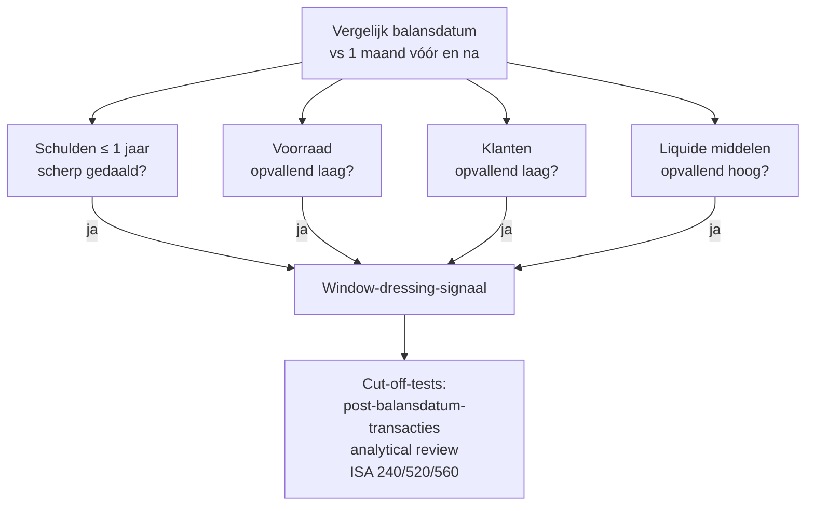

> ⚠️ **Voorlopig — themafiche-laag wordt uitgefaseerd.** Per **ADR-039** vervangt één PO-samenvatting per programmaonderdeel de cluster-themafiches. Deze fiche blijft beschikbaar tot het relevante PO een leerpad krijgt — dan migreert de inhoud naar `content/studiemateriaal/<po-slug>/samenvatting.md`. Voor cross-PO themafiches (vergelijkingen tussen verschillende PO's) volgt een aparte beslissing per fiche: incorporeren in alle relevante samenvattingen, óf upgraden naar concept-fiche.

> **Themafiche — kapstok voor herhaling.** Going-concern + Altman + window-dressing-radar op één pagina. Voor verhaal en routekaart: [[studiemateriaal/1-3|overzicht PO 1.3]] of [[studiemateriaal/1-9|overzicht PO 1.9]].

---

## Take-away

- **Continuïteit = veronderstelling** waaronder de jaarrekening wordt opgesteld; weerlegging triggert herwaardering (liquidatie-waarde)
- **Discontinuïteit ≠ faillissement** — continuïteit is een schaal: dreigend / problematisch / definitief opgegeven
- **Altman Z-score** is signaal, geen diagnose — 1-2 jaar voorspellings-horizon; Belgische sectoren vereisen aangepaste modellen
- **Window-dressing = niet noodzakelijk fraude** maar legitieme grens-praktijken die misleiden; cut-off-tests onthullen
- **Alarmbel-procedure** (WVV 5:153 BV / 7:228 NV) bij netto-actief onder kritieke drempel — bestuurdersaansprakelijkheid

---

## Continuïteits-scenarios

| Scenario | Indicatoren | Boekhoudkundige consequentie |
|---|---|---|
| **Continuïteit OK** | Positieve trend ratio's · cash-positie · winstgevendheid | Standaard waardering (going concern) |
| **Continuïteit bedreigd** | Negatieve NT · krimpende marges · verlies · Z-score < 1.81 · bankweigeringen | Toelichting verplicht (KB-WVV); bestuur evalueert; commissaris kan benadrukking-passage opnemen |
| **Continuïteit verlaten** | Beslissing tot stopzetting · faillissement aangevraagd | Liquidatie-waardering (vervangingswaarde laagst); art. 3:33 WVV-vermelding |

---

## Altman Z-score (oorspronkelijke variant — beursgenoteerd)

$$
Z = 1{,}2 \times \frac{\text{Werkkapitaal}}{\text{Totaal activa}} + 1{,}4 \times \frac{\text{Ingehouden winst}}{\text{Totaal activa}} + 3{,}3 \times \frac{\text{EBIT}}{\text{Totaal activa}} + 0{,}6 \times \frac{\text{Marktwaarde EV}}{\text{Boekwaarde schuld}} + 1{,}0 \times \frac{\text{Omzet}}{\text{Totaal activa}}
$$

**Interpretatie-bandbreedtes (oorspronkelijk model)**:

| Z-waarde | Interpretatie |
|---|---|
| Z > 2.99 | Veilig — lage faillissementskans |
| 1.81 ≤ Z ≤ 2.99 | Grijze zone — opvolgen |
| Z < 1.81 | Hoge faillissementskans binnen 2 jaar |

**Belgische varianten**: Ooghe-Camerlynck (KMO) · CNH-modellen — beter gekalibreerd op Belgische sectoren.

---

## Window-dressing — detectie-radar

**Niet noodzakelijk fraude** — maar wijkt af van getrouw beeld; auditor (ISA 240) onderzoekt of materieel.

---

## Alarmbel-procedure (WVV)

| Triggerdrempel | NV (art. 7:228) | BV (art. 5:153) |
|---|---|---|
| Netto-actief onder | 1/2 kapitaal → bijzondere AV ≤ 2 mnd | Liquiditeits-test faalt + balanstest faalt → AV ≤ 2 mnd |
| Netto-actief onder | 1/4 kapitaal of MKW → ontbinding overweegen | Ernstige twijfel continuïteit → idem |

**Niet-naleving** = hoofdelijke bestuurdersaansprakelijkheid voor schulden aangegaan tijdens periode (art. 2:56 WVV).

---

## ⚠️ Valkuilen

| Valkuil | Wat klopt er niet | Wat klopt wél |
|---|---|---|
| Discontinuïteit = faillissement | Discontinuïteit is verandering van veronderstelling; faillissement is juridische procedure | Continuïteit kan vrijwillig opgegeven (vereffening) zonder faillissement |
| Z-score als enig criterium | Statistisch model; sector-blind; één-tijdstipsignaal | Combineren met trend + kwalitatieve signalen + cash-positie |
| Tabel zonder verhaal afleveren | Cijfers zonder interpretatie = audit-failure | Diagnose = ratio's + trend + benchmark + verhaal + aanbevelingen |
| Window-dressing = fraude | Vaak legitiem (timing-keuze); soms grens-overschrijdend | ISA 240 onderzoek of materieel en intentioneel |
| Alarmbel laat triggeren | Procedure is preventief, niet curatief | Bestuur moet alert zijn vóór ratio's negatief worden |

---

## Doorklik — losse concept-fiches

**De vijf records**
- [[continuiteit]] — going-concern + 3 scenario's
- [[financiele-diagnose]] — integrale beoordeling-procedure
- [[faillissementspredictie-modellen]] — Altman + Ooghe-Camerlynck + CNH
- [[window-dressing]] — detectie + ISA 240/505/520/560
- [[toegevoegde-waarde]] — context voor diagnose

**Cross-relevant**
- [[kapitaalbescherming]] — alarmbel-procedure WVV
- [[kamers-voor-ondernemingen-in-moeilijkheden]] — vervolg na alarmbel-trigger
- [[ratio-interpretatie]] — methodologische basis

**Verwante themafiches**
- [[themafiches/jaarrekeninganalyse-aanpak|Themafiche — Aanpak & herrangschikking]]
- [[themafiches/ratio-families|Themafiche — Ratio-families]]
- [[themafiches/kasstroom-analyse|Themafiche — Kasstroom-analyse]]

---

*Themafiche afgeleid uit cluster financiele-analyse (PO 1.3 + 1.9). Status: voorgesteld.*
