> ⚠️ **Voorlopig — themafiche-laag wordt uitgefaseerd.** Per **ADR-039** vervangt één PO-samenvatting per programmaonderdeel de cluster-themafiches. Deze fiche blijft beschikbaar tot het relevante PO een leerpad krijgt — dan migreert de inhoud naar `content/leerpaden/<po-slug>/samenvatting.md`. Voor cross-PO themafiches (vergelijkingen tussen verschillende PO's) volgt een aparte beslissing per fiche: incorporeren in alle relevante samenvattingen, óf upgraden naar concept-fiche.

> **Themafiche — kapstok voor herhaling.** Vier audit-fases + ISA's per fase + auditrisicomodel op één pagina. Voor verhaal en routekaart: [[leerpaden/1.6|minicursus PO 1.6]].

---

## Take-away

- **Controle ≠ alles checken** — redelijke (niet absolute) zekerheid via materialiteit + risico-georiënteerde aanpak (ISA 200/320)
- **Planning is iteratief**, geen januari-checklist — bewijswerk in fase 3 voedt herziening risico-inschatting (ISA 300 A3)
- **Auditrisico = IR × CR × DR** — alleen DR is door de auditor stuurbaar; IR en CR worden ingeschat
- **Professional skepticism is permanent** — niet vertrouwen "tenzij" maar twijfelen "tenzij gevalideerd"
- **Dossier sluit binnen 60 dagen** na verklaring (ISA 230) — daarna geen wijzigingen meer

---

## De vier fases — kapstok per ISA-cluster

| Fase | Kern-activiteit | Sleutel-ISA's | Deliverable |
|---|---|---|---|
| **1. Aanvaarden** | KYC · onafhankelijkheid · ethische check · capaciteit · opdrachtbrief | ISA 210 · ISA 220 · ISQM 1/2 | Getekende opdrachtbrief + aanvaardings-memo |
| **2. Plannen** | Kennis entiteit · risico-inschatting · materialiteit · strategie + werkprogramma | ISA 300 · ISA 315 · ISA 320 · ISA 330 | Audit-strategy + werkprogramma per cyclus |
| **3. Bewijswerk** | Test of controls · substantive procedures · steekproef · cijferanalyse · LOR | ISA 330 · ISA 500-580 · ISA 520 · ISA 530 | Werkdocumenten per assertion per cyclus |
| **4. Afronden** | Subsequent events · going-concern · misstatement-summary · governance-communicatie · verklaring | ISA 260 · ISA 450 · ISA 560 · ISA 570 · ISA 700-720 | Controleverklaring + management letter |

---

## Auditrisicomodel

$$
\text{AR} = \text{IR} \times \text{CR} \times \text{DR}
$$

| Component | Waar beïnvloed | Wie controleert |
|---|---|---|
| **IR** — Inherent risk | Aard transacties · branche · complexiteit | Niet stuurbaar — wel inschatbaar (ISA 315) |
| **CR** — Control risk | Interne-controle-systeem cliënt | Niet stuurbaar — wel testbaar (ISA 330) |
| **DR** — Detection risk | Aard · timing · omvang substantive procedures | **Stuurbaar** door auditor (omgekeerd evenredig met IR × CR) |

**Inzicht**: hoog IR × hoog CR ⇒ DR moet laag ⇒ meer / robuustere substantive procedures.

---

## ISA-kapstok per fase

```mermaid
flowchart TD
    F1["Fase 1 — Aanvaarden"] --> A1["ISA 210 opdrachtvoorwaarden"]
    F1 --> A2["ISA 220 + ISQM kwaliteit"]
    F2["Fase 2 — Plannen"] --> B1["ISA 300 planning"]
    F2 --> B2["ISA 315 risico-inschatting"]
    F2 --> B3["ISA 320 materialiteit"]
    F2 --> B4["ISA 330 reactie op risico"]
    F3["Fase 3 — Bewijswerk"] --> C1["ISA 500 audit-bewijs"]
    F3 --> C2["ISA 520 cijferanalyse"]
    F3 --> C3["ISA 530 steekproef"]
    F3 --> C4["ISA 540 schattingen"]
    F3 --> C5["ISA 580 LOR"]
    F4["Fase 4 — Afronden"] --> D1["ISA 450 misstatements"]
    F4 --> D2["ISA 560 subsequent events"]
    F4 --> D3["ISA 570 going-concern"]
    F4 --> D4["ISA 700-720 verklaring"]
```

---

## Bewijswerk — 7 procedures per assertion

| Procedure | Bewijskracht | Typische toepassing |
|---|---|---|
| Inspectie | Hoog (extern document) | Facturen · contracten · titels |
| Waarneming | Beperkt (momentopname) | Stockopname · functiescheiding observeren |
| Bevestiging (extern) | Zeer hoog | Saldo-bevestiging klanten · banken · advocaten |
| Herberekening | Hoog (objectief) | Afschrijvingstabellen · btw-aangifte · loonberekening |
| Heruitvoering | Hoog | Walk-through controle-procedure |
| Cijferanalyse (ISA 520) | Variabel | Ratio's · trend · plausibiliteit · regressie |
| Inquiry / vraagstelling | Laag (zonder corroboration) | Management · personeel · governance |

**Materialiteit** (ISA 320): startpunt 5% pre-tax-winst is **richtwaarde**, geen automatisme — alternatieven bij verlies-entiteit, financiële instelling, NPO.

---

## ⚠️ Valkuilen

| Valkuil | Wat klopt er niet | Wat klopt wél |
|---|---|---|
| Controle = alles checken | Auditor moet elke transactie nakijken | Redelijke zekerheid + materialiteit + risico-aanpak (ISA 200/320/530) |
| Planning eenmalig afvinken | Strategy = vaste checklist begin januari | Iteratief proces; bewijswerk voedt herziening (ISA 300 A3) |
| Materialiteit = altijd 5% van winst | Vaste regel uit ISA 320 | 5% pre-tax is startpunt voor profit-entity; ander benchmark bij verlies/NPO/bank |
| Documenten = bewijs | Alles wat cliënt aanlevert telt | Bewijs heeft kwaliteit (ISA 500) — extern > intern > management-generated |
| Steekproef automatisch extrapolerbaar | Elke steekproef = statistisch geldig | Alleen statistische steekproef (random/systematic) extrapoleert met gekend foutpercentage (ISA 530) |
| LOR vervangt bewijs | Ondertekende verklaring management = voldoende | LOR is *aanvullend* bewijs, niet vervangend (ISA 580 par. 4) |

---

## Doorklik — losse concept-fiches

**De vier fases**
- [[opdrachtaanvaarding-en-opdrachtbrief]] — KYC · ethische check · opdrachtbrief · aansprakelijkheid
- [[audit-planning]] — ISA 300/315/320 · auditrisicomodel · strategy + werkprogramma
- [[audit-bewijs]] — assertions · 7 procedures · steekproef · LOR
- [[audit-afronding]] — subsequent events · going-concern · governance-communicatie

**Cross-cutting**
- [[controleopdracht]] — hoofdrecord 4-fase-model
- [[isa-overzicht]] — kapstok per audit-fase met alle ISA-nummers
- [[revisiedossier]] — permanent + lopend dossier

**Verwante themafiches**
- [[themafiches/controleverklaring|Themafiche — Controleverklaring & oordeel]]
- [[themafiches/opdracht-types|Themafiche — Opdracht-types & zekerheidsniveaus]]
- [[themafiches/bijzondere-mandaten|Themafiche — Bijzondere mandaten]]
- [[themafiches/interne-controle-frameworks|Themafiche — Interne-controle-frameworks]] (cross PO 1.7)

---

*Themafiche afgeleid uit cluster controle-opdracht (PO 1.6). Status: voorgesteld.*
