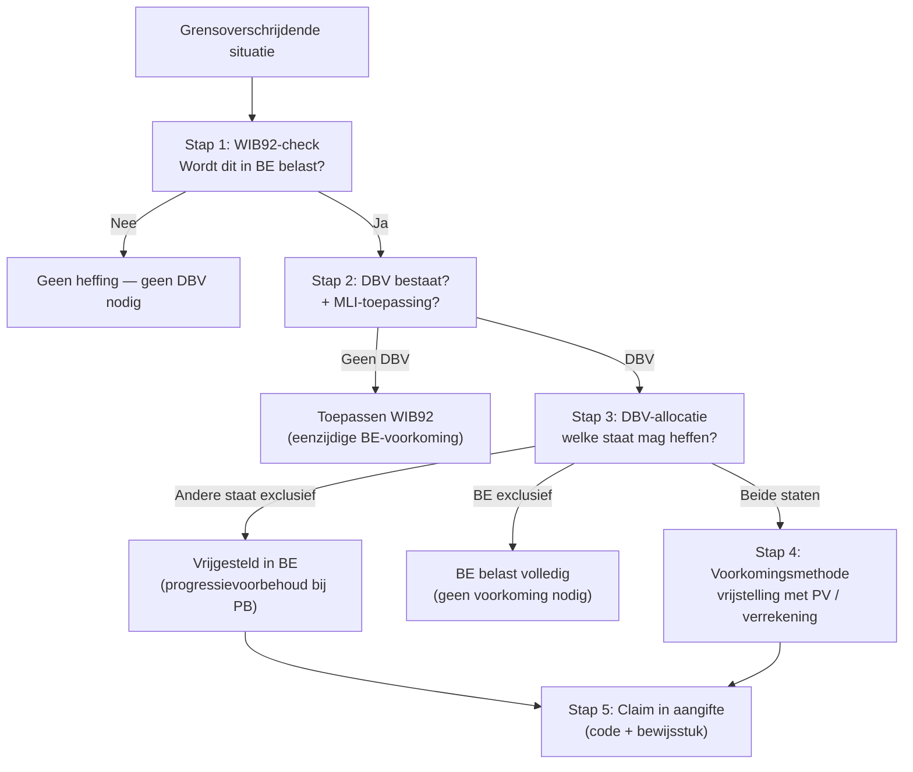

> ⚠️ **Voorlopig — themafiche-laag wordt uitgefaseerd.** Per **ADR-039** vervangt één PO-samenvatting per programmaonderdeel de cluster-themafiches. Deze fiche blijft beschikbaar tot het relevante PO een leerpad krijgt — dan migreert de inhoud naar `content/leerpaden/<po-slug>/samenvatting.md`. Voor cross-PO themafiches (vergelijkingen tussen verschillende PO's) volgt een aparte beslissing per fiche: incorporeren in alle relevante samenvattingen, óf upgraden naar concept-fiche.

> **Themafiche — kapstok voor herhaling.** DBV-flow: WIB-check → DBV-allocatie → voorkomingsmethode + MLI-overlay + claim-formaliteit. Voor verhaal en routekaart: [[leerpaden/2.8|minicursus PO 2.8]].

---

## Take-away

- **DBV creëert geen heffing — verdeelt bevoegdheid**: eerst WIB92-check (heffen we in BE?), pas dan DBV-toepassing
- **Vrijstelling met progressievoorbehoud**: vrijgesteld inkomen telt mee voor progressie-tarief op rest-Belgische inkomen
- **MLI-overlay sinds 2019**: bestaande DBV's gewijzigd — gebruik "synthetised texts" OESO of FOD; oude tekst ≠ huidige toepassing
- **Vrijstelling claim in aangifte** (niet automatisch): code "vrijgesteld onder DBV" + bewijs bronstaat-belasting
- **183-dagenregel werknemers** = drie cumulatieve voorwaarden (≤ 183 dagen + werkgever geen bronland-resident + geen vaste inrichting in bronland)
- **Voorkoming dubbele belasting**: vrijstellings- of verrekeningsmethode — varieert per DBV en per inkomens­categorie

---

## Beslisboom — DBV-toepassing

---

## DBV-allocatie per inkomenscategorie (OESO-model)

| Inkomen | Heffingsbevoegdheid | Limiet bronstaat | BE-voorkoming |
|---|---|---|---|
| **Onroerend inkomen (art. 6)** | Staat ligging (exclusief) | Onbeperkt | Vrijstelling met PV |
| **Dividenden (art. 10)** | Beide — woonstaat (rest) + bronstaat (max 15% / 5% bij MDR-deelneming) | Cap meestal 15% / 5% | DBI-aftrek (verrekening) |
| **Interesten (art. 11)** | Beide — woonstaat + bronstaat (max 10% typisch) | Cap meestal 10% / 0% (IRR) | Verrekening (DBI niet voor interesten) |
| **Royalty's (art. 12)** | Vaak woonstaat exclusief (BE-DBV's) of bronstaat met cap | Variabel | Verrekening |
| **Vermogenswinsten onroerend (art. 13)** | Staat ligging | Onbeperkt | Vrijstelling met PV |
| **Lonen werknemers (art. 15)** | In principe werkstaat | Uitz: 183-dagenregel (zie tabel) | Vrijstelling met PV |
| **Bestuurdersbezoldigingen (art. 16)** | Staat vennootschap | Onbeperkt | Vrijstelling met PV |
| **Pensioenen (art. 18)** | Variabel — vaak woonstaat | Variabel | Vrijstelling met PV |
| **Ondernemingswinst (art. 7)** | Woonstaat — tenzij vaste inrichting in bronstaat | Bij VI: toerekening winst aan VI | Vrijstelling met PV (BE: art. 156 WIB) |

---

## 183-dagenregel (art. 15 OESO-MV)

| Voorwaarde | Inhoud | Effect bij voldoen |
|---|---|---|
| **(a) ≤ 183 dagen aanwezigheid** | In bronstaat tijdens 12 mnd-periode (varieert per DBV: kalenderjaar of voortschrijdend) | Cumulatief |
| **(b) Werkgever niet-resident bronstaat** | Beloning betaald door / namens werkgever NIET in bronstaat | Cumulatief |
| **(c) Geen vaste inrichting** | Beloning niet ten laste van VI van werkgever in bronstaat | Cumulatief |

**Drie cumulatief = werkstaat-uitzondering**: woonstaat heft. Eén voorwaarde niet voldaan = bronstaat heft (werkstaat).

---

## Voorkomings­methoden — vrijstelling vs verrekening

| Methode | Mechanisme | Wanneer toegepast | Voorbeeld |
|---|---|---|---|
| **Vrijstelling met progressievoorbehoud** | Vrijgesteld inkomen ≠ belast in BE, maar telt voor tarief op overige inkomsten | Onroerend · ondernemingswinst via VI · loon (DBV-art. 23) · pensioen typisch | Belgisch loon 40k + Frans pensioen 20k vrijgesteld → BE-PB op 40k aan progressie-tarief geldend voor 60k |
| **Volledige vrijstelling** | Vrijgesteld + niet meetelt voor progressie | Zeldzaam (sommige DBV's) | n.v.t. typisch |
| **Verrekening met cap (ordinary credit)** | BE belast volledig + verrekent bronstaat-belasting tot BE-belasting op dat inkomen | Dividenden via DBI · interesten · royalty's | BE belast 25%; bronstaat 15% → verrekening 15% (cap = 25% op dat inkomen) |
| **Forfaitair Buitenlands Gedeelte (FBB)** | Vast forfaitair krediet | Soms voor interesten | Bestaand maar uitdovend; zeldzaam |

---

## MLI-impact (Multilateraal Instrument)

| Effect | Toelichting |
|---|---|
| **Wijzigt bestaande DBV's** | MLI bovenop bilaterale verdragen — niet vervangend |
| **Synthetised texts** | OESO + FOD Financiën publiceren geconsolideerde versies — gebruik die, niet oude DBV-tekst |
| **PPT (Principal Purpose Test)** | Nieuwe anti-misbruik-bepaling: DBV-voordeel ontzegd bij "main purpose" = belastingvoordeel zonder zakelijke rationale |
| **Inwerkingtreding BE** | Voor BE: 1 oktober 2019 (PB-bronheffing) en aanslagjaren vanaf 2020 (winstbelasting) |
| **DBV's gewijzigd** | Ca. 100 BE-DBV's via MLI gewijzigd |

---

## DBV-claim in aangifte

| Element | Hoe? |
|---|---|
| **PB — vrijgesteld onder DBV** | Code "vrijgesteld onder DBV" in vak overeenstemmend met inkomen-type |
| **VenB — DBI-splitsing** | Vak DBI met kolom voor verdragsland (apart van niet-verdragsland) |
| **Bewijs bron-belasting** | Aanslagbiljet bronstaat of verklaring bron-fiscus |
| **Niet claimen = volledige BE-belasting** | Vrijstelling werkt NIET automatisch |
| **Termijn correctie** | Via bezwaar (1 jaar) of ambtshalve ontheffing (5 jaar — uitzonderlijke fout) |

---

## ⚠️ Valkuilen

| Valkuil | Wat klopt er niet | Wat klopt wél |
|---|---|---|
| Direct naar DBV zonder WIB92-check | DBV creëert heffing | DBV is verdelings-instrument — geen heffing zonder WIB92-grondslag. Eerst BE-belastbaarheid testen |
| DBV-vrijstelling = automatisch | Vrijstelling werkt zonder claim | Expliciet claimen in aangifte (code + bewijs) — anders volledige BE-belasting |
| Buitenlands inkomen = belastingvrij | "DBV maakt vrij" | Vrijstelling met progressievoorbehoud: telt mee voor tarief op overige inkomsten |
| Oude DBV-tekst toepassen | DBV uit 2001 nog "huidig" | Sinds 2019 MLI-overlay — gebruik synthetised texts OESO / FOD voor BE-DBV's |
| 183 dagen alleen | Eén voorwaarde-tabel | Drie cumulatieve voorwaarden — werkgever-residentie + geen VI ook vereist |
| Vrijstelling = verrekening | Methodes door elkaar | Vrijstelling met PV (onroerend, loon, VI) ≠ verrekening (dividenden, interesten). DBV bepaalt methode per inkomens-type |

---

## Doorklik — losse concept-fiches

**DBV-kader**
- [[dubbelbelastingverdrag]] — verdragsstructuur + MLI
- [[fiscale-residentie]] — wie is rijksinwoner?
- [[internationaal-fiscaal]] — overkoepelend

**Per inkomenscategorie**
- [[roerend-inkomen-internationaal]] — dividenden + interesten + royalty's grensoverschrijdend
- [[internationaal-onroerend-goed]] — onroerend buitenland
- [[internationale-tewerkstelling]] — 183-dagenregel
- [[vaste-inrichting]] — drempel + winsttoerekening

**Cross-cutting**
- [[belasting-niet-inwoners]] — BNI-mechaniek
- [[buitenlandse-winst-en-verlies]] — voorkoming voor VI-winst

**Verwante themafiches**
- [[themafiches/eu-fiscale-richtlijnen|Themafiche — EU fiscale richtlijnen]]
- [[themafiches/vaste-inrichting|Themafiche — Vaste inrichting]]
- [[themafiches/transfer-pricing-en-beps|Themafiche — Transfer pricing & BEPS]]

---

*Themafiche afgeleid uit cluster europees-en-internationaal-fiscaal-recht (PO 2.8). Status: voorgesteld.*
