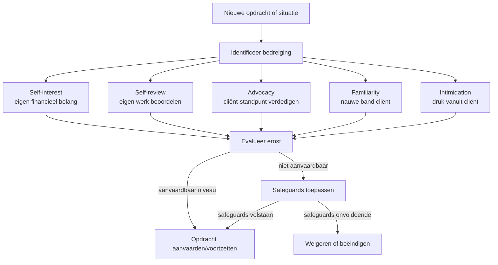

> ⚠️ **Voorlopig — themafiche-laag wordt uitgefaseerd.** Per **ADR-039** vervangt één PO-samenvatting per programmaonderdeel de cluster-themafiches. Deze fiche blijft beschikbaar tot het relevante PO een leerpad krijgt — dan migreert de inhoud naar `content/leerpaden/<po-slug>/samenvatting.md`. Voor cross-PO themafiches (vergelijkingen tussen verschillende PO's) volgt een aparte beslissing per fiche: incorporeren in alle relevante samenvattingen, óf upgraden naar concept-fiche.

> **Themafiche — kapstok voor herhaling.** Vijf beginselen van het ITAA-beroep + conceptueel kader threats-and-safeguards + onafhankelijkheid versus objectiviteit. Voor verhaal en routekaart: [[leerpaden/4.0|minicursus PO 4.0]].

---

## Take-away

- **Vijf beginselen zijn juridisch bindend** — niet beleefdheids-code; overtreding = tuchtfout art. 22 Wet 17/3/2019
- **Onafhankelijkheid ≠ objectiviteit** — onafhankelijkheid is voorwaarde voor **wettelijke audit** (commissaris); objectiviteit geldt voor **élke opdracht**
- **Conceptueel kader** is *doorlopend* — bij opdrachtaanvaarding én tijdens uitvoering bij elke nieuwe omstandigheid
- **Onafhankelijkheid heeft twee dimensies**: feitelijk (in mind) **én** naar buiten toe (in appearance) — beide vereist
- **Safeguards moeten de dreiging op aanvaardbaar niveau brengen** — als geen safeguard volstaat → opdracht weigeren of beëindigen

---

## De vijf fundamentele beginselen

| Beginsel | Wat? | Praktijk-vertaling |
|---|---|---|
| **Integriteit** | Eerlijk + oprecht + rechtschapen in alle beroepsrelaties | Geen valse verklaringen · geen misleidende rapportering · associate niet met dossiers waarvan men weet dat ze materieel-onjuiste informatie bevatten |
| **Objectiviteit** | Geen vooroordeel · belangenconflict · ongepaste beïnvloeding | Conceptueel kader doorlopen; bij conflict → safeguards of weigeren |
| **Vakbekwaamheid en zorgvuldigheid** | Voldoende kennis + nauwgezet werk + permanente vorming | Niet aanvaarden zonder competentie · CPD-uren · supervision over team |
| **Vertrouwelijkheid** | Informatie cliënt + werkgever niet onthullen · niet voor eigen voordeel gebruiken | Beroepsgeheim art. 458 Sw + ITAA-norm · uitzondering bij wet (AML) of toestemming |
| **Professioneel gedrag** | Wetgeving respecteren + niets doen dat beroep in diskrediet brengt | Reclame-regels · communicatie sociale media · gedrag-buiten-werk-uren-relevant indien beroep raakt |

---

## Threats-and-safeguards — vijf bedreigingen

| Bedreiging | Voorbeeld | Typische safeguard |
|---|---|---|
| **Self-interest** | Honorarium hangt af van uitkomst | Vast honorarium · escalatie naar partner · onafhankelijke review |
| **Self-review** | Eigen advies vorig jaar opnieuw beoordelen | Andere collega in review · scheidings-team (Chinese walls) |
| **Advocacy** | Cliënt verdedigen in fiscaal geschil terwijl boekhouding gevoerd wordt | Geen pleitfunctie + boekhoudfunctie tegelijk · cliënt informeren over rol-beperking |
| **Familiarity** | Lange relatie · familieband · partner werkt bij cliënt | Partner-rotatie (7 jaar audit) · cooling-off · review door buitenstaander |
| **Intimidation** | Cliënt dreigt met opzegging bij ongunstig advies | Documenteren · escalatie ITAA · weigeren bij persistente druk |

---

## Onafhankelijkheid — twee dimensies

| Dimensie | Wat? | Toets |
|---|---|---|
| **Feitelijke onafhankelijkheid** (in mind) | Geesteshouding · vrij van invloed | Innerlijk; documentatie van overwegingen + safeguards |
| **Schijnbaar onafhankelijk** (in appearance) | Hoe een redelijke derde de situatie ziet | Externe toets — wat zou een geïnformeerde derde concluderen? |

**Beide dimensies vereist voor wettelijke audit-opdracht** (commissaris) — art. 12 § 1 + ITAA-norm onafhankelijkheid.

**Voor andere opdrachten** geldt **objectiviteit** als breder beginsel — minder strikt dan onafhankelijkheid, maar zelfde threats-and-safeguards-analyse.

**Cooling-off** = wachtperiode tussen bv. functie bij cliënt en commissaris-rol — voor publieke entiteiten typisch 1-2 jaar; ITAA-norm onafhankelijkheid specifieert.

---

## Onverenigbaarheden — kortbij

| Activiteit | Verenigbaar met ITAA-statuut? |
|---|---|
| Loondienst-functie bij cliënt | Nee — voor opdrachten naar die cliënt |
| Handelsactiviteit (zaakvoerder commerciële vennootschap) | Beperkt — vereist conformiteit met onafhankelijkheid + objectiviteit; melding ITAA |
| Politiek mandaat | Toegelaten · met respect voor beroepsplichten |
| Notaris-/advocaat-statuut combineren | Nee — afzonderlijke beroepswetgeving |
| Bestuurder bij audit-cliënt | Nee voor commissarissen; problematisch voor andere opdrachten |

⚠️ Bij twijfel: **conformiteits-check via Norm Onafhankelijkheid ITAA** + melding kantoor-organisatie.

---

## ⚠️ Valkuilen

| Valkuil | Wat klopt er niet | Wat klopt wél |
|---|---|---|
| Deontologie = etiquette of vrijblijvende ethiek | Wettelijke verankering · overtreding = tuchtfout art. 22 Wet 17/3/2019 | Bindende beroepsplichten · sanctioneerbaar tot schrapping |
| Onafhankelijkheid en objectiviteit door elkaar | Onafhankelijkheid = strikt voor wettelijke audit; objectiviteit = breder beginsel | Commissaris: beide; andere opdrachten: objectiviteit-analyse via threats-and-safeguards |
| Threats-and-safeguards = afvinklijstje bij opdrachtaanvaarding | Doorlopende plicht — bij elke nieuwe omstandigheid opnieuw evalueren | Periodieke heroverweging + documentatie in dossier; ad-hoc bij nieuwe feiten |
| Onafhankelijkheid is subjectief — "ik weet dat ik objectief ben" | Ook **in appearance**-toets vereist | Wat zou een geïnformeerde derde denken? — externe blik vereist |
| Onafhankelijkheid enkel voor commissarissen | Cijfer-strikt: ja, maar **objectiviteit** geldt voor élke opdracht | Voor advies/aangifte/boekhouding: objectiviteit via threats-and-safeguards |
| Safeguards lossen elke dreiging op | Soms onvoldoende — appropriate reviewer kan niet alles compenseren | Bij niet-reduceerbare dreiging → opdracht weigeren of beëindigen |

---

## Doorklik — losse concept-fiches

**Kern-beginselen**
- [[deontologie]] — 5 beginselen + conceptueel kader
- [[onafhankelijkheid]] — twee dimensies + commissaris-context
- [[beroepsgeheim]] — vertrouwelijkheid + uitzonderingen

**Beroep-statuut**
- [[gecertificeerd-accountant]] — toelating · monopolie-opdrachten · stagiair
- [[itaa-beroepsorganisatie]] — structuur + publiek toezicht + register
- [[normbronnen]] — wet → KB → reglement → norm → code → ISA

**Aanverwant**
- [[kwaliteitsmanagement-opdracht]] — ISQM kantoor + EQR opdracht
- [[permanente-vorming]] — CPD-vereisten

**Verwante themafiches**
- [[themafiches/antiwitwas-praktijk|Themafiche — Antiwitwas-praktijk]]
- [[themafiches/beroepsgeheim-en-aansprakelijkheid|Themafiche — Beroepsgeheim & aansprakelijkheid]]
- [[themafiches/opdrachtaanvaarding-en-tucht|Themafiche — Opdrachtaanvaarding & tucht]]

---

*Themafiche afgeleid uit cluster beroepsbeoefening (PO 4.0). Status: voorgesteld.*
