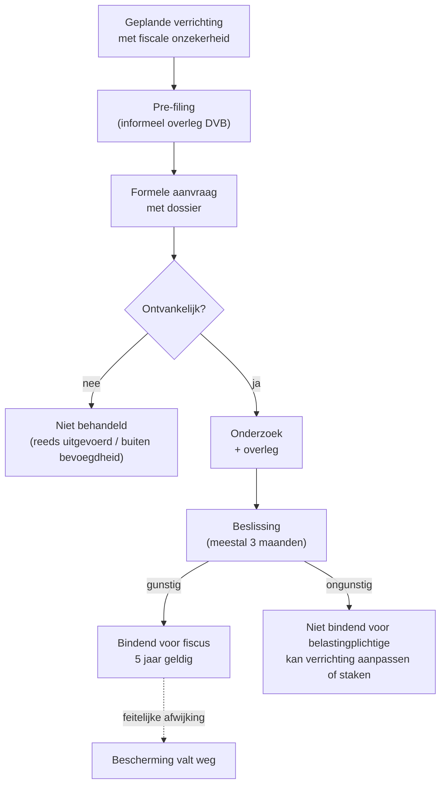

> **Themafiche — kapstok voor herhaling.** DVB = bindende zekerheid vooraf, alleen voor geplande verrichtingen, alleen binnen de DVB-bevoegdheid. Voor verhaal en routekaart: [[leerpaden/2.1|minicursus PO 2.1]].

---

## Take-away

- **Vooraf, niet achteraf** — art. 22 sluit ruling uit voor reeds uitgevoerde verrichtingen; aanvragen moeten ingediend zijn vóór één bindend element zich heeft voltrokken
- **Bindend voor de fiscus, niet voor de belastingplichtige** — die kan kiezen om de geplande verrichting niet door te zetten of anders uit te voeren
- **Draagwijdte = exact zoals beschreven** — wezenlijke afwijking in de uitvoering (andere bedragen, andere partijen, andere structuur) doet de bescherming wegvallen
- **DVB ≠ akkoord, ≠ taxatie-onderhandeling** — drie verschillende zekerheidsinstrumenten met andere voorwaarden en gevolgen
- **5 jaar geldigheid** standaard (verlenging mogelijk); verkortbaar als verrichting eerder voltrokken of stopgezet

---

## DVB-procedure in stappen

---

## Ontvankelijkheidsvoorwaarden — checklist

| Voorwaarde | Wat? | Veelgemaakte fout |
|---|---|---|
| **Toekomstig** | Verrichting nog niet uitgevoerd op datum aanvraag | Aanvraag indienen ná notariële akte → onontvankelijk |
| **Concreet beschreven** | Voldoende detail (partijen, bedragen, structuur, tijdspad) | Hypothetische "wat als"-vragen → niet behandeld |
| **Binnen DVB-bevoegdheid** | Federale belasting (PB · VenB · BTW · Reg-fed · Succ-fed · douane) | Vlaamse erfbelasting → VLABEL (apart kanaal) |
| **Geen procedure lopend** | Geen fiscale controle, bezwaar of geschil over hetzelfde onderwerp | Bezwaar lopend → DVB niet behandeld |
| **Geen ontwijking-uitsluiting** | Verrichting valt niet onder limitatieve uitsluitingen | Zuiver fiscale constructies zonder zakelijke substantie → afgewezen |
| **Aanvrager gerechtigd** | Belastingplichtige zelf of gemandateerde adviseur | Aanvraag door niet-betrokken derde |

---

## Drie zekerheidsinstrumenten naast elkaar

| Aspect | DVB-ruling | Akkoord (art. 220 WIB) | Pre-rulling / regularisatie |
|---|---|---|---|
| **Wanneer?** | Vóór verrichting | Tijdens controle of bij specifieke kwesties | Bij rechtzetting bestaande situatie |
| **Bevoegde dienst** | DVB (federaal) of VLABEL (gewestelijk) | Aanslag-/controleambtenaar | Contactpunt regularisaties (CPR) |
| **Bindend?** | Ja, voor fiscus | Ja, beide partijen | Ja, eens betaald (uitsluiting strafvervolging) |
| **Geldigheidsduur** | 5 jaar (standaard) | Tot wijziging feiten/wet | Eenmalig |
| **Publicatie** | Anoniem (geredigeerd) op fisconetplus | Nee | Nee |
| **Toegankelijk voor derden?** | Geredigeerd ja, individueel nee | Nee | Nee |

---

## Draagwijdte van de beslissing

| Type wijziging | Impact op bescherming |
|---|---|
| Onbetekenende uitvoeringsverschillen | Bescherming blijft |
| Wezenlijke afwijking in bedragen of structuur | Bescherming valt weg (volledig) |
| Wetswijziging na ruling | Bescherming valt weg vanaf inwerkingtreding nieuwe wet |
| Nieuwe rechtspraak (Cassatie) | Bescherming blijft tot einde termijn (rechtszekerheid) |
| Nieuwe administratieve interpretatie | Bescherming blijft tot einde termijn |
| Belastingplichtige onthult feiten onvolledig | Ruling vernietigbaar ex tunc |

---

## ⚠️ Valkuilen

| Valkuil | Wat klopt er niet | Wat klopt wél |
|---|---|---|
| Ruling voor reeds uitgevoerde verrichtingen | Art. 22 sluit dit uit | Voor reeds uitgevoerde: gewone aangifte + eventueel bezwaar of regularisatie |
| Wezenlijke afwijking onderschatten | Bescherming valt weg | Hou uitvoering exact zoals beschreven; wijziging? → nieuwe aanvraag |
| DVB als civielrechtelijke goedkeuring lezen | Ruling raakt enkel fiscale behandeling | Civielrechtelijke geldigheid blijft een aparte vraag |
| Verwarring DVB ↔ VLABEL | Verschillende bevoegdheden | Federaal = DVB; Vlaamse erfbelasting/registratie = VLABEL; Brussels/Waals = FOD Fin |
| Ruling als één-onderhandeling | Pre-filing is informeel; formele aanvraag is bindende procedure | Gebruik pre-filing om te toetsen of dossier kans maakt |
| Geen ruling vragen bij twijfel | Misgelopen zekerheid bij grote verrichting | Voor herstructurering, internationale structuur of grote meerwaarde: ruling-aanvraag is best practice |

---

## Doorklik — losse concept-fiches

**Ruling-procedure**
- [[voorafgaande-beslissing-dvb]] — DVB-procedure + ontvankelijkheid + draagwijdte

**Verwante zekerheidsinstrumenten**
- [[fiscale-bemiddelingsprocedure]] — bemiddeling tijdens of na controle
- [[fiscale-regularisatie-en-buitenlandse-goederen]] — regularisatie via CPR

**Aanleidingen voor ruling**
- [[anti-misbruik]] — twijfel over AAMB-risico
- [[fiscale-fusie-splitsing]] — neutraliteitsvoorwaarden vooraf bevestigen
- [[transfer-pricing]] — Advanced Pricing Agreement (APA)

**Verwante themafiches**
- [[themafiches/fiscale-beginselen|Themafiche — Fiscale beginselen]] (rechtszekerheid)
- [[themafiches/anti-misbruik|Themafiche — Anti-misbruik & simulatie]]

---

*Themafiche afgeleid uit cluster algemene-fiscale-beginselen (PO 2.1). Status: voorgesteld.*
