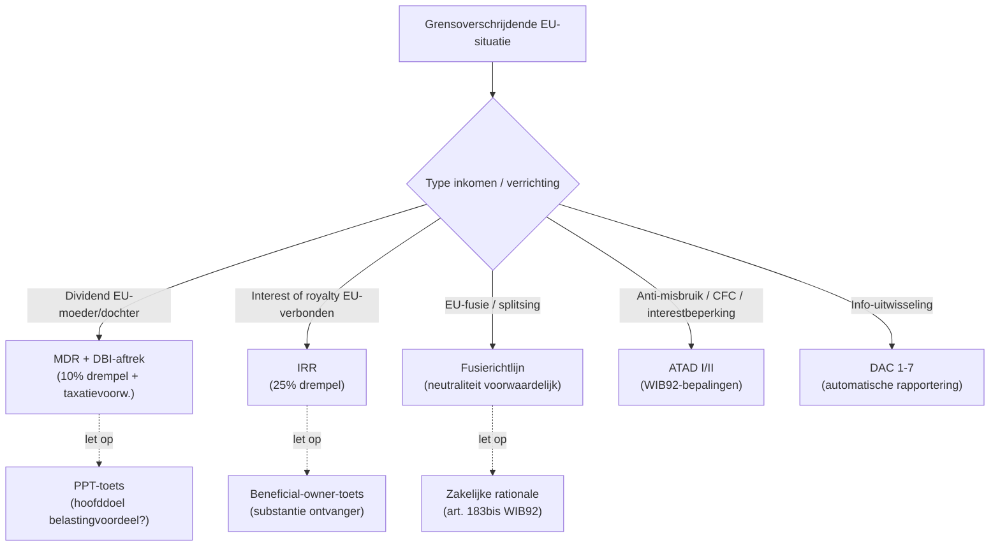

> ⚠️ **Voorlopig — themafiche-laag wordt uitgefaseerd.** Per **ADR-039** vervangt één PO-samenvatting per programmaonderdeel de cluster-themafiches. Deze fiche blijft beschikbaar tot het relevante PO een leerpad krijgt — dan migreert de inhoud naar `content/studiemateriaal/<po-slug>/samenvatting.md`. Voor cross-PO themafiches (vergelijkingen tussen verschillende PO's) volgt een aparte beslissing per fiche: incorporeren in alle relevante samenvattingen, óf upgraden naar concept-fiche.

> **Themafiche — kapstok voor herhaling.** Vier kern-richtlijnen + DAC-administratieve samenwerking + PPT-overlay sinds 2015. Voor verhaal en routekaart: [[studiemateriaal/2-8|overzicht PO 2.8]].

---

## Take-away

- **Richtlijn = omgezet in nationaal recht** — niet rechtstreeks toepasbaar als verordening. WIB92-bepalingen dragen de toepassing
- **MDR (10% drempel) ≠ DBI-aftrek (10% drempel of 2,5M EUR aanschaffingswaarde alt.)** — verschillende voorwaarden
- **IRR vereist 25% deelneming** (niet 10% zoals MDR) — verwarringsvraag op examen
- **Richtlijnen werken UITSLUITEND binnen EU** — derde-land = interne recht + DBV
- **ATAD = minimum-richtlijn**: BE-omzetting kan strenger zijn. Geen rechtstreekse toepassing — kijk WIB92
- **PPT-overlay (post-BEPS)**: voordeel ontzegd bij hoofddoel belastingvoordeel zonder zakelijke rationale
- **DBI-taxatievoorwaarde**: dochterstaat moet vergelijkbare VenB heffen (anti-misbruik fiscale paradijzen)

---

## Vier kern-richtlijnen — overzicht

| Richtlijn | Doel | BE-omzetting | Drempel |
|---|---|---|---|
| **Moeder-dochterrichtlijn (MDR)** | Voorkomen dubbele belasting dividenden binnen EU | DBI-aftrek (art. 202-205 WIB92) + RV-vrijstelling | 10% deelneming + 1 jaar houdperiode |
| **Interest-royaltyrichtlijn (IRR)** | Vrijstelling RV op interesten + royalty's tussen verbonden EU-vennootschappen | Art. 107 WIB92 + uitvoeringsbesluiten | 25% deelneming + 1 jaar |
| **Fusierichtlijn** | Belastingneutraliteit grensoverschrijdende fusies | Art. 183bis + 210/211 WIB92 | Geen drempel — voorwaardelijk (zakelijke rationale) |
| **ATAD I + II** | Anti-Tax-Avoidance: interest-aftrekbeperking · CFC · exit-tax · GAAR · hybride mismatches | Art. 198/1, 198 10°/2-3, 185/2, 220bis WIB92 + Pijler 2-Wet | Diverse drempels per maatregel |
| **DAC 1-7** | Administratieve uitwisseling tussen lidstaten | Art. 321/1-321/7 WIB92 + uitvoering | Per type info |

---

## MDR vs DBI-aftrek — verschillen

| Element | MDR (richtlijn) | DBI-aftrek (BE-recht art. 202) |
|---|---|---|
| **Drempel deelneming** | ≥ 10% | ≥ 10% OF aanschaffingswaarde ≥ 2 500 000 EUR (alt.) |
| **Houdperiode** | 1 jaar (lidstaat-keuze) | 1 jaar (BE) |
| **Taxatie-voorwaarde dochter** | Geen — richtlijn vereist niet | BE: dochter onderworpen aan vergelijkbare VenB (anti-misbruik) |
| **Aftrek %** | RV-vrijstelling 100% | 100% van ontvangen dividend |
| **EU-only?** | Ja (EU/EER) | Wereldwijd, maar voorwaarden strikter voor niet-EU |

⚠️ Examen-typisch: stagiairs verwarren drempels of vergeten taxatievoorwaarde.

---

## IRR (Interest-royaltyrichtlijn) — kerncomponenten

| Element | Regel |
|---|---|
| **Drempel deelneming** | 25% (kapitaal of stemrechten) — **niet 10%** als MDR |
| **Houdperiode** | 1 jaar |
| **Wie ontvangt vrijstelling?** | EU-verbonden vennootschap (ontvanger interest/royalty) |
| **Beneficial owner-toets** | Vereist — substantie-eis ontvanger (geen lege doorgeefluik) |
| **Toepassing buiten EU** | NEE — beide partijen moeten EU-vennootschappen (of EU-vaste-inrichtingen) zijn |
| **Effect** | Geen bronheffing op interesten + royalty's tussen verbonden EU-vennootschappen |

---

## ATAD I + II — vijf maatregelen

| Maatregel | Wat? | BE-toepassing |
|---|---|---|
| **1. Interest-aftrekbeperking** | EBITDA-formule: aftrek beperkt tot 30% EBITDA of 3 mln EUR (drempel) | Art. 198/1 WIB92 — KMO-vrijstelling onder 3 mln |
| **2. Exit-taxatie** | Belasting latente meerwaarden bij grensoverschrijdende verhuizing | Art. 220bis + WIB92 |
| **3. GAAR (algemene anti-misbruik)** | Niet-zakelijke constructies negeren | Art. 344 §1 WIB92 (BE-versie) |
| **4. CFC (Controlled Foreign Companies)** | Inkomen van laaggebelaste CFC's in moeder-vennootschap belasten | Art. 185/2 WIB92 |
| **5. Hybride mismatches** | Dubbele aftrek of niet-belasting via hybriden voorkomen | Art. 198 10°/2-3 WIB92 (ATAD II) |

⚠️ ATAD geldt voor **élke** VenB-pl. vennootschap met grensoverschrijdende elementen — niet alleen multinationals.

---

## DAC-richtlijnen — uitwisseling van inlichtingen

| DAC | Wat? | In werking |
|---|---|---|
| **DAC 1** | Automatische uitwisseling diverse inkomsten | 2014 |
| **DAC 2** | CRS (Common Reporting Standard) — financiële rekeningen | 2017 |
| **DAC 3** | Voorafgaande grensoverschrijdende rulings | 2017 |
| **DAC 4** | Country-by-Country Reporting (CbCR) | 2017 |
| **DAC 5** | Toegang fiscus tot AML/KYC-info | 2017 |
| **DAC 6** | Mandatory disclosure agressieve grensoverschrijdende constructies | 2020 |
| **DAC 7** | Digitale platform-rapportering (Airbnb, Uber, Amazon) | 2023 |

**Effect**: BE-fiscus krijgt automatisch buitenlandse rekening- + transactie-info. Niet-aangegeven buitenlands vermogen = hoog detectie-risico.

---

## Beslisboom — welke richtlijn?

---

## Fusierichtlijn — neutraliteit voorwaardelijk

| Element | Regel |
|---|---|
| **Neutraal voor wat?** | Uitstel van belasting op latente meerwaarden bij grensoverschrijdende fusie/splitsing |
| **Belasting elimineert?** | Nee — fiscale claim "rolt" mee naar verkrijger |
| **Voorwaarden** | Zakelijke rationale + behoud activa-allocatie + geen exclusief belastingmotief |
| **Verlies-overdracht** | Beperkt naar verhouding fiscaal netto-actief overgenomen vs gecombineerd |
| **Anti-misbruik** | Art. 183bis WIB92: fiscus mag neutraliteit weigeren bij hoofddoel belastingvoordeel |

---

## ⚠️ Valkuilen

| Valkuil | Wat klopt er niet | Wat klopt wél |
|---|---|---|
| Richtlijn = direct toepasbaar | Werkt zoals verordening | Richtlijn bindt qua resultaat — vereist nationale omzetting (WIB92-bepalingen) |
| MDR-drempel (10%) = IRR-drempel | Beide 10% | MDR: 10% · IRR: 25%. Tussen 10-25%: MDR voor dividenden, niet IRR voor interesten |
| PSD-richtlijn = automatische DBI-aftrek | Élk EU-dividend = 100% DBI | DBI-taxatievoorwaarde naast richtlijn-drempel. Lege EU-shell ohne reële activiteit = geen DBI |
| Richtlijn op derde-land toepassen | EU-richtlijn werkt overal waar één partij EU is | UITSLUITEND EU-EU. Derde-land = interne recht (WIB92 art. 202-205 voor DBI-overweging) |
| PPT vergeten na BEPS | Voordelen quasi-automatisch | Sinds 2015: PPT-toets — hoofddoel belastingvoordeel + geen zakelijke rationale = voordeel ontzegd |
| ATAD = enkel multinationals | KMO's mogen ATAD negeren | ATAD geldt voor élke VenB-pl. met grensoverschrijdende elementen. KMO-vrijstelling alleen op interestbeperking (< 3 mln) |

---

## Doorklik — losse concept-fiches

**EU-richtlijnen kern**
- [[eu-fiscale-richtlijnen]] — overzicht
- [[moeder-dochterrichtlijn]] — MDR-mechaniek
- [[interest-royalty-richtlijn]] — IRR-mechaniek
- [[atad-richtlijn]] — anti-misbruik EU
- [[fiscale-fusie-splitsing]] — fusierichtlijn

**BE-toepassing**
- [[dbi-aftrek]] — Belgische DBI naast MDR
- [[anti-misbruik]] — GAAR-context
- [[country-by-country-reporting]] — DAC 4 + BEPS

**Cross-cutting**
- [[internationaal-fiscaal]] — overkoepelend
- [[dubbelbelastingverdrag]] — verhouding tot DBV

**Verwante themafiches**
- [[themafiches/dbv-toepassing|Themafiche — DBV-toepassing]]
- [[themafiches/transfer-pricing-en-beps|Themafiche — Transfer pricing & BEPS]]
- [[themafiches/vaste-inrichting|Themafiche — Vaste inrichting]]

---

*Themafiche afgeleid uit cluster europees-en-internationaal-fiscaal-recht (PO 2.8). Status: voorgesteld.*
