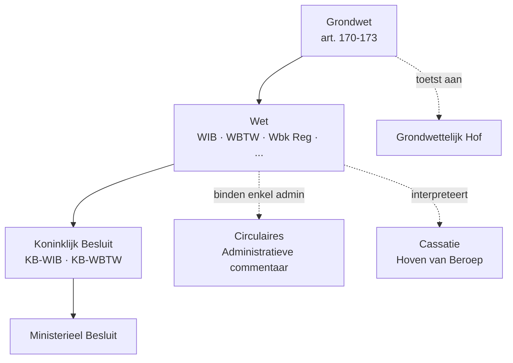

> ⚠️ **Voorlopig — themafiche-laag wordt uitgefaseerd.** Per **ADR-039** vervangt één PO-samenvatting per programmaonderdeel de cluster-themafiches. Deze fiche blijft beschikbaar tot het relevante PO een leerpad krijgt — dan migreert de inhoud naar `content/leerpaden/<po-slug>/samenvatting.md`. Voor cross-PO themafiches (vergelijkingen tussen verschillende PO's) volgt een aparte beslissing per fiche: incorporeren in alle relevante samenvattingen, óf upgraden naar concept-fiche.

> **Themafiche — kapstok voor herhaling.** Acht substantiële beginselen + bronnenhiërarchie + interpretatieregels — het meta-fundament voor alle PO 2.x. Voor verhaal en routekaart: [[leerpaden/2.1|minicursus PO 2.1]].

---

## Take-away

- **Substantieel ≠ procedureel** — de acht beginselen hier bepalen wát en hoé belast kan worden; de beginselen behoorlijk bestuur (rechtszekerheid, motivering, vertrouwen) zitten een laag dieper en raken alleen de uitoefening
- **Legaliteit eist 'wet' in materiële zin** — gemeentebelasting bij gemeenteraadsreglement = OK; collegebeslissing = niet OK; KB onder delegatie kan, maar essentiële bestanddelen blijven aan het parlement
- **Annualiteit ≠ jaarlijks heffen** — het parlement moet jaarlijks (begrotingswet) instemmen; meerjarenvaststelling van de aanslag (5 jaar terug bij fraude) is niet in strijd
- **Realiteitsbeginsel als fiscale ondergrond** — fiscus belast de werkelijke economische verrichting, niet de juridische verpakking als die afwijkt; dit is de wettelijke basis voor simulatieleer en AAMB
- **Hiërarchie**: Grondwet → wet (WIB/WBTW/...) → KB → ministerieel besluit → circulaire/commentaar. Circulaires binden alleen de administratie

---

## De acht beginselen — overzicht

| Beginsel | Kern | Grondslag | Klassieke toepassing |
|---|---|---|---|
| **Legaliteit** | Geen belasting zonder wet (in materiële zin) | GW art. 170 | Delegatie aan KB enkel voor technische uitvoering |
| **Annualiteit** | Jaarlijkse parlementaire toestemming via begroting | GW art. 171 | Aanslagtermijn ≠ annualiteit |
| **Gelijkheid** | Gelijke behandeling vergelijkbare situaties; verschil moet redelijk gerechtvaardigd | GW art. 172 | GwH-toetsing categorieën belastingplichtigen |
| **Non-retroactiviteit** | Belastingwet werkt vanaf publicatie; retroactiviteit enkel in uitzonderingsgevallen | EVRM 1e Prot. art. 1 + algemene rechtsbeginselen | Tariefwijziging midden boekjaar — pro rata of vanaf AJ? |
| **Territorialiteit** | België heft op rijksinwoners (wereldinkomen) + niet-inwoners (Belgische bron) | WIB art. 1-5 + DBV | Aanknopingspunt: woonplaats + zetel werkelijke leiding |
| **Non-bis-in-idem** | Geen dubbele heffing op hetzelfde voorwerp door dezelfde overheid | Algemeen rechtsbeginsel + DBV | Bilaterale verdragen voorkomen internationale dubbele belasting |
| **Realiteit** | Fiscus belast werkelijke economische verrichting, niet de juridische schijn | Cassatie-rechtspraak | Basis voor simulatieleer + interpretatie 'in dubio contra fiscum' beperkt |
| **Moraliteit vs neutraliteit** | Fiscus is neutraal over rechtmatigheid van inkomsten — illegale inkomsten zijn belastbaar | Brepols-arrest (1961) | Recht op minst belaste weg ↔ AAMB-grens |

---

## Bronnenhiërarchie

**Belangrijk**: circulaires en administratieve commentaar binden **enkel** de administratie (vertrouwensbeginsel) — niet de belastingplichtige of de rechter. Een gunstige circulaire is een ankerpunt voor de belastingplichtige; een ongunstige niet.

---

## Interpretatie — de vier regels

| Regel | Toepassing | Valstrik |
|---|---|---|
| **Grammaticaal** | Tekstuele betekenis primair | Reikwijdte fiscale termen ≠ civielrechtelijke termen automatisch |
| **Teleologisch** | Doel/strekking wet | Niet inroepbaar tegen duidelijke tekst |
| **Systematisch** | Plaats in wetboek + samenhang | Vergeten — leidt tot tunneldenken op één artikel |
| **In dubio contra fiscum** | Bij blijvende twijfel: belastingplichtige wint | Adagium pas in beeld ná uitputting van eerste 3 — niet als hoofdregel |

**Bewijslast**: fiscus draagt de bewijslast voor het bestaan van belastbaarheid; belastingplichtige draagt de bewijslast voor aftrekken, vrijstellingen en verminderingen.

---

## Soorten belastingen — vier indelingen

| Indeling | Categorieën | Voorbeelden |
|---|---|---|
| Naar voorwerp | Direct (PB · VenB · ROVH) vs indirect (BTW · accijnzen · registratie) | Direct = op rechtstreeks bezit/inkomen; indirect = op verrichting |
| Naar grondslag | Personeel (PB · VenB) vs zakelijk (BTW · OV) | Personeel houdt rekening met persoonlijke draagkracht |
| Naar bevoegdheid | Federaal · gewestelijk · lokaal | Sinds Bijz. Wet Financiering: erfbelasting + registratie = gewestelijk |
| Naar functie | Financieel · regulerend · herverdelend | BTW = financieel; ecotaks = regulerend; PB = herverdelend |

---

## ⚠️ Valkuilen

| Valkuil | Wat klopt er niet | Wat klopt wél |
|---|---|---|
| Beginselen behoorlijk bestuur op één hoop met fiscale beginselen | Twee verschillende lagen | Substantiële beginselen (wát/hoé) ≠ procedurele beginselen (hoe uitoefenen) |
| Legaliteit = enkel federale wet | Te eng | "Wet" in materiële zin omvat ook decreet, ordonnantie, gemeenteraadsreglement |
| Annualiteit verwarren met aanslagtermijn | Aanslagtermijn (3 of 7 jaar) ≠ jaarlijkse parlementaire toestemming | Annualiteit = budgettaire vernieuwing; aanslagtermijn = procedureel |
| Circulaire als wet behandelen | Circulaire bindt enkel administratie | Rechter is vrij; belastingplichtige kan beroep doen op gunstige circulaire via vertrouwensbeginsel |
| In dubio contra fiscum als hoofdregel | Het is de laatste interpretatieregel, niet de eerste | Pas na uitputting grammaticaal + teleologisch + systematisch |
| Fiscaal volgt boekhouding zonder voorbehoud | Talloze afwijkingen via correcties | Vertrekpunt boekhoudkundige winst, maar VU + DBI + verlies-overdracht corrigeren |

---

## Doorklik — losse concept-fiches

**Beginselen + bronnen**
- [[fiscale-beginselen]] — de acht beginselen (Σ-record met 8 sub-secties)
- [[fiscaal-recht]] — bronnenhiërarchie + KB + circulaires
- [[interpretatie-fiscale-wet]] — vier interpretatieregels + bewijslast
- [[belasting-definitie-en-functies]] — wat is een belasting + 3 functies
- [[indeling-belastingen]] — direct/indirect · personeel/zakelijk · federaal/gewestelijk/lokaal

**Actoren**
- [[fiscale-actoren]] — belastingplichtige · administratie · OM · rechter · adviseur

**Verwante themafiches**
- [[themafiches/anti-misbruik|Themafiche — Anti-misbruik & simulatie]]
- [[themafiches/dvb-ruling|Themafiche — DVB & ruling]]

---

*Themafiche afgeleid uit cluster algemene-fiscale-beginselen (PO 2.1). Status: voorgesteld.*
