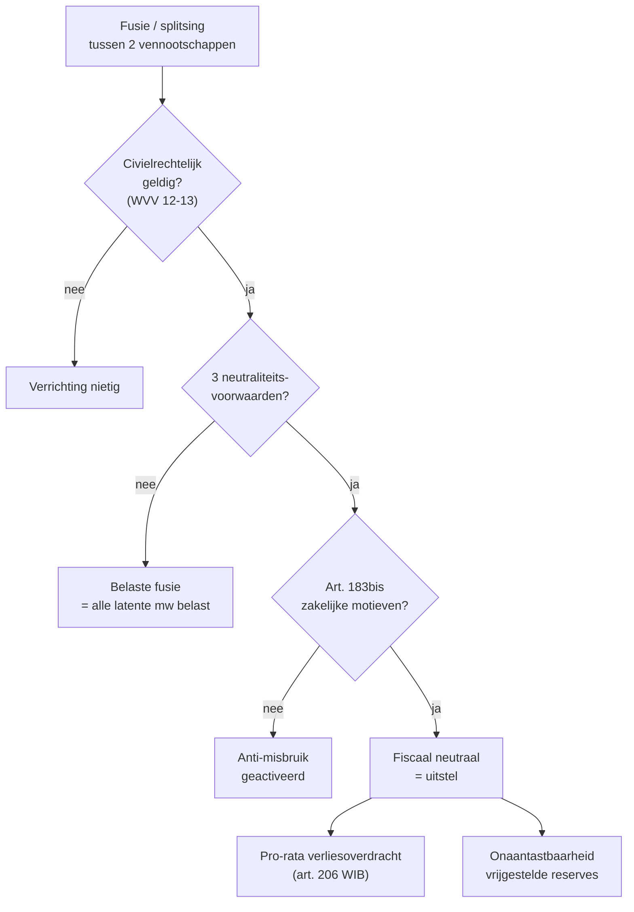

> ⚠️ **Voorlopig — themafiche-laag wordt uitgefaseerd.** Per **ADR-039** vervangt één PO-samenvatting per programmaonderdeel de cluster-themafiches. Deze fiche blijft beschikbaar tot het relevante PO een leerpad krijgt — dan migreert de inhoud naar `content/leerpaden/<po-slug>/samenvatting.md`. Voor cross-PO themafiches (vergelijkingen tussen verschillende PO's) volgt een aparte beslissing per fiche: incorporeren in alle relevante samenvattingen, óf upgraden naar concept-fiche.

> **Themafiche — kapstok voor herhaling.** Fiscale neutraliteit = uitstel, geen vrijstelling. Strenge voorwaarden + pro-rata verliesoverdracht + onaantastbaarheid bij verkrijger. Voor verhaal en routekaart: [[leerpaden/2.3|minicursus PO 2.3]].

---

## Take-away

- **Neutraliteit = uitstel, niet vrijstelling** — de fiscale claim "rolt" mee naar de verkrijger; bij latere verkoop wordt zij alsnog belast
- **Drie cumulatieve neutraliteitsvoorwaarden** — verkrijger is Belgisch (of EU-vennootschap met vaste inrichting BE) · vermogen voortgezet met zelfde boekhoudkundige waarden · onaantastbaarheid van vrijgestelde reserves
- **Verliesoverdracht is pro-rata** — beperkt naar verhouding fiscaal netto-actief overgenomen vennootschap / fiscaal netto-actief beide samen op datum verrichting
- **Anti-misbruik (art. 183bis WIB)** toetst zakelijke overwegingen zelfstandig — vennootschapsrechtelijke geldigheid volstaat niet
- **Ruling vóór de verrichting** is standaard bij grote herstructurering — DVB bevestigt neutraliteitsvoorwaarden + AAMB

---

## Drie neutraliteitsvoorwaarden (art. 211 WIB)

| Voorwaarde | Inhoud | Wat als niet vervuld? |
|---|---|---|
| **1. Verkrijger Belgisch / EU + vaste inrichting BE** | Zonder BE-belastingplicht geen neutraliteit | Belaste fusie: alle latente meerwaarden + reserves belast bij overgaande vennootschap |
| **2. Boekhoudkundige continuïteit** | Zelfde aanschaffingswaarden + afschrijvingsplannen + reserves | Belaste fusie + reserves uitkeren = belastbaar als dividend |
| **3. Onaantastbaarheidsvoorwaarde vrijgestelde reserves** | Reserves blijven onaantastbaar op balans verkrijger | Belaste reserve-uitkering (latente belasting wordt actueel) |

---

## Beslisboom — neutrale fusie

---

## Verliesoverdracht — pro-rata-formule

$$\text{Overgedragen verlies bij verkrijger} = \text{verlies}_\text{overgenomen} \times \frac{\text{FNA}_\text{overgenomen}}{\text{FNA}_\text{overgenomen} + \text{FNA}_\text{verkrijger}}$$

Waar FNA = fiscaal netto-actief op datum van de verrichting.

**Symmetrisch**: ook de **eigen** verliezen van de verkrijger worden beperkt naar dezelfde pro-rata-verhouding.

**Anti-misbruik bij controle-wijziging** (art. 207 §3 WIB): bij wijziging van zeggenschap zonder zakelijke motieven vervalt verliesoverdracht volledig.

---

## Soorten reorganisatie — keuze-tabel

| Type | Civiele basis | Fiscaal | Gebruik |
|---|---|---|---|
| **Fusie door overneming** | WVV 12:2-12:18 | Neutraal mits art. 211 | Eén overgaat in andere |
| **Fusie door oprichting** | WVV 12:19-12:23 | Neutraal mits art. 211 | Twee gaan op in nieuwe |
| **Partiële splitsing** | WVV 12:31-12:37 | Neutraal mits art. 211 | Tak overdraagt aan nieuwe of bestaande |
| **Splitsing door oprichting** | WVV 12:24-12:30 | Neutraal mits art. 211 | Eén splitst in meerdere nieuwe |
| **Inbreng bedrijfstak** | WVV 12:48 | Neutraal mits art. 46 §1 1° WIB | Tak inbreng tegen aandelen |
| **Geruisloze fusie zuster** | WVV 12:1bis | Apart regime | 100%-dochters / zustervennootschappen |

---

## Vergelijkingsmatrix neutraliteit

| Aspect | Volledige fusie | Partiële splitsing | Bedrijfstak-inbreng |
|---|---|---|---|
| Wettelijke basis | Art. 211 WIB | Art. 211 WIB | Art. 46 §1 1° WIB |
| Verliesoverdracht | Ja (pro-rata) | Ja (pro-rata op overgenomen tak) | Beperkt — alleen verliezen van die tak |
| Onaantastbaarheid reserves | Ja | Pro-rata | Pro-rata |
| Aandeelhouders | Krijgen aandelen verkrijger | Krijgen aandelen nieuwe entiteit + behouden in oude | Inbrengende venn krijgt aandelen ontvanger |
| Continuïteit boekhouding | Vereist | Vereist | Vereist |

---

## Anti-misbruik bij herstructurering

| Vraag | Toets |
|---|---|
| Zijn er zakelijke + niet-fiscale motieven? | Bewijs: business case, synergie, schaalvoordeel, herorganisatie |
| Wordt wettelijk doel art. 211 gefrustreerd? | AAMB (art. 344 §1) kan bovenop art. 183bis spelen |
| Is de transactie gericht op verlies-overname zonder activiteit? | Anti-misbruik bij verliesoverdracht (art. 207 §3) |
| Is de transactie tussen verbonden vennootschappen? | Hogere bewijslast zakelijke motieven |

**Best practice**: ruling-aanvraag vóór de verrichting bij DVB — bevestigt neutraliteit + tegenbewijs AAMB + verliesoverdracht.

---

## ⚠️ Valkuilen

| Valkuil | Wat klopt er niet | Wat klopt wél |
|---|---|---|
| Neutraliteit = vrijstelling | Uitstel, niet vrijstelling | Latente belasting rolt mee; bij latere verkoop alsnog belast |
| Verliesoverdracht volledig | Pro-rata-beperking | Berekening FNA/FNA × verlies |
| Anti-misbruik onderschatten | Art. 183bis is autonoom — vennootschapsrechtelijke geldigheid volstaat niet | Documenteer zakelijke motieven vooraf + bewaar bewijs |
| Onaantastbaarheid vergeten bij vrijgestelde reserves | Voorwaarde voor blijvende vrijstelling | Reserves op aparte rekeningen + onaantastbaar bij verkrijger |
| Boekhoudkundige continuïteit "klein detail" | Hoeksteen van neutraliteit | Aanschaffingswaarden + afschrijvingsplannen blijven gelijk |
| Geen ruling vragen | Mogelijk fiscale verrassing | DVB-ruling = best practice bij grote herstructurering |
| Geruisloze fusie zuster = identiek aan fusie | Apart regime (12:1bis WVV) | Minder formaliteiten, fiscaal nog steeds art. 211 |
| Inbreng bedrijfstak = fusie | Andere regime + andere verliesoverdrachts-regels | Art. 46 §1 1° (niet art. 211) |

---

## Doorklik — losse concept-fiches

**Reorganisatie**
- [[fiscale-fusie-splitsing]] — neutraliteit + 3 voorwaarden + pro-rata
- [[fusie]] — civielrechtelijke fusie (WVV 12)
- [[abnormale-goedgunstige-voordelen]] — art. 26 + arm's length bij verbonden vennootschappen

**Anti-misbruik**
- [[anti-misbruik]] — algemeen kader
- [[algemene-anti-misbruik-bepaling]] — art. 344 §1 WIB

**Voorafgaande zekerheid**
- [[voorafgaande-beslissing-dvb]] — ruling-procedure

**Verwante themafiches**
- [[themafiches/venb-bewerkingsschema|Themafiche — VenB-bewerkingsschema]]
- [[themafiches/anti-misbruik|Themafiche — Anti-misbruik & simulatie]]
- [[themafiches/dvb-ruling|Themafiche — DVB & ruling]]
- [[themafiches/meerwaarden-venb|Themafiche — Meerwaarden in VenB]]

---

*Themafiche afgeleid uit cluster vennootschapsbelasting (PO 2.3). Status: voorgesteld.*
