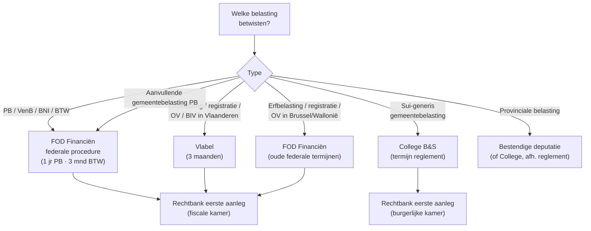

> ⚠️ **Voorlopig — themafiche-laag wordt uitgefaseerd.** Per **ADR-039** vervangt één PO-samenvatting per programmaonderdeel de cluster-themafiches. Deze fiche blijft beschikbaar tot het relevante PO een leerpad krijgt — dan migreert de inhoud naar `content/leerpaden/<po-slug>/samenvatting.md`. Voor cross-PO themafiches (vergelijkingen tussen verschillende PO's) volgt een aparte beslissing per fiche: incorporeren in alle relevante samenvattingen, óf upgraden naar concept-fiche.

> **Themafiche — kapstok voor herhaling.** Welke route per niveau: federaal-FOD · Vlabel · Brussel/Wallonië-FOD · gemeente B&S. Voor verhaal en routekaart: [[leerpaden/2.7|minicursus PO 2.7]].

---

## Take-away

- **Vier procedure-routes** afhankelijk van belasting + gewest: (1) federale FOD · (2) Vlabel · (3) FOD voor Brussel/Wallonië gewestbelastingen · (4) gemeentelijk College B&S
- **Termijnen verschillen per route**: federaal PB 1 jaar · Vlabel 3 maanden · gemeente per reglement
- **Vlabel-procedure ≠ federale procedure**: kortere bezwaartermijn + eigen administratie + apart gerechtelijke kanaal
- **Per belasting opnieuw lokaliseren** — multi-gewestelijk dossier vereist split per belasting (PB-woonplaats, OV-ligging, erfbelasting-5jaarsregel)
- **Cassatie blijft federaal** — uniformiteit op hoogste niveau gewaarborgd

---

## Beslisboom — welke route per belasting?

---

## Routes per administratie

| Route | Bezwaartermijn | Bij wie? | Vorm |
|---|---|---|---|
| **Federaal PB / VenB** | 1 jaar (vanaf 1e dag 3e maand na verzending) | Adviseur-generaal directeur FOD | Aangetekend / MyMinfin |
| **Federaal BTW** | 3 maanden | Adviseur-generaal directeur FOD | Aangetekend |
| **Vlabel — erfbelasting** | 3 maanden | Vlabel | Aangetekend / online |
| **Vlabel — registratierecht / OV / BIV** | 3 maanden | Vlabel | Idem |
| **Brussel / Wallonië — erfbelasting + registratie** | Federale termijnen (overgang) | FOD Financiën | Aangetekend |
| **Aanvullende gemeentebelasting PB** | Volgt PB-bezwaar | FOD (geen apart pad) | Idem PB |
| **Sui-generis gemeentebelasting** | Termijn reglement (typisch 3 maanden) | College B&S | Aangetekend |
| **Provinciale belasting** | Termijn reglement | Bestendige deputatie / College | Aangetekend |

⚠️ Termijn-strategie: **dubbel agenderen + tijdig met aangetekende stuiten**.

---

## Vlabel-procedure — specifieke kenmerken

| Element | Vlabel | Federaal (vergelijking) |
|---|---|---|
| **Bezwaartermijn** | 3 maanden | 1 jaar (PB) / 3 maanden (BTW) |
| **Vorm** | Schriftelijk + online MyMinfin-equivalent | Idem |
| **Bemiddeling** | Vlaamse fiscale bemiddelingsdienst | Federale fiscale bemiddelingsdienst |
| **Beslissing** | Vlabel-directeur | Adviseur-generaal directeur FOD |
| **Beroep** | Rechtbank eerste aanleg (fiscale kamer) — Vlaamse zaken | Idem voor federale zaken |
| **Cassatie** | Hof van cassatie (federaal) | Idem |

---

## Gemeente-procedure — bijzonderheden

| Element | Regel |
|---|---|
| **Bezwaartermijn** | Per reglement — typisch 3 maanden, soms korter |
| **Bij wie?** | College Burgemeester & Schepenen |
| **Vorm** | Aangetekend (vermeld in reglement) |
| **Schorsende werking?** | Reglement-afhankelijk — meestal niet schorsend |
| **Termijn beslissing** | 6 maanden (typisch) — daarna fictieve afwijzing |
| **Beroep** | Rechtbank eerste aanleg (burgerlijke of fiscale kamer afhankelijk) |
| **Bestendige deputatie** | Soms voorzien als appel-instantie voor specifieke heffingen |

⚠️ **Reglement = bron**. Bij elk gemeentebezwaar: belastingreglement opvragen voor precieze termijn + vorm.

---

## Termijn-overzicht — per route

| Niveau | Aanslagtermijn | Bezwaartermijn | Beroep-termijn |
|---|---|---|---|
| **Federaal PB** | 3/4/6/10 jaar (AJ 2023+) | 1 jaar | 3 maanden (na beslissing of fictie 6 mnd) |
| **Federaal BTW** | 3/7/7 jaar | 3 maanden | 3 maanden |
| **Vlabel erfbelasting** | Eigen termijnen VCF | 3 maanden | 3 maanden |
| **Vlabel registratierecht** | Idem | 3 maanden | 3 maanden |
| **Vlabel OV** | Idem | 3 maanden | 3 maanden |
| **Gemeentebelasting** | Eigen reglement | Eigen reglement (typisch 3 mnd) | Eigen reglement |

---

## Multi-gewestelijk dossier — lokalisatie per belasting

| Cliënt-situatie | Per belasting opnieuw lokaliseren |
|---|---|
| **Vlaamse cliënt, onroerend goed in Wallonië** | PB-aanvullend = Vlaamse gemeente · OV + verkooprecht = Wallonië · verkeersbelasting = inschrijver-woonplaats |
| **Verhuis tussen gewesten in jaar** | PB-aanvullend = woonplaats op 1 januari (anker-moment) · OV = ligging onroerend goed · BIV = inschrijvingsdatum |
| **Erfenis met goederen in 3 gewesten** | Erfbelasting: 5-jaarsregel woonplaats overledene bepaalt heffend gewest. Tarief = dat gewest |
| **Niet-rijksinwoner met Belgische goederen** | Erfbelasting: ligging Belgische goederen bepaalt gewest |

---

## ⚠️ Valkuilen

| Valkuil | Wat klopt er niet | Wat klopt wél |
|---|---|---|
| Eén bezwaartermijn voor alles | 1 jaar federale-PB-reflex overal | Vlabel 3 maanden · BTW 3 maanden · gemeente per reglement · PB 1 jaar — apart agenderen |
| Bezwaar gemeentebelasting naar federale directeur | Federaal-reflex | College Burgemeester & Schepenen binnen reglement-termijn |
| Bezwaar Vlaamse gewestbelasting naar FOD | Federaal als default | Vlabel sinds 2015 — bezwaar bij Vlabel met termijn 3 maanden |
| Vlabel = FOD met andere naam | Identieke procedure | Aparte administratie + kortere termijn + Vlaamse bemiddeling |
| Hele dossier in één gewest behandelen | Lokalisatie eenmalig | Per belasting opnieuw aanknopen: PB-woonplaats · OV-ligging · erfbelasting-5jaarsregel · BIV-inschrijving |
| Cassatie verschilt per gewest | Aparte cassatie-kamers | Hof van cassatie blijft federaal voor alle fiscale zaken |

---

## Doorklik — losse concept-fiches

**Procedure per niveau**
- [[gewestelijke-fiscale-procedure]] — Vlabel-route + termijnen
- [[bezwaarprocedure]] — federale bezwaartermijn
- [[fiscale-bemiddelingsprocedure]] — federaal + Vlaams

**Overkoepelend**
- [[fiscale-procedure]] — federale kader
- [[gewestelijke-fiscale-autonomie]] — bevoegdheidsverdeling
- [[lokale-en-regionale-belastingen]] — niveau-onderscheid

**Verwante themafiches**
- [[themafiches/gewestelijke-fiscaliteit|Themafiche — Gewestelijke fiscaliteit]]
- [[themafiches/gemeentelijke-belastingen|Themafiche — Gemeentelijke belastingen]]
- [[themafiches/fiscale-termijnen|Themafiche — Fiscale termijnen]]
- [[themafiches/bezwaar-en-gerechtelijke-fase|Themafiche — Bezwaar & gerechtelijke fase]]

---

*Themafiche afgeleid uit cluster regionale-en-lokale-belastingen (PO 2.7). Status: voorgesteld.*
