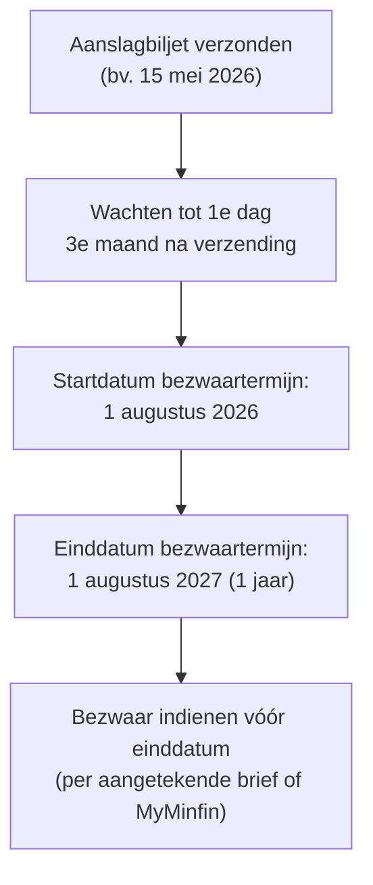

> **Themafiche — kapstok voor herhaling.** De zes termijn-families samengebracht — vraag altijd: welk aanslagjaar? welke belasting? welke termijn? Voor verhaal en routekaart: [[leerpaden/2.5|minicursus PO 2.5]].

---

## Take-away

- **Sinds AJ 2023 — Wet 20 nov 2022**: nieuwe aanslagtermijnen 3 / 4 / 6 / 10 jaar (vervangt oude "3-7-7"). Voor oude AJ's: oude regels
- **Aanslagtermijn (fiscus vestigt aanslag) ≠ bezwaartermijn (BP betwist aanslag)** — twee verschillende partijen, twee verschillende termijnen
- **Onderzoekstermijn = aanslagtermijn** — fiscus mag niet onderzoeken buiten termijn waarin hij kan vestigen
- **Bezwaartermijn 1 jaar vanaf 1e dag 3e maand na verzending aanslagbiljet** (federaal) — niet vanaf datum biljet
- **BTW: verjaring 3 jaar (gewoon) / 7 jaar (fraude)** — kortere termijnen, eigen regime
- **Verjaring invordering = 5 jaar** maar wordt **gestuit** door elke vervolgingshandeling

---

## Aanslagtermijnen WIB92 — vanaf AJ 2023 (Wet 20-11-2022)

| Termijn | Wanneer? | Grond |
|---|---|---|
| **3 jaar** | Gewone aangifte tijdig ingediend; geen complexiteits-element | Art. 354 WIB92 |
| **4 jaar** | Geen of laattijdige aangifte | Art. 354 |
| **6 jaar** | "Complexe" aangifte: hybride mismatches, CFC, transfer pricing, MLI-toepassing, internationale aangifte | Art. 354 |
| **10 jaar** | Fraude (zelfs zonder kennisgeving inbreuk vóór termijn) | Art. 354 |

**Voor AJ 2022 en eerder**: oude termijnen 3 / 7 (geen aangifte) / 7 (fraude met voorafgaande kennisgeving).

---

## Termijn-overzichts-tabel — directe belastingen vs BTW

| Termijn | Directe belastingen (WIB92) | BTW (W.BTW) | Bron BTW |
|---|---|---|---|
| **Aanslag- / vorderingstermijn — gewoon** | 3 jaar (AJ 2023+) | 3 jaar | W.BTW art. 81bis |
| **Aanslag- / vorderingstermijn — geen aangifte** | 4 jaar | 7 jaar | W.BTW art. 81bis |
| **Aanslag- / vorderingstermijn — fraude** | 10 jaar | 7 jaar | W.BTW art. 81bis |
| **Onderzoekstermijn** | = aanslagtermijn | 7 jaar | W.BTW art. 81bis |
| **Bezwaartermijn** | 1 jaar vanaf 1e dag 3e maand na verzending aanslagbiljet (art. 371 WIB92) | 3 maanden vanaf kennisgeving | W.BTW art. 84 |
| **Bewaarplicht stukken** | 10 jaar | 10 jaar | W.BTW art. 60 + WIB92 art. 315 |
| **Verjaring invordering** | 5 jaar (gestuitig) | 5 jaar | Wb.Inv. art. 23 |

⚠️ Tarieven + uitgebreide schema's: **Cijferzakboekje bij examen** raadplegen.

---

## Bezwaartermijn — start- en eind-punt

**Vergrendelen in agenda**: dubbele datum-check.

---

## Onderzoekstermijn = aanslagtermijn

| Onderzoeksdaad | Toegestaan binnen | Bron |
|---|---|---|
| **Vraag om inlichtingen** | Aanslagtermijn (3/4/6/10) | WIB92 art. 316 |
| **Inzage boekhouding** | Idem | WIB92 art. 315 |
| **Controle in beroepslokalen** | Idem (toegang zonder gerechtelijk bevel) | WIB92 art. 319 |
| **Controle in privéwoning** | Alleen met huiszoekingsbevel onderzoeksrechter | WIB92 art. 319 |
| **Inlichtingen bij derden** | Idem | WIB92 art. 322 |

⚠️ Onderzoeksdaden **buiten** termijn = in principe nietig. Bij twijfel: vraag naar juridische grond (welk AJ? welke verlenging?).

---

## Bewaarplicht — drie regimes

| Wet | Bewaartermijn | Wat? |
|---|---|---|
| **WER (boekhoudrecht)** | 7 jaar | Boeken, jaarrekeningen, verantwoordingsstukken |
| **WIB92** | 10 jaar | Stukken relevant voor inkomstenbelasting |
| **W.BTW** | 10 jaar | Facturen, boeken, vervoersdocumenten, BTW-aangiftes |

⚠️ **In praktijk = 10 jaar** want langste termijn primeert. WER 7 jaar is de minimum-vloer.

---

## Verjaring invordering

| Element | Regel |
|---|---|
| **Termijn** | 5 jaar vanaf opeisbaarheid (art. 23 Wb.Inv.) |
| **Stuitingsoorzaken** | Dwangbevel, beslag, schriftelijke ingebrekestelling, erkenning schuld door BP |
| **Effect stuiting** | Termijn begint opnieuw te lopen vanaf stuitingsdaad |
| **Schorsing tijdens bezwaar/beroep** | Schorsing tot definitieve uitspraak |

⚠️ Praktijk: door regelmatige stuiting (dwangbevel) wordt verjaring zelden bereikt.

---

## ⚠️ Valkuilen

| Valkuil | Wat klopt er niet | Wat klopt wél |
|---|---|---|
| Oude "3-7-7" formule | Voor alle aanslagjaren toegepast | Sinds AJ 2023: 3/4/6/10. Oude regels alleen voor AJ ≤ 2022 |
| Aanslag- = bezwaartermijn | Eén termijn voor beide partijen | Aanslag (fiscus): 3/4/6/10. Bezwaar (BP): 1 jaar vanaf 1e dag 3e maand na verzending |
| Bezwaartermijn vanaf datum biljet | 1 jaar vanaf opmaak aanslagbiljet | 1 jaar vanaf **1e dag 3e maand na verzending**. Verzending ≠ opmaak |
| Onderzoek mag altijd | Fiscus mag controleren ongeacht termijn | Onderzoekstermijn = aanslagtermijn. Onderzoek na termijn = nietig |
| Bewaartermijn 7 jaar volstaat | WER 7 jaar als algemene regel | 10 jaar in praktijk (WIB92 + W.BTW primeren) |
| Verjaring 5 jaar = altijd verjaard na 5 jaar | Schuld vervalt automatisch | Stuiting door dwangbevel of beslag = termijn herstart. Regelmatige stuiting = nooit verjaring |

---

## Doorklik — losse concept-fiches

**Termijnen**
- [[aanslagtermijnen]] — directe belastingen (WIB92)
- [[btw-controle]] — onderzoekstermijnen BTW
- [[invorderingsprocedure]] — verjaring + stuiting

**Procedurele context**
- [[fiscale-procedure]] — overkoepelend kader
- [[fiscale-controle]] — onderzoeksbevoegdheden
- [[bezwaarprocedure]] — bezwaartermijn-mechaniek

**Verwante themafiches**
- [[themafiches/taxatieprocedure|Themafiche — Taxatieprocedure]]
- [[themafiches/bezwaar-en-gerechtelijke-fase|Themafiche — Bezwaar & gerechtelijke fase]]
- [[themafiches/invordering-en-dwangbevel|Themafiche — Invordering & dwangbevel]]
- [[themafiches/bewaarplicht|Themafiche — Bewaarplicht]]

---

*Themafiche afgeleid uit cluster fiscale-procedure (PO 2.5). Status: voorgesteld.*
