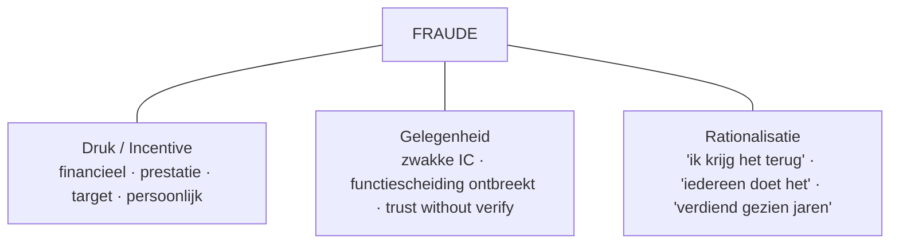

> ⚠️ **Voorlopig — themafiche-laag wordt uitgefaseerd.** Per **ADR-039** vervangt één PO-samenvatting per programmaonderdeel de cluster-themafiches. Deze fiche blijft beschikbaar tot het relevante PO een leerpad krijgt — dan migreert de inhoud naar `content/studiemateriaal/<po-slug>/samenvatting.md`. Voor cross-PO themafiches (vergelijkingen tussen verschillende PO's) volgt een aparte beslissing per fiche: incorporeren in alle relevante samenvattingen, óf upgraden naar concept-fiche.

> **Themafiche — kapstok voor herhaling.** Fraudedriehoek + red flags + ISA 240 + evaluatie IC op één pagina. Voor verhaal en routekaart: [[studiemateriaal/1-7|overzicht PO 1.7]].

---

## Take-away

- **Drie afwijkings-types** langs as intentie × gevolg: **fouten** (onbedoeld) · **fraude** (intentioneel · voordeel) · **verspilling** (onbedoeld · structureel inefficiënt)
- **Fraudedriehoek (Cressey)**: druk + gelegenheid + rationalisatie — neem één hoek weg en frauderisico daalt drastisch
- **Twee fraude-types** (ISA 240): **fraudulent financial reporting** (management) · **misappropriation of assets** (medewerkers)
- **Management override = inherente beperking** — vereist altijd specifieke audit-procedures (ISA 240 par. 32-33): journal entry-testen · schattings-bias · ongebruikelijke transacties
- **Design ≠ operating effectiveness** — procedure bestaat op papier ≠ werkt elke dag; aparte tests vereist (ISA 330)

---

## Fraudedriehoek (Cressey)

**Inzicht**: alle drie samen ⇒ fraude wordt waarschijnlijk. Interne controle pakt vooral **gelegenheid** aan; tone-at-the-top pakt **rationalisatie**; HR-beleid pakt **druk**.

---

## Drie afwijkings-types

| As | **Fouten** | **Fraude** | **Verspilling** |
|---|---|---|---|
| Intentie | Onbedoeld | Intentioneel | Onbedoeld |
| Voordeel voor dader? | Nee | Ja (financieel · positie · imago) | Nee — structureel inefficiënt |
| Voorbeelden | Verkeerde boeking · cut-off-fout · typo | Spookmedewerker · fictieve factuur · earnings management | Te veel voorraad · dubbel werk · ongebruikte licenties |
| Mitigatie | Procedure + opleiding + 4-ogen | Functiescheiding + monitoring + tone-at-top + klokkenluider | Proces-redesign + KPI-analyse + lean |

---

## ISA 240 — fraude bij externe controle

| Stap | Wat | Wettelijke basis |
|---|---|---|
| **Brainstorm in team** | Frauderisico-discussie bij planning — verplicht | ISA 240 par. 15 |
| **Vermoeden van intent** | Professional skepticism doorheen hele controle | ISA 200 + 240 |
| **Specifieke procedures management override** | Journal entry-testing · schattings-bias · significante ongebruikelijke transacties | ISA 240 par. 32-33 |
| **Communicatie** | Vermoeden of vaststelling fraude ⇒ tijdige communicatie governance | ISA 240 par. 40 · ISA 260 |
| **NOCLAR-overweging** | Wet- en regelschending ⇒ NOCLAR-flow (IESBA) | ISA 250 + IESBA NOCLAR |
| **Withdrawal** | Bij management-fraude betrokken op hoog niveau ⇒ terugtrekking overwegen | ISA 240 par. 38 |

---

## Red flags (ACFE + ISA 240)

| Categorie | Signalen |
|---|---|
| **Persoonlijk** | Levensstijl > inkomen · financiële druk (verslaving · echtscheiding) · klacht over compensatie · weigert vakantie |
| **Organisatorisch** | Hoog verloop accounting · zwakke tone-at-top · agressieve targets met bonus · management overrules controls |
| **Boekhoudkundig** | Veel manuele journaalposten · last-minute aanpassingen · ongebruikelijke groei zonder cash · veel grootste-klanten-vorderingen openstaand |
| **IT** | Geen audittrail · superuser-rechten breed verspreid · disabled controls · veel "tijdelijke" override-tickets |

---

## Evaluatie interne controle — design vs operating

| Test | Wat | Wanneer | Bewijs |
|---|---|---|---|
| **Walkthrough** | 1 transactie van begin tot einde door proces volgen | Bij elke planning + bij IC-wijziging | Design effectiveness + momentopname |
| **Test of controls (ToC)** | Steekproef over hele periode — werkt de controle elke keer? | Bij steunen op controles voor lagere DR | Operating effectiveness over de periode |
| **Self-assessment** | Management beoordeelt eigen werking | Doorlopend (1e en 2e lijn) | Monitoring-bewijs |
| **Interne audit** | Onafhankelijke evaluatie door 3e lijn | Risk-based audit-plan | Assurance aan auditcomité |

**ISA 330 par. 17**: afwijkingen in toetsing ⇒ specifiek onderzoek naar oorzaak + impact + nood aan herziening planning.

---

## Communicatie naar governance + management letter

| Bevinding | Naar wie | Vorm |
|---|---|---|
| Materiële zwakte interne controle | Auditcomité + management | Management letter + ISA 265 |
| Vermoeden van fraude (klein) | Geschikt management-niveau (geen betrokkenheid) | Schriftelijk · ISA 240 |
| Vermoeden van fraude (management) | Auditcomité of equivalent · gov-orgaan | Schriftelijk · escalatie · evt. NOCLAR |
| Wettelijke schending | NOCLAR-flow (IESBA) | Stappenplan: in eerste instantie cliënt; daarna mogelijk extern |

---

## ⚠️ Valkuilen

| Valkuil | Wat klopt er niet | Wat klopt wél |
|---|---|---|
| Alle afwijkingen als fouten behandelen | Geen bewijs van intentie ⇒ geen fraude-onderzoek | ISA 240 vereist alertness voor fraude doorheen controle; bij twijfel verdere overwegingen + alertheid |
| Functiescheiding ⇒ geen fraude | ACR-IH geïmplementeerd ⇒ probleem opgelost | Voorkomt enkel enkelvoudige fraude; collusie en management override blijven (ISA 240) |
| Tone-at-the-top onderschatten | Goede procedures op papier volstaan | ACFE-onderzoek: ethisch klimaat + voorbeeldgedrag bestuur belangrijkste fraude-preventie-factor |
| Design effectiveness = operating effectiveness | Goed gedocumenteerde procedure ⇒ effectief | Aparte tests — een procedure kan op papier kloppen maar in praktijk omzeild worden |
| Walkthrough volstaat als toets | 1 transactie nagegaan ⇒ controle getoetst | Walkthrough geeft enkel momentopname + design-bewijs; operating effectiveness vereist steekproef over periode (ISA 330) |
| Afwijkingen negeren als 'normaal' | Paar afwijkingen in steekproef ⇒ aanvaardbaar | ISA 330 par. 17 vereist specifiek onderzoek bij elke gedetecteerde deviation |
| KAM beperken tot wat fout liep | Probleem-rapportage in verklaring | KAM = significante aandachtspunten voor *de controle*, niet enkel problemen (ISA 701) |

---

## Doorklik — losse concept-fiches

**Kern-records**
- [[fouten-en-fraude]] — drie afwijkings-types + fraudedriehoek + ISA 240
- [[evaluatie-interne-controle]] — design vs operating + walkthrough + ToC

**Cross-records**
- [[interne-controle]] — overkoepelend systeem
- [[functiescheiding]] — sluit collusie/override niet uit
- [[interne-audit]] — 3e-lijn-toetsing
- [[audit-bewijs]] — externe auditor steekproef (cross PO 1.6)
- [[audit-afronding]] — misstatement-evaluatie ISA 450

**Verwante themafiches**
- [[themafiches/interne-controle-frameworks|Themafiche — Interne-controle-frameworks]]
- [[themafiches/functiescheiding-en-cyclus|Themafiche — Functiescheiding & cyclus-controle]]
- [[themafiches/controleopdracht-aanpak|Themafiche — Controleopdracht-aanpak]] (cross PO 1.6)
- [[themafiches/controleverklaring|Themafiche — Controleverklaring]] (cross PO 1.6)

---

*Themafiche afgeleid uit cluster interne-controle (PO 1.7). Status: voorgesteld.*
