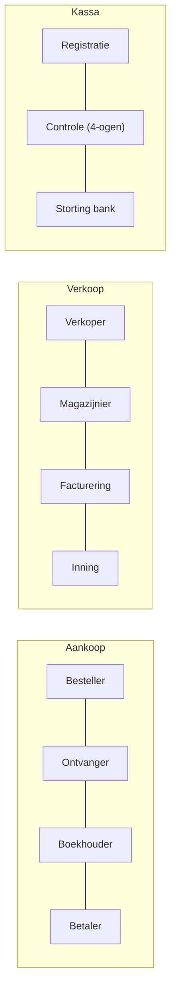

> **Themafiche — kapstok voor herhaling.** ACR-IH-leer + 5 cycli × risico's × sleutelcontroles op één pagina. Voor verhaal en routekaart: [[leerpaden/1.7|minicursus PO 1.7]].

---

## Take-away

- **ACR-IH-leer**: vier onverenigbare functies — **A**utoriseren · **C**ontroleren · **R**egistreren · **I**nitiëren-uitvoeren · **H**ouden (bewaren) — één persoon mag maximaal twee *niet-aangrenzende* functies vervullen
- **Functiescheiding is geen wondermiddel** — collusie en management override blijven mogelijk; combineer met monitoring + 4-ogen + IT-controles
- **Vijf transactionele cycli** als kapstok: aankoop (P2P) · verkoop (O2C) · voorraad · productie · HR (H2R); treasury en vaste activa als optionele zesde
- **IT-functiescheiding via RBAC** — Role-Based Access Control vertaalt organisatorisch principe naar systeem-rechten; ITGC bewaakt RBAC zelf
- **Walk-through is geen toets** van operating effectiveness — geeft enkel design-bewijs en momentopname

---

## ACR-IH — vier onverenigbare functies

| Functie | Rol | Voorbeeld aankoop |
|---|---|---|
| **A**utoriseren | Beslist of transactie mag gebeuren | Bestelling > €X goedkeuren |
| **C**ontroleren / Registreren | Boekt + reconcilieert | Factuur boeken + reconciliatie banksaldo |
| **I**nitiëren / Uitvoeren | Voert transactie fysiek uit | Bestelling plaatsen · ontvangst goederen |
| **H**ouden (Bewaren) | Bewaart activa | Magazijn-voorraad · kassa · IT-rechten |

**Vuistregel**: maximaal **2 niet-aangrenzende** functies per persoon (bv. A + H mag soms; A + C nooit; I + H ⇒ diefstal-risico).

---

## Vijf cycli × risico's × sleutelcontroles

| Cyclus | Top-risico | Klassieke sleutelcontroles |
|---|---|---|
| **Aankoop (P2P)** | Fictieve leveranciers · over-betaling · kickback | 3-way match (PO + ontvangst + factuur) · leveranciers-masterfile · functiescheiding besteller↔ontvanger↔betaler |
| **Verkoop (O2C)** | Niet-geboekte verkoop · krediet-overschrijding · prijslijst-omzeiling | Order-tot-cash autorisatie · krediet-limieten · DSO-monitoring · saldo-bevestiging klanten |
| **Voorraad** | Verlies/diefstal · waarderings-fout · obsolescence | Cyclische tellingen · ABC-classificatie · waarderings-controle · functiescheiding houden↔registreren |
| **Productie** | WIP-waardering · standaard-kosten-deviatie · scrap | Standaard-kost vs werkelijke · BOM-controle · variantieanalyse |
| **HR (H2R)** | Spookmedewerker · onterechte loonsverhoging · oneigenlijke toegangsrechten | Functiescheiding HR-administratie↔betaling · onboarding/offboarding-protocol · RBAC-review |

**Verweven**: een verkoop triggert voorraad-afname; een aankoop triggert betaling. Cycli kunnen niet los geanalyseerd worden.

---

## Functiescheiding per cyclus — concreet

**Mantra**: wie initieert mag niet boeken; wie boekt mag niet betalen; wie bewaart mag niet registreren.

---

## IT-controles — ITGC vs application controls

| Type | Wat | Voorbeelden |
|---|---|---|
| **ITGC** (General IT Controls) | Onderbouwt application controls | Access management (RBAC) · change management · backup/recovery · operations |
| **Application controls** | Specifiek per proces | Veld-validaties · automatische BTW-berekening · totaal-controles · automatische reconciliatie |
| **IT-dependent manual** | Manual control die IT-output gebruikt | Manager review van system-generated report |

⚠️ **Application control alleen zo betrouwbaar als de onderliggende ITGC** — geen ITGC-toetsing ⇒ geen vertrouwen op application control.

---

## KMO-pragmatisme

| Beperking | Compenserende controle |
|---|---|
| Te weinig medewerkers voor volledige ACR-IH | 4-ogen-principe bij sleutel-transacties · bestuurders-review |
| Geen interne audit (3e lijn ontbreekt) | Periodieke externe audit + management review |
| Eigenaar = bestuurder = boekhouder | Externe accountant als 2e blik + bank-reconciliatie maandelijks |
| Beperkte IT-rechten-segmentatie | Logging + periodieke RBAC-review · MFA verplicht |

---

## ⚠️ Valkuilen

| Valkuil | Wat klopt er niet | Wat klopt wél |
|---|---|---|
| Pseudo-functiescheiding via gedeelde paswoorden | Op papier verdeeld ⇒ effectief | Alleen effectief als systemen het technisch afdwingen (RBAC + audittrail per user) |
| ACR-IH eisen in micro-onderneming | Elk bedrijf moet volledige functiescheiding hebben | In micro-onderneming feitelijk onmogelijk — werk met compenserende controles + management-override-risico documenteren |
| Functiescheiding als magic bullet | Met goede ACR-IH geen fraude meer | Sluit collusie en management override **niet** uit; combineer met monitoring + tone-at-the-top + auditcomité |
| Application control vertrouwen zonder ITGC-toetsing | Systeem rekent automatisch ⇒ correct | Application control = zo betrouwbaar als onderliggende ITGC (toegang · change management · operations) |
| Cyclus-aanpak vervangt risico-inschatting | Cyclus geclassificeerd ⇒ risico's gedekt | Cyclus-aanpak structureert risico-identificatie maar vervangt ze niet (cliënt-specifieke risico's er altijd bij) |
| Walkthrough = test of controls | Eén transactie nalopen ⇒ controle getoetst | Walkthrough geeft enkel design-bewijs + momentopname; operating effectiveness vereist steekproef over hele periode (ISA 330) |
| Cloud = geen eigen IT-controle meer | M365/Azure/AWS doet alles | Shared responsibility — provider beheert infrastructuur, cliënt blijft verantwoordelijk voor user-management · data-classificatie · application-config |

---

## Doorklik — losse concept-fiches

**Kern-records**
- [[functiescheiding]] — ACR-IH-leer + RBAC + ITAA-kantoor
- [[cyclus-analyse]] — 5 cycli × risico's × sleutelcontroles
- [[it-controles]] — ITGC + application controls + cloud

**Cross-records**
- [[interne-controle]] — overkoepelend systeem
- [[ontwerp-interne-controle]] — proces-mapping
- [[evaluatie-interne-controle]] — design vs operating effectiveness
- [[audit-bewijs]] — auditor toetst sleutelcontroles (cross PO 1.6)

**Verwante themafiches**
- [[themafiches/interne-controle-frameworks|Themafiche — Interne-controle-frameworks]]
- [[themafiches/fouten-en-fraude-controle|Themafiche — Fouten & fraude]]
- [[themafiches/controleopdracht-aanpak|Themafiche — Controleopdracht-aanpak]] (cross PO 1.6)

---

*Themafiche afgeleid uit cluster interne-controle (PO 1.7). Status: voorgesteld.*
