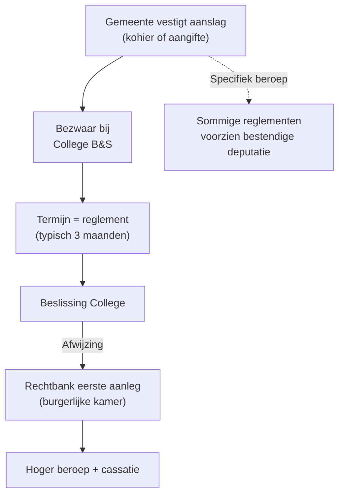

> ⚠️ **Voorlopig — themafiche-laag wordt uitgefaseerd.** Per **ADR-039** vervangt één PO-samenvatting per programmaonderdeel de cluster-themafiches. Deze fiche blijft beschikbaar tot het relevante PO een leerpad krijgt — dan migreert de inhoud naar `content/studiemateriaal/<po-slug>/samenvatting.md`. Voor cross-PO themafiches (vergelijkingen tussen verschillende PO's) volgt een aparte beslissing per fiche: incorporeren in alle relevante samenvattingen, óf upgraden naar concept-fiche.

> **Themafiche — kapstok voor herhaling.** 581 gemeenten = 581 reglementen. Drie bronnen lokale fiscaliteit + provinciale beperkingen + reglement-toets per dossier. Voor verhaal en routekaart: [[studiemateriaal/2-7|overzicht PO 2.7]].

---

## Take-away

- **Drie bronnen lokale fiscaliteit**: (1) opcentiemen federale/gewestelijke belasting (PB · OV) · (2) sui-generis gemeentebelastingen (eigen reglement) · (3) provinciale belastingen (beperkt)
- **Reglement-toets per dossier**: 581 gemeenten = 581 verschillende belastingreglementen. Bij elke cliënt-activiteit / vestiging: reglement raadplegen
- **Opcentiem = 1/100 van basisrecht** — 1500 opcentiemen = 15× basisrecht (= basis × 16 in totaal-heffing)
- **Provincie kan GEEN opcentiemen heffen op PB** (WIB92 art. 464 verbod) — alleen gemeente (art. 465)
- **Aanvullende gemeentebelasting PB volgt enkel gezamenlijk belaste inkomsten** — niet afzonderlijk belaste (RV op dividenden, art. 90)
- **Gemeente compenseert vaak laag AGB-tarief met hogere OV-opcentiemen** of sui-generis-belasting

---

## Drie bronnen lokale fiscaliteit

| Bron | Wat? | Wie? | Wettelijke grond |
|---|---|---|---|
| **Opcentiemen federale/gewestelijke belasting** | % opslag op basisrecht | Gemeente + provincie (alleen op OV) | WIB92 art. 465 (gemeente AGB) + 464 (verbod provincie) |
| **Sui-generis gemeentebelasting** | Eigen belasting per reglement | Gemeente (581 reglementen!) | Art. 170 §4 GW + autonomie |
| **Provinciale belasting** | Beperkte heffing | Provincie | Art. 41/162 GW + provinciedecreet |

---

## Opcentiem-mechaniek

| Element | Regel | Voorbeeld |
|---|---|---|
| **Definitie** | 1 opcentiem = 1/100 van basisrecht | 100 opcentiemen = basis × 2 |
| **Aanvullende gemeentebelasting PB (AGB)** | % van federale PB op gezamenlijk belaste inkomsten | 7% AGB op PB van 10 000 EUR = 700 EUR |
| **Gemeentelijke opcentiemen OV** | × basisheffing onroerende voorheffing | 1500 opcentiemen → basis × 16 totaal |
| **Provinciale opcentiemen OV** | Idem | 100 opcentiemen → basis × 2 voor provincie-deel |
| **Berekening totale OV** | Basis + gemeente-opcentiemen + provincie-opcentiemen + gewest | Som van alle componenten |

⚠️ Concrete opcentiemen per gemeente: **Cijferzakboekje bij examen** raadplegen.

---

## Aanvullende gemeentebelasting PB — beperkingen

| Element | Regel |
|---|---|
| **Grondslag** | Federale PB-belasting op gezamenlijk belaste inkomsten |
| **NIET in grondslag** | Roerende voorheffing (dividenden, interesten) · afzonderlijk belaste meerwaarden art. 90 WIB92 |
| **Tarief** | 0-9,5% (typisch 6-9%) per gemeente — vastgelegd door gemeenteraad |
| **Inning** | FOD Financiën int + stort door aan gemeente |
| **Bezwaar** | Volgt PB-bezwaarprocedure (1 jr federaal) — niet apart te betwisten |
| **Cijferzakboekje** | Tarief per gemeente raadplegen voor exacte berekening |

---

## Provinciale belastingen — beperkt + specifiek

| Bron | Toegestaan? | Voorbeelden |
|---|---|---|
| **Opcentiemen OV** | Ja | 100-200 opcentiemen typisch |
| **Opcentiemen PB / VenB / BNI** | **Nee** (art. 464 WIB92 verbod) | n.v.t. |
| **Algemene provinciebelasting** | Ja (eigen reglement) | Vlaamse provincies — wisselende basis |
| **Sectorale provinciale belastingen** | Ja | Industrie · gevaarlijke activiteiten · regenwater |
| **Aanvullende belasting motorrijtuigen** | Vroeger | Niet meer in praktijk |

⚠️ **Vlaanderen — afschaffing provinciale opcentiemen PB sinds vergroening**: niet bestaand. Provincie financieel beperkter dan gemeente.

---

## Sui-generis gemeentebelastingen — voorbeelden

| Type | Heffingsbasis | Toelichting |
|---|---|---|
| **Belasting tweede verblijven** | Per verblijf | Variabel — kuststeden hoger |
| **Belasting leegstand handelspanden** | Per pand × duur | Stimulus tegen leegstand |
| **Belasting toeristische verblijven** | Per overnachting | Hotels + Airbnb |
| **Belasting krachtbronnen / motoren** | Per kW | Industriële activiteit |
| **Reclameheffing** | Per affiche / m² | Visuele vervuiling |
| **Belasting aansluiting riolering** | Per aansluiting | Eenmalig of jaarlijks |
| **Belasting verstoring openbaar domein** | Per m² × duur | Bouwwerf |

**Reglement-toets per dossier**: bij nieuwe vestiging cliënt → volledig belastingreglement gemeente opvragen.

---

## Procedure gemeentebelasting

⚠️ **Bezwaartermijn = lezen in reglement** — niet overal 3 maanden; kan 3 weken tot 6 maanden zijn.

---

## ⚠️ Valkuilen

| Valkuil | Wat klopt er niet | Wat klopt wél |
|---|---|---|
| Gemeentebelastingen overal hetzelfde | "Standaard"-belastingen aannemen | 581 gemeenten = 581 reglementen. Reglement opvragen bij elke nieuwe vestiging / activiteit |
| Provincie kan opcentiemen heffen op PB | "Provincie en gemeente = beide opcentiemen" | WIB92 art. 464 verbiedt provincie. Alleen gemeente (art. 465). Provincie OV-opcentiemen wel toegelaten |
| AGB toepassen op afzonderlijk belaste inkomsten | AGB op totale federale belasting | AGB volgt enkel gezamenlijk belaste inkomsten. RV dividenden + afzonderlijke art. 90 = buiten basis |
| Gemeente 0% AGB = geen lokale belasting | 0% AGB = geen heffing | Gemeente compenseert typisch met OV-opcentiemen of sui-generis-belastingen. Lokale druk = som van alle bronnen |
| 1500 opcentiemen = 1500% opslag | 15-voudig is correct | 1500/100 = 15× basisrecht; totale heffing = basis × (1 + 15) = basis × 16 |
| Bezwaar gemeentebelasting naar FOD | Federaal-reflex toegepast | College B&S binnen termijn reglement (typisch 3 maanden) — niet FOD, niet Vlabel |

---

## Doorklik — losse concept-fiches

**Gemeentelijke fiscaliteit**
- [[aanvullende-gemeentebelasting-pb]] — AGB op PB
- [[gemeentelijke-opcentiemen-onroerende-voorheffing]] — opcentiemen OV
- [[gemeentebelastingen-sui-generis]] — eigen reglement

**Provincie**
- [[provinciale-belastingen]] — beperkte heffing + OV-opcentiemen

**Overkoepelend**
- [[lokale-en-regionale-belastingen]] — kader + bevoegdheidsverdeling
- [[gewestelijke-fiscale-autonomie]] — gewestbevoegdheid

**Verwante themafiches**
- [[themafiches/gewestelijke-fiscaliteit|Themafiche — Gewestelijke fiscaliteit]]
- [[themafiches/fiscale-procedure-gewest-gemeente|Themafiche — Procedure gewest/gemeente]]

---

*Themafiche afgeleid uit cluster regionale-en-lokale-belastingen (PO 2.7). Status: voorgesteld.*
