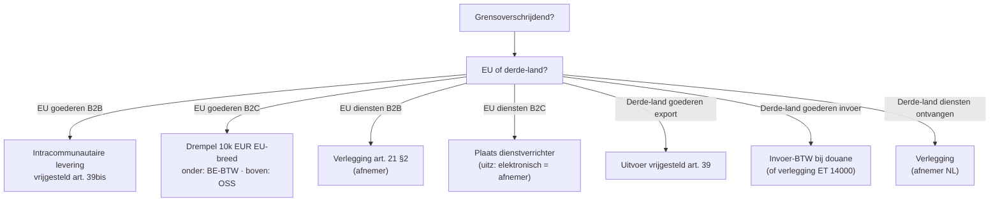

> ⚠️ **Voorlopig — themafiche-laag wordt uitgefaseerd.** Per **ADR-039** vervangt één PO-samenvatting per programmaonderdeel de cluster-themafiches. Deze fiche blijft beschikbaar tot het relevante PO een leerpad krijgt — dan migreert de inhoud naar `content/studiemateriaal/<po-slug>/samenvatting.md`. Voor cross-PO themafiches (vergelijkingen tussen verschillende PO's) volgt een aparte beslissing per fiche: incorporeren in alle relevante samenvattingen, óf upgraden naar concept-fiche.

> **Themafiche — kapstok voor herhaling.** EU vs derde-land · IC-handel · B2B-diensten met verlegging · OSS/IOSS · driehoeksverkeer · quick fixes. Voor verhaal en routekaart: [[studiemateriaal/2-4|overzicht PO 2.4]].

---

## Take-away

- **EU vs derde-land = ander regime**: EU → IC-handel + verleggingsregels · derde-land → in-/uitvoer + douane
- **Verleggingsregeling = geen vrijstelling** — schuldenaar verschuift naar afnemer (rooster 55-56 + 59)
- **Quick fixes 2020**: VIES-nummer afnemer + IC-opgave = **materiële** voorwaarde voor IC-vrijstelling (niet meer formaliteit)
- **OSS-drempel 10 000 EUR is EU-breed cumulatief** (alle bestemmingslanden samen) — niet per lidstaat
- **Driehoeksverkeer (vereenvoudiging art. 25ter §1, 2°)** — 3 BTW-nummers in 3 verschillende lidstaten; middenpartij geen registratie nodig
- **Elektronische diensten = diensten** (geen goederen), B2C-EU = plaats afnemer + OSS

---

## EU vs derde-land — eerste split

---

## EU-goederenhandel — IC-levering / IC-verwerving

| Stroom | Bij verkoper | Bij koper | Voorwaarden vrijstelling |
|---|---|---|---|
| **B2B IC-levering uit BE** | Vrijstelling art. 39bis | Idem land EU (verwerving belast bij koper) | Geldig VIES-nummer afnemer + IC-opgave + vervoer EU-uit |
| **B2B IC-verwerving in BE** | n.v.t. | Rooster 86 (basis) + 55 (BTW) + 59 (aftrek) | Belastbaar in BE (bestemming) |
| **B2C afstandsverkoop** | < 10k drempel: BE-BTW · boven: bestemmings-BTW via OSS | Geen BTW-actie | Drempel EU-breed cumulatief |
| **Driehoeksverkeer (vereenvoudiging)** | Verkoper 1 → middenpartij vrijgesteld | Middenpartij verlegt aan eindkoper | 3 verschillende BTW-nummers + facturatie middenpartij vermeldt vereenvoudiging |

---

## EU-diensten — B2B vs B2C

| Type | B2B (zaken-naar-zaken) | B2C (zaken-naar-particulier) |
|---|---|---|
| **Hoofdregel** | Plaats afnemer (verlegging) | Plaats dienstverrichter |
| **Onroerende diensten** | Plaats ligging gebouw (uitz) | Idem |
| **Restaurant, evenement-toegang** | Plaats fysieke uitvoering | Idem |
| **Personenvervoer** | Plaats afgelegde traject | Idem |
| **Elektronische diensten (TBE)** | Plaats afnemer (verlegging) | Plaats afnemer + OSS-mogelijkheid |
| **Verhuur transportmiddelen kort (< 30d)** | Plaats afgifte | Idem |
| **Verhuur transportmiddelen lang** | Plaats afnemer | Plaats woonplaats particulier |

---

## OSS / IOSS

| Regeling | Toepassing | Drempel |
|---|---|---|
| **Unie-regeling OSS** | EU-leverancier voor B2C-afstandsverkopen EU + B2C-diensten | 10 000 EUR EU-breed cumulatief |
| **Niet-unie-regeling OSS** | Niet-EU leverancier voor B2C-diensten naar EU-consumenten | Geen drempel |
| **IOSS (invoer)** | Verkoop vanuit derde-land naar EU-consument, zending ≤ 150 EUR | Cap 150 EUR per zending |
| **Standaard-regime** | Lokale BTW-registratie in elk bestemmingsland | Default zonder OSS |

⚠️ Onder OSS: 1 aangifte per kwartaal in lidstaat-identificatie; lokaal registreren niet vereist.

---

## Invoer + uitvoer derde-land

| Stroom | Regime | Mechanisme |
|---|---|---|
| **Uitvoer naar derde-land** | Vrijgesteld art. 39 W.BTW | Bewijs uitvoer (douane-document); rooster 47 |
| **Invoer uit derde-land — standaard** | Invoer-BTW bij douane | Cash betalen aan douane; aftrek via rooster 87/59 |
| **Invoer met vergunning ET 14000** | Verlegging | Rooster 87 + 57 + 59 — geen cash-uitgave |
| **B2B-diensten ontvangen uit derde-land** | Verlegging | Rooster 87 + 55-56 + 59 |
| **B2C-diensten verricht naar derde-land** | Plaats afnemer (art. 21 §3 buiten EU) | Geen BTW |

---

## Driehoeksverkeer — vereenvoudiging (art. 25ter §1, 2°)

| Partij | Land | Wat doet die? |
|---|---|---|
| **A — eerste verkoper** | EU-lidstaat 1 | Factureert vrijgesteld aan B (IC-levering) |
| **B — middenpartij** | EU-lidstaat 2 | Geen BTW-registratie in 3 nodig; vermeldt "vereenvoudiging driehoeksverkeer" + verleggingsregeling |
| **C — eindkoper** | EU-lidstaat 3 | Verlegt BTW (rooster equivalent in eigen land); ontvangt goederen direct van A |

**Voorwaarden**: 3 verschillende BTW-nummers, 3 verschillende lidstaten, goederen rechtstreeks A → C vervoerd.

---

## Quick fixes 2020 (Richtlijn EU 2018/1910)

| Fix | Wat? | Impact |
|---|---|---|
| **VIES-nummer + IC-opgave = materieel** | Materiële voorwaarde voor IC-vrijstelling, niet meer formaliteit | Geen geldig VIES = BTW verschuldigd door verkoper + boete |
| **Bewijs intracommunautair vervoer** | Twee onafhankelijke documenten (CMR + verzekering, etc.) | Forfaitaire bewijsregel; uitvoeringsverordening art. 45bis |
| **Call-off stock vereenvoudiging** | Tussenvoorraad-regime EU-breed gestandaardiseerd | Eén regime i.p.v. uiteenlopend per lidstaat |
| **Driehoeksverkeer verfijnd** | Geactualiseerde voorwaarden vereenvoudiging | Strict toepassen |

---

## ⚠️ Valkuilen

| Valkuil | Wat klopt er niet | Wat klopt wél |
|---|---|---|
| Verlegging = geen BTW verschuldigd | Studenten denken: "verlegd" = niets doen | BTW blijft verschuldigd — rooster 55-56 (verschuldigd) + 59 (aftrek) — vergeten = tekort + boete |
| OSS-drempel 10k per lidstaat | Oude drempels (35k/100k per lidstaat) of 10k per land toegepast | Drempel = EU-breed cumulatief (alle bestemmingen samen) sinds 1 juli 2021 |
| VIES-nummer is formaliteit | Vrijstelling overeind ook zonder geldig nummer (substance over form) | Quick fixes 2020: VIES + IC-opgave = materieel-substantiële voorwaarde |
| Elektronische diensten = goederen | Software / streaming behandeld als goederen | Diensten (art. 18 §2): B2C-EU = plaats afnemer + OSS |
| Invoer-BTW altijd cash bij douane | Cash betalen aan douane verplicht | Vergunning ET 14000 = verlegging op aangifte (rooster 87/57/59) → geen cash |
| MLI of BTW-richtlijn = nationaal recht | Direct toepasbaar | EU-richtlijn vereist nationale omzetting (BTW-richtlijn 2006/112 omgezet in W.BTW) |

---

## Doorklik — losse concept-fiches

**EU-handel**
- [[btw-grensoverschrijdend]] — IC + OSS + quick fixes
- [[plaats-van-handeling-btw]] — hoofdregels + uitzonderingen

**Diensten**
- [[btw-dienstverlening]] — B2B/B2C + verlegging
- [[fiscaal-vertegenwoordiger-btw]] — vereisten bij niet-EU-partijen

**Invoer + douane**
- [[douaneprocedures-btw-invoer]] — invoer-BTW + ET 14000
- [[opstart-btw-formaliteiten]] — BTW-nummer aanvragen

**Verwante themafiches**
- [[themafiches/btw-vier-kernvragen|Themafiche — BTW vier kernvragen]]
- [[themafiches/btw-aftrek|Themafiche — BTW-aftrek]]
- [[themafiches/btw-vastgoed|Themafiche — BTW & vastgoed]]
- [[themafiches/vrijstellingsregeling-kleine-onderneming|Themafiche — Vrijstellingsregeling KO]]

---

*Themafiche afgeleid uit cluster btw (PO 2.4). Status: voorgesteld.*
