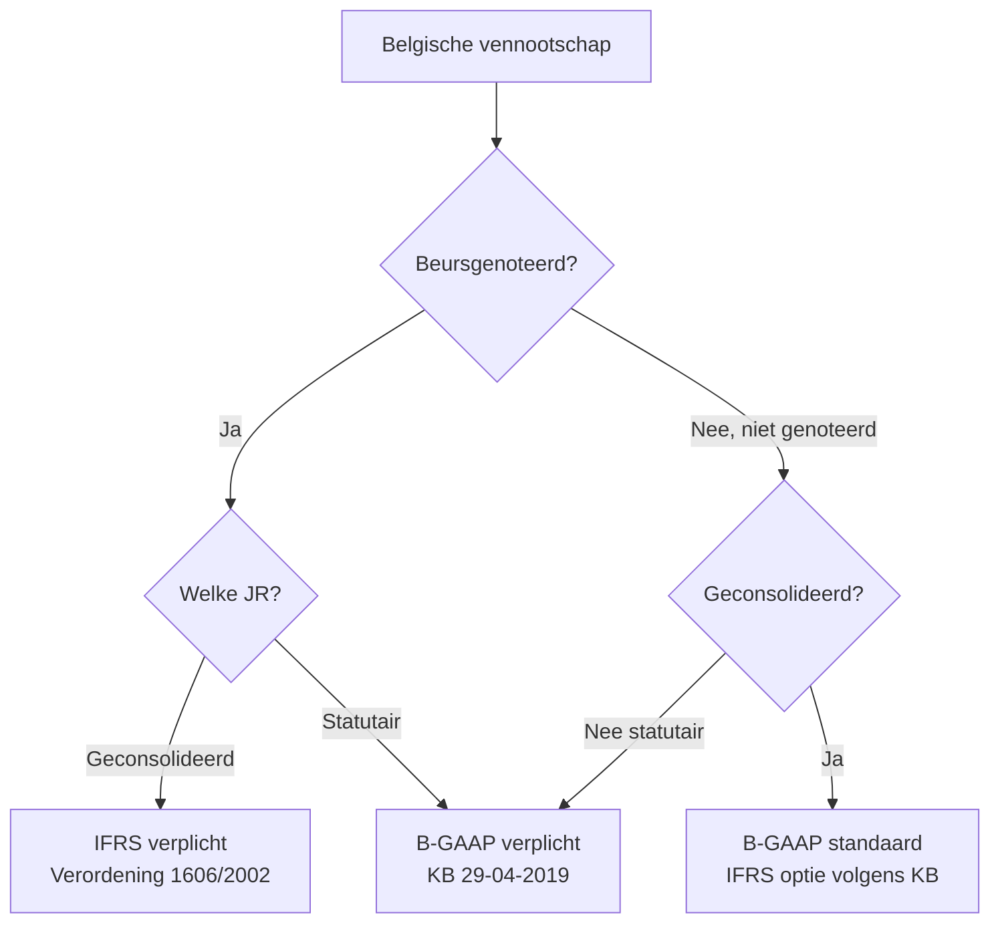
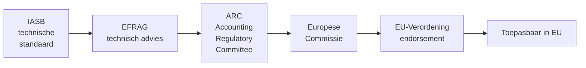

> **Themafiche — kapstok voor herhaling.** Waar staat IFRS in de EU-architectuur en wanneer is het verplicht? Voor verhaal en routekaart: [[leerpaden/1.5|minicursus PO 1.5]].

---

## Take-away

- **Verordening 1606/2002 is de rechtsbasis** — verplicht IFRS voor geconsolideerde JR van beursgenoteerde EU-vennootschappen vanaf 2005
- **Richtlijn 2013/34/EU is parallel kader** — harmoniseert B-GAAP-jaarrekening (klein/groot/micro · schema · jaarverslag) — basis voor onze KB 29-04-2019
- **IASB ≠ EU** — IASB stelt standaarden op; EU "endorseert" via EFRAG-advies en EU-Verordening
- **IFRS 1 = retrospectieve openingsbalans** — eerste-toepasser moet vorig vergelijkbaar jaar opnieuw waarderen volgens IFRS (vier verplichte uitzonderingen + zestien optionele vrijstellingen)
- **Conceptueel kader is geen standaard** — interpretatieve gids; valt terug bij ontbreken specifieke standaard (IAS 8 hiërarchie)

---

## EU-architectuur — vier lagen

| Laag | Instrument | Rol | Effect |
|---|---|---|---|
| 1. EU-recht | **Verordening 1606/2002** | IAS-Verordening | Verplicht IFRS voor geconsolideerde JR beursgenoteerden |
| 2. EU-recht | **Richtlijn 2013/34/EU** | Boekhoudrichtlijn | Harmoniseert nationale B-GAAP (drempels · schema · jaarverslag) |
| 3. Belgisch | WER Boek III + KB 29-04-2019 | Omzetting Richtlijn 2013/34 + B-GAAP-detail | Bindend statutair |
| 4. Belgisch | KB 30-01-2001 (consolidatie) + WVV | Consolidatie B-GAAP + IFRS-optie | Geconsolideerd niveau |

---

## Wanneer IFRS verplicht of toegelaten?

**Sleutelregel**: statutaire jaarrekening van **elke** Belgische vennootschap blijft B-GAAP — basis voor VenB-aangifte, dividend-test, NBB-neerlegging.

---

## IASB → endorsement → toepassing

**Endorsement-criteria** (Verordening 1606/2002 art. 3§2):
- Standaard niet strijdig met richtlijn 2013/34 (true-and-fair-view)
- In Europees publiek belang
- Begrijpelijk · relevant · betrouwbaar · vergelijkbaar

---

## IFRS-architectuur

| Niveau | Naam | Voorbeelden |
|---|---|---|
| **Conceptueel kader** | Conceptual Framework (2018-revisie) | Geen standaard — interpretatieve gids |
| **IAS** (oude reeks) | International Accounting Standards (1973-2001) | IAS 1 (presentatie) · IAS 2 (voorraden) · IAS 16 (MVA) · IAS 36 (impairment) · IAS 38 (IMA) |
| **IFRS** (nieuwe reeks) | International Financial Reporting Standards (2001+) | IFRS 3 (business combination) · IFRS 10 (consolidatie) · IFRS 15 (revenue) · IFRS 16 (leasing) |
| **Interpretaties** | IFRIC + SIC | Bindend; geven uitvoering aan standaarden |

---

## IFRS 1 — eerste toepassing in vier stappen

1. **Openingsbalans op overgangsdatum** — start van vroegste vergelijkbaar jaar
2. **Retrospectieve waardering** alle posten volgens huidige IFRS
3. **Verschillen → openings-EV** (geen resultaatpost)
4. **Verplichte uitzonderingen** (4) + **optionele vrijstellingen** (16) — om disproportionele kost te vermijden

---

## ⚠️ Valkuilen

| Valkuil | Wat klopt er niet | Wat klopt wél |
|---|---|---|
| "Alle EU-vennootschappen IFRS" | Verplicht alleen voor geconsolideerde JR beursgenoteerden | Niet-genoteerden + statutaire JR: B-GAAP (België) |
| "IASB legt IFRS rechtstreeks op" | IASB-standaarden moeten endorsement EU doorlopen | Verordening 1606/2002 + EU-publicatie nodig vóór toepassing |
| Conceptueel kader = standaard | Het is interpretatieve gids; geen bindende regel | IAS 8 hiërarchie: bij ontbreken specifieke standaard mag accountant terugvallen op kader |
| Eerste toepassing prospectief | IFRS 1 vereist retrospectieve openingsbalans op vergelijkbaar-jaar-start | Vorig jaar opnieuw waarderen volgens IFRS-regels |
| Richtlijn 2013/34 = IFRS-light | Richtlijn dekt B-GAAP — wel mogelijkheid IFRS-optie voor niet-genoteerden | Twee parallelle kaders — geen synthese |
| Endorsement automatisch | EFRAG-advies en ARC-stemming kunnen blokkeren (zoals IFRS 9 macro-hedge) | Soms jarenlange vertraging tussen IASB-publicatie en EU-toepasbaarheid |

---

## Doorklik — losse concept-fiches

**IFRS-kader**
- [[ifrs]] — Σ-hoofdrecord: IASB-architectuur · EU-Verordening 1606/2002 · eerste toepassing IFRS 1

**Specifieke standaarden**
- [[materiele-vaste-activa]] — IAS 16
- [[immateriele-vaste-activa]] — IAS 38
- [[opbrengstverantwoording]] — IFRS 15

**B-GAAP-parallel**
- [[belgisch-boekhoudrecht]] — WER Boek III · KB 29-04-2019 · grondslag richtlijn 2013/34
- [[autoriteiten-boekhoudrecht]] — CBN-rol bij IFRS-interpretatie in B-GAAP-context

**Verwante themafiches**
- [[themafiches/be-gaap-vs-ifrs-vergelijking|Themafiche — B-GAAP vs IFRS: balansposten]]
- [[themafiches/boekhoudplicht-en-rechtsbronnen|Themafiche — Boekhoudplicht & rechtsbronnen]]
- [[themafiches/consolidatie|Themafiche — Consolidatie]] *(IFRS 10/3/11/12 contexten)*

---

*Themafiche afgeleid uit cluster ifrs-rapportering (PO 1.5). Status: voorgesteld.*
