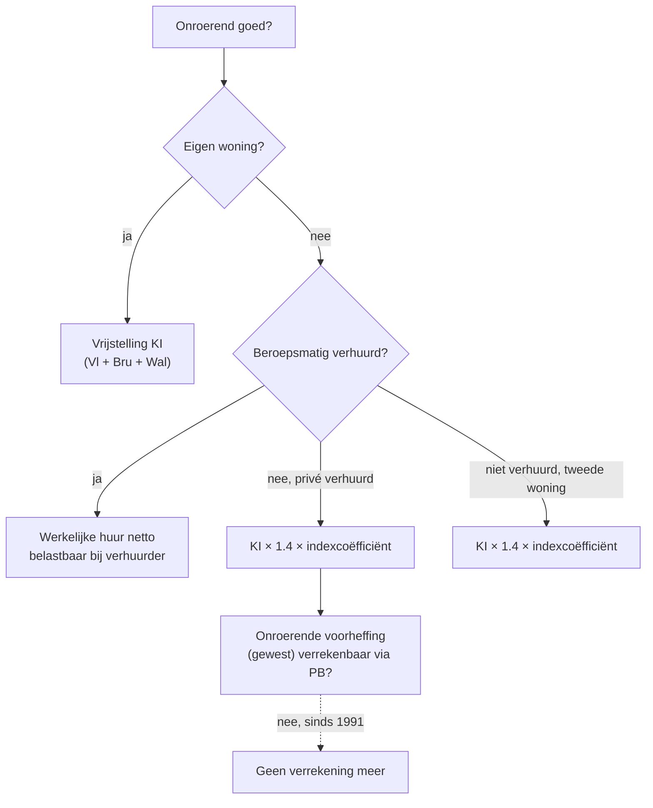

> ⚠️ **Voorlopig — themafiche-laag wordt uitgefaseerd.** Per **ADR-039** vervangt één PO-samenvatting per programmaonderdeel de cluster-themafiches. Deze fiche blijft beschikbaar tot het relevante PO een leerpad krijgt — dan migreert de inhoud naar `content/studiemateriaal/<po-slug>/samenvatting.md`. Voor cross-PO themafiches (vergelijkingen tussen verschillende PO's) volgt een aparte beslissing per fiche: incorporeren in alle relevante samenvattingen, óf upgraden naar concept-fiche.

> **Themafiche — kapstok voor herhaling.** Vier categorieën met elk eigen kwalificatieregels, eigen netto-bepaling en eigen tarief-pad. De kwalificatie bepaalt alles. Voor verhaal en routekaart: [[studiemateriaal/2-2|overzicht PO 2.2]].

---

## Take-away

- **Kwalificatie eerst** — een meerwaarde op een gebouw kan onroerend, beroeps of divers zijn afhankelijk van bestemming + frequentie; tarief volgt
- **Onroerend ≠ onroerend** — privé verhuurd = KI×1.4×index, beroepsmatig verhuurd = werkelijke huur (netto), eigen woning = vrijstelling
- **Roerend voorheffing primair bevrijdend** voor PB-natuurlijke personen — aangifte enkel waar voordelig (bv. 30%-grens overschrijden bij lager marginaal)
- **Beroepsinkomen heeft 5 sub-categorieën** met verschillende aftrek-regels — kostenforfait of werkelijke kosten verschilt per categorie
- **Diverse inkomsten (art. 90)** = vangnet voor wat niet onder de eerste drie valt — aparte tarieven (15% · 33% · progressief)

---

## De vier categorieën in één tabel

| Categorie | Wat? | Netto-bepaling | Tarief-pad |
|---|---|---|---|
| **Onroerend (V)** | KI · huurinkomsten · vruchtgebruik | KI × 1.4 × index (privé) · huur netto (beroep) · KI vrijgesteld (eigen woning) | Progressief PB |
| **Roerend (VII)** | Dividenden · interesten · royalty's · auteursrechten | Bruto (min eventuele kosten) | Meestal 30% RV bevrijdend · sommige 15% · uitzonderingen progressief |
| **Beroeps (VI)** | Loon · wedde · winst · baten · pensioenen | Bruto − beroepskosten (forfait of werkelijk) − sociale bijdragen | Progressief PB (uitz.: art. 171 afzonderlijk) |
| **Divers (VIII)** | Onderhoud · meerwaarden buiten beroep · loten · prijzen · onderverhuring | Bruto − bewezen kosten | Aparte tarieven 15% / 33% / progressief afhankelijk van type |

---

## Onroerend inkomen — beslisboom

---

## Roerend inkomen — RV-overzicht (richting; concrete percentages: Cijferzakboekje)

| Roerend inkomen | RV-tarief richting | Bevrijdend? | Uitzondering |
|---|---|---|---|
| Dividenden Belgische bron | 30% | Ja (PB-natuurlijke persoon) | VVPRbis = 15% · liquidatiereserve 5+ jaar = 5% |
| Interesten spaarboekje | Vrijgesteld tot drempel + 15% boven | Ja | Drempel cf. Cijferzakboekje |
| Interesten andere | 30% | Ja | Staatsbon eventueel verlaagd |
| Auteursrechten | Apart regime (15% · plafond) | Ja onder plafond | Hervorming 2023: scope ingeperkt |
| Buitenlandse dividenden | 30% (na DBV-verrekening) | Soms verrekenbare buitenlandse RV | DBV bepaalt vermindering |

---

## Beroepsinkomen — vijf sub-categorieën

| Sub-categorie | Wie? | Aftrekbaarheid kosten | Bijzonderheid |
|---|---|---|---|
| **Bezoldigingen werknemers** | Arbeider · bediende · ambtenaar | Forfait of werkelijk | Bedrijfsvoorheffing aan bron |
| **Bezoldigingen bedrijfsleiders** | Bestuurder · zaakvoerder · vereffenaar | Forfait of werkelijk | 45.000-EUR-regel raakt VenB-aftrekbaarheid |
| **Winst** | Handelaar · industrieel | Werkelijke kosten · forfait beperkt | Aftrekbaarheidstest art. 49 WIB |
| **Baten** | Vrije beroepen · zelfstandigen (niet-handelaar) | Werkelijke kosten · forfait beperkt | Cf. winst-baten-zelfstandige |
| **Pensioenen + vervangingsinkomsten** | Gepensioneerden · werkloosheid · ziekte | Forfait beperkt | Vermindering vervangingsinkomen |

---

## Diverse inkomsten (art. 90 WIB) — overzicht tarieven

| Type | Voorbeeld | Tarief |
|---|---|---|
| Occasionele winsten/baten | Eenmalige consultancy buiten beroep | 33% |
| Meerwaarde aandelen (speculatief buiten normaal beheer privé) | Snelle aan- en verkoop | 33% |
| Meerwaarde gebouwen ≤ 5 jaar na aankoop | Snelle doorverkoop | 16,5% |
| Onderverhuring · concessie | Onderhuur | Progressief |
| Onderhoudsuitkeringen ontvangen | Ex-echtgenoot | 80% × progressief |
| Loten · prijzen | Lotto · cultuurprijs | Vrijstelling tot drempel · 15% |
| Auteurschap-vergoedingen buiten roerend | (Apart regime) | Cf. roerend |

⚠️ Concrete tarieven en drempels: **Cijferzakboekje bij examen**.

---

## ⚠️ Valkuilen

| Valkuil | Wat klopt er niet | Wat klopt wél |
|---|---|---|
| Eigen woning aangeven als onroerend inkomen | Vrijstelling KI sinds 2018 (gewestelijk) | Niet aangeven (Vl) of vrijgesteld inkomen (Bru/Wal) |
| Beroepsmatig verhuurd KI × 1.4 toepassen | Werkelijke huur netto | KI×1.4 alleen voor privé-verhuur of niet-verhuurd |
| RV bevrijdend toch aangeven 'voor de zekerheid' | Voegt geen voordeel toe | Niet aangeven; aangifte verbreekt het bevrijdende karakter niet maar maakt complex |
| Onderhoudsuitkering volledig belasten | Slechts 80% belast als divers inkomen (ontvanger) | Symmetrisch met aftrek 80% bij betaler |
| Meerwaarde gebouw automatisch art. 90 | Hangt af van termijn + bestemming | < 5 jaar privé = 16,5%; > 5 jaar normaal beheer = vrijgesteld |
| Auteursrechten oude regime gebruiken | Hervorming 2023 beperkte scope | Cf. Cijferzakboekje + circulaires post-2023 |

---

## Doorklik — losse concept-fiches

**Onroerend**
- [[onroerend-inkomen-pb]] — eigen vs verhuurd
- [[kadastraal-inkomen]] — KI-vaststelling + revaluatie
- [[eigen-woning-fiscaal]] — vrijstelling per gewest
- [[onroerende-voorheffing]] — gewestelijk

**Roerend**
- [[roerend-inkomen-pb]] — dividenden · interesten · royalty's
- [[roerende-voorheffing]] — 30% bevrijdend vs verrekenbaar
- [[vvprbis]] — verminderd tarief 15%
- [[liquidatiereserve]] — 5%-RV na 5 jaar

**Beroeps**
- [[beroepsinkomen-pb]] — 5 sub-categorieën
- [[werknemersbezoldiging]] — loon + opzeg
- [[bedrijfsleidersbezoldiging]] — 45k-regel
- [[winst-baten-zelfstandige]] — handelaar vs vrije beroep
- [[beroepskosten]] — forfait vs werkelijk (art. 49 WIB)
- [[stopzettingsmeerwaarde]] — tarieven 16,5% / 33% / progressief

**Diverse**
- [[diverse-inkomsten-pb]] — art. 90 WIB
- [[onderhoudsuitkering]] — symmetrisch (80% beide kanten)

**Verwante themafiches**
- [[themafiches/pb-berekeningsschema|Themafiche — PB-berekeningsschema]]
- [[themafiches/voordelen-alle-aard|Themafiche — Voordelen alle aard]]
- [[themafiches/art-171-afzonderlijke-aanslagvoeten|Themafiche — Art. 171 afzonderlijke aanslagvoeten]]

---

*Themafiche afgeleid uit cluster personenbelasting (PO 2.2). Status: voorgesteld.*
