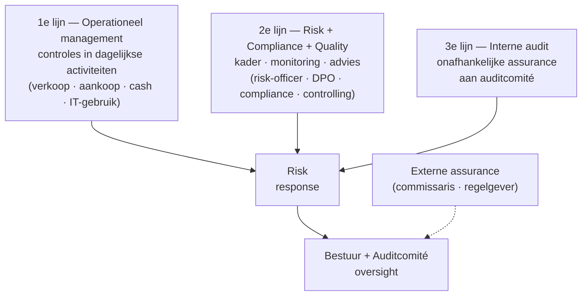
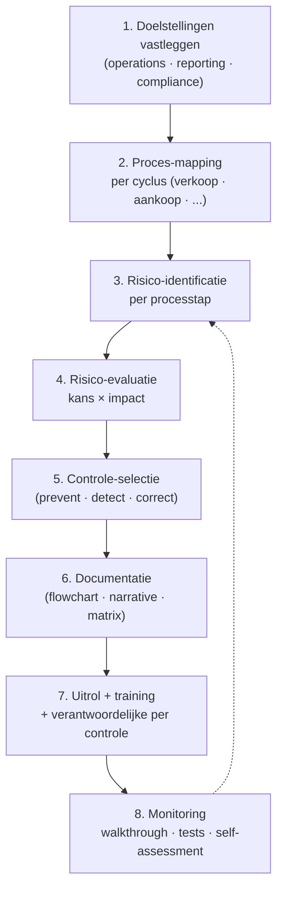

> ⚠️ **Voorlopig — themafiche-laag wordt uitgefaseerd.** Per **ADR-039** vervangt één PO-samenvatting per programmaonderdeel de cluster-themafiches. Deze fiche blijft beschikbaar tot het relevante PO een leerpad krijgt — dan migreert de inhoud naar `content/studiemateriaal/<po-slug>/samenvatting.md`. Voor cross-PO themafiches (vergelijkingen tussen verschillende PO's) volgt een aparte beslissing per fiche: incorporeren in alle relevante samenvattingen, óf upgraden naar concept-fiche.

> **Themafiche — kapstok voor herhaling.** COSO IC + ERM · 3 Lines · 4 doelstellingen · ontwerp-flow op één pagina. Voor verhaal en routekaart: [[studiemateriaal/1-7|overzicht PO 1.7]].

---

## Take-away

- **Interne controle = management-systeem**, niet auditor-werk — management ontwerpt, externe controle toetst
- **Redelijke (nooit absolute) zekerheid** — vier inherente beperkingen: oordeel · breakdown · collusie · management override
- **COSO IC (2013) vs COSO ERM (2017)**: complementair, geen vervanging — IC = controle-systeem, ERM = risico-management-systeem
- **3 Lines = conceptueel model**, niet organigram — in KMO mag één persoon meerdere lijnen vervullen, mits documentatie
- **COSO niet wettelijk verplicht in België** — wel feitelijke standaard; ISA 315 verwijst er actief naar

---

## COSO IC 2013 — vijf componenten + 17 principes

| Component | Kern | Voorbeelden | # principes |
|---|---|---|---|
| **1. Control environment** | Toon-aan-de-top · ethiek · structuur · HR | Gedragscode · klokkenluider · functioneringsgesprek | 5 |
| **2. Risk assessment** | Doelen → risico's → respons | Risico-register · materialiteits-drempels · fraud risk | 4 |
| **3. Control activities** | Procedures die risico's mitigeren | Functiescheiding · autorisaties · reconciliaties · IT-controles | 3 |
| **4. Information & communication** | Info-flow op + neer + horizontaal | Management-rapportering · klokkenluiders-kanaal · governance-comm. | 3 |
| **5. Monitoring activities** | Doorlopend + periodiek toetsen werking | Self-assessment · interne audit · management review | 2 |

**Totaal: 17 principes** — examen-favoriet voor kapstok-vraag.

---

## 4 doelstellingen interne controle (COSO)

| Doelstelling | Voorbeeld in KMO-context |
|---|---|
| **Operations** — effectief & efficiënt | Voorraad-rotatie · productiviteit · cashflow-beheer |
| **Reporting** — betrouwbaar (intern + extern + financieel + niet-financieel) | Juiste cijfers in jaarrekening · KPI-dashboard · ESG-rapport |
| **Compliance** — wetten + reglementen + interne richtlijnen | Btw-aangiftes · GDPR · branche-vergunningen |
| **Safeguarding of assets** (subdoel onder reporting) | Voorraad-beveiliging · cash-procedures · IT-toegang |

---

## 3 Lines of Defense (IIA-model herzien 2020)

**KMO-pragmatisme**: kleine organisatie ⇒ 2e lijn vaak gedeeld met management; 3e lijn meestal niet aanwezig. **Conceptueel model**, geen organigram-eis.

---

## COSO IC vs COSO ERM

| As | **COSO IC (2013)** | **COSO ERM (2017)** |
|---|---|---|
| **Focus** | Interne controle (controle-systeem) | Risico-management (strategisch + operationeel) |
| **Vertrekpunt** | Doelstellingen + risico-respons | Strategie + waarde-creatie + risico-appetijt |
| **Bouwstenen** | 5 componenten + 17 principes | 5 componenten + 20 principes (governance · strategie · performance · review · communicatie) |
| **Verhouding** | Operationeel verankerd | Strategisch boven IC — IC blijft binnen ERM |
| **Verplicht?** | Nee (B-context) | Nee (B-context) |

---

## Ontwerp-flow interne controle

**Iteratief**: bij wijziging (nieuw ERP · M&A · regelgeving) → terug naar stap 2.

---

## Referentiekaders — wanneer welk?

| Kader | Wanneer gebruiken | Doelpubliek |
|---|---|---|
| **COSO IC 2013** | Algemeen IC-design + IC-evaluatie | Management · auditcomité · externe controle |
| **COSO ERM 2017** | Strategisch risico-management | Bestuur · risk officer |
| **ISA 315 herzien** | Risico-inschatting door externe auditor | Commissaris · revisor |
| **IIA-standards + 3 Lines (2020)** | Interne-audit-functie inrichten | Interne auditor · auditcomité |
| **ITAA-norm interne controle KMO** | KMO-IC-advies door accountant | Gecert. accountant · cliënt-management |
| **ISO 31000** | Risk management proces-norm | Operationeel risk management |

---

## ⚠️ Valkuilen

| Valkuil | Wat klopt er niet | Wat klopt wél |
|---|---|---|
| Interne controle = interne audit | Beide intern, dus synoniem | IC = systeem (door management); interne audit = 3e-lijn-functie die het systeem toetst |
| Externe controle vs interne controle verwarren | "Controle" zonder kwalificatie | Vraag altijd: wie voert uit en rapporteert aan wie? Intern aan management; extern aan AV |
| IC geeft absolute zekerheid | Goed IC-systeem voorkomt fouten en fraude | Slechts redelijke zekerheid — 4 inherente beperkingen: oordeel · breakdown · collusie · management override |
| 3 Lines letterlijk = drie aparte afdelingen | Elke onderneming moet 3 afdelingen hebben | Conceptueel model; in KMO mag 1 persoon meerdere lijnen, mits documentatie + toezicht |
| COSO als checklist afvinken | Component ✓ ⇒ effectief | COSO is een lens, geen checklist — werkt-de-component-in-deze-onderneming-vraag |
| COSO IC = COSO ERM | 2017-versie vervangt 2013 | Complementair (IC = controle-systeem; ERM = risk-systeem); allebei nog in gebruik |
| COSO wettelijk verplicht in België | "Alle ondernemingen moeten COSO" | Geen wettelijke verplichting; wel feitelijke standaard waarnaar ISA 315 verwijst |

---

## Doorklik — losse concept-fiches

**Kern-record**
- [[interne-controle]] — definitie · 4 doelstellingen · dubbele dimensie · 3 Lines · referentiekaders
- [[coso-framework]] — COSO IC + COSO ERM + 17 principes
- [[ontwerp-interne-controle]] — proces-mapping · risico-identificatie · controle-selectie
- [[interne-audit]] — 3e-lijn · auditcharter · IIA-standards

**Cross-records**
- [[auditcomite]] — gespecialiseerd raadscomité OOB
- [[evaluatie-interne-controle]] — design vs operating effectiveness

**Verwante themafiches**
- [[themafiches/functiescheiding-en-cyclus|Themafiche — Functiescheiding & cyclus-controle]]
- [[themafiches/fouten-en-fraude-controle|Themafiche — Fouten & fraude]]
- [[themafiches/controleopdracht-aanpak|Themafiche — Controleopdracht-aanpak]] (cross PO 1.6)

---

*Themafiche afgeleid uit cluster interne-controle (PO 1.7). Status: voorgesteld.*
